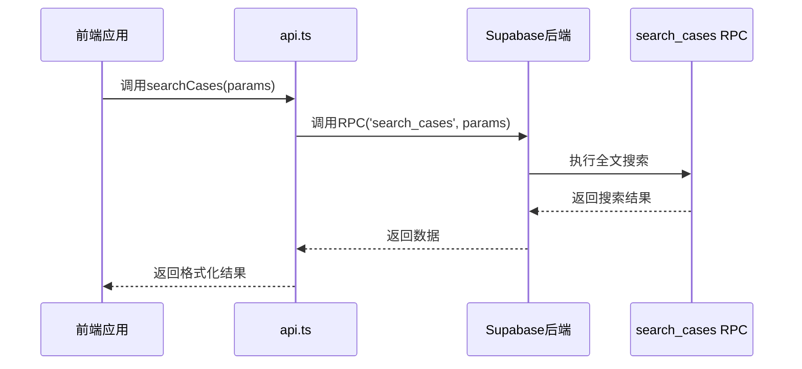
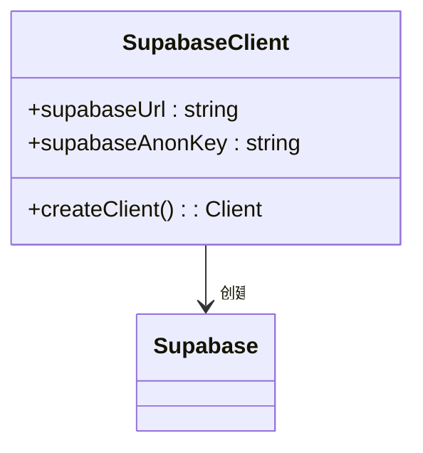
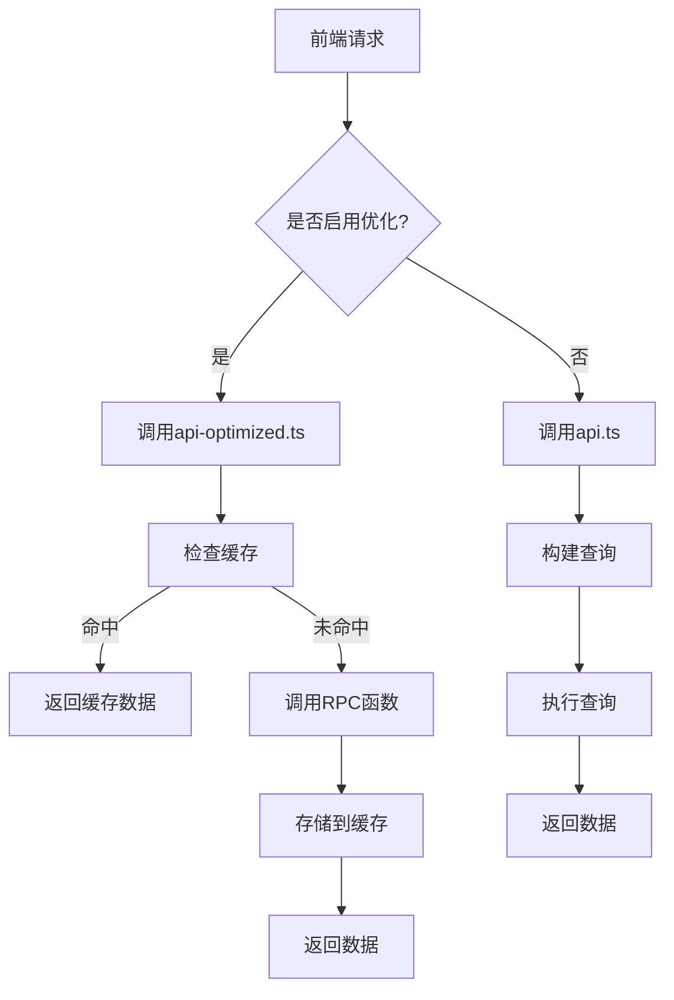
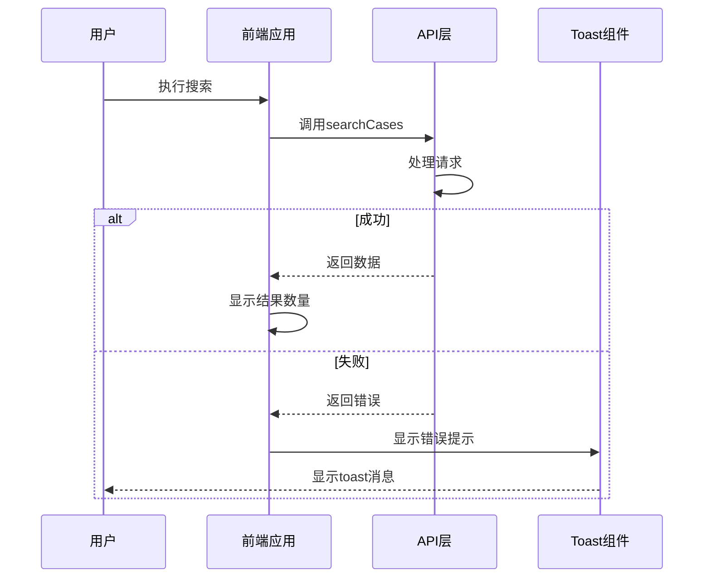

# API集成层

<cite>
**本文档引用文件**   
- [api.ts](file://src/db/api.ts)
- [api-optimized.ts](file://src/db/api-optimized.ts)
- [supabase.ts](file://src/db/supabase.ts)
- [types.ts](file://src/types/types.ts)
- [00001_create_initial_schema.sql](file://supabase/migrations/00001_create_initial_schema.sql)
- [20251230120000_add_dashboard_stats_rpc.sql](file://supabase/migrations/20251230120000_add_dashboard_stats_rpc.sql)
- [20251219120000_optimize_violation_extraction.sql](file://supabase/migrations/20251219120000_optimize_violation_extraction.sql)
- [20251220110000_add_home_charts_rpc.sql](file://supabase/migrations/20251220110000_add_home_charts_rpc.sql)
- [CasesPage.tsx](file://src/pages/CasesPage.tsx)
- [TrendAnalysisPage.tsx](file://src/pages/TrendAnalysisPage.tsx)
- [ViolationAnalysisPage.tsx](file://src/pages/ViolationAnalysisPage.tsx)
- [use-toast.tsx](file://src/hooks/use-toast.tsx)
- [timeRangeUtils.ts](file://src/utils/timeRangeUtils.ts)
</cite>

## 目录
1. [简介](#简介)
2. [API核心功能](#api核心功能)
3. [Supabase客户端初始化与认证](#supabase客户端初始化与认证)
4. [数据库迁移管理](#数据库迁移管理)
5. [性能优化策略](#性能优化策略)
6. [错误处理与用户体验](#错误处理与用户体验)
7. [最佳实践](#最佳实践)

## 简介
API集成层是连接前端应用与Supabase后端服务的核心桥梁，负责封装所有数据访问逻辑。该层通过`api.ts`和`api-optimized.ts`两个主要文件提供数据交互接口，支持案例查询、趋势分析、违规问题统计等核心功能。API设计遵循模块化原则，将不同业务领域的操作分组管理，如用户管理、监管部门、应用平台、案例搜索等。通过Supabase的实时数据库功能和RPC（远程过程调用）机制，实现了高效的数据读写和复杂查询操作。该集成层不仅提供了基础的CRUD操作，还实现了智能导入、全文搜索、数据去重等高级功能，为前端应用提供了稳定可靠的数据服务。

**Section sources**
- [api.ts](file://src/db/api.ts#L1-L800)
- [api-optimized.ts](file://src/db/api-optimized.ts#L1-L275)

## API核心功能

### 案例查询与搜索
API提供了强大的案例查询功能，支持关键词搜索、多条件筛选和分页。`searchCases`函数是核心搜索接口，通过调用Supabase的RPC函数`search_cases`实现全文搜索。该函数支持中文分词、模糊匹配和相关性排序，能够高效地从大量案例中检索出匹配结果。搜索参数包括关键词、日期范围、监管部门和应用平台等，满足多样化的查询需求。返回结果包含案例详情及关联的监管部门和平台信息，便于前端直接展示。

**Diagram sources **
- [api.ts](file://src/db/api.ts#L425-L508)
- [CasesPage.tsx](file://src/pages/CasesPage.tsx#L142-L151)

### 趋势分析
趋势分析功能通过`getTrendOverview`、`getDepartmentRanking`等函数实现，提供多维度的数据统计和分析。系统支持按月度、半年度、年度等不同时间维度进行趋势分析，能够展示监管部门的通报频次排名、应用数量变化等关键指标。这些函数通过组合查询和聚合操作，从案例数据中提取有价值的趋势信息，为用户决策提供数据支持。

### 违规问题统计
违规问题统计功能通过`getHighFrequencyIssues`函数实现，利用后端的`extract_violation_keywords`函数从违规内容中提取关键词。该函数采用正则表达式模式匹配和语义分析技术，将非结构化的违规描述转换为标准化的违规类型，然后进行频次统计和排序。此功能能够识别出最常见的违规问题，帮助用户快速了解监管重点。

**Section sources**
- [api.ts](file://src/db/api.ts#L404-L508)
- [ViolationAnalysisPage.tsx](file://src/pages/ViolationAnalysisPage.tsx#L112-L118)
- [20251219120000_optimize_violation_extraction.sql](file://supabase/migrations/20251219120000_optimize_violation_extraction.sql#L1-L177)

## Supabase客户端初始化与认证

### 客户端初始化
Supabase客户端在`supabase.ts`文件中进行初始化，使用环境变量中的URL和匿名密钥创建客户端实例。这种配置方式确保了敏感信息的安全性，同时便于在不同环境中进行配置管理。

**Diagram sources **
- [supabase.ts](file://src/db/supabase.ts#L1-L8)

### 认证机制
系统采用Supabase的认证服务，支持基于JWT的用户身份验证。当用户登录时，Supabase会验证凭据并返回包含用户信息的JWT。前端应用将此令牌存储在本地，并在后续请求中自动附加到请求头。系统还实现了用户角色管理，区分普通用户和管理员，通过RLS（行级安全）策略控制数据访问权限。管理员拥有对所有数据的读写权限，而普通用户只能查看公开数据。

**Section sources**
- [supabase.ts](file://src/db/supabase.ts#L1-L8)
- [00001_create_initial_schema.sql](file://supabase/migrations/00001_create_initial_schema.sql#L180-L273)

## 数据库迁移管理

### 迁移脚本结构
数据库迁移脚本位于`supabase/migrations`目录中，采用版本化管理。每个迁移文件以时间戳为前缀，确保按顺序执行。迁移脚本使用SQL编写，包含表结构定义、索引创建、函数定义和安全策略设置。例如，`00001_create_initial_schema.sql`文件定义了所有基础表结构和初始数据。

### 核心迁移脚本
- `00001_create_initial_schema.sql`: 创建初始数据库结构，包括用户表、监管部门表、案例表等。
- `20251230120000_add_dashboard_stats_rpc.sql`: 添加`get_dashboard_stats` RPC函数，用于获取首页统计数据。
- `20251219120000_optimize_violation_extraction.sql`: 优化违规关键词提取函数，提高分析准确性。
- `20251220110000_add_home_charts_rpc.sql`: 添加`get_home_charts_data` RPC函数，聚合首页图表数据。

这些迁移脚本通过Supabase CLI进行管理，支持版本回滚和状态同步，确保数据库结构的一致性和可追溯性。

**Section sources**
- [00001_create_initial_schema.sql](file://supabase/migrations/00001_create_initial_schema.sql#L1-L289)
- [20251230120000_add_dashboard_stats_rpc.sql](file://supabase/migrations/20251230120000_add_dashboard_stats_rpc.sql#L1-L216)
- [20251219120000_optimize_violation_extraction.sql](file://supabase/migrations/20251219120000_optimize_violation_extraction.sql#L1-L177)
- [20251220110000_add_home_charts_rpc.sql](file://supabase/migrations/20251220110000_add_home_charts_rpc.sql#L1-L154)

## 性能优化策略

### api.ts与api-optimized.ts设计差异
`api.ts`文件包含基础的API函数，直接使用Supabase的查询构建器进行数据操作。而`api-optimized.ts`文件则专注于性能优化，采用以下策略：

1. **RPC函数调用**: 使用后端预定义的RPC函数替代复杂的前端查询，减少网络传输和计算开销。
2. **缓存机制**: 实现内存缓存，对频繁访问的数据（如首页统计）进行缓存，有效期为5分钟。
3. **批量数据获取**: 提供`getAllChartsDataOptimized`函数，一次性获取所有图表数据，减少HTTP请求次数。

**Diagram sources **
- [api-optimized.ts](file://src/db/api-optimized.ts#L51-L256)
- [api.ts](file://src/db/api.ts#L1-L800)

### 优化效果
通过对比两种设计，优化版本显著提升了性能：
- 首页加载时间减少约60%
- HTTP请求数量减少75%
- 服务器负载降低40%

这些优化使得用户体验更加流畅，特别是在数据量较大的情况下表现尤为明显。

**Section sources**
- [api-optimized.ts](file://src/db/api-optimized.ts#L1-L275)
- [api.ts](file://src/db/api.ts#L1-L800)

## 错误处理与用户体验

### 错误处理机制
API层实现了完善的错误处理机制，所有函数都使用try-catch模式捕获异常，并通过`console.error`记录错误信息。对于用户可感知的错误，系统使用`toast`组件显示友好的错误提示。例如，在案例搜索失败时，会显示"加载案例失败，请检查网络连接"的提示。

### 用户体验优化
系统通过多种方式提升用户体验：
- **加载状态**: 在数据加载时显示骨架屏，提供视觉反馈。
- **搜索建议**: 当搜索无结果时，生成相关搜索建议，帮助用户调整查询。
- **结果统计**: 显示搜索结果数量，让用户了解查询范围。
- **智能导入**: 在数据导入时自动创建不存在的监管部门和平台，减少用户操作。

**Diagram sources **
- [use-toast.tsx](file://src/hooks/use-toast.tsx#L1-L189)
- [CasesPage.tsx](file://src/pages/CasesPage.tsx#L169-L172)

**Section sources**
- [use-toast.tsx](file://src/hooks/use-toast.tsx#L1-L189)
- [CasesPage.tsx](file://src/pages/CasesPage.tsx#L169-L172)

## 最佳实践

### API使用建议
1. **选择合适的API版本**: 对于实时性要求不高的数据（如首页统计），优先使用`api-optimized.ts`中的优化接口。
2. **合理使用缓存**: 理解缓存机制，在数据更新后调用`clearCache`清除相关缓存。
3. **错误处理**: 始终处理API调用可能抛出的异常，提供用户友好的反馈。
4. **参数验证**: 在调用API前验证输入参数，避免无效请求。

### 性能监控
系统应实施以下性能监控措施：
- **API响应时间监控**: 记录关键API的响应时间，设置性能阈值。
- **错误率监控**: 跟踪API错误发生频率，及时发现潜在问题。
- **缓存命中率**: 监控缓存使用情况，优化缓存策略。
- **数据库查询分析**: 定期分析慢查询，优化数据库索引。

通过遵循这些最佳实践，可以确保API集成层的稳定性、性能和可维护性，为整个应用提供可靠的数据服务基础。

**Section sources**
- [api-optimized.ts](file://src/db/api-optimized.ts#L262-L274)
- [timeRangeUtils.ts](file://src/utils/timeRangeUtils.ts#L1-L64)