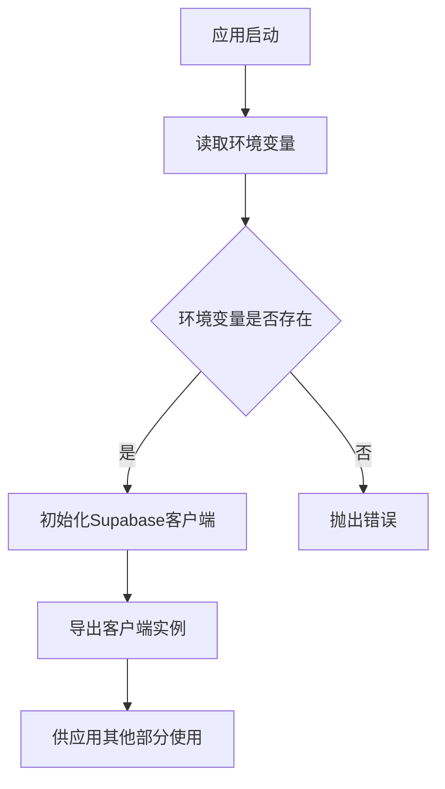
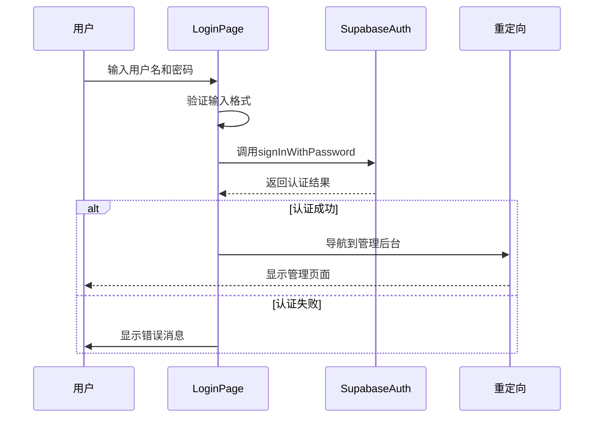
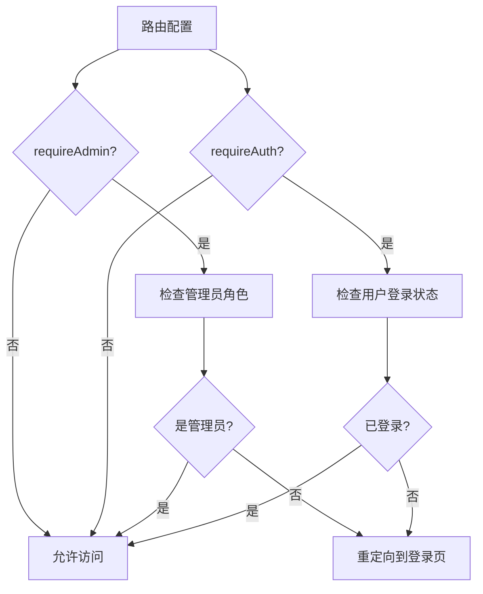
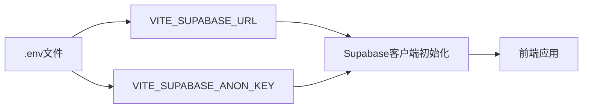
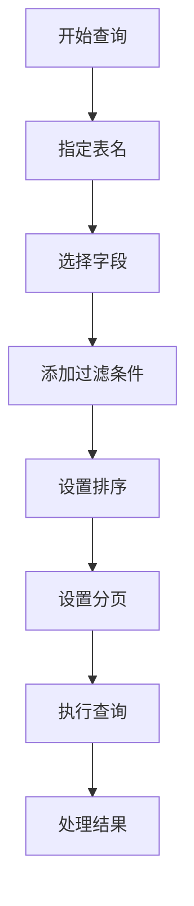
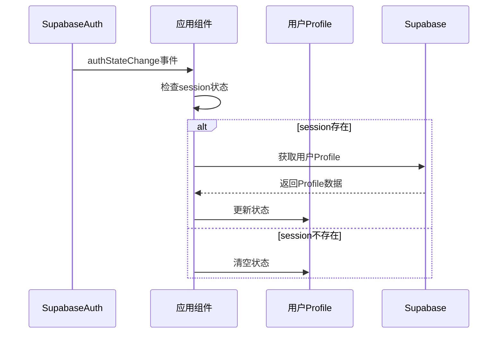
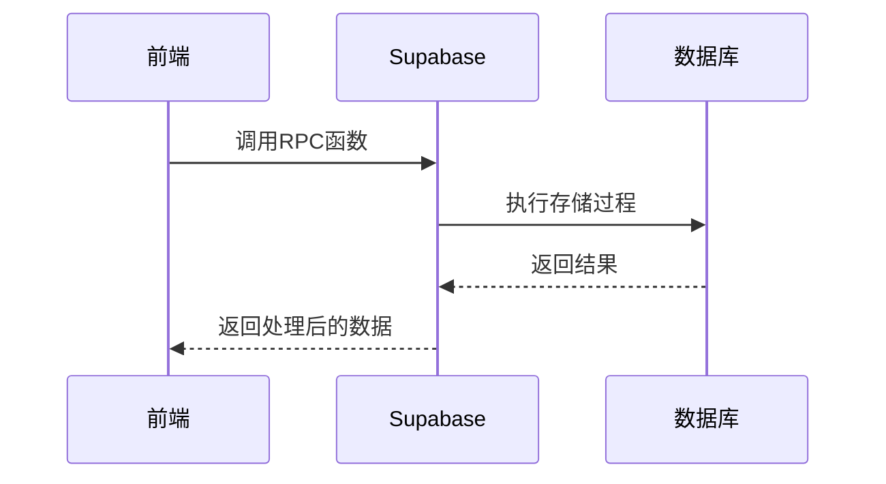
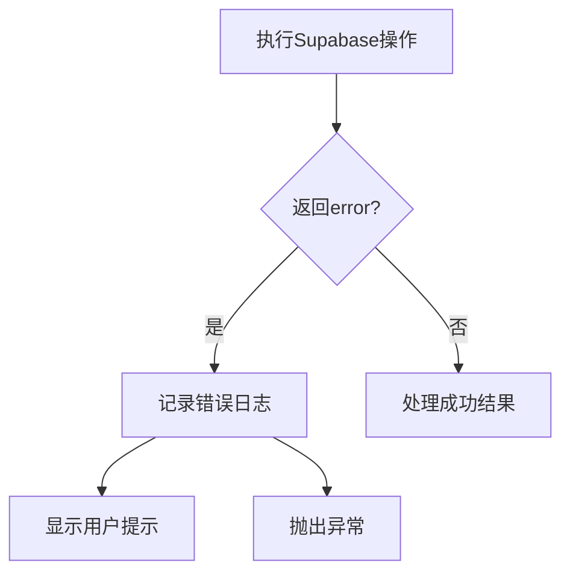

# Supabase集成

<cite>
**本文档引用的文件**  
- [supabase.ts](file://src/db/supabase.ts)
- [use-supabase-upload.ts](file://src/hooks/use-supabase-upload.ts)
- [api.ts](file://src/db/api.ts)
- [api-optimized.ts](file://src/db/api-optimized.ts)
- [types.ts](file://src/types/types.ts)
- [LoginPage.tsx](file://src/pages/LoginPage.tsx)
- [routes.tsx](file://src/routes.tsx)
- [ProtectedModuleRoute.tsx](file://src/components/common/ProtectedModuleRoute.tsx)
- [ModuleContext.tsx](file://src/contexts/ModuleContext.tsx)
</cite>

## 目录
1. [简介](#简介)
2. [Supabase客户端初始化](#supabase客户端初始化)
3. [认证机制与权限控制](#认证机制与权限控制)
4. [文件上传自定义Hook](#文件上传自定义hook)
5. [环境变量配置](#环境变量配置)
6. [Supabase使用模式](#supabase使用模式)
7. [连接管理与错误处理](#连接管理与错误处理)

## 简介
本文档详细说明了前端应用与Supabase后端服务的完整集成方案。文档涵盖了Supabase客户端的初始化、认证机制、权限控制策略、文件上传功能、环境变量配置以及Supabase客户端的使用模式。通过本集成方案，实现了安全的前后端通信、高效的文件上传处理和灵活的权限管理。

## Supabase客户端初始化

Supabase客户端的初始化在`src/db/supabase.ts`文件中完成。客户端使用环境变量中的URL和匿名密钥进行初始化，确保了配置的安全性和灵活性。



**Diagram sources**
- [supabase.ts](file://src/db/supabase.ts#L1-L8)

**Section sources**
- [supabase.ts](file://src/db/supabase.ts#L1-L8)

## 认证机制与权限控制

### 认证工作流程
认证机制基于Supabase的认证系统实现，通过用户名和密码进行登录。系统将用户名转换为特定格式的邮箱地址进行认证。



**Diagram sources**
- [LoginPage.tsx](file://src/pages/LoginPage.tsx#L1-L102)

### 权限控制策略
权限控制通过路由配置和模块保护组件实现。系统定义了不同级别的访问控制，包括认证要求和管理员权限要求。



**Diagram sources**
- [routes.tsx](file://src/routes.tsx#L1-L207)
- [ProtectedModuleRoute.tsx](file://src/components/common/ProtectedModuleRoute.tsx#L1-L28)

**Section sources**
- [LoginPage.tsx](file://src/pages/LoginPage.tsx#L1-L102)
- [routes.tsx](file://src/routes.tsx#L1-L207)
- [ProtectedModuleRoute.tsx](file://src/components/common/ProtectedModuleRoute.tsx#L1-L28)

## 文件上传自定义Hook

`use-supabase-upload.ts`是一个自定义Hook，用于处理文件上传到Supabase存储桶的逻辑。该Hook提供了完整的文件上传功能，包括进度监控和错误处理。

### 实现细节
该Hook基于`react-dropzone`实现拖拽上传功能，并与Supabase存储服务集成。它支持多种配置选项，如文件类型限制、大小限制和并发上传控制。

```mermaid
classDiagram
class UseSupabaseUploadOptions {
+bucketName : string
+path? : string
+allowedMimeTypes? : string[]
+maxFileSize? : number
+maxFiles? : number
+cacheControl? : number
+upsert? : boolean
+supabase : SupabaseClient
}
class UseSupabaseUploadReturn {
+files : FileWithPreview[]
+setFiles : Function
+successes : string[]
+isSuccess : boolean
+loading : boolean
+errors : {name : string, message : string}[]
+setErrors : Function
+onUpload : Function
+maxFileSize : number
+maxFiles : number
+allowedMimeTypes : string[]
}
class FileWithPreview {
+preview? : string
+errors : readonly FileError[]
}
UseSupabaseUploadOptions --> UseSupabaseUploadReturn : "生成"
FileWithPreview --> UseSupabaseUploadReturn : "包含"
```

**Diagram sources**
- [use-supabase-upload.ts](file://src/hooks/use-supabase-upload.ts#L1-L198)

**Section sources**
- [use-supabase-upload.ts](file://src/hooks/use-supabase-upload.ts#L1-L198)

## 环境变量配置

### 配置最佳实践
环境变量配置遵循Vite的约定，使用`VITE_`前缀的变量在客户端代码中可用。关键的Supabase配置通过环境变量注入，避免了硬编码。



**Diagram sources**
- [supabase.ts](file://src/db/supabase.ts#L4-L5)

### 安全注意事项
- 匿名密钥（anon key）用于客户端初始化，不应被视为完全安全的凭证
- 敏感操作应在服务端通过Supabase函数或受保护的API端点处理
- 生产环境中应配置适当的行级安全策略（RLS）来保护数据

**Section sources**
- [supabase.ts](file://src/db/supabase.ts#L4-L5)

## Supabase使用模式

### 查询构建
应用使用Supabase的链式API构建查询，支持选择字段、过滤条件、排序和分页。



**Section sources**
- [api.ts](file://src/db/api.ts#L21-L803)

### 实时订阅
通过`onAuthStateChange`监听认证状态变化，实现用户登录状态的实时响应。



**Diagram sources**
- [AUTH_UX_OPTIMIZATION_GUIDE.md](file://docs/AUTH_UX_OPTIMIZATION_GUIDE.md#L100-L132)

### RPC调用
应用使用RPC（远程过程调用）执行复杂的数据库操作，如全文搜索和统计计算。



**Section sources**
- [api.ts](file://src/db/api.ts#L425-L508)
- [api-optimized.ts](file://src/db/api-optimized.ts#L57-L275)

## 连接管理与错误处理

### 连接管理策略
- 使用单例模式创建Supabase客户端，确保整个应用使用同一个连接实例
- 在组件卸载时正确清理订阅，防止内存泄漏
- 实现缓存机制减少不必要的网络请求

### 错误处理
- 统一的错误处理模式：检查返回的error对象，存在则抛出异常
- 用户友好的错误提示：使用toast组件显示错误消息
- 详细的错误日志：在开发环境中记录详细的错误信息



**Section sources**
- [api.ts](file://src/db/api.ts#L28-L29)
- [LoginPage.tsx](file://src/pages/LoginPage.tsx#L45-L48)
- [api-optimized.ts](file://src/db/api-optimized.ts#L72-L75)