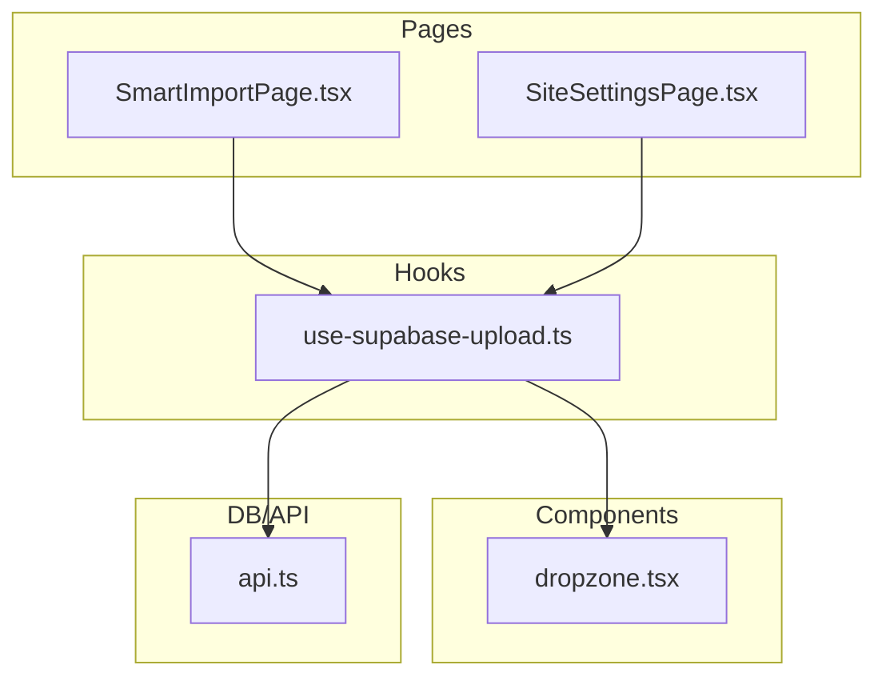
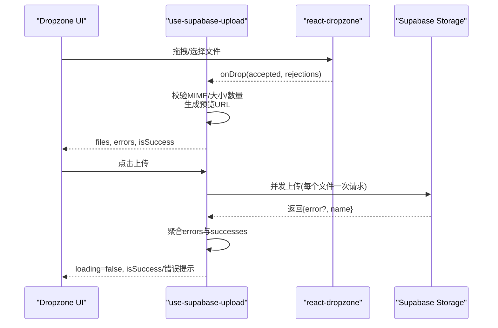
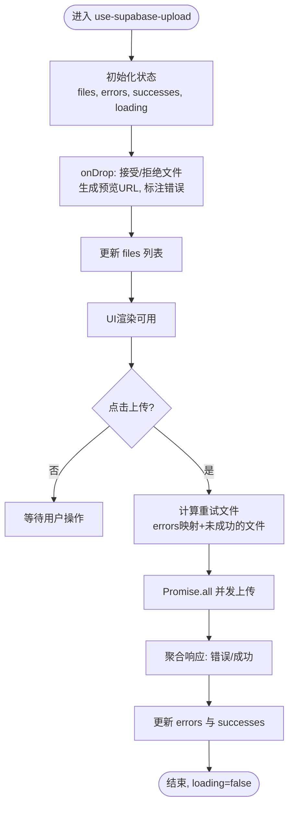
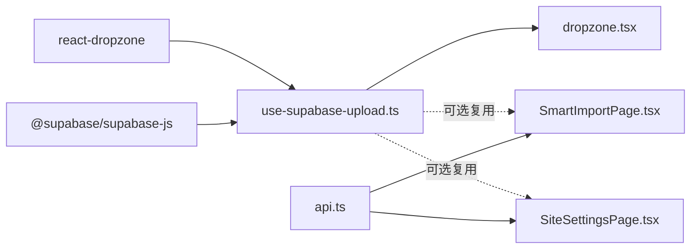

# 上传Hook实现

<cite>
**本文引用的文件**
- [use-supabase-upload.ts](file://src/hooks/use-supabase-upload.ts)
- [dropzone.tsx](file://src/components/dropzone.tsx)
- [SmartImportPage.tsx](file://src/pages/admin/SmartImportPage.tsx)
- [SiteSettingsPage.tsx](file://src/pages/admin/SiteSettingsPage.tsx)
- [api.ts](file://src/db/api.ts)
</cite>

## 目录
1. [引言](#引言)
2. [项目结构](#项目结构)
3. [核心组件](#核心组件)
4. [架构总览](#架构总览)
5. [详细组件分析](#详细组件分析)
6. [依赖关系分析](#依赖关系分析)
7. [性能考虑](#性能考虑)
8. [故障排查指南](#故障排查指南)
9. [结论](#结论)
10. [附录](#附录)

## 引言
本文围绕 use-supabase-upload.ts 自定义 Hook 的实现进行深入解析，重点阐述其作为文件上传核心逻辑封装的设计理念与实现细节。我们将从参数配置、状态管理、与 Dropzone 组件的协作、错误处理策略、性能优化等方面展开，并结合智能导入与网站 Logo 上传场景给出调用方式与最佳实践。

## 项目结构
本项目采用按功能域组织的目录结构，上传相关能力分布在 hooks、components、pages 与 db 层：
- hooks：集中存放业务逻辑钩子，use-supabase-upload.ts 即在此处
- components：UI 组件层，dropzone.tsx 将 Hook 的状态与行为可视化
- pages：页面级业务，SmartImportPage.tsx 与 SiteSettingsPage.tsx 分别展示了两种典型上传场景
- db：数据库与存储接口，api.ts 中包含 uploadLogo/uploadFavicon 等存储操作



图表来源
- [use-supabase-upload.ts](file://src/hooks/use-supabase-upload.ts#L1-L197)
- [dropzone.tsx](file://src/components/dropzone.tsx#L1-L228)
- [SmartImportPage.tsx](file://src/pages/admin/SmartImportPage.tsx#L1-L200)
- [SiteSettingsPage.tsx](file://src/pages/admin/SiteSettingsPage.tsx#L1-L200)
- [api.ts](file://src/db/api.ts#L2630-L2693)

章节来源
- [use-supabase-upload.ts](file://src/hooks/use-supabase-upload.ts#L1-L197)
- [dropzone.tsx](file://src/components/dropzone.tsx#L1-L228)
- [SmartImportPage.tsx](file://src/pages/admin/SmartImportPage.tsx#L1-L200)
- [SiteSettingsPage.tsx](file://src/pages/admin/SiteSettingsPage.tsx#L1-L200)
- [api.ts](file://src/db/api.ts#L2630-L2693)

## 核心组件
- use-supabase-upload.ts：封装了基于 react-dropzone 的文件上传流程，负责文件校验、上传调度、并发控制、错误聚合与成功追踪，并通过返回值暴露给 UI 组件使用。
- dropzone.tsx：将 Hook 的状态与行为以可视化的拖拽上传区呈现，提供文件列表、上传按钮、成功/失败反馈与移除文件等交互。
- SmartImportPage.tsx：智能导入页面，演示了图片/PDF 上传到临时存储桶的流程，以及与后端函数的配合。
- SiteSettingsPage.tsx：站点设置页面，演示了 Logo/Favicon 的上传与删除逻辑，其中 Logo/Favicon 的上传由 api.ts 提供的函数完成。
- api.ts：封装了 uploadLogo、uploadFavicon、deleteLogo、deleteFavicon 等与 Supabase Storage 的交互。

章节来源
- [use-supabase-upload.ts](file://src/hooks/use-supabase-upload.ts#L1-L197)
- [dropzone.tsx](file://src/components/dropzone.tsx#L1-L228)
- [SmartImportPage.tsx](file://src/pages/admin/SmartImportPage.tsx#L1-L200)
- [SiteSettingsPage.tsx](file://src/pages/admin/SiteSettingsPage.tsx#L1-L200)
- [api.ts](file://src/db/api.ts#L2630-L2693)

## 架构总览
use-supabase-upload.ts 通过 useDropzone 集成文件拖拽与校验，内部维护 files、errors、successes、loading 等状态，并在 onUpload 中并发上传所有待上传文件。UI 层通过 Dropzone 组件消费 Hook 返回的状态，实现“解耦”的用户交互与上传逻辑。



图表来源
- [use-supabase-upload.ts](file://src/hooks/use-supabase-upload.ts#L85-L158)
- [dropzone.tsx](file://src/components/dropzone.tsx#L62-L179)

章节来源
- [use-supabase-upload.ts](file://src/hooks/use-supabase-upload.ts#L85-L158)
- [dropzone.tsx](file://src/components/dropzone.tsx#L62-L179)

## 详细组件分析

### use-supabase-upload.ts 设计与实现要点
- 参数配置项
  - bucketName：目标存储桶名称
  - path：上传路径前缀（可选，默认根目录）
  - allowedMimeTypes：允许的 MIME 类型数组（支持通配符），用于前端校验
  - maxFileSize：单文件最大字节数
  - maxFiles：一次上传的最大文件数
  - cacheControl：CDN 缓存秒数
  - upsert：是否覆盖同名文件
  - supabase：初始化好的 Supabase 客户端实例
- 状态管理
  - files：包含预览 URL 与错误集合的文件数组
  - errors：上次上传失败的文件名与错误消息
  - successes：已成功上传的文件名集合
  - loading：上传中状态
  - isSuccess：整体上传成功判定（无错误且成功数等于文件数）
- 核心流程
  - onDrop：过滤重复文件、生成预览、标注错误、合并到 files
  - onUpload：计算需重试的文件（若有错误），并发 Promise.all 上传，聚合响应，更新 errors 与 successes，最后恢复 loading
  - useEffect：当文件数归零时清空错误；当文件数不超过 maxFiles 时移除“过多文件”错误
- 与 react-dropzone 的集成
  - 通过 useDropzone 的 accept、maxSize、maxFiles、multiple 控制前端校验与交互
  - 返回 getRootProps/getInputProps 供 Dropzone 组件使用



图表来源
- [use-supabase-upload.ts](file://src/hooks/use-supabase-upload.ts#L58-L158)

章节来源
- [use-supabase-upload.ts](file://src/hooks/use-supabase-upload.ts#L10-L57)
- [use-supabase-upload.ts](file://src/hooks/use-supabase-upload.ts#L58-L158)
- [use-supabase-upload.ts](file://src/hooks/use-supabase-upload.ts#L159-L197)

### Dropzone 组件与 Hook 的协作
- Dropzone 将 use-supabase-upload 返回的状态注入上下文，UI 子组件通过 useDropzoneContext 读取 files、errors、onUpload、loading、isSuccess 等
- UI 行为
  - 成功态：显示“全部上传成功”
  - 上传中：对未成功的文件显示“上传中”提示
  - 失败态：显示具体错误消息
  - 超出数量：提示最多可上传数量
  - 上传按钮：disabled 在有错误或 loading 时
- 交互细节
  - 预览：图片文件显示缩略图，非图片显示文件图标
  - 移除：支持逐个移除文件
  - 空态：提供拖拽/点击选择入口与最大文件大小提示

```mermaid
classDiagram
class UseSupabaseUpload {
+files : FileWithPreview[]
+errors : {name,message}[]
+successes : string[]
+loading : boolean
+isSuccess : boolean
+onUpload() : Promise<void>
+maxFileSize : number
+maxFiles : number
+allowedMimeTypes : string[]
}
class Dropzone {
+getRootProps(props)
+getInputProps(props)
+children
}
class DropzoneContent {
+files
+setFiles
+onUpload()
+loading
+successes
+errors
+maxFileSize
+maxFiles
+isSuccess
}
UseSupabaseUpload --> Dropzone : "提供状态/方法"
Dropzone --> DropzoneContent : "渲染子组件"
```

图表来源
- [use-supabase-upload.ts](file://src/hooks/use-supabase-upload.ts#L181-L194)
- [dropzone.tsx](file://src/components/dropzone.tsx#L21-L61)
- [dropzone.tsx](file://src/components/dropzone.tsx#L62-L179)

章节来源
- [dropzone.tsx](file://src/components/dropzone.tsx#L1-L179)

### 智能导入场景（图片/PDF 上传）
- 场景概述：SmartImportPage.tsx 支持从 URL、文本、图片、PDF 多种输入方式，其中图片与 PDF 通过 Supabase Storage 临时上传，随后调用后端函数解析。
- 上传流程要点
  - 文件类型校验：仅允许图片与 PDF
  - 文件大小校验：PDF 最大 10MB，图片最大 5MB
  - 上传到 temp-uploads 存储桶，生成公开 URL
  - 成功后提示并可继续解析；失败则弹出错误提示
- 与 use-supabase-upload 的关系
  - 当前页面未直接使用 use-supabase-upload，而是直接调用 supabase.storage.upload 与 getPublicUrl
  - 若希望统一上传体验，可在该页面引入 use-supabase-upload 并复用其校验与并发策略

章节来源
- [SmartImportPage.tsx](file://src/pages/admin/SmartImportPage.tsx#L1-L120)
- [SmartImportPage.tsx](file://src/pages/admin/SmartImportPage.tsx#L120-L200)

### 网站 Logo 上传场景
- 场景概述：SiteSettingsPage.tsx 提供 Logo 与 Favicon 的上传/删除与 URL 输入三种方式，Logo/Favicon 的上传与删除由 api.ts 提供的方法完成。
- 上传流程要点
  - 文件类型校验：Logo 支持 PNG/JPG/SVG；Favicon 支持 PNG/ICO
  - 文件大小校验：均为 2MB
  - 上传到 app-800go8thhcsh_logos 存储桶，生成公开 URL
  - 支持 URL 输入模式与文件上传模式互切
  - 上传失败时提示“存储桶可能未创建”，引导用户使用 URL 输入
- 与 use-supabase-upload 的关系
  - 当前页面未直接使用 use-supabase-upload，而是直接调用 api.ts 的 uploadLogo/uploadFavicon
  - 若希望统一上传体验，可在该页面引入 use-supabase-upload 并复用其校验与并发策略

章节来源
- [SiteSettingsPage.tsx](file://src/pages/admin/SiteSettingsPage.tsx#L1-L200)
- [api.ts](file://src/db/api.ts#L2630-L2693)
- [api.ts](file://src/db/api.ts#L2695-L2705)

## 依赖关系分析
- use-supabase-upload.ts
  - 依赖 react-dropzone（useDropzone）进行拖拽与校验
  - 依赖 @supabase/supabase-js（SupabaseClient）进行存储上传
- dropzone.tsx
  - 依赖 use-supabase-upload 返回的状态与方法
  - 依赖 UI 组件库（Button、Alert 等）进行界面渲染
- SmartImportPage.tsx 与 SiteSettingsPage.tsx
  - 通过 api.ts 与 Supabase Storage 交互
  - 与 use-supabase-upload 无直接依赖，但可复用其能力



图表来源
- [use-supabase-upload.ts](file://src/hooks/use-supabase-upload.ts#L1-L10)
- [dropzone.tsx](file://src/components/dropzone.tsx#L1-L20)
- [SmartImportPage.tsx](file://src/pages/admin/SmartImportPage.tsx#L1-L40)
- [SiteSettingsPage.tsx](file://src/pages/admin/SiteSettingsPage.tsx#L1-L40)
- [api.ts](file://src/db/api.ts#L2630-L2693)

章节来源
- [use-supabase-upload.ts](file://src/hooks/use-supabase-upload.ts#L1-L10)
- [dropzone.tsx](file://src/components/dropzone.tsx#L1-L20)
- [SmartImportPage.tsx](file://src/pages/admin/SmartImportPage.tsx#L1-L40)
- [SiteSettingsPage.tsx](file://src/pages/admin/SiteSettingsPage.tsx#L1-L40)
- [api.ts](file://src/db/api.ts#L2630-L2693)

## 性能考虑
- 并发控制
  - onUpload 中对所有待上传文件使用 Promise.all 并发上传，提升吞吐；若需限制并发，可在 map 后改为分批 Promise.all
- 内存管理
  - onDrop 为每个文件生成预览 URL，注意及时清理 URL.createObjectURL，避免内存泄漏（可在组件卸载或移除文件时清理）
- 用户体验
  - 实时反馈：loading、successes、errors 状态即时更新
  - 重试机制：支持针对上次失败的文件再次上传
  - 前端校验：通过 react-dropzone 的 accept/maxSize/maxFiles 提前拦截无效文件

章节来源
- [use-supabase-upload.ts](file://src/hooks/use-supabase-upload.ts#L117-L158)
- [dropzone.tsx](file://src/components/dropzone.tsx#L62-L179)

## 故障排查指南
- 常见错误类型与提示策略
  - 网络中断/服务不可达：onUpload 抛出异常或返回 error，UI 展示错误消息并允许重试
  - 权限不足：Supabase 存储桶策略限制导致上传失败，需检查桶策略与认证
  - 文件类型不符：allowedMimeTypes 校验失败，UI 显示具体错误
  - 文件过大：maxFileSize 校验失败，UI 显示最大限制并阻止上传
  - 数量超限：maxFiles 校验失败，UI 提示最多可上传数量
- 用户提示策略
  - 成功：显示“全部上传成功”或“部分成功”
  - 失败：对单个文件显示失败原因；对整体显示错误汇总
  - 上传中：对未成功的文件显示“上传中”提示
- 重试与清理
  - 通过 errors 与 successes 的组合，仅重试失败文件
  - 清理 files 时同步清理预览 URL，避免内存泄漏

章节来源
- [use-supabase-upload.ts](file://src/hooks/use-supabase-upload.ts#L85-L158)
- [dropzone.tsx](file://src/components/dropzone.tsx#L62-L179)

## 结论
use-supabase-upload.ts 通过将文件拖拽、校验、并发上传与状态管理整合为一个可复用的 Hook，实现了“UI 与上传逻辑解耦”。结合 dropzone.tsx，它提供了直观的上传体验与完善的错误反馈。在智能导入与网站 Logo 上传等场景中，可直接使用该 Hook 或将其能力迁移到现有页面，以统一上传体验、提升一致性与可维护性。

## 附录

### 参数与返回值说明
- 参数
  - bucketName、path、allowedMimeTypes、maxFileSize、maxFiles、cacheControl、upsert、supabase
- 返回值
  - files、setFiles、errors、setErrors、successes、isSuccess、loading、onUpload、maxFileSize、maxFiles、allowedMimeTypes、...dropzoneProps

章节来源
- [use-supabase-upload.ts](file://src/hooks/use-supabase-upload.ts#L10-L57)
- [use-supabase-upload.ts](file://src/hooks/use-supabase-upload.ts#L181-L194)

### 实际调用示例（路径指引）
- 智能导入页面（图片/PDF 上传）
  - 文件类型与大小校验与上传流程：参见 [SmartImportPage.tsx](file://src/pages/admin/SmartImportPage.tsx#L1-L120)
- 网站 Logo 上传
  - Logo 上传与删除流程：参见 [SiteSettingsPage.tsx](file://src/pages/admin/SiteSettingsPage.tsx#L1-L200) 与 [api.ts](file://src/db/api.ts#L2630-L2693)
- 网站 Favicon 上传
  - Favicon 上传与删除流程：参见 [SiteSettingsPage.tsx](file://src/pages/admin/SiteSettingsPage.tsx#L1-L200) 与 [api.ts](file://src/db/api.ts#L2678-L2705)