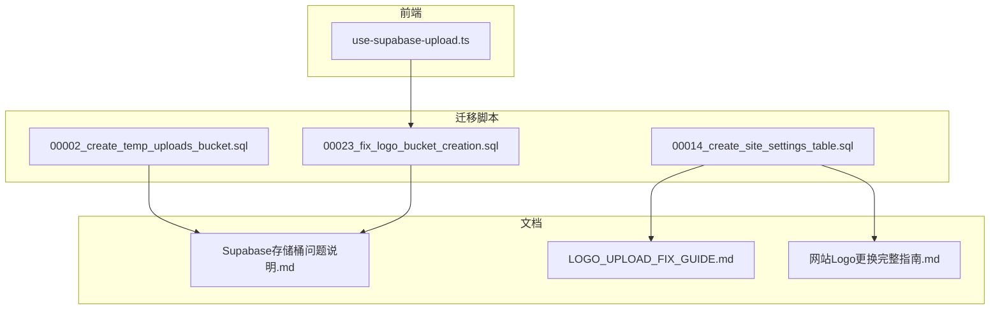
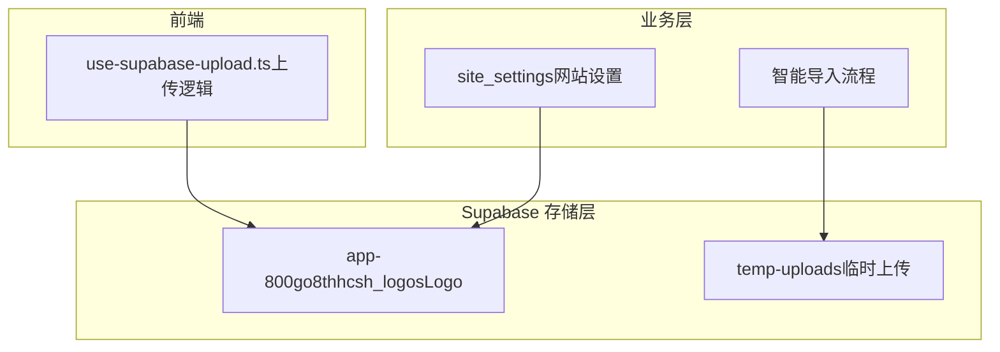
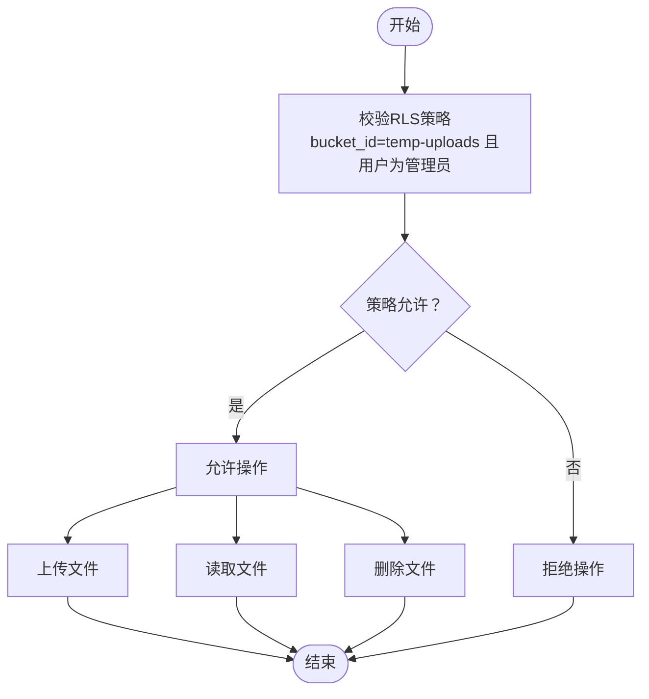
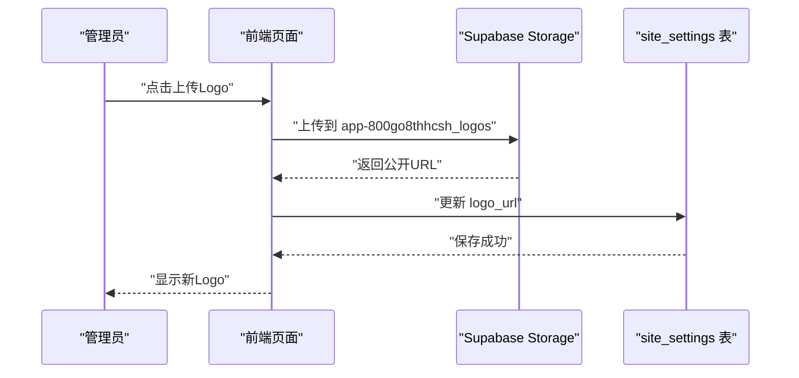
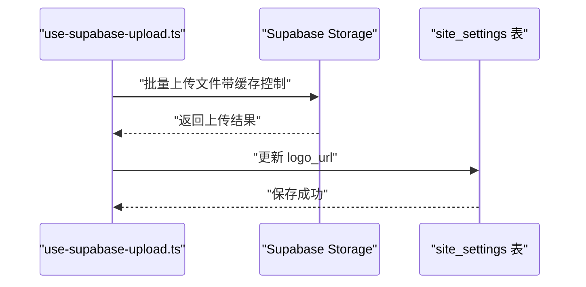
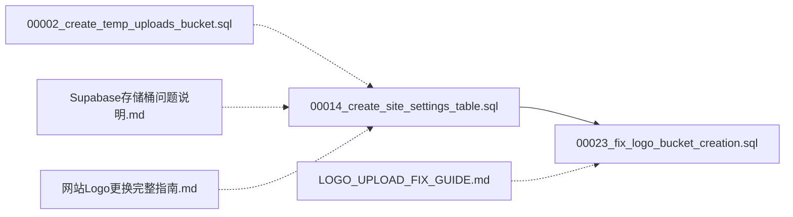

# 存储桶管理

<cite>
**本文引用的文件**
- [00002_create_temp_uploads_bucket.sql](file://supabase/migrations/00002_create_temp_uploads_bucket.sql)
- [00023_fix_logo_bucket_creation.sql](file://supabase/migrations/00023_fix_logo_bucket_creation.sql)
- [00014_create_site_settings_table.sql](file://supabase/migrations/00014_create_site_settings_table.sql)
- [Supabase存储桶问题说明.md](file://docs/Supabase存储桶问题说明.md)
- [LOGO_UPLOAD_FIX_GUIDE.md](file://docs/LOGO_UPLOAD_FIX_GUIDE.md)
- [网站Logo更换完整指南.md](file://docs/网站Logo更换完整指南.md)
- [use-supabase-upload.ts](file://src/hooks/use-supabase-upload.ts)
</cite>

## 目录
1. [简介](#简介)
2. [项目结构](#项目结构)
3. [核心组件](#核心组件)
4. [架构总览](#架构总览)
5. [详细组件分析](#详细组件分析)
6. [依赖关系分析](#依赖关系分析)
7. [性能考量](#性能考量)
8. [故障排查指南](#故障排查指南)
9. [结论](#结论)
10. [附录](#附录)

## 简介
本文件围绕 Supabase 存储桶的配置与管理策略展开，重点解析两个迁移脚本：
- 00002_create_temp_uploads_bucket.sql：创建临时上传存储桶（temp-uploads），用于智能导入流程中的临时文件存储。
- 00023_fix_logo_bucket_creation.sql：修复 logo 存储桶创建问题，明确其访问权限与策略。

同时，结合网站设置（site_settings）与实际业务场景，说明临时上传桶的设计目的、文件生命周期管理与安全策略（RLS 规则），以及 logo 存储桶的创建、访问权限与在网站设置中的应用。最后给出命名规范、容量规划与监控机制的最佳实践，涵盖通过 SQL 脚本定义存储策略、设置 CORS 规则与管理存储配额的方法。

## 项目结构
- 迁移脚本位于 supabase/migrations 下，包含存储桶创建与策略定义。
- 文档位于 docs 下，提供问题说明、修复指南与操作指南。
- 前端上传逻辑位于 src/hooks/use-supabase-upload.ts，体现文件上传流程与缓存控制。

图表来源
- [00002_create_temp_uploads_bucket.sql](file://supabase/migrations/00002_create_temp_uploads_bucket.sql#L1-L55)
- [00023_fix_logo_bucket_creation.sql](file://supabase/migrations/00023_fix_logo_bucket_creation.sql#L1-L77)
- [00014_create_site_settings_table.sql](file://supabase/migrations/00014_create_site_settings_table.sql#L1-L146)
- [Supabase存储桶问题说明.md](file://docs/Supabase存储桶问题说明.md#L1-L460)
- [LOGO_UPLOAD_FIX_GUIDE.md](file://docs/LOGO_UPLOAD_FIX_GUIDE.md#L1-L332)
- [网站Logo更换完整指南.md](file://docs/网站Logo更换完整指南.md#L1-L762)
- [use-supabase-upload.ts](file://src/hooks/use-supabase-upload.ts#L131-L163)

章节来源
- [00002_create_temp_uploads_bucket.sql](file://supabase/migrations/00002_create_temp_uploads_bucket.sql#L1-L55)
- [00023_fix_logo_bucket_creation.sql](file://supabase/migrations/00023_fix_logo_bucket_creation.sql#L1-L77)
- [00014_create_site_settings_table.sql](file://supabase/migrations/00014_create_site_settings_table.sql#L1-L146)
- [Supabase存储桶问题说明.md](file://docs/Supabase存储桶问题说明.md#L1-L460)
- [LOGO_UPLOAD_FIX_GUIDE.md](file://docs/LOGO_UPLOAD_FIX_GUIDE.md#L1-L332)
- [网站Logo更换完整指南.md](file://docs/网站Logo更换完整指南.md#L1-L762)
- [use-supabase-upload.ts](file://src/hooks/use-supabase-upload.ts#L131-L163)

## 核心组件
- 临时上传存储桶（temp-uploads）
  - 目的：为智能导入流程提供临时文件存储，支持图片与 PDF 的上传、读取与删除，且仅管理员可操作。
  - 安全策略：RLS 策略限定 bucket_id 并校验用户角色为管理员。
  - 生命周期：脚本注释指出文件可自动过期（通过定时任务清理）。
- logo 存储桶（app-800go8thhcsh_logos）
  - 目的：用于网站 Logo 的公开读取与管理员上传/更新/删除。
  - 访问权限：公开读取；仅管理员上传、更新、删除。
  - 创建现状：通过 SQL 直接插入 storage.buckets 表的方式在当前实例中无效，需通过 Dashboard、Service Role Key 或 CLI 创建。
- 网站设置（site_settings）
  - 存储 Logo URL，RLS 策略允许所有人读取，仅管理员修改。
  - 迁移中包含 logo 存储桶的创建与策略定义（尽管在当前实例中未生效）。

章节来源
- [00002_create_temp_uploads_bucket.sql](file://supabase/migrations/00002_create_temp_uploads_bucket.sql#L1-L55)
- [00023_fix_logo_bucket_creation.sql](file://supabase/migrations/00023_fix_logo_bucket_creation.sql#L1-L77)
- [00014_create_site_settings_table.sql](file://supabase/migrations/00014_create_site_settings_table.sql#L1-L146)
- [Supabase存储桶问题说明.md](file://docs/Supabase存储桶问题说明.md#L1-L460)

## 架构总览
下面的架构图展示了存储桶与业务流程的关系，包括临时上传桶在智能导入中的作用、logo 存储桶在网站设置中的应用，以及前端上传逻辑。

图表来源
- [00002_create_temp_uploads_bucket.sql](file://supabase/migrations/00002_create_temp_uploads_bucket.sql#L1-L55)
- [00023_fix_logo_bucket_creation.sql](file://supabase/migrations/00023_fix_logo_bucket_creation.sql#L1-L77)
- [00014_create_site_settings_table.sql](file://supabase/migrations/00014_create_site_settings_table.sql#L1-L146)
- [use-supabase-upload.ts](file://src/hooks/use-supabase-upload.ts#L131-L163)

## 详细组件分析

### 临时上传存储桶（temp-uploads）分析
- 设计目的
  - 支持智能导入流程中的临时文件存储，避免直接写入生产环境存储，降低风险。
- 存储桶配置
  - 公开访问关闭（需要认证）。
  - 文件大小限制通过 RLS 策略控制。
  - 允许的 MIME 类型包括图片与 PDF。
- 安全策略（RLS）
  - 仅管理员可上传、读取、删除。
  - 策略基于 bucket_id 与用户角色校验。
- 生命周期管理
  - 脚本注释指出文件可自动过期（通过定时任务清理）。

图表来源
- [00002_create_temp_uploads_bucket.sql](file://supabase/migrations/00002_create_temp_uploads_bucket.sql#L1-L55)

章节来源
- [00002_create_temp_uploads_bucket.sql](file://supabase/migrations/00002_create_temp_uploads_bucket.sql#L1-L55)

### logo 存储桶（app-800go8thhcsh_logos）分析
- 创建过程
  - 原始迁移（00014）与修复迁移（00023）均尝试通过 SQL 直接插入 storage.buckets 表，但在当前实例中无效。
  - 需通过 Supabase Dashboard、Service Role Key 或 Supabase CLI 创建。
- 访问权限配置
  - 公开读取：所有人可读。
  - 仅管理员上传、更新、删除。
- 在网站设置中的应用
  - site_settings 表存储 logo_url，RLS 允许所有人读取，仅管理员修改。
  - logo 存储桶策略与 site_settings 的 RLS 共同保证安全与可用性。

图表来源
- [00023_fix_logo_bucket_creation.sql](file://supabase/migrations/00023_fix_logo_bucket_creation.sql#L1-L77)
- [00014_create_site_settings_table.sql](file://supabase/migrations/00014_create_site_settings_table.sql#L1-L146)
- [LOGO_UPLOAD_FIX_GUIDE.md](file://docs/LOGO_UPLOAD_FIX_GUIDE.md#L1-L332)
- [网站Logo更换完整指南.md](file://docs/网站Logo更换完整指南.md#L1-L762)

章节来源
- [00023_fix_logo_bucket_creation.sql](file://supabase/migrations/00023_fix_logo_bucket_creation.sql#L1-L77)
- [00014_create_site_settings_table.sql](file://supabase/migrations/00014_create_site_settings_table.sql#L1-L146)
- [Supabase存储桶问题说明.md](file://docs/Supabase存储桶问题说明.md#L1-L460)
- [LOGO_UPLOAD_FIX_GUIDE.md](file://docs/LOGO_UPLOAD_FIX_GUIDE.md#L1-L332)
- [网站Logo更换完整指南.md](file://docs/网站Logo更换完整指南.md#L1-L762)

### 前端上传逻辑与缓存控制
- 上传流程
  - 前端对文件进行批量上传，支持部分成功重试。
  - 上传时设置缓存控制（cacheControl），提升 CDN 缓存效率。
- 与存储桶的关系
  - 上传目标桶根据业务场景选择（如 logo 存储桶）。
  - 成功后获取公开 URL 并更新数据库（如 site_settings.logo_url）。

图表来源
- [use-supabase-upload.ts](file://src/hooks/use-supabase-upload.ts#L131-L163)

章节来源
- [use-supabase-upload.ts](file://src/hooks/use-supabase-upload.ts#L131-L163)

## 依赖关系分析
- 迁移脚本之间的依赖
  - 00014_create_site_settings_table.sql 中包含 logo 存储桶的创建与策略定义。
  - 00023_fix_logo_bucket_creation.sql 作为修复尝试，补充策略重建与冲突处理。
  - 00002_create_temp_uploads_bucket.sql 独立定义临时上传桶及其 RLS。
- 文档与脚本的对应关系
  - Supabase存储桶问题说明.md 对比了 00014 与 00023 的差异与失败原因。
  - LOGO_UPLOAD_FIX_GUIDE.md 与 网站Logo更换完整指南.md 提供了操作指引与验证步骤。

图表来源
- [00014_create_site_settings_table.sql](file://supabase/migrations/00014_create_site_settings_table.sql#L1-L146)
- [00023_fix_logo_bucket_creation.sql](file://supabase/migrations/00023_fix_logo_bucket_creation.sql#L1-L77)
- [00002_create_temp_uploads_bucket.sql](file://supabase/migrations/00002_create_temp_uploads_bucket.sql#L1-L55)
- [Supabase存储桶问题说明.md](file://docs/Supabase存储桶问题说明.md#L1-L460)
- [LOGO_UPLOAD_FIX_GUIDE.md](file://docs/LOGO_UPLOAD_FIX_GUIDE.md#L1-L332)
- [网站Logo更换完整指南.md](file://docs/网站Logo更换完整指南.md#L1-L762)

章节来源
- [00014_create_site_settings_table.sql](file://supabase/migrations/00014_create_site_settings_table.sql#L1-L146)
- [00023_fix_logo_bucket_creation.sql](file://supabase/migrations/00023_fix_logo_bucket_creation.sql#L1-L77)
- [00002_create_temp_uploads_bucket.sql](file://supabase/migrations/00002_create_temp_uploads_bucket.sql#L1-L55)
- [Supabase存储桶问题说明.md](file://docs/Supabase存储桶问题说明.md#L1-L460)
- [LOGO_UPLOAD_FIX_GUIDE.md](file://docs/LOGO_UPLOAD_FIX_GUIDE.md#L1-L332)
- [网站Logo更换完整指南.md](file://docs/网站Logo更换完整指南.md#L1-L762)

## 性能考量
- 缓存控制
  - 前端上传时设置 cacheControl，有助于 CDN 缓存与减少回源压力。
- 文件大小限制
  - 临时上传桶限制为 10MB，logo 存储桶限制为 2MB，避免超大文件占用资源。
- MIME 类型限制
  - 通过 allowed_mime_types 控制，减少无效或恶意文件进入存储。
- 生命周期管理
  - 临时上传桶建议配合定时任务清理过期文件，释放存储空间。

章节来源
- [00002_create_temp_uploads_bucket.sql](file://supabase/migrations/00002_create_temp_uploads_bucket.sql#L1-L55)
- [00023_fix_logo_bucket_creation.sql](file://supabase/migrations/00023_fix_logo_bucket_creation.sql#L1-L77)
- [use-supabase-upload.ts](file://src/hooks/use-supabase-upload.ts#L131-L163)

## 故障排查指南
- 问题：logo 存储桶不存在
  - 现象：Logo 上传功能失败。
  - 原因：在当前实例中，直接通过 SQL 插入 storage.buckets 表无效。
  - 解决方案：
    - 通过 Supabase Dashboard 手动创建存储桶并配置策略。
    - 使用 Service Role Key 通过 API 创建（极度危险，使用后立即删除脚本）。
    - 使用 Supabase CLI 创建。
    - 临时方案：在网站设置中直接输入外部图片 URL。
- 验证步骤
  - 使用提供的验证脚本检查存储桶状态。
  - 在管理后台测试上传与前端显示效果。
- 常见问题
  - 上传时报“违反行级安全策略”：确认当前用户为管理员，且 is_admin() 正常工作。
  - 上传成功但前端不显示：检查浏览器缓存、CDN 缓存与 logo_url 是否正确保存。

章节来源
- [Supabase存储桶问题说明.md](file://docs/Supabase存储桶问题说明.md#L1-L460)
- [LOGO_UPLOAD_FIX_GUIDE.md](file://docs/LOGO_UPLOAD_FIX_GUIDE.md#L1-L332)
- [网站Logo更换完整指南.md](file://docs/网站Logo更换完整指南.md#L1-L762)

## 结论
- 临时上传桶（temp-uploads）通过严格的 RLS 策略与生命周期管理，为智能导入流程提供安全可控的临时文件存储。
- logo 存储桶（app-800go8thhcsh_logos）采用公开读取与管理员写入的策略，满足网站 Logo 的展示需求；在当前实例中需通过非 SQL 方式创建。
- site_settings 表与存储桶策略共同构成完整的安全与可用性保障。
- 实践中应结合缓存控制、文件大小与类型限制、定期清理与监控，确保存储系统的稳定与高效。

## 附录

### 命名规范
- 临时上传桶：建议以 temp- 前缀命名，明确用途与生命周期。
- 生产存储桶：建议以 app-<project_ref>_<purpose> 命名，便于识别与管理。
- 示例：app-800go8thhcsh_logos

章节来源
- [00023_fix_logo_bucket_creation.sql](file://supabase/migrations/00023_fix_logo_bucket_creation.sql#L1-L77)

### 容量规划与监控机制
- 容量规划
  - 根据业务峰值并发与文件类型分布估算存储需求，预留 20%-30% 的冗余。
  - 对临时桶与生产桶分别设定合理的文件大小限制与数量上限。
- 监控机制
  - 使用 Supabase Dashboard 的 Storage 监控面板观察桶使用量与访问趋势。
  - 结合日志与告警，关注异常上传行为与配额接近阈值的情况。

章节来源
- [Supabase存储桶问题说明.md](file://docs/Supabase存储桶问题说明.md#L1-L460)

### 通过 SQL 脚本定义存储策略与配额
- 存储桶创建与策略
  - 使用 INSERT INTO storage.buckets 定义桶名、公开属性、文件大小限制与允许的 MIME 类型。
  - 使用 CREATE POLICY 定义 SELECT/INSERT/UPDATE/DELETE 的访问策略，结合 auth.uid() 与 is_admin() 进行权限控制。
- CORS 规则
  - 通过 Supabase Dashboard 的 Storage -> Policies -> CORS 配置，设置允许的来源与方法，确保跨域访问安全。
- 存储配额
  - 在 Dashboard 中为桶设置配额与文件数量上限，防止滥用。
  - 结合 RLS 与配额双重约束，提升安全性与稳定性。

章节来源
- [00002_create_temp_uploads_bucket.sql](file://supabase/migrations/00002_create_temp_uploads_bucket.sql#L1-L55)
- [00023_fix_logo_bucket_creation.sql](file://supabase/migrations/00023_fix_logo_bucket_creation.sql#L1-L77)
- [Supabase存储桶问题说明.md](file://docs/Supabase存储桶问题说明.md#L1-L460)