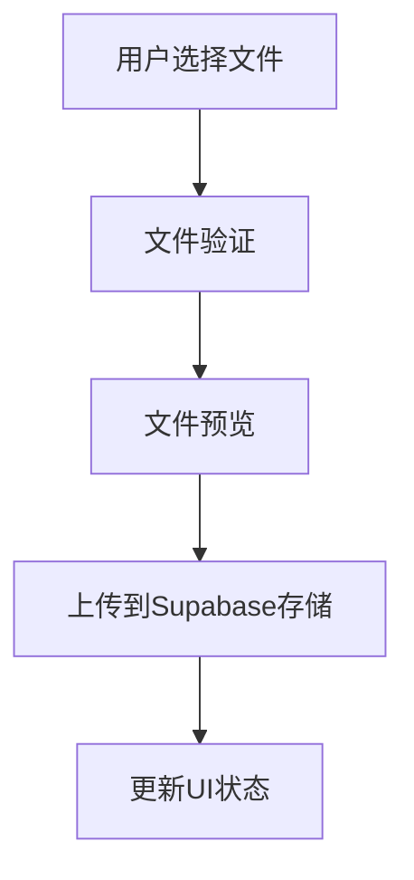
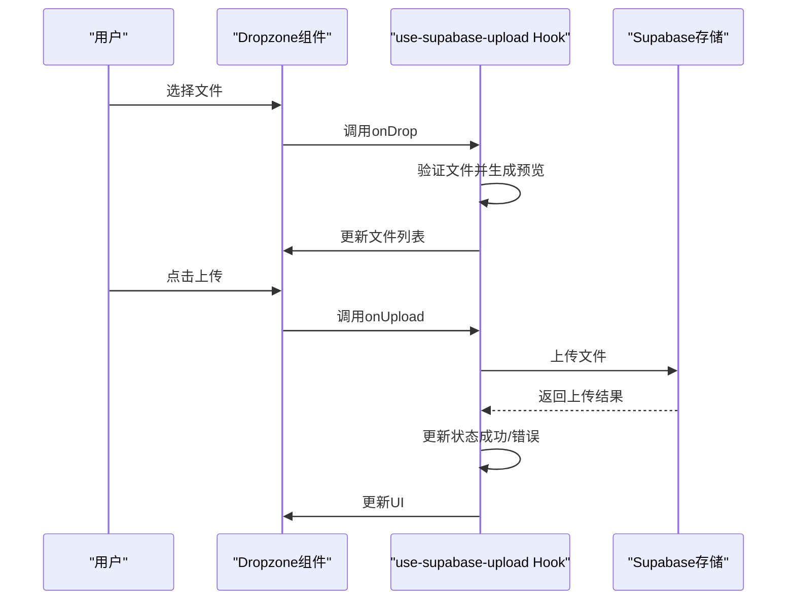

# 存储集成

<cite>
**本文档引用文件**   
- [use-supabase-upload.ts](file://src/hooks/use-supabase-upload.ts)
- [dropzone.tsx](file://src/components/dropzone.tsx)
- [supabase.ts](file://src/db/supabase.ts)
- [SiteSettingsPage.tsx](file://src/pages/admin/SiteSettingsPage.tsx)
- [api.ts](file://src/db/api.ts)
- [00002_create_temp_uploads_bucket.sql](file://supabase/migrations/00002_create_temp_uploads_bucket.sql)
- [00023_fix_logo_bucket_creation.sql](file://supabase/migrations/00023_fix_logo_bucket_creation.sql)
- [Supabase存储桶问题说明.md](file://docs/Supabase存储桶问题说明.md)
</cite>

## 目录
1. [简介](#简介)
2. [项目结构](#项目结构)
3. [核心组件](#核心组件)
4. [架构概述](#架构概述)
5. [详细组件分析](#详细组件分析)
6. [依赖分析](#依赖分析)
7. [性能考虑](#性能考虑)
8. [故障排除指南](#故障排除指南)
9. [结论](#结论)

## 简介
本文档详细说明了Supabase存储集成的实现方案，重点介绍文件上传功能的完整生命周期。文档深入解析了`use-supabase-upload.ts`自定义Hook的设计与实现，包括其参数配置和返回值。同时，文档详细描述了从用户通过Dropzone选择文件到调用Supabase存储API执行上传的完整流程，以及存储桶的创建与配置。

## 项目结构
项目结构清晰地组织了各个功能模块，其中与存储集成相关的文件主要分布在`src/hooks`、`src/components`和`supabase/migrations`目录中。`src/hooks`目录包含`use-supabase-upload.ts`自定义Hook，`src/components`目录包含`dropzone.tsx`组件，`supabase/migrations`目录包含存储桶创建和配置的SQL脚本。

**Section sources**
- [use-supabase-upload.ts](file://src/hooks/use-supabase-upload.ts)
- [dropzone.tsx](file://src/components/dropzone.tsx)
- [00002_create_temp_uploads_bucket.sql](file://supabase/migrations/00002_create_temp_uploads_bucket.sql)
- [00023_fix_logo_bucket_creation.sql](file://supabase/migrations/00023_fix_logo_bucket_creation.sql)

## 核心组件
`use-supabase-upload.ts`自定义Hook是文件上传功能的核心，它封装了与Supabase存储API的交互逻辑。该Hook提供了丰富的配置选项，包括存储桶名称、路径、允许的MIME类型、最大文件大小、最大文件数量、缓存控制和上载策略。`dropzone.tsx`组件则提供了用户友好的文件上传界面，集成了`use-supabase-upload.ts`Hook的功能。

**Section sources**
- [use-supabase-upload.ts](file://src/hooks/use-supabase-upload.ts)
- [dropzone.tsx](file://src/components/dropzone.tsx)

## 架构概述
文件上传功能的架构基于React自定义Hook和Supabase存储服务。`use-supabase-upload.ts`Hook负责管理文件上传的状态和逻辑，`dropzone.tsx`组件负责提供用户界面。文件上传流程从用户选择文件开始，经过验证和预览，最终通过Supabase存储API上传到指定的存储桶。



**Diagram sources **
- [use-supabase-upload.ts](file://src/hooks/use-supabase-upload.ts)
- [dropzone.tsx](file://src/components/dropzone.tsx)

## 详细组件分析

### use-supabase-upload Hook 分析
`use-supabase-upload.ts`自定义Hook提供了文件上传功能的核心逻辑。它接受一个配置对象作为参数，返回一个包含文件列表、上传状态、错误信息和上传函数的对象。

#### 参数配置
- **bucketName**: 指定文件上传的目标存储桶名称。
- **path**: 指定文件在存储桶中的路径。
- **allowedMimeTypes**: 指定允许上传的文件MIME类型。
- **maxFileSize**: 指定单个文件的最大大小。
- **maxFiles**: 指定一次上传的最大文件数量。
- **cacheControl**: 指定文件在浏览器和Supabase CDN中的缓存时间。
- **upsert**: 指定是否覆盖已存在的文件。
- **supabase**: 初始化的Supabase客户端实例。

#### 返回值
- **files**: 当前选择的文件列表。
- **setFiles**: 设置文件列表的函数。
- **successes**: 成功上传的文件列表。
- **isSuccess**: 上传是否成功的标志。
- **loading**: 上传是否正在进行的标志。
- **errors**: 上传过程中出现的错误列表。
- **setErrors**: 设置错误列表的函数。
- **onUpload**: 执行文件上传的函数。
- **maxFileSize**: 最大文件大小限制。
- **maxFiles**: 最大文件数量限制。
- **allowedMimeTypes**: 允许的MIME类型列表。
- **dropzoneProps**: 用于集成react-dropzone的属性。

```mermaid
classDiagram
class UseSupabaseUploadOptions {
+bucketName : string
+path? : string
+allowedMimeTypes? : string[]
+maxFileSize? : number
+maxFiles? : number
+cacheControl? : number
+upsert? : boolean
+supabase : SupabaseClient
}
class UseSupabaseUploadReturn {
+files : FileWithPreview[]
+setFiles : (files : FileWithPreview[]) => void
+successes : string[]
+isSuccess : boolean
+loading : boolean
+errors : { name : string; message : string }[]
+setErrors : (errors : { name : string; message : string }[]) => void
+onUpload : () => Promise<void>
+maxFileSize : number
+maxFiles : number
+allowedMimeTypes : string[]
+getRootProps : () => any
+getInputProps : () => any
+isDragActive : boolean
+isDragReject : boolean
+draggedFiles : File[]
}
UseSupabaseUploadOptions --> UseSupabaseUploadReturn : "配置"
```

**Diagram sources **
- [use-supabase-upload.ts](file://src/hooks/use-supabase-upload.ts#L10-L54)

### 文件上传流程分析
文件上传流程从用户通过Dropzone组件选择文件开始。`use-supabase-upload.ts`Hook接收文件列表，进行验证和预览处理。用户点击上传按钮后，`onUpload`函数被调用，通过Supabase存储API将文件上传到指定的存储桶。上传过程中，Hook会更新加载状态和错误信息，上传完成后更新成功列表。



**Diagram sources **
- [use-supabase-upload.ts](file://src/hooks/use-supabase-upload.ts#L117-L158)
- [dropzone.tsx](file://src/components/dropzone.tsx#L62-L177)

## 依赖分析
文件上传功能依赖于多个外部库和内部模块。主要依赖包括`react-dropzone`用于文件选择和拖放功能，`@supabase/supabase-js`用于与Supabase存储服务的交互。内部依赖包括`supabase.ts`提供的Supabase客户端实例，以及`api.ts`中定义的辅助函数。

```mermaid
graph TD
A[use-supabase-upload.ts] --> B[react-dropzone]
A --> C[@supabase/supabase-js]
A --> D[supabase.ts]
A --> E[api.ts]
F[dropzone.tsx] --> A
F --> G[ui组件]
```

**Diagram sources **
- [use-supabase-upload.ts](file://src/hooks/use-supabase-upload.ts)
- [dropzone.tsx](file://src/components/dropzone.tsx)
- [supabase.ts](file://src/db/supabase.ts)

**Section sources**
- [use-supabase-upload.ts](file://src/hooks/use-supabase-upload.ts)
- [dropzone.tsx](file://src/components/dropzone.tsx)
- [supabase.ts](file://src/db/supabase.ts)
- [api.ts](file://src/db/api.ts)

## 性能考虑
为了优化文件上传性能，建议采取以下措施：
- 对大文件实施分块上传，避免单次请求过大。
- 控制并发上传数量，避免过多的网络请求影响用户体验。
- 合理设置缓存策略，减少重复文件的上传。
- 在上传前进行文件验证，避免无效文件占用带宽和存储空间。

## 故障排除指南
在使用文件上传功能时，可能会遇到以下常见问题：
- 存储桶不存在：确保在Supabase Dashboard中正确创建了存储桶。
- 权限不足：检查用户角色是否具有上传文件的权限。
- 文件类型不支持：确保上传的文件类型在允许的MIME类型列表中。
- 文件大小超限：检查文件大小是否超过配置的最大限制。

**Section sources**
- [Supabase存储桶问题说明.md](file://docs/Supabase存储桶问题说明.md)
- [00023_fix_logo_bucket_creation.sql](file://supabase/migrations/00023_fix_logo_bucket_creation.sql)

## 结论
本文档详细介绍了Supabase存储集成的实现方案，重点解析了`use-supabase-upload.ts`自定义Hook的设计与实现。通过合理的架构设计和参数配置，实现了高效、可靠的文件上传功能。建议在实际使用中根据具体需求调整配置参数，并注意性能优化和错误处理。