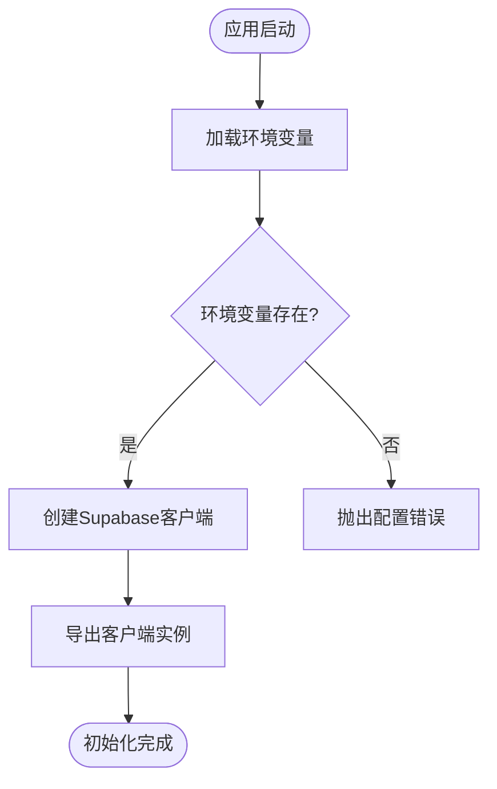
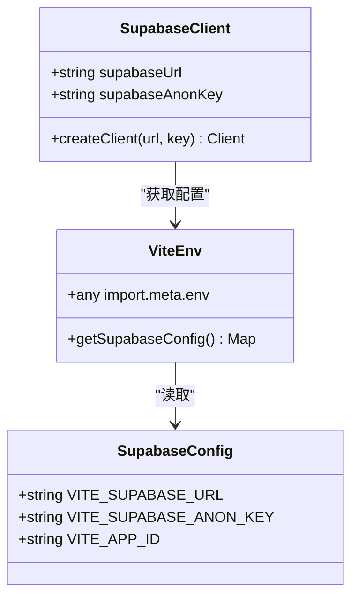
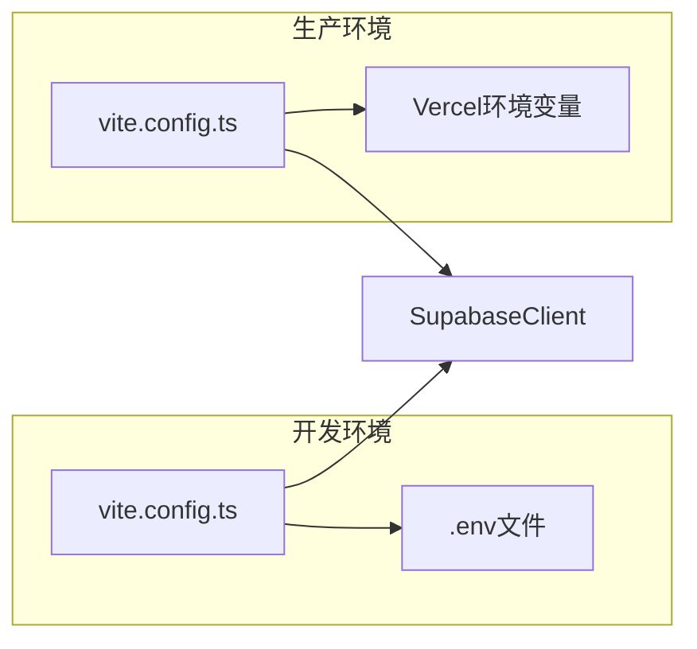
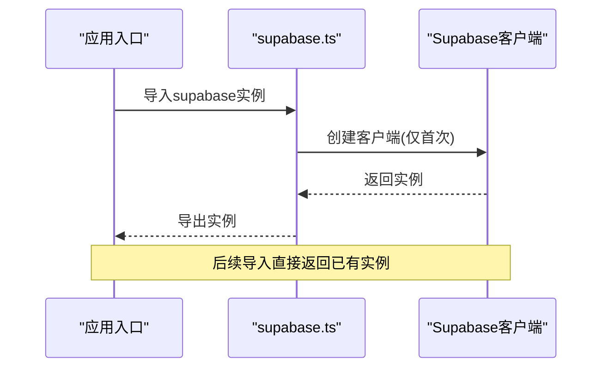
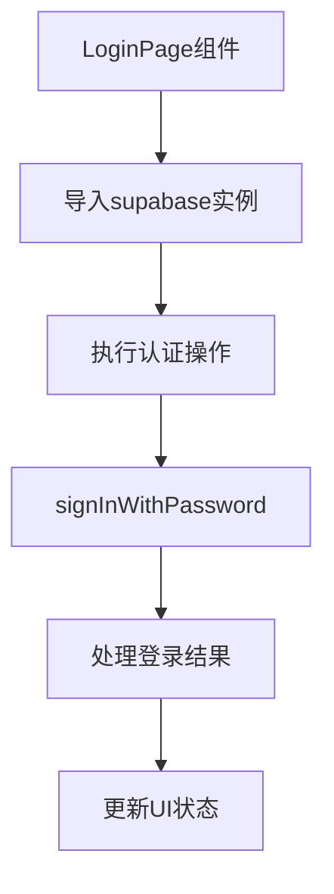
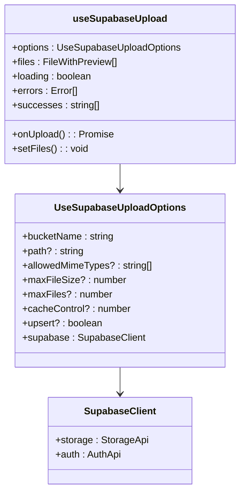
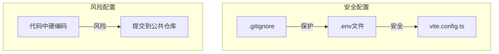

# 客户端配置

<cite>
**本文档引用的文件**   
- [supabase.ts](file://src/db/supabase.ts)
- [api.ts](file://src/db/api.ts)
- [use-supabase-upload.ts](file://src/hooks/use-supabase-upload.ts)
- [LoginPage.tsx](file://src/pages/LoginPage.tsx)
- [.env](file://.env)
- [vite.config.ts](file://vite.config.ts)
- [Project-Rules.md](file://Project-Rules.md)
</cite>

## 目录
1. [简介](#简介)
2. [Supabase客户端初始化](#supabase客户端初始化)
3. [环境变量配置](#环境变量配置)
4. [全局单例模式使用](#全局单例模式使用)
5. [组件和Hook中的使用](#组件和hook中的使用)
6. [安全配置最佳实践](#安全配置最佳实践)
7. [常见问题排查](#常见问题排查)
8. [结论](#结论)

## 简介
本文档详细说明了前端应用中Supabase客户端的配置过程。文档涵盖了Supabase客户端的初始化、环境变量的安全配置、全局单例模式的使用方式，以及在组件和Hook中的正确使用方法。同时提供了配置错误的常见问题排查指南，帮助开发人员快速解决配置相关的问题。

## Supabase客户端初始化

Supabase客户端在`src/db/supabase.ts`文件中进行初始化，通过Vite的环境变量机制读取配置信息。客户端实例使用`@supabase/supabase-js`库的`createClient`函数创建，并作为单例导出供整个应用使用。

**Diagram sources**
- [supabase.ts](file://src/db/supabase.ts#L2-L8)

**Section sources**
- [supabase.ts](file://src/db/supabase.ts#L1-L8)

## 环境变量配置

Supabase客户端通过Vite的`import.meta.env`机制读取环境变量。项目使用`.env`文件存储环境配置，其中包含Supabase服务的URL和匿名密钥。

### 环境变量定义

项目使用以下环境变量进行Supabase配置：

- `VITE_SUPABASE_URL`: Supabase服务的API URL
- `VITE_SUPABASE_ANON_KEY`: Supabase服务的匿名访问密钥

这些环境变量在`src/db/supabase.ts`文件中被读取：

**Diagram sources**
- [supabase.ts](file://src/db/supabase.ts#L4-L5)
- [.env](file://.env#L4-L6)

**Section sources**
- [supabase.ts](file://src/db/supabase.ts#L4-L5)
- [.env](file://.env#L4-L6)

### 不同环境的配置方式

项目在不同环境中使用不同的配置策略：

- **开发环境**: 使用`.env`文件中的配置
- **测试环境**: 使用CI/CD管道中的环境变量
- **生产环境**: 使用Vercel等部署平台的环境变量配置

Vite配置文件`vite.config.ts`确保了环境变量的正确加载：

**Diagram sources**
- [vite.config.ts](file://vite.config.ts#L1-L25)
- [.env](file://.env#L1-L7)

**Section sources**
- [vite.config.ts](file://vite.config.ts#L1-L25)

## 全局单例模式使用

Supabase客户端在项目中作为全局单例使用，确保整个应用使用同一个客户端实例，避免重复创建和资源浪费。

### 单例实现原理

客户端实例在`src/db/supabase.ts`文件中创建并导出，由于ES模块的特性，该实例在整个应用中只会被创建一次：

**Diagram sources**
- [supabase.ts](file://src/db/supabase.ts#L7)

**Section sources**
- [supabase.ts](file://src/db/supabase.ts#L7)

### 单例优势

使用全局单例模式有以下优势：

- **资源优化**: 避免重复创建客户端实例，节省内存和网络资源
- **状态一致性**: 所有组件共享同一个认证状态
- **连接复用**: 复用HTTP连接，提高性能
- **简化管理**: 集中管理客户端配置和生命周期

## 组件和Hook中的使用

Supabase客户端在组件和自定义Hook中通过导入方式使用，确保一致性和类型安全。

### 在组件中使用

在React组件中，通过导入`supabase`实例来执行数据库操作：

**Diagram sources**
- [LoginPage.tsx](file://src/pages/LoginPage.tsx#L3)
- [supabase.ts](file://src/db/supabase.ts)

**Section sources**
- [LoginPage.tsx](file://src/pages/LoginPage.tsx#L3-L48)

### 在自定义Hook中使用

在自定义Hook中，Supabase客户端作为参数传递，提高Hook的可测试性和灵活性：

**Diagram sources**
- [use-supabase-upload.ts](file://src/hooks/use-supabase-upload.ts#L53)
- [supabase.ts](file://src/db/supabase.ts)

**Section sources**
- [use-supabase-upload.ts](file://src/hooks/use-supabase-upload.ts#L1-L198)

## 安全配置最佳实践

为了确保Supabase客户端配置的安全性，项目遵循以下最佳实践。

### 环境变量安全

根据`Project-Rules.md`中的安全性规范，项目采取了以下措施：

- **禁止在代码中硬编码敏感信息**: 所有敏感配置都通过环境变量注入
- **使用VITE前缀**: 确保环境变量被Vite正确暴露给客户端代码
- **.gitignore保护**: `.env`文件被添加到`.gitignore`，防止意外提交

**Diagram sources**
- [.env](file://.env)
- [Project-Rules.md](file://Project-Rules.md#L46-L53)

**Section sources**
- [Project-Rules.md](file://Project-Rules.md#L46-L53)

### 访问控制

项目遵循最小权限原则，使用匿名密钥进行只读操作，敏感操作通过服务端函数处理：

- **前端**: 使用匿名密钥，仅执行查询操作
- **后端**: 使用服务角色密钥，执行写入和管理操作
- **权限**: 通过Supabase RLS（行级安全）策略控制数据访问

## 常见问题排查

### 环境变量未正确加载

**问题现象**: 应用启动时报错，提示无法读取`VITE_SUPABASE_URL`或`VITE_SUPABASE_ANON_KEY`。

**解决方案**:
1. 检查`.env`文件是否存在且格式正确
2. 确认环境变量名称以`VITE_`开头
3. 重启开发服务器使环境变量生效
4. 检查`vite.config.ts`中是否有影响环境变量加载的插件

### 跨域访问被拒绝

**问题现象**: 浏览器控制台显示CORS错误，无法连接Supabase服务。

**解决方案**:
1. 检查Supabase项目设置中的CORS配置
2. 确保开发服务器的域名在允许的来源列表中
3. 在生产环境中配置正确的部署域名
4. 检查网络代理设置是否影响请求

### 认证失败

**问题现象**: 用户登录时返回认证错误。

**解决方案**:
1. 检查邮箱格式是否符合要求
2. 验证密码是否正确
3. 检查Supabase Auth设置中的用户注册策略
4. 确认匿名密钥具有适当的权限

## 结论

Supabase客户端的配置是前端应用的关键部分，通过合理的初始化、环境变量管理和安全实践，可以确保应用的稳定性和安全性。全局单例模式的使用简化了客户端管理，而清晰的使用模式和错误排查指南则提高了开发效率。遵循本文档的指导，开发人员可以正确配置和使用Supabase客户端，为应用提供可靠的后端服务支持。