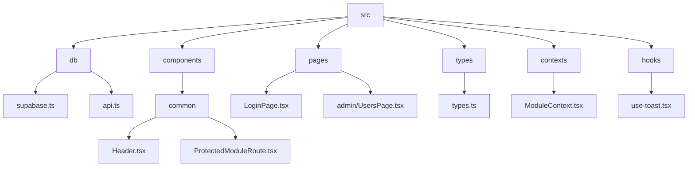
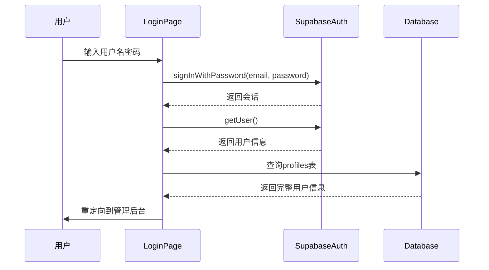
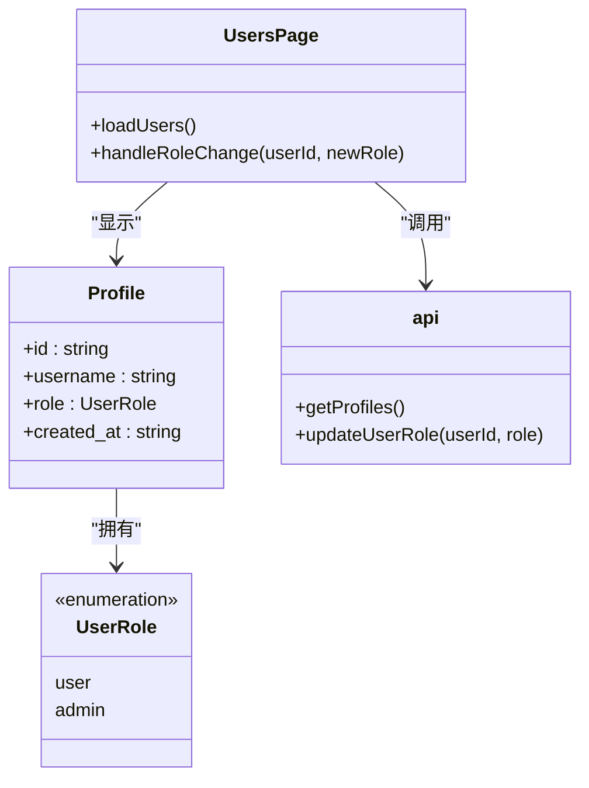
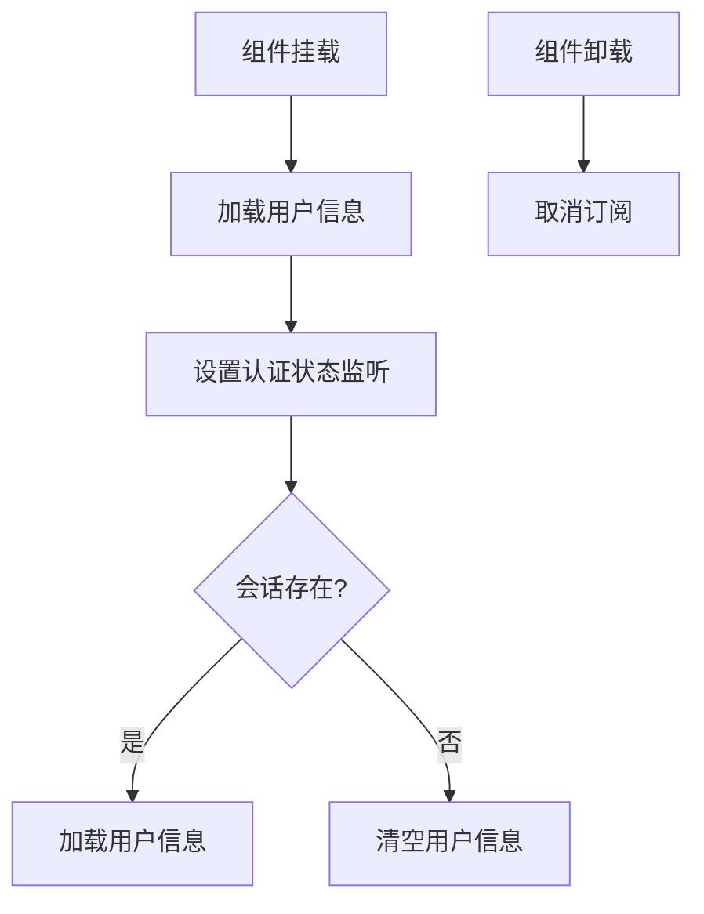
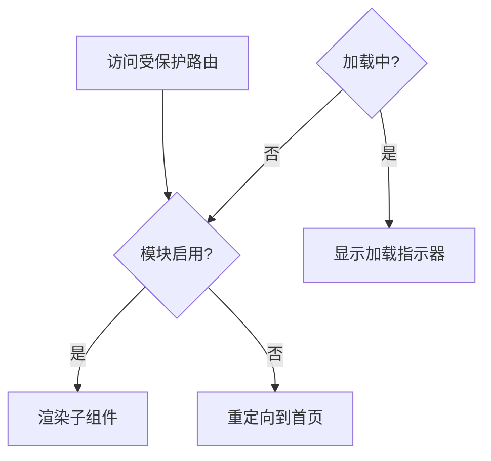
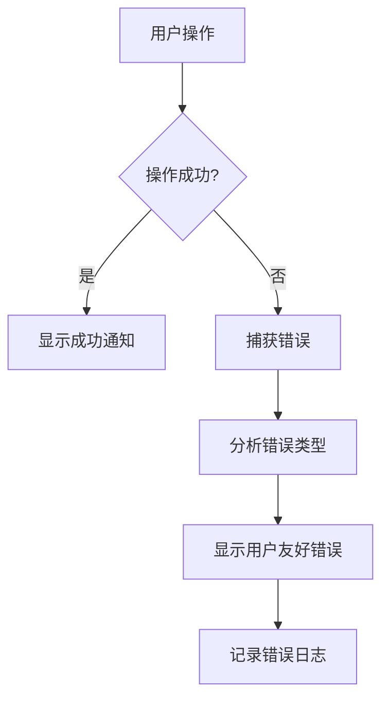

# 认证集成

<cite>
**本文档引用的文件**  
- [supabase.ts](file://src/db/supabase.ts)
- [api.ts](file://src/db/api.ts)
- [LoginPage.tsx](file://src/pages/LoginPage.tsx)
- [ProtectedModuleRoute.tsx](file://src/components/common/ProtectedModuleRoute.tsx)
- [Header.tsx](file://src/components/common/Header.tsx)
- [UsersPage.tsx](file://src/pages/admin/UsersPage.tsx)
- [types.ts](file://src/types/types.ts)
- [use-toast.tsx](file://src/hooks/use-toast.tsx)
- [AUTH_UX_OPTIMIZATION_GUIDE.md](file://docs/AUTH_UX_OPTIMIZATION_GUIDE.md)
</cite>

## 目录
1. [项目结构](#项目结构)
2. [核心认证机制](#核心认证机制)
3. [用户角色管理](#用户角色管理)
4. [认证状态在React组件中的使用](#认证状态在react组件中的使用)
5. [受保护路由与权限控制](#受保护路由与权限控制)
6. [错误处理与用户体验](#错误处理与用户体验)
7. [总结](#总结)

## 项目结构

本项目采用模块化结构，认证相关功能分布在多个目录中。核心认证逻辑位于`src/db`目录下，包括Supabase客户端配置和API封装。React组件位于`src/components`和`src/pages`目录中，负责UI展示和用户交互。类型定义位于`src/types`目录中，确保类型安全。

**图表来源**
- [supabase.ts](file://src/db/supabase.ts)
- [api.ts](file://src/db/api.ts)
- [LoginPage.tsx](file://src/pages/LoginPage.tsx)
- [ProtectedModuleRoute.tsx](file://src/components/common/ProtectedModuleRoute.tsx)
- [Header.tsx](file://src/components/common/Header.tsx)
- [UsersPage.tsx](file://src/pages/admin/UsersPage.tsx)
- [types.ts](file://src/types/types.ts)

**本节来源**
- [src](file://src)

## 核心认证机制

项目使用Supabase Auth进行身份验证，通过`supabase.auth.signInWithPassword`方法实现基于用户名/密码的登录。系统将用户名转换为特定格式的邮箱地址（username@miaoda.com）进行认证。认证成功后，系统通过`getCurrentProfile`函数获取当前用户会话和详细信息。

`getCurrentProfile`函数首先调用`supabase.auth.getUser()`获取用户会话，然后根据用户ID从`profiles`表中查询完整的用户信息。该函数返回`Profile`类型的Promise，如果用户未登录则返回null。

**图表来源**
- [LoginPage.tsx](file://src/pages/LoginPage.tsx)
- [api.ts](file://src/db/api.ts)
- [supabase.ts](file://src/db/supabase.ts)

**本节来源**
- [LoginPage.tsx](file://src/pages/LoginPage.tsx)
- [api.ts](file://src/db/api.ts)

## 用户角色管理

系统实现了基于角色的访问控制（RBAC），用户角色分为'admin'和'user'两种。管理员可以访问管理后台并管理其他用户，普通用户只能访问公共页面。

`updateUserRole`函数用于更新用户角色，接受用户ID和新角色作为参数，通过Supabase客户端更新`profiles`表中的角色字段。该功能在`UsersPage`组件中实现，管理员可以通过下拉菜单更改用户角色。

**图表来源**
- [types.ts](file://src/types/types.ts)
- [api.ts](file://src/db/api.ts)
- [UsersPage.tsx](file://src/pages/admin/UsersPage.tsx)

**本节来源**
- [types.ts](file://src/types/types.ts)
- [api.ts](file://src/db/api.ts)
- [UsersPage.tsx](file://src/pages/admin/UsersPage.tsx)

## 认证状态在React组件中的使用

系统通过React的`useEffect`钩子和Supabase的`onAuthStateChange`监听器管理认证状态。在`Header`组件中，系统初始化时加载用户信息，并设置认证状态监听器。当用户登录或退出时，系统自动更新UI。

认证状态管理流程包括：组件挂载时加载用户信息，监听认证状态变化，登录后自动加载用户信息，退出后清空用户信息，组件卸载时取消订阅。

**图表来源**
- [Header.tsx](file://src/components/common/Header.tsx)
- [api.ts](file://src/db/api.ts)

**本节来源**
- [Header.tsx](file://src/components/common/Header.tsx)

## 受保护路由与权限控制

系统使用`ProtectedModuleRoute`组件实现受保护路由和权限控制。该组件接收`moduleKey`属性，通过`useModules`上下文检查模块是否启用。如果模块未启用，组件将用户重定向到首页。

`ProtectedModuleRoute`还处理加载状态，在模块配置加载完成前显示加载指示器。这种设计确保了用户体验的流畅性，避免了页面闪烁。

**图表来源**
- [ProtectedModuleRoute.tsx](file://src/components/common/ProtectedModuleRoute.tsx)
- [ModuleContext.tsx](file://src/contexts/ModuleContext.tsx)

**本节来源**
- [ProtectedModuleRoute.tsx](file://src/components/common/ProtectedModuleRoute.tsx)

## 错误处理与用户体验

系统实现了全面的错误处理机制，使用`sonner`库显示Toast通知。在登录过程中，系统验证用户名格式（只允许字母、数字和下划线），并在出现错误时显示相应的错误提示。

对于认证失败的情况，系统捕获Supabase返回的错误消息并显示给用户。会话过期时，系统自动重定向到登录页面。所有关键操作（如登录、退出、更新角色）都包含错误处理和用户反馈。

**图表来源**
- [LoginPage.tsx](file://src/pages/LoginPage.tsx)
- [UsersPage.tsx](file://src/pages/admin/UsersPage.tsx)
- [use-toast.tsx](file://src/hooks/use-toast.tsx)
- [Header.tsx](file://src/components/common/Header.tsx)

**本节来源**
- [LoginPage.tsx](file://src/pages/LoginPage.tsx)
- [UsersPage.tsx](file://src/pages/admin/UsersPage.tsx)
- [use-toast.tsx](file://src/hooks/use-toast.tsx)

## 总结

本项目实现了基于Supabase Auth的完整认证系统，包括用户登录、会话管理、角色控制和权限验证。系统通过`getCurrentProfile`函数获取用户信息，使用`updateUserRole`函数管理用户角色，并在React组件中通过监听器实时响应认证状态变化。

受保护路由通过`ProtectedModuleRoute`组件实现，确保只有授权用户才能访问特定功能。系统还实现了全面的错误处理机制，提供良好的用户体验。整体设计遵循最佳实践，代码结构清晰，易于维护和扩展。