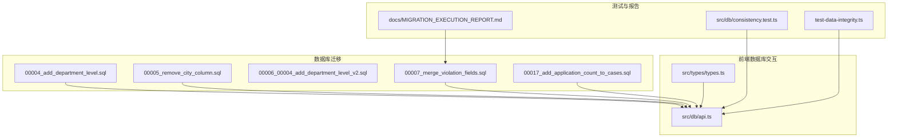
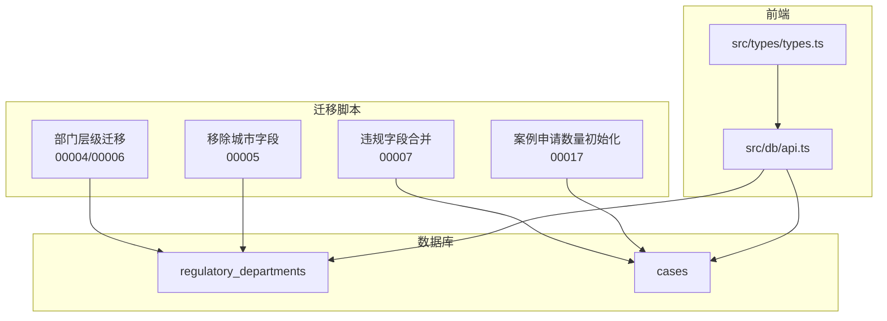
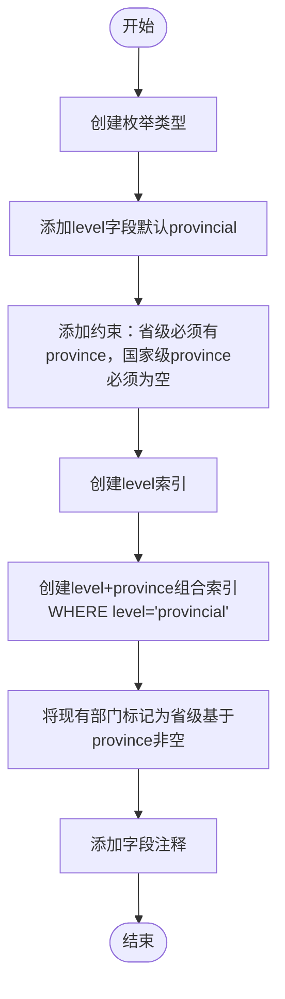
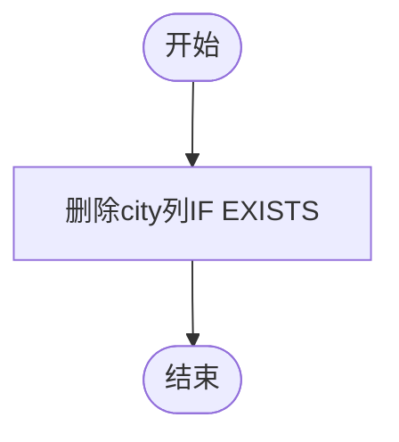
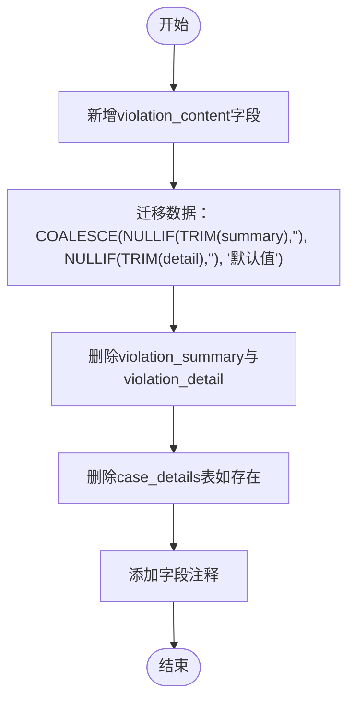
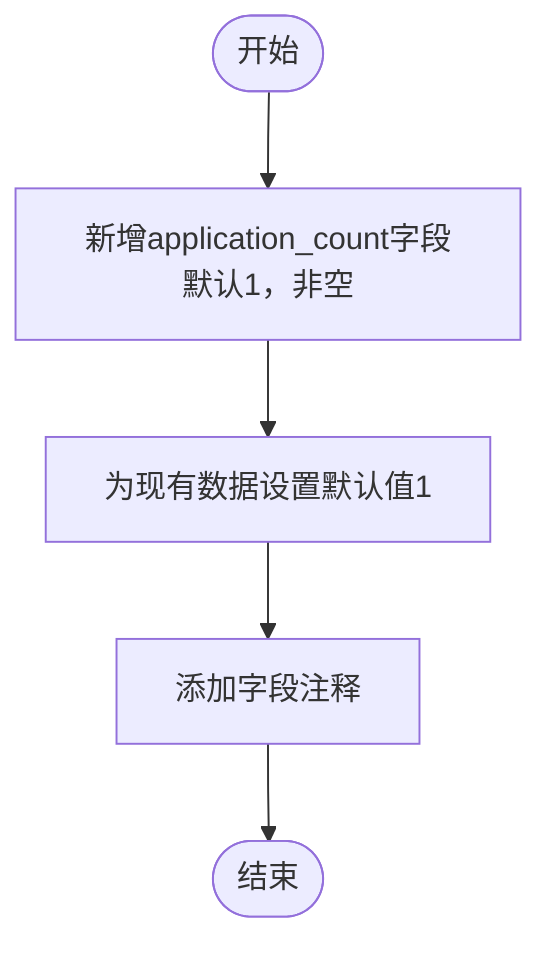
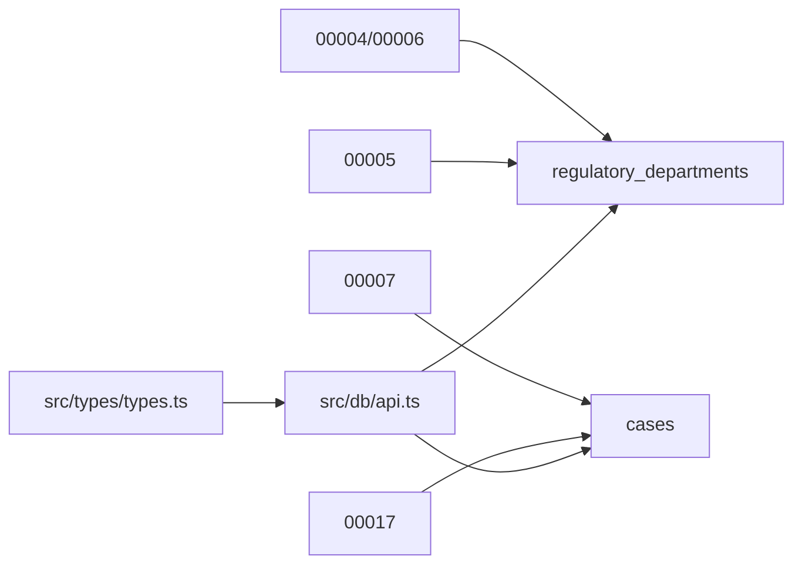

# 数据变更

<cite>
**本文引用的文件**
- [00004_add_department_level.sql](file://supabase/migrations/00004_add_department_level.sql)
- [00005_remove_city_column.sql](file://supabase/migrations/00005_remove_city_column.sql)
- [00006_00004_add_department_level_v2.sql](file://supabase/migrations/00006_00004_add_department_level_v2.sql)
- [00007_merge_violation_fields.sql](file://supabase/migrations/00007_merge_violation_fields.sql)
- [00017_add_application_count_to_cases.sql](file://supabase/migrations/00017_add_application_count_to_cases.sql)
- [api.ts](file://src/db/api.ts)
- [types.ts](file://src/types/types.ts)
- [consistency.test.ts](file://src/db/consistency.test.ts)
- [test-data-integrity.ts](file://test-data-integrity.ts)
- [MIGRATION_EXECUTION_REPORT.md](file://docs/MIGRATION_EXECUTION_REPORT.md)
</cite>

## 目录
1. [简介](#简介)
2. [项目结构](#项目结构)
3. [核心组件](#核心组件)
4. [架构总览](#架构总览)
5. [详细组件分析](#详细组件分析)
6. [依赖关系分析](#依赖关系分析)
7. [性能考量](#性能考量)
8. [故障排查指南](#故障排查指南)
9. [结论](#结论)
10. [附录](#附录)

## 简介
本文件聚焦于仓库中关键的数据变更迁移脚本，系统性解析以下迁移的结构设计、数据操作逻辑、事务与一致性保障、回滚方案、验证方法与质量保证流程：
- 00004_add_department_level.sql：新增部门层级字段并填充默认值，建立约束与索引
- 00005_remove_city_column.sql：移除已废弃的城市字段
- 00007_merge_violation_fields.sql：违规字段合并与数据转换规则
- 00017_add_application_count_to_cases.sql：案例申请数量字段初始化

同时，结合前端API与类型定义，说明这些变更如何影响业务层，并给出数据一致性校验与质量保障建议。

## 项目结构
围绕数据变更的核心文件位于 supabase/migrations 目录，前端与数据库交互位于 src/db 与 src/types 中，配套测试与迁移报告位于 docs 与根目录测试脚本。

图表来源
- [00004_add_department_level.sql](file://supabase/migrations/00004_add_department_level.sql#L1-L63)
- [00005_remove_city_column.sql](file://supabase/migrations/00005_remove_city_column.sql#L1-L23)
- [00006_00004_add_department_level_v2.sql](file://supabase/migrations/00006_00004_add_department_level_v2.sql#L1-L41)
- [00007_merge_violation_fields.sql](file://supabase/migrations/00007_merge_violation_fields.sql#L1-L41)
- [00017_add_application_count_to_cases.sql](file://supabase/migrations/00017_add_application_count_to_cases.sql#L1-L25)
- [api.ts](file://src/db/api.ts#L126-L253)
- [types.ts](file://src/types/types.ts#L14-L39)
- [consistency.test.ts](file://src/db/consistency.test.ts#L1-L24)
- [test-data-integrity.ts](file://test-data-integrity.ts#L1-L99)
- [MIGRATION_EXECUTION_REPORT.md](file://docs/MIGRATION_EXECUTION_REPORT.md#L1-L357)

章节来源
- [00004_add_department_level.sql](file://supabase/migrations/00004_add_department_level.sql#L1-L63)
- [00005_remove_city_column.sql](file://supabase/migrations/00005_remove_city_column.sql#L1-L23)
- [00006_00004_add_department_level_v2.sql](file://supabase/migrations/00006_00004_add_department_level_v2.sql#L1-L41)
- [00007_merge_violation_fields.sql](file://supabase/migrations/00007_merge_violation_fields.sql#L1-L41)
- [00017_add_application_count_to_cases.sql](file://supabase/migrations/00017_add_application_count_to_cases.sql#L1-L25)
- [api.ts](file://src/db/api.ts#L126-L253)
- [types.ts](file://src/types/types.ts#L14-L39)
- [consistency.test.ts](file://src/db/consistency.test.ts#L1-L24)
- [test-data-integrity.ts](file://test-data-integrity.ts#L1-L99)
- [MIGRATION_EXECUTION_REPORT.md](file://docs/MIGRATION_EXECUTION_REPORT.md#L1-L357)

## 核心组件
- 部门层级迁移（00004/00006）：新增枚举与字段、约束与索引、默认值填充
- 城市字段移除（00005）：删除废弃字段
- 违规字段合并（00007）：新增统一字段、COALESCE迁移、删除旧字段与表
- 案例申请数量初始化（00017）：新增字段与默认值填充

章节来源
- [00004_add_department_level.sql](file://supabase/migrations/00004_add_department_level.sql#L1-L63)
- [00005_remove_city_column.sql](file://supabase/migrations/00005_remove_city_column.sql#L1-L23)
- [00006_00004_add_department_level_v2.sql](file://supabase/migrations/00006_00004_add_department_level_v2.sql#L1-L41)
- [00007_merge_violation_fields.sql](file://supabase/migrations/00007_merge_violation_fields.sql#L1-L41)
- [00017_add_application_count_to_cases.sql](file://supabase/migrations/00017_add_application_count_to_cases.sql#L1-L25)

## 架构总览
下图展示了迁移脚本与前端API之间的关系，以及数据类型定义如何支撑迁移后的查询与展示。

图表来源
- [00004_add_department_level.sql](file://supabase/migrations/00004_add_department_level.sql#L1-L63)
- [00005_remove_city_column.sql](file://supabase/migrations/00005_remove_city_column.sql#L1-L23)
- [00006_00004_add_department_level_v2.sql](file://supabase/migrations/00006_00004_add_department_level_v2.sql#L1-L41)
- [00007_merge_violation_fields.sql](file://supabase/migrations/00007_merge_violation_fields.sql#L1-L41)
- [00017_add_application_count_to_cases.sql](file://supabase/migrations/00017_add_application_count_to_cases.sql#L1-L25)
- [api.ts](file://src/db/api.ts#L126-L253)
- [types.ts](file://src/types/types.ts#L14-L39)

## 详细组件分析

### 组件A：部门层级字段的添加与数据填充（00004/00006）
- 设计要点
  - 新增枚举类型，定义国家级与省级两个级别
  - 新增 level 字段，默认值为省级，确保现有数据平滑过渡
  - 添加约束：省级部门必须有省份，国家级部门省份必须为空
  - 建立单列索引与组合索引，优化按级别与省份的查询
  - 注释字段，明确语义
- 数据填充策略
  - 基于现有 province 是否为空，将所有已有部门标记为省级
- 幂等性与回滚
  - v2脚本采用 DO/EXCEPTION 与 IF EXISTS，避免重复执行报错
  - 删除旧约束后重建，确保约束一致性
- 前端影响
  - 前端根据 level 与 province 判断部门类型，用于筛选与展示

图表来源
- [00004_add_department_level.sql](file://supabase/migrations/00004_add_department_level.sql#L1-L63)
- [00006_00004_add_department_level_v2.sql](file://supabase/migrations/00006_00004_add_department_level_v2.sql#L1-L41)

章节来源
- [00004_add_department_level.sql](file://supabase/migrations/00004_add_department_level.sql#L1-L63)
- [00006_00004_add_department_level_v2.sql](file://supabase/migrations/00006_00004_add_department_level_v2.sql#L1-L41)
- [api.ts](file://src/db/api.ts#L126-L253)
- [types.ts](file://src/types/types.ts#L14-L39)

### 组件B：城市字段的移除（00005）
- 设计要点
  - 删除已废弃的 city 字段，简化结构
  - 该字段不再使用，部门定位通过 level 与 province 即可满足
- 前端影响
  - 前端已移除 city 字段的输入与显示，类型定义同步更新

图表来源
- [00005_remove_city_column.sql](file://supabase/migrations/00005_remove_city_column.sql#L1-L23)

章节来源
- [00005_remove_city_column.sql](file://supabase/migrations/00005_remove_city_column.sql#L1-L23)
- [api.ts](file://src/db/api.ts#L126-L253)
- [types.ts](file://src/types/types.ts#L14-L39)

### 组件C：违规字段合并（00007）
- 设计要点
  - 新增统一字段 violation_content
  - 数据迁移：优先使用 violation_summary，若为空则使用 violation_detail；若两者均为空，则填充默认值
  - 删除旧字段 violation_summary 与 violation_detail
  - 删除旧表 case_details（如存在）
- 数据清洗与转换规则
  - 使用 TRIM 与 NULLIF 过滤空白
  - 使用 COALESCE 保证不丢失数据
  - 旧表删除采用 CASCADE，确保无残留引用

图表来源
- [00007_merge_violation_fields.sql](file://supabase/migrations/00007_merge_violation_fields.sql#L1-L41)
- [types.ts](file://src/types/types.ts#L28-L39)

章节来源
- [00007_merge_violation_fields.sql](file://supabase/migrations/00007_merge_violation_fields.sql#L1-L41)
- [types.ts](file://src/types/types.ts#L28-L39)

### 组件D：案例申请数量初始化（00017）
- 设计要点
  - 新增 application_count 字段，整型，默认1，非空
  - 对现有数据批量设置默认值
- 业务意义
  - 每个案例至少涉及1个应用，便于后续统计与分析

图表来源
- [00017_add_application_count_to_cases.sql](file://supabase/migrations/00017_add_application_count_to_cases.sql#L1-L25)

章节来源
- [00017_add_application_count_to_cases.sql](file://supabase/migrations/00017_add_application_count_to_cases.sql#L1-L25)
- [api.ts](file://src/db/api.ts#L511-L725)
- [types.ts](file://src/types/types.ts#L28-L39)

## 依赖关系分析
- 迁移脚本依赖
  - 00004/00006 依赖 regulatory_departments 表结构
  - 00007 依赖 cases 表结构与历史字段
  - 00017 依赖 cases 表结构
- 前端依赖
  - api.ts 中的部门查询与案例查询依赖迁移后的字段
  - types.ts 中的 Case 与 RegulatoryDepartment 类型定义与迁移后结构一致

图表来源
- [00004_add_department_level.sql](file://supabase/migrations/00004_add_department_level.sql#L1-L63)
- [00005_remove_city_column.sql](file://supabase/migrations/00005_remove_city_column.sql#L1-L23)
- [00006_00004_add_department_level_v2.sql](file://supabase/migrations/00006_00004_add_department_level_v2.sql#L1-L41)
- [00007_merge_violation_fields.sql](file://supabase/migrations/00007_merge_violation_fields.sql#L1-L41)
- [00017_add_application_count_to_cases.sql](file://supabase/migrations/00017_add_application_count_to_cases.sql#L1-L25)
- [api.ts](file://src/db/api.ts#L126-L253)
- [types.ts](file://src/types/types.ts#L14-L39)

章节来源
- [api.ts](file://src/db/api.ts#L126-L253)
- [types.ts](file://src/types/types.ts#L14-L39)

## 性能考量
- 索引优化
  - 为 level 字段建立索引，加速按级别筛选
  - 为 level+province 建立组合索引（仅省级），提升按省查询效率
- 查询模式
  - 前端按级别与省份查询部门，迁移后的索引可显著降低查询成本
- 批量更新
  - 迁移脚本中的 UPDATE 语句针对特定条件执行，避免全表扫描

章节来源
- [00004_add_department_level.sql](file://supabase/migrations/00004_add_department_level.sql#L47-L52)
- [00006_00004_add_department_level_v2.sql](file://supabase/migrations/00006_00004_add_department_level_v2.sql#L27-L32)
- [api.ts](file://src/db/api.ts#L126-L253)

## 故障排查指南
- 数据一致性校验
  - 前端一致性测试：比较首页与趋势页当前月案例数，确保统计口径一致
  - 数据完整性测试：检查案例与部门关联情况、国家级/省级分布是否完整
- 迁移执行验证
  - 参考迁移执行报告，确认函数创建、拆分逻辑、清理与统计结果均通过
- 常见问题定位
  - 若部门筛选异常，检查 level 与 province 约束是否生效
  - 若违规内容为空，检查合并迁移是否覆盖默认值逻辑
  - 若案例申请数量异常，检查默认值填充是否执行

章节来源
- [consistency.test.ts](file://src/db/consistency.test.ts#L1-L24)
- [test-data-integrity.ts](file://test-data-integrity.ts#L1-L99)
- [MIGRATION_EXECUTION_REPORT.md](file://docs/MIGRATION_EXECUTION_REPORT.md#L1-L357)

## 结论
本次数据变更围绕“结构简化、字段合并、默认值填充、索引优化”展开，既保证了历史数据的平滑过渡，又提升了查询性能与前端展示的一致性。通过幂等脚本、约束与注释、配套测试与迁移报告，形成了较为完整的质量保障闭环。

## 附录

### 数据变更前后对比示例（文字描述）
- 部门层级
  - 变更前：存在 province 与 city 字段，部门定位依赖“省份-城市”
  - 变更后：新增 level（national/provincial），province 仅对省级有效；city 字段删除
- 违规字段
  - 变更前：存在 violation_summary 与 violation_detail 两个字段
  - 变更后：统一为 violation_content；旧字段与旧表删除
- 案例申请数量
  - 变更前：无 application_count 字段
  - 变更后：新增字段，默认值为1，用于统计每通报涉及的应用数量

章节来源
- [00004_add_department_level.sql](file://supabase/migrations/00004_add_department_level.sql#L1-L63)
- [00005_remove_city_column.sql](file://supabase/migrations/00005_remove_city_column.sql#L1-L23)
- [00006_00004_add_department_level_v2.sql](file://supabase/migrations/00006_00004_add_department_level_v2.sql#L1-L41)
- [00007_merge_violation_fields.sql](file://supabase/migrations/00007_merge_violation_fields.sql#L1-L41)
- [00017_add_application_count_to_cases.sql](file://supabase/migrations/00017_add_application_count_to_cases.sql#L1-L25)

### 数据验证方法与质量保证流程
- 前端一致性测试：比较不同页面的统计指标，确保数据口径一致
- 数据完整性测试：核对部门与案例关联、国家级/省级分布、统计分布
- 迁移执行报告：确认函数创建、拆分逻辑、清理与统计结果
- 类型与API一致性：确保前端类型定义与数据库结构一致，API查询稳定

章节来源
- [consistency.test.ts](file://src/db/consistency.test.ts#L1-L24)
- [test-data-integrity.ts](file://test-data-integrity.ts#L1-L99)
- [MIGRATION_EXECUTION_REPORT.md](file://docs/MIGRATION_EXECUTION_REPORT.md#L1-L357)
- [types.ts](file://src/types/types.ts#L14-L39)
- [api.ts](file://src/db/api.ts#L126-L253)