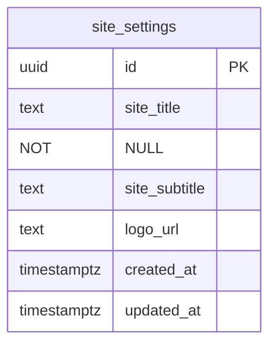
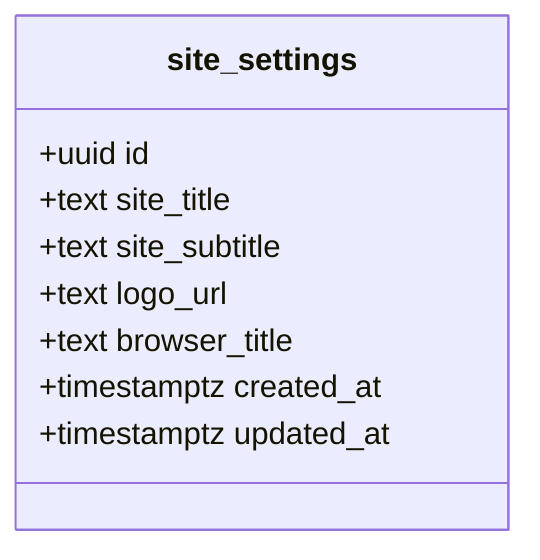
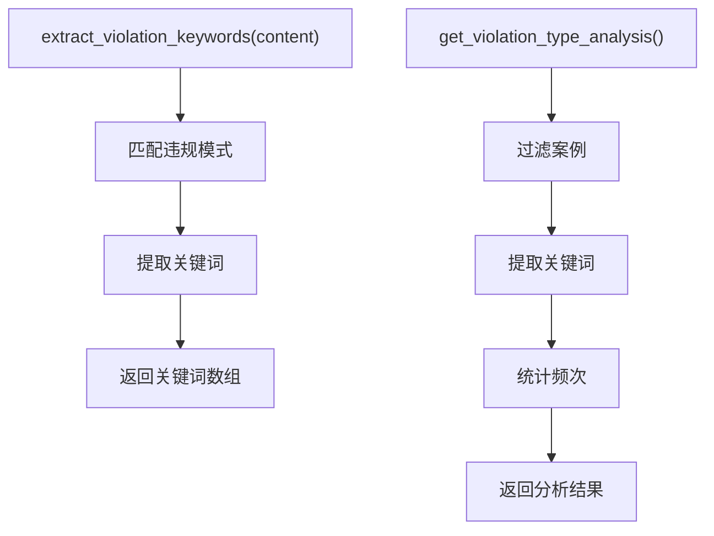
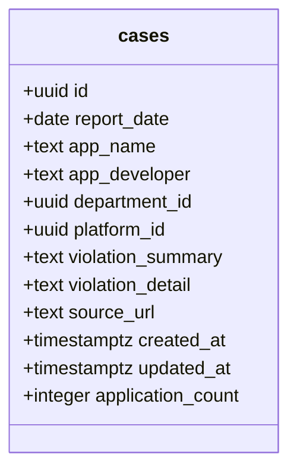
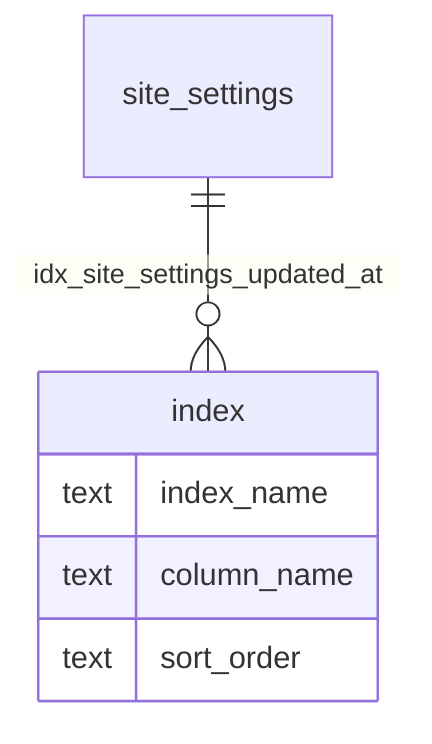
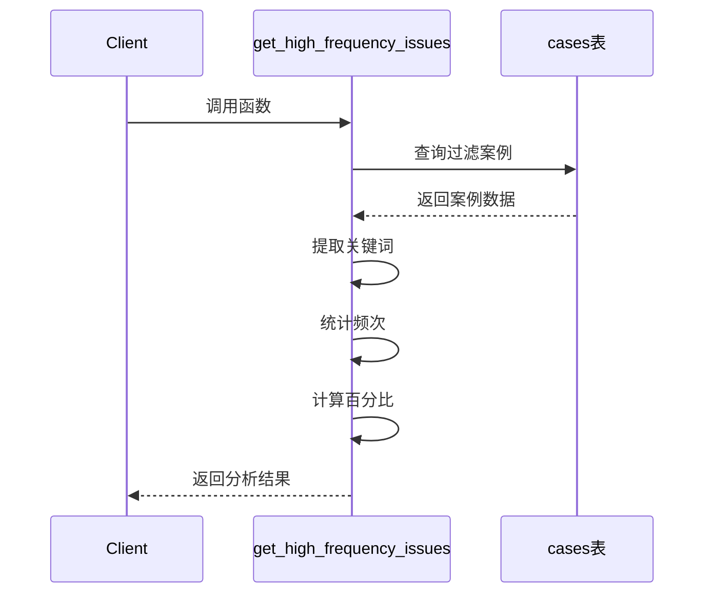
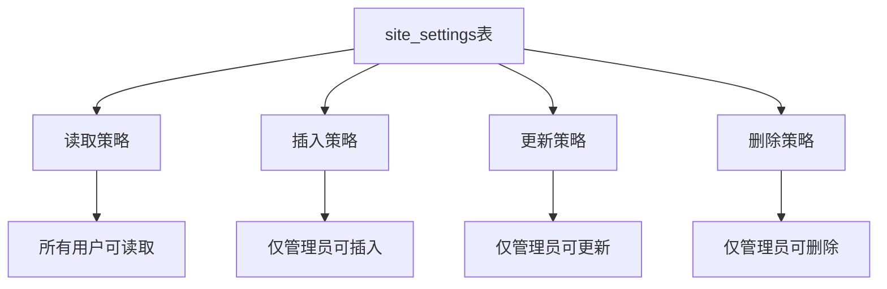

# 数据库迁移

<cite>
**本文档引用的文件**  
- [00001_create_initial_schema.sql](file://supabase/migrations/00001_create_initial_schema.sql)
- [00014_create_site_settings_table.sql](file://supabase/migrations/00014_create_site_settings_table.sql)
- [00015_add_browser_title_to_site_settings.sql](file://supabase/migrations/00015_add_browser_title_to_site_settings.sql)
- [20251219000000_create_violation_analysis_rpc.sql](file://supabase/migrations/20251219000000_create_violation_analysis_rpc.sql)
- [00017_add_application_count_to_cases.sql](file://supabase/migrations/00017_add_application_count_to_cases.sql)
- [20251219100000_align_high_frequency_issues.sql](file://supabase/migrations/20251219100000_align_high_frequency_issues.sql)
- [00015_add_fulltext_search.sql](file://supabase/migrations_archive/00015_add_fulltext_search.sql)
- [00017_add_stats_rpc_functions.sql](file://supabase/migrations_archive/00017_add_stats_rpc_functions.sql)
- [config.toml](file://supabase/config.toml)
</cite>

## 目录
1. [引言](#引言)
2. [迁移系统概述](#迁移系统概述)
3. [迁移脚本版本控制](#迁移脚本版本控制)
4. [关键迁移脚本分析](#关键迁移脚本分析)
5. [迁移脚本中的数据库变更](#迁移脚本中的数据库变更)
6. [归档策略](#归档策略)
7. [迁移脚本编写规范](#迁移脚本编写规范)
8. [结论](#结论)

## 引言
本文档详细说明了Supabase迁移系统的管理机制，涵盖了迁移脚本的版本控制、执行顺序、关键脚本功能、数据库变更以及归档策略。文档旨在为开发团队提供全面的迁移系统指南，确保数据库变更的一致性和可追溯性。

## 迁移系统概述
Supabase迁移系统通过有序执行SQL脚本管理数据库结构的演进。系统采用基于时间戳的命名规范，确保迁移脚本按正确顺序执行。迁移脚本存储在`supabase/migrations`目录中，每个脚本包含详细的注释说明其功能和变更内容。

**Section sources**
- [00001_create_initial_schema.sql](file://supabase/migrations/00001_create_initial_schema.sql)

## 迁移脚本版本控制
迁移脚本采用数字前缀命名规范，确保按字典顺序执行。命名格式为`NNNNN_description.sql`，其中NNNNN为五位数字序列号。对于需要精确时间戳的迁移，采用`YYYYMMDDHHMMSS_description.sql`格式。

迁移脚本的执行顺序严格按照文件名排序，系统通过维护迁移历史记录确保每个脚本仅执行一次。这种机制保证了数据库状态的一致性和可重复性。

**Section sources**
- [00001_create_initial_schema.sql](file://supabase/migrations/00001_create_initial_schema.sql)
- [00014_create_site_settings_table.sql](file://supabase/migrations/00014_create_site_settings_table.sql)

## 关键迁移脚本分析

### 网站设置表创建
`00014_create_site_settings_table.sql`脚本创建了`site_settings`表，用于存储网站的基本配置信息。该表包含网站主标题、备用名称和Logo URL等字段，并设置了行级安全策略，确保所有用户可读取配置，仅管理员可修改。

**Diagram sources**
- [00014_create_site_settings_table.sql](file://supabase/migrations/00014_create_site_settings_table.sql#L40-L48)

**Section sources**
- [00014_create_site_settings_table.sql](file://supabase/migrations/00014_create_site_settings_table.sql)

### 浏览器标题字段添加
`00015_add_browser_title_to_site_settings.sql`脚本为`site_settings`表添加了`browser_title`字段，用于控制浏览器标签页显示的标题。该字段为可选字段，最大长度100字符，默认值为"合规通 Case Wiki"。

**Diagram sources**
- [00015_add_browser_title_to_site_settings.sql](file://supabase/migrations/00015_add_browser_title_to_site_settings.sql#L26-L27)

**Section sources**
- [00015_add_browser_title_to_site_settings.sql](file://supabase/migrations/00015_add_browser_title_to_site_settings.sql)

### 违规分析RPC函数创建
`20251219000000_create_violation_analysis_rpc.sql`脚本创建了违规分析相关的数据库函数。包括`extract_violation_keywords`辅助函数和`get_violation_type_analysis`RPC函数，用于从违规内容中提取关键词并进行统计分析。

**Diagram sources**
- [20251219000000_create_violation_analysis_rpc.sql](file://supabase/migrations/20251219000000_create_violation_analysis_rpc.sql#L4-L133)

**Section sources**
- [20251219000000_create_violation_analysis_rpc.sql](file://supabase/migrations/20251219000000_create_violation_analysis_rpc.sql)

## 迁移脚本中的数据库变更

### 表结构修改
迁移脚本通过`ALTER TABLE`语句修改现有表结构。例如，`00017_add_application_count_to_cases.sql`脚本为`cases`表添加了`application_count`字段，用于记录每次通报涉及的应用数量。

**Diagram sources**
- [00017_add_application_count_to_cases.sql](file://supabase/migrations/00017_add_application_count_to_cases.sql#L16-L17)

**Section sources**
- [00017_add_application_count_to_cases.sql](file://supabase/migrations/00017_add_application_count_to_cases.sql)

### 索引创建
迁移脚本为关键字段创建索引以优化查询性能。例如，`00014_create_site_settings_table.sql`脚本为`site_settings`表的`updated_at`字段创建了降序索引。

**Diagram sources**
- [00014_create_site_settings_table.sql](file://supabase/migrations/00014_create_site_settings_table.sql#L50-L51)

### 函数定义
迁移脚本定义了多个数据库函数以实现复杂业务逻辑。`20251219100000_align_high_frequency_issues.sql`脚本对齐了高频问题分析逻辑，使用正则提取关键词。

**Diagram sources**
- [20251219100000_align_high_frequency_issues.sql](file://supabase/migrations/20251219100000_align_high_frequency_issues.sql#L4-L66)

**Section sources**
- [20251219100000_align_high_frequency_issues.sql](file://supabase/migrations/20251219100000_align_high_frequency_issues.sql)

### 权限设置
迁移脚本通过行级安全（RLS）策略管理数据访问权限。`00014_create_site_settings_table.sql`脚本设置了`site_settings`表的RLS策略，确保所有用户可读取配置，仅管理员可修改。

**Diagram sources**
- [00014_create_site_settings_table.sql](file://supabase/migrations/00014_create_site_settings_table.sql#L53-L78)

## 归档策略
`migrations_archive`目录用于存放已弃用或不再使用的迁移脚本。这些脚本保留了历史变更记录，但不再参与常规的迁移流程。归档策略确保了迁移历史的完整性，同时保持主迁移目录的整洁。

**Section sources**
- [00015_add_fulltext_search.sql](file://supabase/migrations_archive/00015_add_fulltext_search.sql)
- [00017_add_stats_rpc_functions.sql](file://supabase/migrations_archive/00017_add_stats_rpc_functions.sql)

## 迁移脚本编写规范

### 事务处理
所有迁移脚本应包含适当的错误处理机制，确保数据库状态的一致性。对于复杂的变更，建议使用事务包装，确保原子性。

### 数据迁移
当添加新字段时，应为现有数据提供合理的默认值。数据迁移应在同一迁移脚本中完成，避免数据库处于不一致状态。

### 回滚考虑
迁移脚本应考虑回滚的可能性，提供相应的回滚脚本或确保变更可逆。对于破坏性操作（如删除字段），应谨慎处理并充分测试。

**Section sources**
- [00014_create_site_settings_table.sql](file://supabase/migrations/00014_create_site_settings_table.sql)
- [00015_add_browser_title_to_site_settings.sql](file://supabase/migrations/00015_add_browser_title_to_site_settings.sql)
- [20251219000000_create_violation_analysis_rpc.sql](file://supabase/migrations/20251219000000_create_violation_analysis_rpc.sql)

## 结论
Supabase迁移系统通过严格的版本控制和详细的脚本注释，确保了数据库变更的可追溯性和一致性。遵循本文档的规范和最佳实践，开发团队可以有效地管理数据库演进，确保系统的稳定性和可靠性。