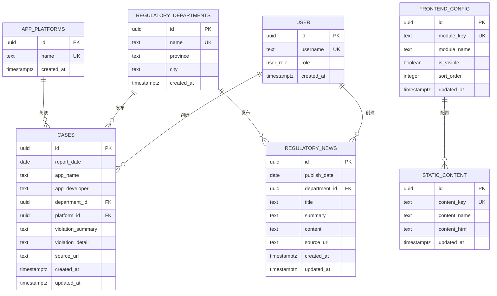
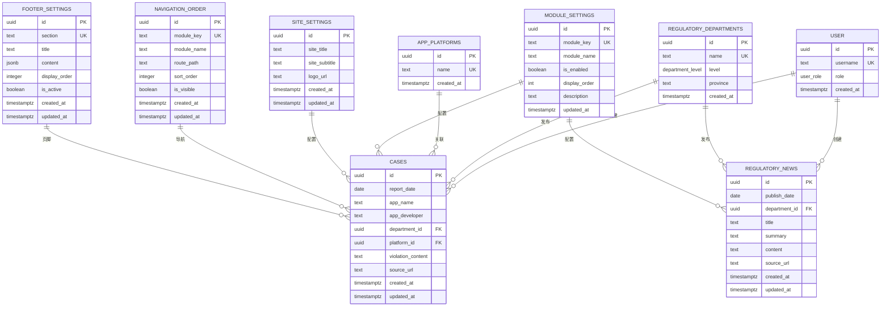

# 模式变更

<cite>
**本文档引用的文件**
- [00001_create_initial_schema.sql](file://supabase/migrations/00001_create_initial_schema.sql)
- [00008_create_module_settings.sql](file://supabase/migrations/00008_create_module_settings.sql)
- [00014_create_site_settings_table.sql](file://supabase/migrations/00014_create_site_settings_table.sql)
- [00018_create_navigation_order_table.sql](file://supabase/migrations/00018_create_navigation_order_table.sql)
- [00003_create_footer_settings_table.sql](file://supabase/migrations/00003_create_footer_settings_table.sql)
- [00004_add_department_level.sql](file://supabase/migrations/00004_add_department_level.sql)
- [00005_remove_city_column.sql](file://supabase/migrations/00005_remove_city_column.sql)
- [00007_merge_violation_fields.sql](file://supabase/migrations/00007_merge_violation_fields.sql)
- [types.ts](file://src/types/types.ts)
</cite>

## 目录
1. [引言](#引言)
2. [初始模式结构](#初始模式结构)
3. [核心表结构演进](#核心表结构演进)
4. [配置表设计与业务逻辑](#配置表设计与业务逻辑)
5. [表关系与ER模型](#表关系与er模型)
6. [迁移路径与兼容性策略](#迁移路径与兼容性策略)
7. [结论](#结论)

## 引言
本文档详细说明了合规通平台数据库表结构的演进过程，重点分析了从初始模式到当前模式的关键迁移脚本和表结构变更。文档涵盖了初始案例表的创建、网站设置表的结构设计、导航顺序表的字段定义以及模块配置表的约束设置，详细描述了每个表的主键、外键、索引和默认值配置，并解释了表结构设计背后的业务逻辑。

## 初始模式结构

本文档分析了合规通平台的初始数据库结构，该结构在 `00001_create_initial_schema.sql` 迁移脚本中定义。初始模式包含了用户管理、监管部门、应用平台、案例主表、监管资讯、前端配置和静态内容等核心表。



**图表来源**
- [00001_create_initial_schema.sql](file://supabase/migrations/00001_create_initial_schema.sql#L89-L289)

**本节来源**
- [00001_create_initial_schema.sql](file://supabase/migrations/00001_create_initial_schema.sql#L1-L289)

## 核心表结构演进

### 案例表结构演进
案例表（cases）的结构经历了重要的演进。在初始模式中，违规内容被分为 `violation_summary`（违规摘要）和 `violation_detail`（详细违规内容）两个字段。随着业务需求的变化，这两个字段在 `00007_merge_violation_fields.sql` 迁移脚本中被合并为一个统一的 `violation_content` 字段。

这一变更的业务逻辑是简化数据结构，避免内容重复和不一致。通过 `COALESCE` 函数，系统优先使用 `violation_summary`，如果为空则使用 `violation_detail`，确保了数据的完整性。同时，该变更也删除了已废弃的 `case_details` 表，进一步简化了数据库结构。

```mermaid
flowchart TD
A[初始状态] --> B[添加 violation_content 字段]
B --> C[数据迁移: COALESCE(violation_summary, violation_detail)]
C --> D[删除 violation_summary 和 violation_detail 字段]
D --> E[删除 case_details 表]
E --> F[最终状态]
```

**图表来源**
- [00007_merge_violation_fields.sql](file://supabase/migrations/00007_merge_violation_fields.sql#L1-L41)

**本节来源**
- [00007_merge_violation_fields.sql](file://supabase/migrations/00007_merge_violation_fields.sql#L1-L41)
- [types.ts](file://src/types/types.ts#L28-L39)

### 监管部门表结构演进
监管部门表（regulatory_departments）的结构也经历了显著的演进。最初，该表使用 `province`（省份）和 `city`（城市）字段来表示部门的地理位置。随着业务需求的变化，系统需要区分国家级和省级部门，因此在 `00004_add_department_level.sql` 迁移脚本中引入了 `level`（级别）字段。

`level` 字段是一个枚举类型，包含 'national'（国家级）和 'provincial'（省级）两个值。同时，系统添加了约束条件：省级部门必须有 `province` 值，而国家级部门的 `province` 必须为 NULL。随后，在 `00005_remove_city_column.sql` 迁移脚本中，已废弃的 `city` 字段被删除，进一步简化了数据结构。

```mermaid
classDiagram
class RegulatoryDepartment {
+uuid id
+text name
+department_level level
+text province
+timestamptz created_at
}
RegulatoryDepartment : +level : department_level
RegulatoryDepartment : +province : text
RegulatoryDepartment : constraint check_provincial_has_province
```

**图表来源**
- [00004_add_department_level.sql](file://supabase/migrations/00004_add_department_level.sql#L32-L63)
- [00005_remove_city_column.sql](file://supabase/migrations/00005_remove_city_column.sql#L21-L23)

**本节来源**
- [00004_add_department_level.sql](file://supabase/migrations/00004_add_department_level.sql#L1-L63)
- [00005_remove_city_column.sql](file://supabase/migrations/00005_remove_city_column.sql#L1-L23)
- [types.ts](file://src/types/types.ts#L14-L20)

## 配置表设计与业务逻辑

### 网站设置表 (site_settings)
`site_settings` 表在 `00014_create_site_settings_table.sql` 迁移脚本中创建，用于存储网站的基本配置信息。该表支持前端动态配置，使管理员能够集中管理网站的标题、副标题和Logo。

表结构设计如下：
- `id`：主键，UUID类型，自动生成
- `site_title`：网站主标题，必填，最大200字符
- `site_subtitle`：网站备用名称/简称，可选，最大100字符
- `logo_url`：Logo图片URL，可选
- `created_at`：创建时间，自动生成
- `updated_at`：更新时间，自动更新

该表启用了行级安全（RLS），所有用户可读取配置（用于前台展示），仅管理员可修改配置。同时，系统创建了 `app-800go8thhcsh_logos` 存储桶用于上传Logo图片，并设置了相应的访问策略。

**本节来源**
- [00014_create_site_settings_table.sql](file://supabase/migrations/00014_create_site_settings_table.sql#L40-L146)

### 模块配置表 (module_settings)
`module_settings` 表在 `00008_create_module_settings.sql` 迁移脚本中创建，用于控制前台功能模块的可见性。该表的设计考虑了模块的启用状态和显示顺序。

表结构设计如下：
- `id`：主键，UUID类型，自动生成
- `module_key`：模块唯一标识符，唯一且非空
- `module_name`：模块显示名称，非空
- `is_enabled`：模块是否启用，布尔类型，默认为true
- `display_order`：显示顺序，整数类型，默认为0
- `description`：模块功能描述，可选
- `updated_at`：最后更新时间，自动生成

该表未启用RLS，因为这是公开的配置信息。系统创建了多个索引以提升查询性能，并设置了触发器自动更新 `updated_at` 字段。

**本节来源**
- [00008_create_module_settings.sql](file://supabase/migrations/00008_create_module_settings.sql#L30-L78)

### 导航顺序表 (navigation_order)
`navigation_order` 表在 `00018_create_navigation_order_table.sql` 迁移脚本中创建，用于存储前端导航栏模块的排序配置。该表支持管理员通过管理后台调整模块的显示顺序和可见性。

表结构设计如下：
- `id`：主键，UUID类型，自动生成
- `module_key`：模块标识，唯一且非空
- `module_name`：模块名称，非空
- `route_path`：路由路径，非空
- `sort_order`：排序序号，整数类型，非空
- `is_visible`：是否可见，布尔类型，默认为true
- `created_at`：创建时间，自动生成
- `updated_at`：更新时间，自动生成

该表启用了RLS，所有用户可读取导航配置，仅管理员可修改导航配置。系统创建了触发器自动更新 `updated_at` 字段。

**本节来源**
- [00018_create_navigation_order_table.sql](file://supabase/migrations/00018_create_navigation_order_table.sql#L29-L83)

### 页脚设置表 (footer_settings)
`footer_settings` 表在 `00003_create_footer_settings_table.sql` 迁移脚本中创建，用于存储网站页脚的各个模块配置。该表使用JSONB类型存储复杂的内容结构，支持灵活的配置。

表结构设计如下：
- `id`：主键，UUID类型，自动生成
- `section`：模块标识，唯一且非空
- `title`：模块标题，非空
- `content`：模块内容，JSONB类型，存储复杂结构
- `display_order`：显示顺序，整数类型，默认为0
- `is_active`：是否启用，布尔类型，默认为true
- `created_at`：创建时间，自动生成
- `updated_at`：更新时间，自动生成

该表启用了RLS，所有用户可读取启用的配置，仅管理员可修改配置。

**本节来源**
- [00003_create_footer_settings_table.sql](file://supabase/migrations/00003_create_footer_settings_table.sql#L23-L205)

## 表关系与ER模型



**图表来源**
- [00001_create_initial_schema.sql](file://supabase/migrations/00001_create_initial_schema.sql#L89-L289)
- [00008_create_module_settings.sql](file://supabase/migrations/00008_create_module_settings.sql#L30-L78)
- [00014_create_site_settings_table.sql](file://supabase/migrations/00014_create_site_settings_table.sql#L40-L146)
- [00018_create_navigation_order_table.sql](file://supabase/migrations/00018_create_navigation_order_table.sql#L29-L83)
- [00003_create_footer_settings_table.sql](file://supabase/migrations/00003_create_footer_settings_table.sql#L23-L205)

## 迁移路径与兼容性策略

### 迁移路径
数据库模式的演进遵循了清晰的迁移路径：
1. **初始模式**：创建基础表结构，包括用户、监管部门、应用平台、案例、监管资讯等。
2. **功能扩展**：添加新的配置表，如模块设置、网站设置、导航顺序和页脚设置。
3. **结构优化**：对现有表进行优化，如合并违规内容字段、调整监管部门结构。
4. **数据清理**：删除已废弃的字段和表，保持数据库的简洁性。

### 兼容性处理策略
在模式变更过程中，系统采用了多种策略确保向后兼容性：
- **数据迁移**：在合并违规内容字段时，使用 `COALESCE` 函数确保数据不丢失。
- **默认值**：在添加新字段时，设置合理的默认值，避免影响现有功能。
- **约束条件**：在调整监管部门结构时，添加约束条件确保数据一致性。
- **索引优化**：在关键字段上创建索引，确保查询性能不受影响。
- **触发器**：使用触发器自动更新时间戳字段，减少应用层的负担。

这些策略确保了模式变更的平滑过渡，最大限度地减少了对现有功能的影响。

**本节来源**
- [00007_merge_violation_fields.sql](file://supabase/migrations/00007_merge_violation_fields.sql#L1-L41)
- [00004_add_department_level.sql](file://supabase/migrations/00004_add_department_level.sql#L32-L63)
- [00005_remove_city_column.sql](file://supabase/migrations/00005_remove_city_column.sql#L21-L23)

## 结论
本文档详细分析了合规通平台数据库表结构的演进过程，从初始模式到当前模式的关键迁移脚本和表结构变更。通过合理的表结构设计和迁移策略，系统实现了功能的扩展和结构的优化，同时确保了向后兼容性。这些变更不仅满足了业务需求，还提高了系统的可维护性和性能。