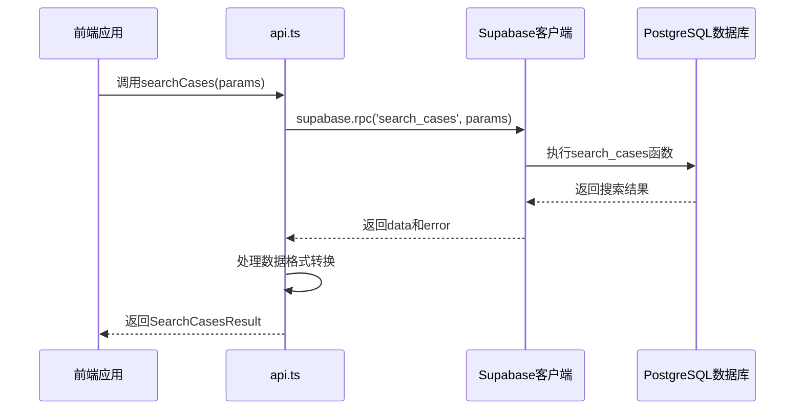
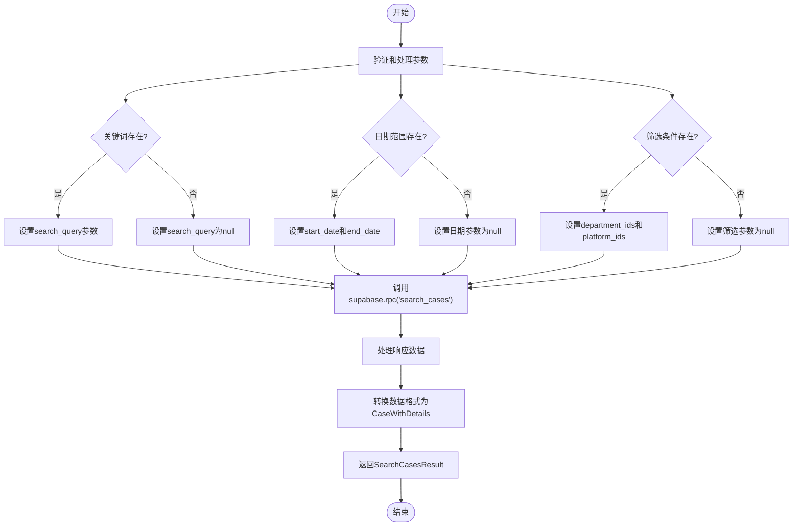
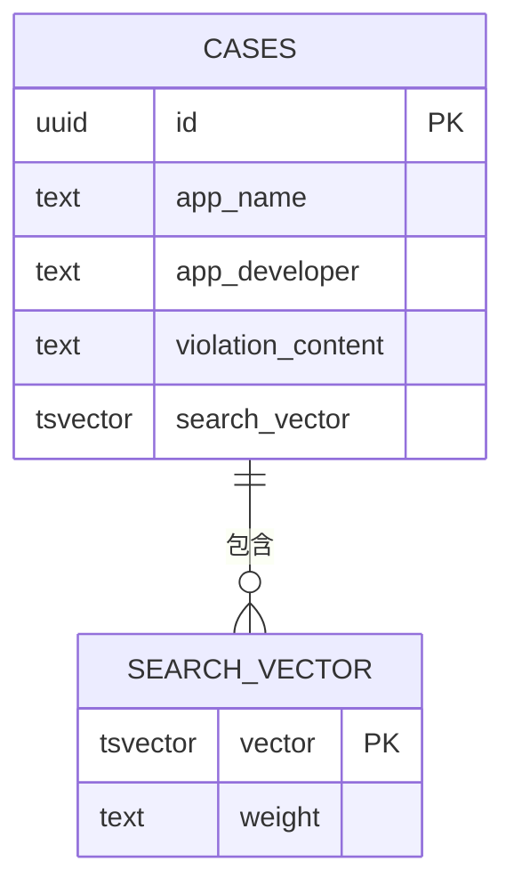
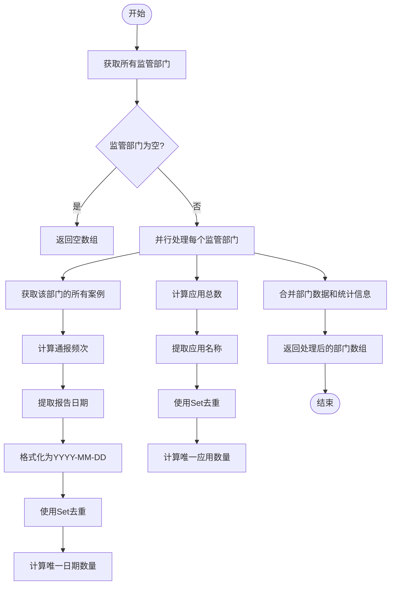
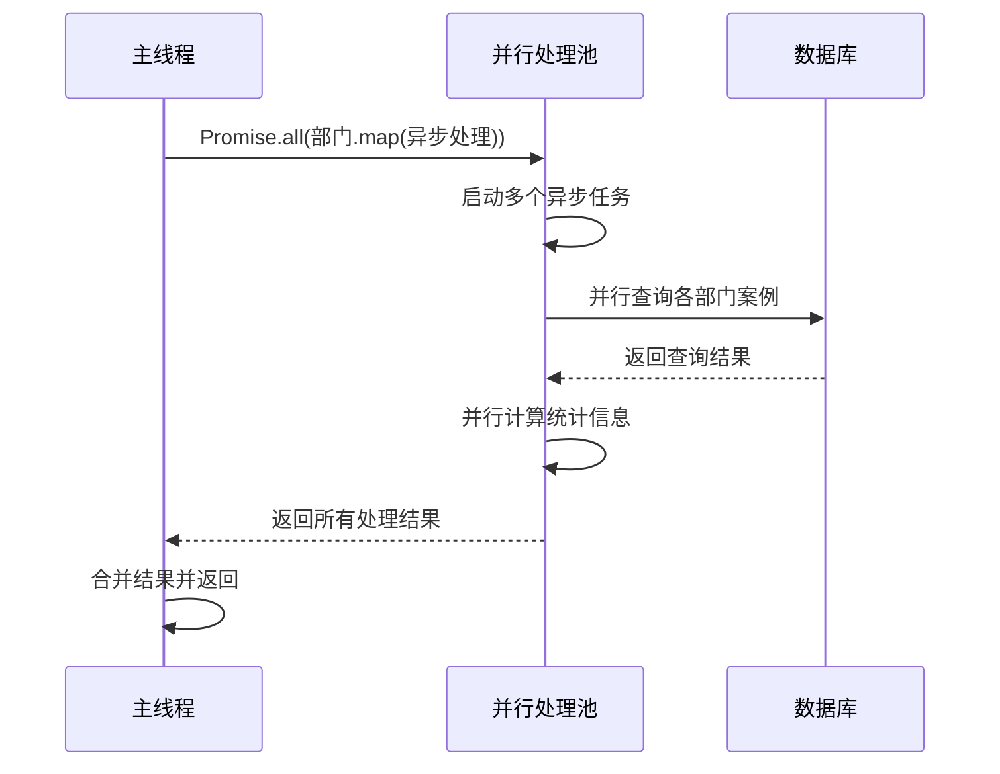
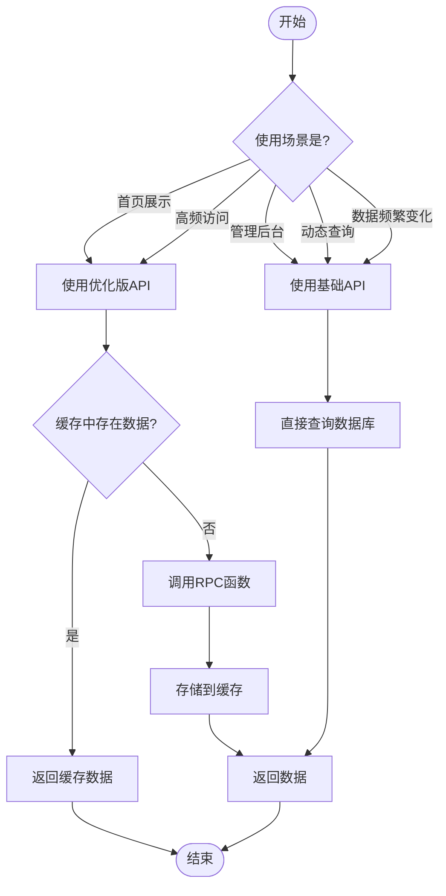
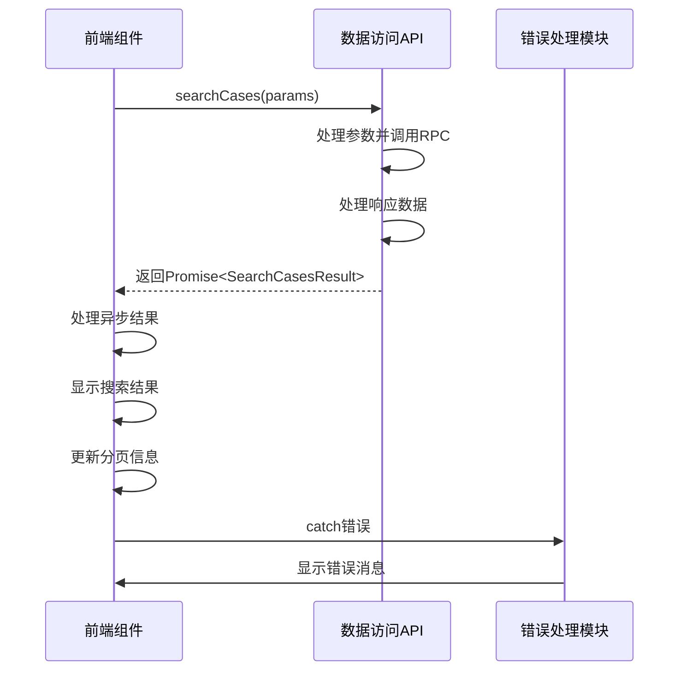
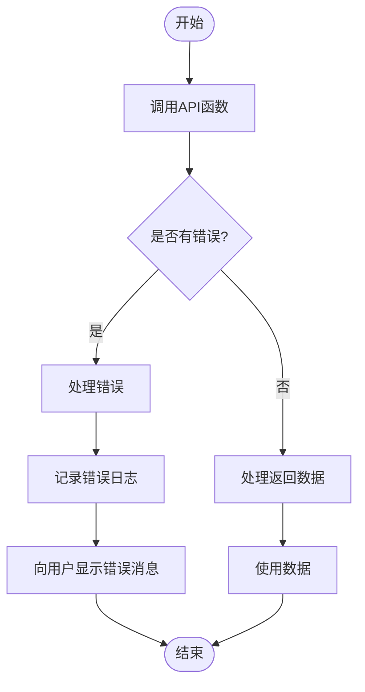
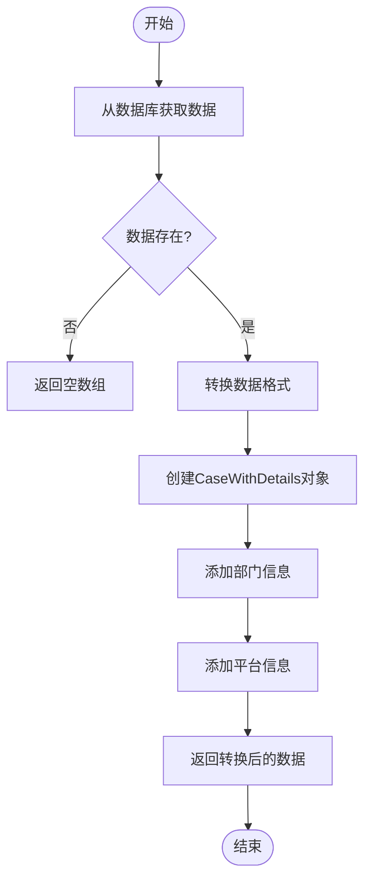

# 数据访问API

<cite>
**本文档引用文件**   
- [api.ts](file://src/db/api.ts)
- [api-optimized.ts](file://src/db/api-optimized.ts)
- [supabase.ts](file://src/db/supabase.ts)
- [types.ts](file://src/types/types.ts)
- [00015_add_fulltext_search.sql](file://supabase/migrations_archive/00015_add_fulltext_search.sql)
- [20251230120000_add_dashboard_stats_rpc.sql](file://supabase/migrations/20251230120000_add_dashboard_stats_rpc.sql)
</cite>

## 目录
1. [简介](#简介)
2. [核心API功能](#核心api功能)
3. [全文搜索实现](#全文搜索实现)
4. [复合查询性能优化](#复合查询性能优化)
5. [基础API与优化版API对比](#基础api与优化版api对比)
6. [接口设计与使用方法](#接口设计与使用方法)
7. [错误处理与数据转换](#错误处理与数据转换)
8. [总结](#总结)

## 简介
本文档详细说明了数据访问API的核心功能，重点分析`api.ts`中封装的各类数据访问方法。文档涵盖了案例查询、监管部门统计、应用平台统计等核心API的实现细节，包括`searchCases`全文搜索函数的RPC调用机制和参数处理。详细描述了`getDepartmentsWithStats`、`getPlatformsWithStats`等复合查询的性能优化策略，特别是去重统计逻辑的实现。对比了`api.ts`和`api-optimized.ts`中对应功能的差异，说明了何时应使用基础API，何时应使用优化版API。提供了实际代码示例展示API调用方式，包括错误处理和数据转换模式，并解释了`SearchCasesParams`和`SearchCasesResult`等接口的设计意图和使用方法。

## 核心API功能

数据访问API主要封装了对案例、监管部门、应用平台等核心数据的访问方法。API分为基础版本（`api.ts`）和优化版本（`api-optimized.ts`），分别适用于不同的使用场景。

### 案例查询API
案例查询API提供了多种方式来检索案例数据，包括分页查询、条件筛选和全文搜索。`getCases`函数支持按报告日期、监管部门和应用平台进行筛选，并提供分页和排序功能。

### 监管部门统计API
监管部门统计API提供了获取监管部门及其统计数据的功能。`getDepartmentsWithStats`函数不仅获取监管部门列表，还计算每个部门的通报频次和相关应用总数。

### 应用平台统计API
应用平台统计API与监管部门统计API类似，但针对应用平台。`getPlatformsWithStats`函数获取所有应用平台，并计算每个平台的通报频次和应用总数。

**Section sources**
- [api.ts](file://src/db/api.ts#L511-L664)
- [api.ts](file://src/db/api.ts#L67-L124)
- [api.ts](file://src/db/api.ts#L316-L373)

## 全文搜索实现

全文搜索功能是数据访问API的核心特性之一，通过`searchCases`函数实现。该函数利用PostgreSQL的全文搜索功能，支持中文分词、模糊匹配、多条件筛选和相关性排序。

### RPC调用机制
`searchCases`函数通过Supabase的RPC（远程过程调用）机制与数据库交互。它调用名为`search_cases`的数据库函数，该函数在PostgreSQL中实现复杂的搜索逻辑。



**Diagram sources **
- [api.ts](file://src/db/api.ts#L425-L508)
- [00015_add_fulltext_search.sql](file://supabase/migrations_archive/00015_add_fulltext_search.sql#L83-L189)

### 参数处理
`searchCases`函数接受`SearchCasesParams`接口定义的参数，包括关键词、分页信息、日期范围和筛选条件。函数对参数进行处理，将空值转换为`null`，并确保数组类型的参数在为空时也转换为`null`。



**Diagram sources **
- [api.ts](file://src/db/api.ts#L426-L444)
- [types.ts](file://src/types/types.ts#L406-L414)

### 搜索向量与索引
数据库通过`search_vector`列和GIN索引来优化全文搜索性能。`search_vector`是一个tsvector类型的列，存储了应用名称、开发者和违规内容的分词向量。GIN索引则加速了全文搜索查询。



**Diagram sources **
- [00015_add_fulltext_search.sql](file://supabase/migrations_archive/00015_add_fulltext_search.sql#L42-L47)

## 复合查询性能优化

复合查询的性能优化是数据访问API的重要方面，特别是在处理大量数据时。API通过多种策略来优化`getDepartmentsWithStats`和`getPlatformsWithStats`等函数的性能。

### 去重统计逻辑
去重统计逻辑是复合查询的核心。对于通报频次的计算，API按自然日合并，每日只计1次，避免了同一部门在同一天的多次通报被重复计算。对于应用总数的计算，API使用`Set`数据结构来存储唯一的应用名称。



**Diagram sources **
- [api.ts](file://src/db/api.ts#L67-L124)

### 并行处理
API使用`Promise.all`来并行处理多个监管部门或应用平台的统计计算。这种并行处理策略显著提高了复合查询的性能，特别是在处理大量数据时。



**Diagram sources **
- [api.ts](file://src/db/api.ts#L81-L122)

## 基础API与优化版API对比

API提供了基础版本和优化版本，以满足不同场景的需求。基础API（`api.ts`）提供了灵活的数据访问方法，而优化版API（`api-optimized.ts`）则专注于性能优化和缓存机制。

### 功能对比
| 功能 | 基础API | 优化版API |
|------|--------|----------|
| 数据获取方式 | 直接查询数据库 | 调用RPC函数 |
| 缓存机制 | 无 | 5分钟内存缓存 |
| 性能 | 一般 | 高 |
| 灵活性 | 高 | 低 |
| 适用场景 | 动态查询、管理后台 | 首页展示、高频访问 |

### 使用场景建议
- **基础API**：适用于需要灵活查询条件的场景，如管理后台的案例管理、监管部门管理等。当需要根据用户输入的动态条件进行查询时，应使用基础API。
- **优化版API**：适用于数据变化不频繁但访问频率高的场景，如首页的统计数据展示。当需要快速响应大量并发请求时，应使用优化版API。



**Diagram sources **
- [api.ts](file://src/db/api.ts)
- [api-optimized.ts](file://src/db/api-optimized.ts)

## 接口设计与使用方法

API的接口设计遵循TypeScript的最佳实践，使用接口来定义数据结构和函数参数。这提高了代码的可读性和类型安全性。

### SearchCasesParams接口
`SearchCasesParams`接口定义了全文搜索函数的参数。它包含了可选的关键词、分页信息、日期范围和筛选条件。

```typescript
export interface SearchCasesParams {
  keyword?: string;
  page?: number;
  pageSize?: number;
  startDate?: string;
  endDate?: string;
  departmentIds?: string[];
  platformIds?: string[];
}
```

### SearchCasesResult接口
`SearchCasesResult`接口定义了全文搜索函数的返回结果。它包含搜索到的案例数据和总记录数。

```typescript
export interface SearchCasesResult {
  data: CaseWithDetails[];
  total: number;
}
```

### 实际使用示例
以下是API的实际使用示例，展示了如何调用`searchCases`函数并处理结果。



**Diagram sources **
- [types.ts](file://src/types/types.ts#L406-L419)
- [api.ts](file://src/db/api.ts#L425-L508)

## 错误处理与数据转换

API的错误处理和数据转换是确保系统稳定性和数据一致性的关键。

### 错误处理策略
API采用统一的错误处理策略，所有函数在遇到错误时都会抛出异常。前端代码需要使用try-catch或Promise的catch方法来处理这些异常。



**Section sources**
- [api.ts](file://src/db/api.ts#L446-L449)
- [api.ts](file://src/db/api.ts#L28-L29)

### 数据转换模式
API在从数据库获取数据后，会进行必要的数据转换，以确保返回的数据结构符合前端的需求。例如，`searchCases`函数会将数据库返回的扁平化数据转换为包含关联对象的`CaseWithDetails`结构。



**Section sources**
- [api.ts](file://src/db/api.ts#L473-L502)

## 总结
本文档详细介绍了数据访问API的设计和实现。API通过基础版本和优化版本的结合，既保证了查询的灵活性，又确保了高性能的数据访问。全文搜索功能利用PostgreSQL的全文搜索能力，提供了强大的关键词检索能力。复合查询的性能优化策略，特别是去重统计逻辑和并行处理，显著提高了大数据量下的查询性能。开发者应根据具体的使用场景选择合适的基础API或优化版API，以达到最佳的性能和用户体验。