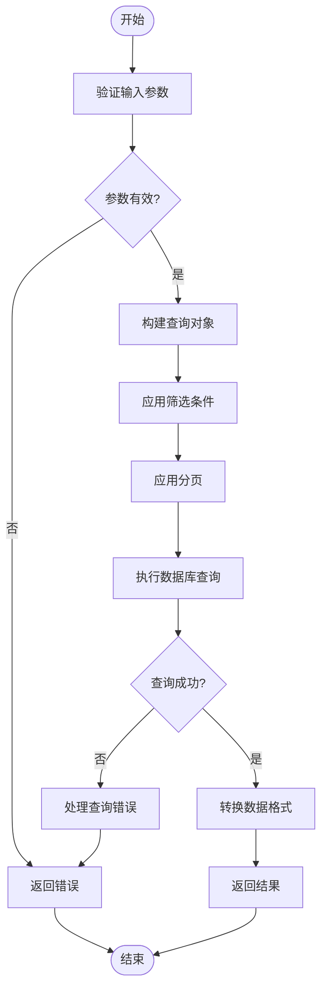
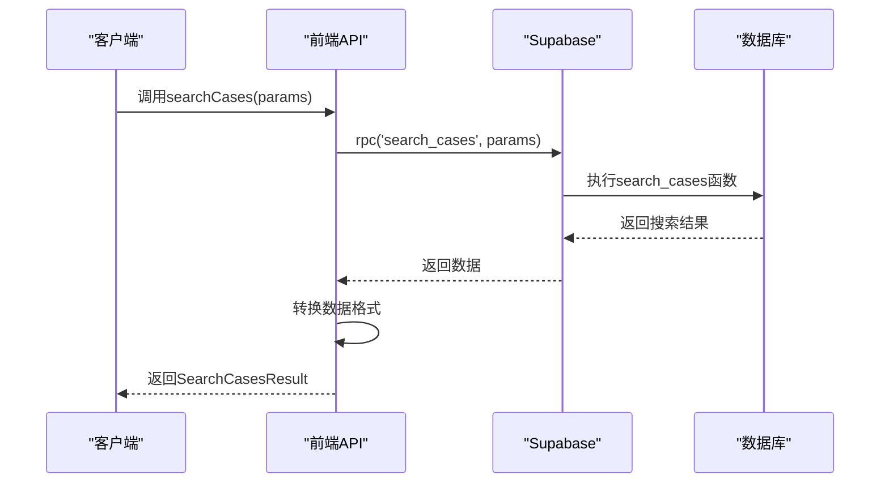
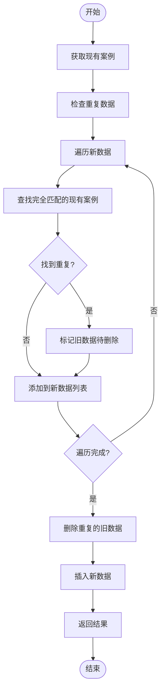
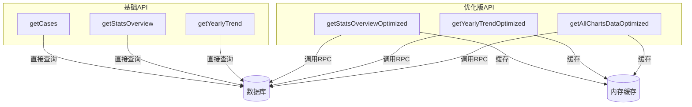

# 案例管理API

<cite>
**本文档引用的文件**   
- [api.ts](file://src/db/api.ts)
- [api-optimized.ts](file://src/db/api-optimized.ts)
- [types.ts](file://src/types/types.ts)
- [supabase.ts](file://src/db/supabase.ts)
- [searchUtils.ts](file://src/utils/searchUtils.ts)
- [CasesPage.tsx](file://src/pages/CasesPage.tsx)
- [CaseManagePage.tsx](file://src/pages/admin/CaseManagePage.tsx)
- [00015_add_fulltext_search.sql](file://supabase/migrations_archive/00015_add_fulltext_search.sql)
- [BATCH_MANAGEMENT_GUIDE.md](file://docs/BATCH_MANAGEMENT_GUIDE.md)
- [README-问题修复.md](file://docs/README-问题修复.md)
</cite>

## 目录
1. [简介](#简介)
2. [核心CRUD操作](#核心crud操作)
3. [全文搜索机制](#全文搜索机制)
4. [批量导入去重机制](#批量导入去重机制)
5. [基础API与优化版API对比](#基础api与优化版api对比)
6. [代码示例](#代码示例)

## 简介
案例管理API是本系统的核心功能模块，提供对应用违规案例的完整生命周期管理。该API基于Supabase构建，通过TypeScript封装了对`cases`表的增删改查（CRUD）操作，并实现了高级功能如全文搜索、批量处理和性能优化。API设计遵循RESTful原则，通过清晰的函数命名和类型定义，确保了代码的可读性和可维护性。

**Section sources**
- [api.ts](file://src/db/api.ts#L511-L725)
- [types.ts](file://src/types/types.ts#L28-L49)

## 核心CRUD操作
案例管理API提供了标准的CRUD操作，包括`getCases`、`getCaseById`、`createCase`、`updateCase`和`deleteCase`等函数，实现了对案例数据的全面管理。

### getCases
`getCases`函数用于分页查询案例列表，支持多种筛选条件。它通过Supabase的`range`方法实现分页，通过`order`方法实现排序，并通过`in`、`gte`、`lte`等过滤器实现多条件筛选。

**参数验证**：函数接收`page`、`pageSize`、`sortBy`、`sortOrder`和`filters`参数。`filters`参数是一个`CaseFilterParams`对象，包含开始日期、结束日期、监管部门ID列表和应用平台ID列表。

**错误处理**：使用`try-catch`模式捕获Supabase查询错误，并将错误抛出供上层处理。

**数据转换**：通过`select`方法关联`regulatory_departments`和`app_platforms`表，返回包含部门和平台详细信息的`CaseWithDetails`对象。



**Diagram sources**
- [api.ts](file://src/db/api.ts#L511-L554)

**Section sources**
- [api.ts](file://src/db/api.ts#L511-L554)
- [types.ts](file://src/types/types.ts#L154-L159)

### getCaseById
`getCaseById`函数用于根据ID查询单个案例的详细信息。它使用Supabase的`eq`方法进行精确匹配，并通过`maybeSingle`确保返回单个结果。

**错误处理**：与`getCases`类似，捕获并抛出数据库查询错误。

**数据转换**：同样通过`select`方法关联部门和平台信息，返回完整的`CaseWithDetails`对象。

**Section sources**
- [api.ts](file://src/db/api.ts#L584-L597)

### createCase
`createCase`函数用于创建新案例。它接收一个`Omit<Case, 'id' | 'created_at' | 'updated_at'>`类型的对象，确保客户端不提供自动生成的字段。

**参数验证**：在调用此函数前，应确保必填字段（如`report_date`、`app_name`）已填写。

**错误处理**：捕获并抛出插入失败的错误。

**Section sources**
- [api.ts](file://src/db/api.ts#L599-L607)

### updateCase
`updateCase`函数用于更新案例信息。它在更新数据时自动设置`updated_at`字段为当前时间戳，确保数据的时效性。

**参数验证**：接收`Partial<Case>`类型的更新对象，允许部分字段更新。

**错误处理**：捕获并抛出更新失败的错误。

**Section sources**
- [api.ts](file://src/db/api.ts#L610-L617)

### deleteCase
`deleteCase`函数用于删除案例。它使用Supabase的`eq`方法根据ID进行删除。

**错误处理**：捕获并抛出删除失败的错误。

**Section sources**
- [api.ts](file://src/db/api.ts#L619-L626)

## 全文搜索机制
`searchCases`函数是案例管理API的核心高级功能，通过调用PostgreSQL的RPC函数`search_cases`实现高效的全文搜索。

### RPC调用机制
`searchCases`函数通过Supabase的`rpc`方法调用后端的`search_cases`函数。该函数接受`search_query`、`page_num`、`page_size`、`start_date`、`end_date`、`department_ids`和`platform_ids`等参数。



**Diagram sources**
- [api.ts](file://src/db/api.ts#L425-L444)
- [00015_add_fulltext_search.sql](file://supabase/migrations_archive/00015_add_fulltext_search.sql#L83-L189)

### 中文分词处理
`search_cases`函数利用PostgreSQL的`tsvector`和`tsquery`类型实现中文分词。`cases`表的`search_vector`列存储了应用名称、开发者和违规内容的分词向量，权重分别为A、B、C。

**分词流程**：
1. 使用`to_tsvector('chinese', text)`将文本转换为分词向量
2. 使用`plainto_tsquery('chinese', search_query)`将搜索关键词转换为查询向量
3. 使用`@@`操作符进行全文匹配

### 多条件筛选逻辑
`search_cases`函数支持多种筛选条件的组合查询：
- **全文搜索**：通过`c.search_vector @@ plainto_tsquery('chinese', search_query)`实现
- **模糊匹配**：通过`ILIKE`操作符对应用名称、开发者、违规内容、部门名称和平台名称进行模糊匹配
- **日期筛选**：通过`gte`和`lte`操作符实现
- **部门和平台筛选**：通过`ANY`操作符实现

**Section sources**
- [api.ts](file://src/db/api.ts#L425-L508)
- [00015_add_fulltext_search.sql](file://supabase/migrations_archive/00015_add_fulltext_search.sql#L119-L138)

## 批量导入去重机制
`batchCreateCasesWithDedup`函数实现了智能的批量导入和去重功能，确保数据的唯一性和最新性。

### 识别重复数据
函数通过比较新导入数据与现有数据的多个字段来识别重复记录，包括通报日期、应用名称、开发者、监管部门、应用平台、违规内容和原文链接。

### 保留最新记录
去重机制采用"删除旧数据，插入新数据"的策略：
1. 获取所有现有案例
2. 遍历新数据，查找完全匹配的现有案例
3. 将匹配的旧数据ID加入删除列表
4. 删除所有重复的旧数据
5. 插入所有新数据（包括重复数据，以保留最新记录）



**Diagram sources**
- [api.ts](file://src/db/api.ts#L667-L724)
- [BATCH_MANAGEMENT_GUIDE.md](file://docs/BATCH_MANAGEMENT_GUIDE.md#L136-L197)

**Section sources**
- [api.ts](file://src/db/api.ts#L667-L724)

## 基础API与优化版API对比
系统提供了基础API和优化版API两种查询方式，以满足不同场景的性能需求。

### 基础API
基础API直接通过Supabase的`select`方法查询数据库，适用于需要灵活筛选和排序的场景。

**优点**：
- 灵活性高，支持复杂的筛选条件
- 实时性强，数据始终最新

**缺点**：
- 在大数据量下响应时间较长
- 对数据库压力较大

### 优化版API
优化版API使用后端RPC函数和缓存机制，显著提升了查询性能。

**性能优化策略**：
- **RPC函数**：使用`get_dashboard_stats`等RPC函数在数据库层面进行聚合计算，减少数据传输量
- **缓存机制**：使用`CacheManager`类实现5分钟的内存缓存，减少重复查询
- **批量获取**：通过`getAllChartsDataOptimized`函数一次性获取所有图表数据，减少请求次数



**Diagram sources**
- [api.ts](file://src/db/api.ts#L999-L1197)
- [api-optimized.ts](file://src/db/api-optimized.ts#L57-L256)

**Section sources**
- [api.ts](file://src/db/api.ts#L999-L1197)
- [api-optimized.ts](file://src/db/api-optimized.ts#L57-L256)

## 代码示例
以下代码示例展示了如何使用案例管理API进行分页查询、条件筛选和批量操作。

### 分页查询
```typescript
// 获取第一页的20条案例，按通报日期降序排列
const result = await getCases(1, 20, 'report_date', 'desc');
console.log(`共${result.total}条案例，当前页${result.data.length}条`);
```

### 条件筛选
```typescript
// 筛选2025年的案例，且监管部门为"国家互联网信息办公室"
const filters = {
  startDate: '2025-01-01',
  endDate: '2025-12-31',
  departmentIds: ['dept-uuid-1']
};
const result = await getCases(1, 20, 'report_date', 'desc', filters);
```

### 批量操作
```typescript
// 批量删除选中的案例
await batchDeleteCases(['case-uuid-1', 'case-uuid-2']);

// 批量更新案例的监管部门
await batchUpdateCases([
  { id: 'case-uuid-1', data: { department_id: 'new-dept-uuid' } },
  { id: 'case-uuid-2', data: { department_id: 'new-dept-uuid' } }
]);

// 批量导入并去重
const importResult = await batchCreateCasesWithDedup(newCases);
console.log(`成功导入${importResult.inserted}条，去重${importResult.duplicatesRemoved}条`);
```

**Section sources**
- [CasesPage.tsx](file://src/pages/CasesPage.tsx#L134-L175)
- [CaseManagePage.tsx](file://src/pages/admin/CaseManagePage.tsx#L139-L180)
- [BATCH_MANAGEMENT_GUIDE.md](file://docs/BATCH_MANAGEMENT_GUIDE.md#L89-L120)