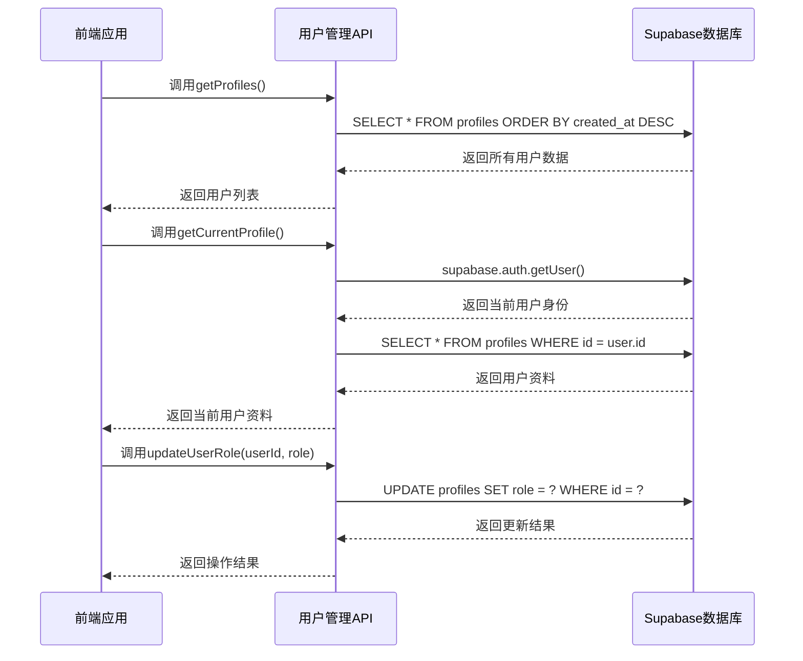

# 用户管理API

<cite>
**本文档引用的文件**
- [api.ts](file://src/db/api.ts)
- [supabase.ts](file://src/db/supabase.ts)
- [UsersPage.tsx](file://src/pages/admin/UsersPage.tsx)
- [types.ts](file://src/types/types.ts)
</cite>

## 目录
1. [简介](#简介)
2. [核心API函数](#核心api函数)
3. [权限控制机制](#权限控制机制)
4. [API调用流程图](#api调用流程图)
5. [错误处理与边界情况](#错误处理与边界情况)
6. [常见问题解决方案](#常见问题解决方案)

## 简介
本文档详细说明了用户管理API的实现，重点介绍getProfiles、getCurrentProfile和updateUserRole等核心API函数。系统基于Supabase作为后端服务，实现了完整的用户认证和权限管理功能。用户信息存储在Supabase的profiles表中，通过TypeScript类型系统定义了严格的接口规范。前端通过React组件与后端API进行交互，实现了用户列表展示和角色管理功能。

**Section sources**
- [api.ts](file://src/db/api.ts#L21-L53)
- [types.ts](file://src/types/types.ts#L7-L12)

## 核心API函数

### getProfiles函数
getProfiles函数用于从Supabase数据库的profiles表中获取所有用户信息。该函数执行以下操作：
1. 使用Supabase客户端从profiles表中选择所有字段
2. 按创建时间(created_at)降序排列，确保最新注册的用户排在前面
3. 处理可能的数据库错误，如果发生错误则抛出异常
4. 返回用户数据数组，如果查询结果不是数组则返回空数组

该函数无需参数，返回Promise<Profile[]>类型的数据，其中Profile接口包含id、username、role和created_at等字段。

### getCurrentProfile函数
getCurrentProfile函数用于获取当前登录用户的资料信息，其工作流程如下：
1. 调用Supabase的auth.getUser()方法获取当前认证用户信息
2. 如果用户未登录（user为null），则返回null
3. 使用用户ID作为条件，从profiles表中查询对应的用户资料
4. 使用.eq('id', user.id)进行精确匹配查询
5. 使用.maybeSingle()确保最多返回一条记录
6. 处理查询错误并返回用户资料或null

该函数结合了Supabase认证系统和数据库查询，实现了安全的当前用户信息获取。

### updateUserRole函数
updateUserRole函数用于更新指定用户的角色权限，其实现细节包括：
1. 接收userId和role两个参数，其中role只能是'user'或'admin'枚举值
2. 使用Supabase的update操作修改profiles表中指定用户ID的role字段
3. 使用.eq('id', userId)条件确保只更新目标用户
4. 如果更新过程中发生错误，则抛出异常
5. 函数返回Promise<void>，表示操作成功完成

该函数实现了基本的用户权限更新功能，但不包含权限验证逻辑，调用者需要确保只有管理员用户才能调用此函数。

**Section sources**
- [api.ts](file://src/db/api.ts#L21-L53)
- [types.ts](file://src/types/types.ts#L3-L12)

## 权限控制机制
系统采用多层次的权限控制机制来确保用户管理功能的安全性：

### 前端权限控制
在UsersPage组件中实现了用户界面级别的权限控制：
- 只有管理员用户才能访问用户管理页面
- 使用ProtectedModuleRoute组件检查模块权限
- 通过ModuleContext提供权限状态

### 后端权限控制
Supabase数据库层面的权限控制：
- 通过Row Level Security (RLS)策略控制数据访问
- profiles表的读写权限由策略定义
- 只有管理员角色才能更新其他用户的角色
- 用户只能读取自己的资料信息

### 角色定义
系统定义了两种用户角色：
- **管理员(admin)**：拥有管理其他用户权限的能力
- **普通用户(user)**：仅能查看自己的信息

权限控制逻辑主要在前端实现，后端Supabase策略作为第二道防线。这种设计平衡了安全性和开发效率，确保关键操作需要适当的权限验证。

**Section sources**
- [UsersPage.tsx](file://src/pages/admin/UsersPage.tsx#L1-L126)
- [ProtectedModuleRoute.tsx](file://src/components/common/ProtectedModuleRoute.tsx#L1-L29)

## API调用流程图

**Diagram sources**
- [api.ts](file://src/db/api.ts#L21-L53)
- [supabase.ts](file://src/db/supabase.ts#L1-L8)

## 错误处理与边界情况
系统实现了完善的错误处理机制来应对各种边界情况：

### getProfiles错误处理
- 数据库连接失败：捕获并抛出Supabase错误
- 查询结果非数组：返回空数组作为默认值
- 网络超时：依赖Supabase客户端的超时机制

### getCurrentProfile边界情况
- 未登录用户：返回null，不抛出错误
- 用户资料不存在：返回null
- 认证令牌失效：Supabase自动处理并返回null

### updateUserRole验证机制
- 参数类型验证：TypeScript确保role参数只能是'user'或'admin'
- 用户ID存在性验证：Supabase更新操作自动处理
- 权限验证：由调用者负责确保操作者有足够权限

### 前端错误处理
在UsersPage组件中使用try-catch块捕获异步操作错误：
- 使用toast通知用户操作结果
- 控制加载状态避免重复提交
- 记录错误到控制台便于调试

**Section sources**
- [api.ts](file://src/db/api.ts#L21-L53)
- [UsersPage.tsx](file://src/pages/admin/UsersPage.tsx#L27-L43)

## 常见问题解决方案
### 无法获取用户列表
**问题原因**：可能是数据库连接问题或RLS策略阻止访问
**解决方案**：
1. 检查Supabase URL和密钥配置
2. 验证profiles表的RLS策略
3. 在Supabase Dashboard中检查查询日志

### 角色更新不生效
**问题原因**：可能是缓存问题或权限不足
**解决方案**：
1. 刷新页面重新加载用户数据
2. 确认当前用户具有管理员权限
3. 检查Supabase更新操作的返回结果

### 当前用户资料获取失败
**问题原因**：认证状态问题或用户资料缺失
**解决方案**：
1. 重新登录以刷新认证令牌
2. 检查profiles表中是否存在对应用户记录
3. 验证Supabase auth配置

### 性能优化建议
1. 对大量用户数据使用分页查询
2. 为常用查询字段创建数据库索引
3. 在前端实现数据缓存机制
4. 使用优化版API减少请求次数

**Section sources**
- [api.ts](file://src/db/api.ts#L21-L53)
- [UsersPage.tsx](file://src/pages/admin/UsersPage.tsx#L22-L33)