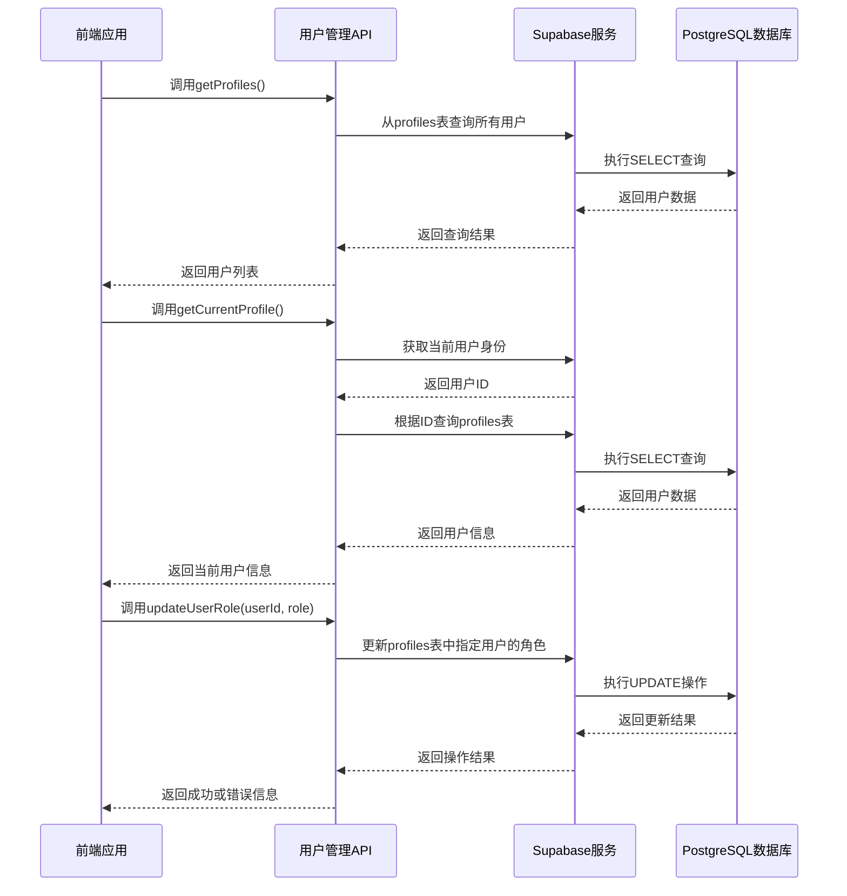

# 系统管理API

<cite>
**本文档引用的文件**   
- [api.ts](file://src/db/api.ts#L22-L851)
- [api-optimized.ts](file://src/db/api-optimized.ts#L57-L274)
- [supabase.ts](file://src/db/supabase.ts#L7)
- [UsersPage.tsx](file://src/pages/admin/UsersPage.tsx#L2-L44)
- [SmartImportPage.tsx](file://src/pages/admin/SmartImportPage.tsx#L728-L846)
- [SiteSettingsPage.tsx](file://src/pages/admin/SiteSettingsPage.tsx#L18)
- [NavigationOrderPage.tsx](file://src/pages/admin/NavigationOrderPage.tsx#L10)
- [types.ts](file://src/types/types.ts#L7-L183)
- [00014_create_site_settings_table.sql](file://supabase/migrations/00014_create_site_settings_table.sql#L40-L87)
- [00018_create_navigation_order_table.sql](file://supabase/migrations/00018_create_navigation_order_table.sql#L29-L66)
</cite>

## 目录
1. [简介](#简介)
2. [用户管理API](#用户管理api)
3. [监管部门管理API](#监管部门管理api)
4. [应用平台管理API](#应用平台管理api)
5. [智能导入功能](#智能导入功能)
6. [优化版API与缓存管理](#优化版api与缓存管理)
7. [配置与导航管理](#配置与导航管理)
8. [代码示例](#代码示例)

## 简介
本系统管理API文档详细介绍了用户、配置和导航管理的核心功能。系统基于Supabase构建，实现了完整的用户认证、权限控制和数据管理能力。API分为基础版本和优化版本，其中优化版API通过引入缓存机制和后端RPC函数，显著提升了系统性能。核心功能包括用户角色管理、监管部门和应用平台的增删改查、智能案例导入以及系统配置管理。所有API均通过Supabase客户端与PostgreSQL数据库交互，确保了数据的一致性和安全性。

**Section sources**
- [api.ts](file://src/db/api.ts#L22-L851)
- [api-optimized.ts](file://src/db/api-optimized.ts#L1-L274)

## 用户管理API
用户管理API提供了对系统用户进行查询和权限控制的功能。通过Supabase的认证集成，系统能够安全地管理用户身份和角色。`getProfiles`函数获取所有用户信息，`getCurrentProfile`获取当前登录用户信息，而`updateUserRole`则用于修改用户角色，实现管理员和普通用户之间的权限切换。

**Diagram sources**
- [api.ts](file://src/db/api.ts#L22-L53)
- [supabase.ts](file://src/db/supabase.ts#L7)

**Section sources**
- [api.ts](file://src/db/api.ts#L22-L53)
- [UsersPage.tsx](file://src/pages/admin/UsersPage.tsx#L2-L44)

## 监管部门管理API
监管部门管理API提供了对国家级和省级监管部门的完整管理功能。系统通过`getDepartments`、`createDepartment`和`updateDepartment`等函数，实现了监管部门的查询、创建和更新操作。每个监管部门包含名称、级别（国家级或省级）和所属省份等信息，支持按级别和省份进行筛选查询。

**Diagram sources**
- [api.ts](file://src/db/api.ts#L56-L293)
- [types.ts](file://src/types/types.ts#L14-L20)

**Section sources**
- [api.ts](file://src/db/api.ts#L56-L293)
- [types.ts](file://src/types/types.ts#L14-L20)

## 应用平台管理API
应用平台管理API提供了对应用平台的增删改查功能。通过`getPlatforms`、`createPlatform`和`updatePlatform`等函数，系统能够管理所有应用平台的信息。每个平台包含名称和创建时间，支持与其他数据（如案例）进行关联查询。

**Diagram sources**
- [api.ts](file://src/db/api.ts#L305-L394)
- [types.ts](file://src/types/types.ts#L22-L26)

**Section sources**
- [api.ts](file://src/db/api.ts#L305-L394)
- [types.ts](file://src/types/types.ts#L22-L26)

## 智能导入功能
智能导入功能是系统的核心特性之一，通过`smartImportCases`函数实现。该功能能够自动识别并创建不存在的部门和平台，确保数据的完整性和一致性。当导入案例数据时，系统会首先检查现有的部门和平台列表，对于不存在的条目，自动创建新的记录，然后将案例数据与这些新创建的实体关联。

**Diagram sources**
- [api.ts](file://src/db/api.ts#L728-L846)
- [SmartImportPage.tsx](file://src/pages/admin/SmartImportPage.tsx#L214-L248)

**Section sources**
- [api.ts](file://src/db/api.ts#L728-L846)

## 优化版API与缓存管理
优化版API通过引入缓存机制和后端RPC函数，显著提升了系统性能。`api-optimized.ts`文件中的函数使用`CacheManager`类来缓存数据，减少对数据库的直接查询。`clearAllCache`和`clearCache`函数提供了缓存管理能力，允许在数据更新后清除缓存，确保前端显示最新数据。

**Diagram sources**
- [api-optimized.ts](file://src/db/api-optimized.ts#L17-L47)
- [api-optimized.ts](file://src/db/api-optimized.ts#L57-L274)

**Section sources**
- [api-optimized.ts](file://src/db/api-optimized.ts#L1-L274)

## 配置与导航管理
系统提供了全面的配置和导航管理功能。`site_settings`表用于存储网站的基本信息，如标题、副标题和Logo。`navigation_order`表则管理前端导航栏的模块排序和可见性。管理员可以通过管理界面调整这些配置，实时影响前端展示。

**Diagram sources**
- [00014_create_site_settings_table.sql](file://supabase/migrations/00014_create_site_settings_table.sql#L40-L87)
- [00018_create_navigation_order_table.sql](file://supabase/migrations/00018_create_navigation_order_table.sql#L29-L66)

**Section sources**
- [SiteSettingsPage.tsx](file://src/pages/admin/SiteSettingsPage.tsx#L18)
- [NavigationOrderPage.tsx](file://src/pages/admin/NavigationOrderPage.tsx#L10)

## 代码示例
以下代码示例展示了如何使用系统管理API进行配置读取、用户管理和智能导入等操作。

**Diagram sources**
- [supabase.ts](file://src/db/supabase.ts#L7)
- [api.ts](file://src/db/api.ts#L22-L851)
- [api-optimized.ts](file://src/db/api-optimized.ts#L262-L270)

**Section sources**
- [api.ts](file://src/db/api.ts#L22-L851)
- [api-optimized.ts](file://src/db/api-optimized.ts#L57-L274)
- [supabase.ts](file://src/db/supabase.ts#L7)