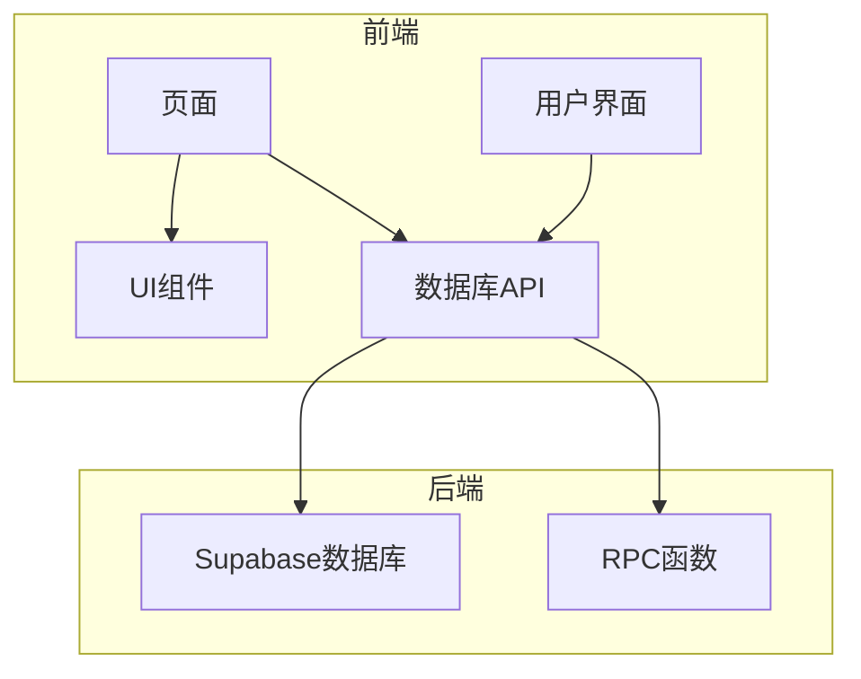
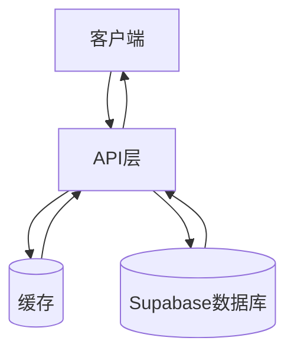
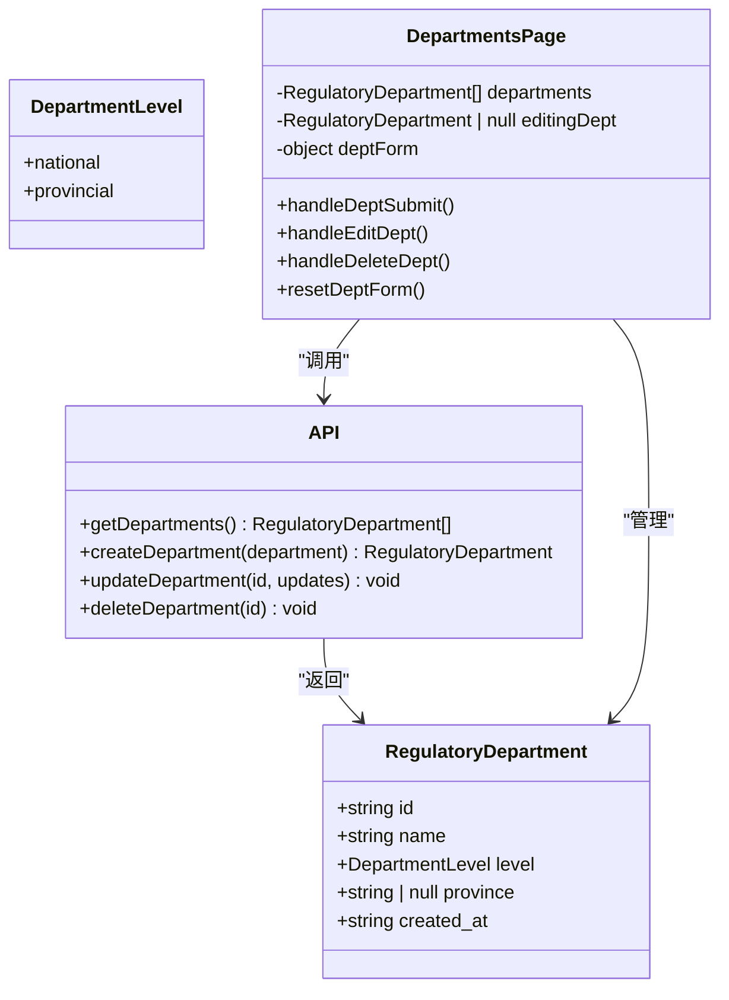
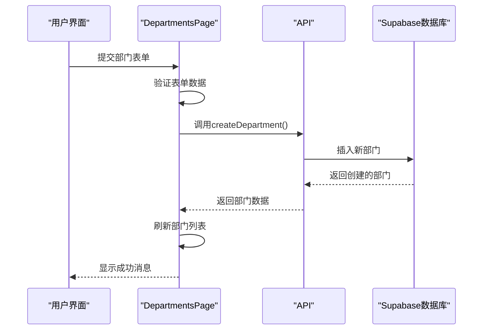
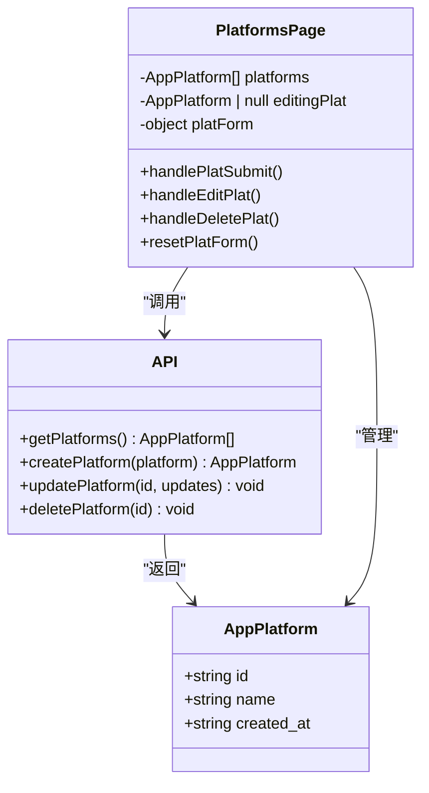
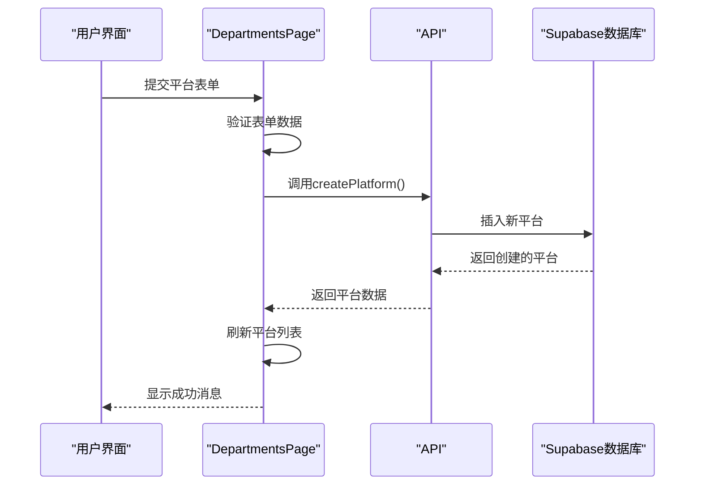
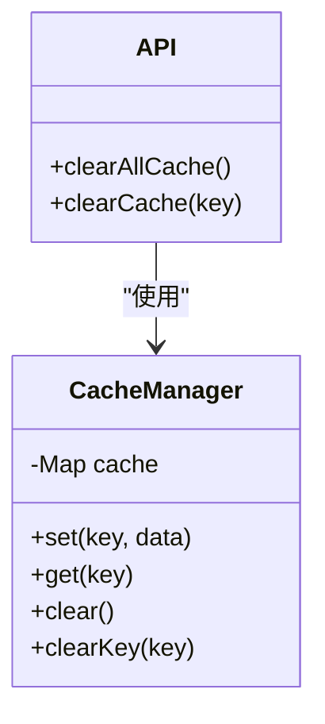
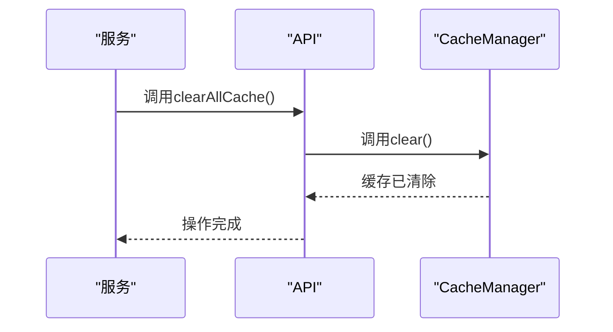
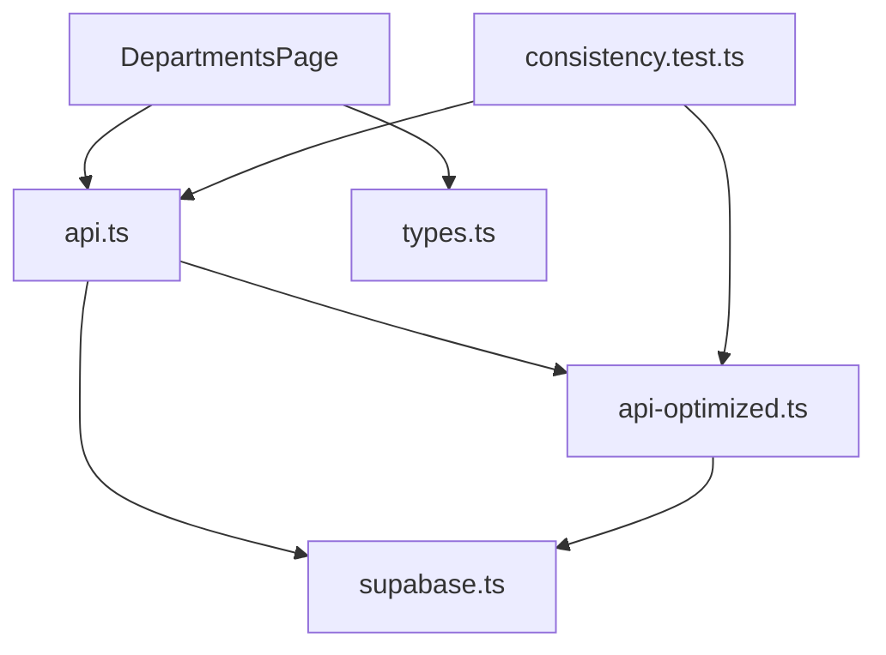

# 配置管理API

<cite>
**本文档引用的文件**
- [DepartmentsPage.tsx](file://src/pages/admin/DepartmentsPage.tsx)
- [api.ts](file://src/db/api.ts)
- [api-optimized.ts](file://src/db/api-optimized.ts)
- [types.ts](file://src/types/types.ts)
- [supabase.ts](file://src/db/supabase.ts)
- [consistency.test.ts](file://src/db/consistency.test.ts)
</cite>

## 目录
1. [简介](#简介)
2. [项目结构](#项目结构)
3. [核心组件](#核心组件)
4. [架构概述](#架构概述)
5. [详细组件分析](#详细组件分析)
6. [依赖分析](#依赖分析)
7. [性能考虑](#性能考虑)
8. [故障排除指南](#故障排除指南)
9. [结论](#结论)

## 简介
本项目是一个用于管理监管部门、应用平台和系统配置的Web应用程序。它提供了一个管理界面，用于配置和管理监管机构、应用平台和缓存。该系统使用Supabase作为后端数据库，并实现了缓存机制以提高性能。核心功能包括监管部门管理、应用平台管理和缓存管理，这些功能通过直观的用户界面进行操作。

## 项目结构
项目采用典型的React应用结构，主要组件包括：
- `src/components`：可重用的UI组件
- `src/db`：数据库API和Supabase客户端
- `src/pages`：应用程序页面，包括管理界面
- `src/types`：TypeScript类型定义
- `src/hooks`：自定义React Hooks
- `supabase/migrations`：数据库迁移脚本

管理功能主要集中在`src/pages/admin/DepartmentsPage.tsx`中，该页面提供了监管部门和应用平台的管理界面。

**图表来源**
- [DepartmentsPage.tsx](file://src/pages/admin/DepartmentsPage.tsx)
- [api.ts](file://src/db/api.ts)

**章节来源**
- [DepartmentsPage.tsx](file://src/pages/admin/DepartmentsPage.tsx)
- [api.ts](file://src/db/api.ts)

## 核心组件
核心组件包括监管部门管理、应用平台管理和缓存管理。监管部门管理API允许创建、读取、更新和删除监管部门信息，包括国家级和省级部门。应用平台管理API提供对应用平台的CRUD操作。缓存管理功能通过`api-optimized.ts`中的缓存机制实现，用于提高数据读取性能。

**章节来源**
- [DepartmentsPage.tsx](file://src/pages/admin/DepartmentsPage.tsx)
- [api.ts](file://src/db/api.ts)
- [api-optimized.ts](file://src/db/api-optimized.ts)

## 架构概述
系统采用前后端分离架构，前端使用React和TypeScript构建，后端使用Supabase作为数据库和身份验证服务。数据流从用户界面开始，通过API层与Supabase数据库交互。缓存机制在API层实现，通过`CacheManager`类管理内存中的缓存数据，减少对数据库的直接访问。

**图表来源**
- [api-optimized.ts](file://src/db/api-optimized.ts)
- [api.ts](file://src/db/api.ts)

## 详细组件分析

### 监管部门管理分析
监管部门管理功能允许用户管理国家级和省级监管部门。系统通过`getDepartments`、`createDepartment`、`updateDepartment`和`deleteDepartment`等API实现完整的CRUD操作。

#### 监管部门管理类图

**图表来源**
- [types.ts](file://src/types/types.ts)
- [DepartmentsPage.tsx](file://src/pages/admin/DepartmentsPage.tsx)
- [api.ts](file://src/db/api.ts)

#### 监管部门创建时序图

**图表来源**
- [DepartmentsPage.tsx](file://src/pages/admin/DepartmentsPage.tsx)
- [api.ts](file://src/db/api.ts)

**章节来源**
- [DepartmentsPage.tsx](file://src/pages/admin/DepartmentsPage.tsx)
- [api.ts](file://src/db/api.ts)

### 应用平台管理分析
应用平台管理功能允许用户管理应用平台信息。系统通过`getPlatforms`、`createPlatform`、`updatePlatform`和`deletePlatform`等API实现完整的CRUD操作。

#### 应用平台管理类图

**图表来源**
- [types.ts](file://src/types/types.ts)
- [DepartmentsPage.tsx](file://src/pages/admin/DepartmentsPage.tsx)
- [api.ts](file://src/db/api.ts)

#### 应用平台创建时序图

**图表来源**
- [DepartmentsPage.tsx](file://src/pages/admin/DepartmentsPage.tsx)
- [api.ts](file://src/db/api.ts)

**章节来源**
- [DepartmentsPage.tsx](file://src/pages/admin/DepartmentsPage.tsx)
- [api.ts](file://src/db/api.ts)

### 缓存管理分析
缓存管理功能通过`CacheManager`类实现，提供`clearAllCache`和`clearCache`方法用于清除缓存。

#### 缓存管理类图

**图表来源**
- [api-optimized.ts](file://src/db/api-optimized.ts)

#### 缓存清除时序图

**图表来源**
- [api-optimized.ts](file://src/db/api-optimized.ts)

**章节来源**
- [api-optimized.ts](file://src/db/api-optimized.ts)

## 依赖分析
系统依赖关系如下：

**图表来源**
- [DepartmentsPage.tsx](file://src/pages/admin/DepartmentsPage.tsx)
- [api.ts](file://src/db/api.ts)
- [api-optimized.ts](file://src/db/api-optimized.ts)
- [consistency.test.ts](file://src/db/consistency.test.ts)

**章节来源**
- [DepartmentsPage.tsx](file://src/pages/admin/DepartmentsPage.tsx)
- [api.ts](file://src/db/api.ts)
- [api-optimized.ts](file://src/db/api-optimized.ts)
- [consistency.test.ts](file://src/db/consistency.test.ts)

## 性能考虑
系统通过多种方式优化性能：
1. 使用`api-optimized.ts`中的缓存机制，缓存有效期为5分钟
2. 通过RPC函数减少数据库查询次数
3. 并行加载数据，如在`loadData`函数中同时加载部门和平台数据
4. 使用Supabase的分页功能处理大量数据

缓存管理是性能优化的关键，`clearAllCache`和`clearCache`函数在数据更新后调用，确保缓存数据的及时刷新。

## 故障排除指南
常见问题及解决方案：

1. **数据未更新**：调用`clearAllCache()`清除缓存后重试
2. **省级部门无法创建**：确保填写了省份字段
3. **API调用失败**：检查Supabase连接配置和网络连接
4. **缓存问题**：在数据更新后调用相应的缓存清除函数

**章节来源**
- [api-optimized.ts](file://src/db/api-optimized.ts)
- [api.ts](file://src/db/api.ts)

## 结论
本配置管理API提供了完整的监管部门、应用平台和缓存管理功能。系统设计合理，通过缓存机制有效提升了性能。API设计遵循REST原则，提供了清晰的CRUD操作接口。未来可以考虑增加更多的数据验证和错误处理机制，进一步提升系统的稳定性和用户体验。