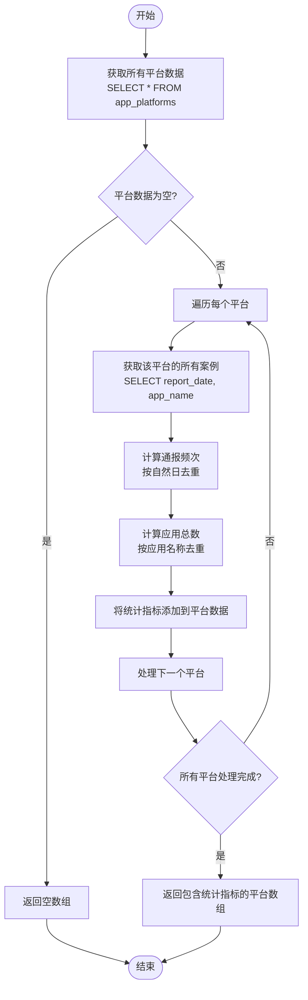
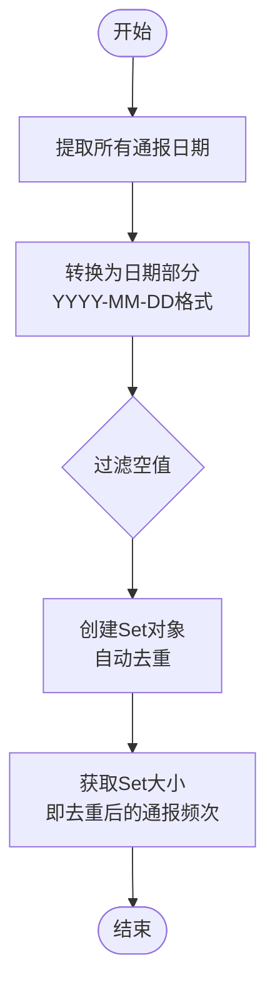
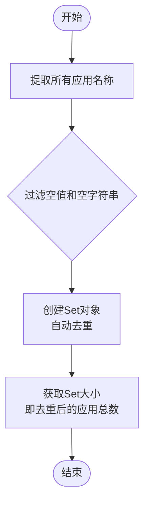

# 应用平台统计API

<cite>
**本文档引用的文件**   
- [api.ts](file://src/db/api.ts)
- [types.ts](file://src/types/types.ts)
</cite>

## 目录
1. [简介](#简介)
2. [核心功能实现](#核心功能实现)
3. [数据关联与计算逻辑](#数据关联与计算逻辑)
4. [API调用示例](#api调用示例)
5. [返回数据结构](#返回数据结构)
6. [性能优化策略](#性能优化策略)
7. [结论](#结论)

## 简介
应用平台统计API提供了对应用平台数据的全面统计功能，通过`getPlatformsWithStats`函数实现。该API从`app_platforms`表获取平台基础信息，并与`cases`表关联计算关键统计指标。统计逻辑与监管部门统计API保持一致，确保数据口径统一。API支持按自然日去重计算通报频次，并采用应用名称去重策略统计相关应用总数，为平台监管提供准确的数据支持。

## 核心功能实现

`getPlatformsWithStats`函数是应用平台统计的核心实现，其主要功能包括：

1. 从`app_platforms`表获取所有平台的基础信息
2. 为每个平台关联`cases`表中的案例数据
3. 计算去重后的通报频次和应用总数
4. 返回包含统计指标的完整平台数据

该函数的实现模式与`getDepartmentsWithStats`高度相似，都采用了"先获取主实体，再为每个实体计算统计指标"的设计模式。这种模式确保了统计逻辑的一致性和可维护性。



**代码片段路径**
- [src/db/api.ts#L316-L373](file://src/db/api.ts#L316-L373)

**Section sources**
- [src/db/api.ts](file://src/db/api.ts#L316-L373)

## 数据关联与计算逻辑

### 数据关联机制
应用平台统计API通过`platform_id`字段建立`app_platforms`表与`cases`表的数据关联。当获取特定平台的统计数据时，系统使用`eq('platform_id', plat.id)`条件查询`cases`表，确保只获取与该平台相关的案例数据。

### 通报频次计算逻辑
通报频次的计算采用了严格的自然日去重策略，确保每日的通报只计为一次。具体实现步骤如下：

1. 从案例数据中提取`report_date`字段
2. 将日期时间转换为仅包含日期部分的字符串（YYYY-MM-DD格式）
3. 使用JavaScript的`Set`数据结构自动去重
4. 统计去重后日期的数量作为最终的通报频次



**代码片段路径**
- [src/db/api.ts#L344-L355](file://src/db/api.ts#L344-L355)

### 应用总数去重策略
应用总数的统计采用了基于应用名称的去重策略，确保同一应用在不同案例中只被计数一次。实现方式是使用`Set`数据结构存储所有非空的应用名称，然后统计`Set`的大小。



**代码片段路径**
- [src/db/api.ts#L357-L363](file://src/db/api.ts#L357-L363)

**Section sources**
- [src/db/api.ts](file://src/db/api.ts#L344-L363)

## API调用示例

以下是如何在前端代码中调用`getPlatformsWithStats` API的示例：

```typescript
import { getPlatformsWithStats } from '@/db/api';

async function fetchPlatformStats() {
  try {
    const platforms = await getPlatformsWithStats();
    
    // 处理返回的平台统计数据
    platforms.forEach(platform => {
      console.log(`平台: ${platform.name}`);
      console.log(`通报频次: ${platform.case_count}`);
      console.log(`相关应用总数: ${platform.app_count}`);
    });
    
    return platforms;
  } catch (error) {
    console.error('获取平台统计数据失败:', error);
    throw error;
  }
}

// 调用函数
fetchPlatformStats();
```

该API可以直接在React组件中使用，例如在`HomePage`或`TrendAnalysisPage`中展示平台统计数据。

**代码片段路径**
- [src/db/api.ts#L316-L373](file://src/db/api.ts#L316-L373)

**Section sources**
- [src/db/api.ts](file://src/db/api.ts#L316-L373)

## 返回数据结构

`getPlatformsWithStats`函数返回一个包含统计指标的平台数组，每个平台对象的结构如下：

```typescript
interface PlatformWithStats extends AppPlatform {
  case_count: number;  // 通报频次（按自然日去重）
  app_count: number;   // 相关应用总数（按应用名称去重）
}
```

| 字段 | 类型 | 说明 |
|------|------|------|
| id | string | 平台唯一标识符 |
| name | string | 平台名称 |
| created_at | string | 平台创建时间 |
| case_count | number | 累计通报频次，按自然日去重计算 |
| app_count | number | 相关应用总数，按应用名称去重计算 |

**代码片段路径**
- [src/types/types.ts#L22-L26](file://src/types/types.ts#L22-L26)
- [src/db/api.ts#L364-L368](file://src/db/api.ts#L364-L368)

**Section sources**
- [src/types/types.ts](file://src/types/types.ts#L22-L26)
- [src/db/api.ts](file://src/db/api.ts#L364-L368)

## 性能优化策略

为了提高统计API的性能，系统采用了多种优化策略：

1. **并行处理**：使用`Promise.all`并行处理每个平台的统计计算，避免串行查询的性能瓶颈
2. **数据库索引**：在`cases`表的`platform_id`和`report_date`字段上创建了复合索引，加速关联查询
3. **内存去重**：利用JavaScript的`Set`数据结构在内存中高效完成去重操作

```mermaid
graph TB
A[性能优化策略] --> B[并行处理]
A --> C[数据库索引]
A --> D[内存去重]
B --> B1[使用Promise.all]
B --> B2[避免串行查询]
C --> C1[CREATE INDEX ON cases(platform_id, report_date)]
C --> C2[加速关联查询]
D --> D1[使用Set数据结构]
D --> D2[高效去重]
```

**代码片段路径**
- [src/db/api.ts#L330-L331](file://src/db/api.ts#L330-L331)
- [supabase/migrations/20251220100000_add_home_charts_indexes.sql#L3](file://supabase/migrations/20251220100000_add_home_charts_indexes.sql#L3)

**Section sources**
- [src/db/api.ts](file://src/db/api.ts#L330-L331)
- [supabase/migrations/20251220100000_add_home_charts_indexes.sql](file://supabase/migrations/20251220100000_add_home_charts_indexes.sql#L3)

## 结论
应用平台统计API通过`getPlatformsWithStats`函数实现了对平台数据的全面统计。该API采用与监管部门统计API一致的计算逻辑，确保了数据口径的统一性。通过`platform_id`进行数据关联，使用`Set`数据结构实现高效的去重计算，确保了统计结果的准确性。API返回的数据结构清晰，包含了平台基础信息和关键统计指标，便于前端展示和分析。整体设计模式与`getDepartmentsWithStats`保持一致，体现了系统设计的统一性和可维护性。