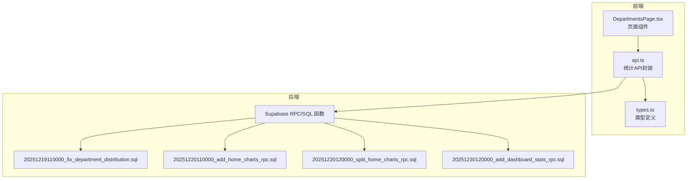
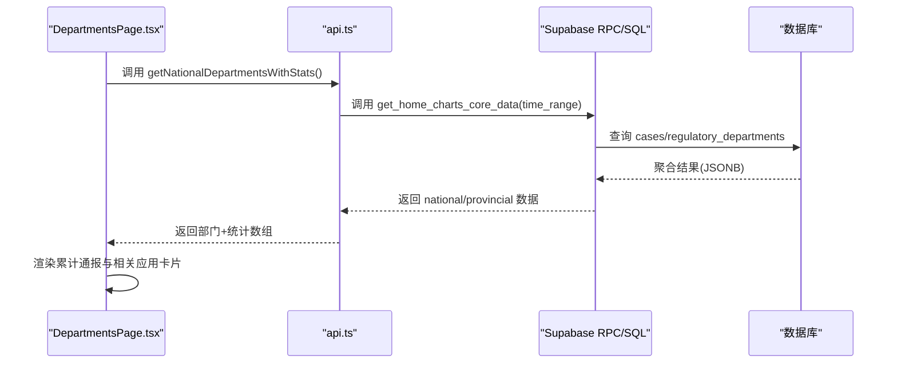
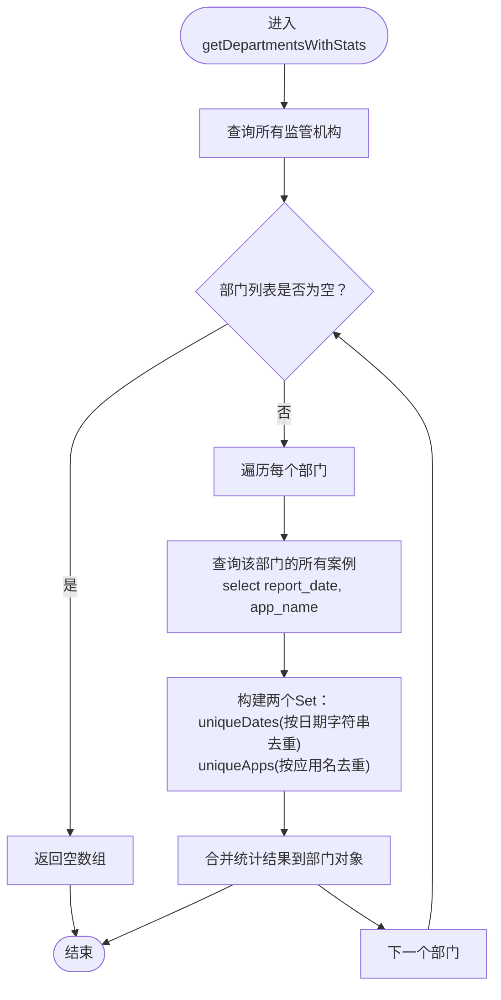
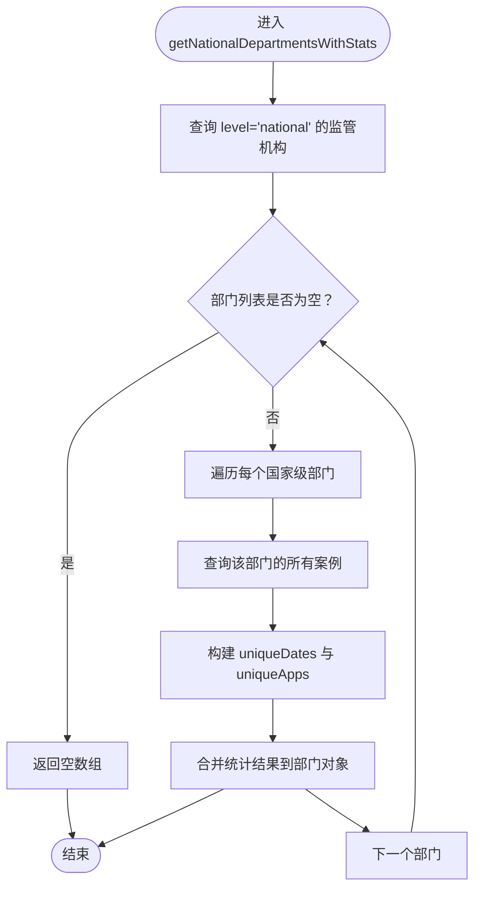
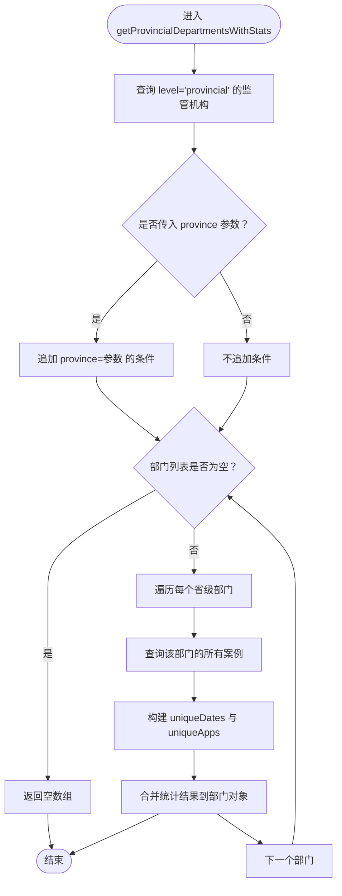
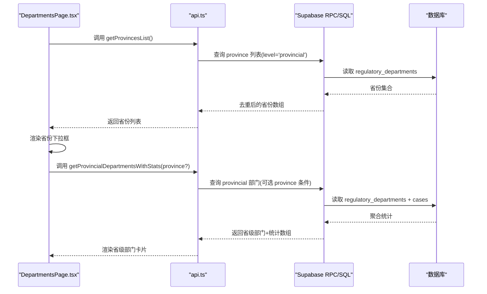
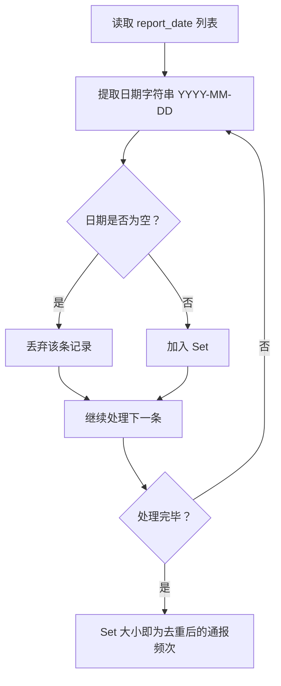
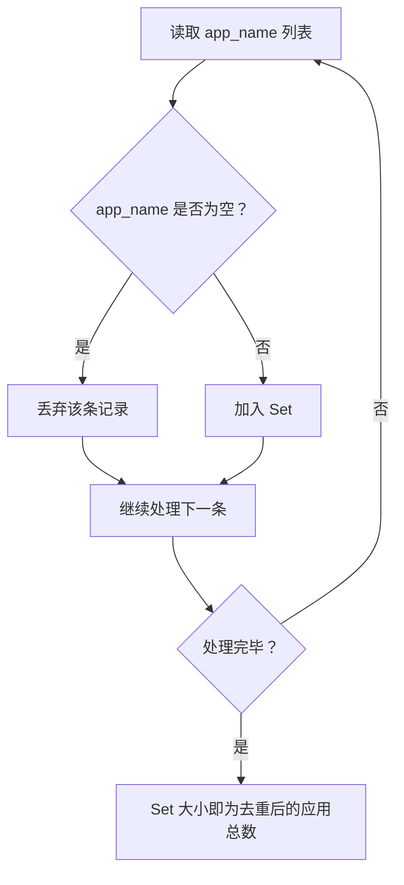
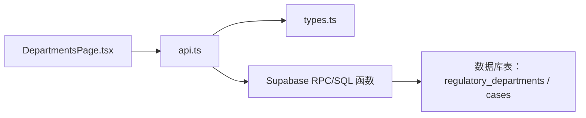

# 监管部门统计API

<cite>
**本文引用的文件**
- [api.ts](file://src/db/api.ts)
- [types.ts](file://src/types/types.ts)
- [DepartmentsPage.tsx](file://src/pages/DepartmentsPage.tsx)
- [20251219110000_fix_department_distribution.sql](file://supabase/migrations/20251219110000_fix_department_distribution.sql)
- [20251220110000_add_home_charts_rpc.sql](file://supabase/migrations/20251220110000_add_home_charts_rpc.sql)
- [20251220120000_split_home_charts_rpc.sql](file://supabase/migrations/20251220120000_split_home_charts_rpc.sql)
- [20251230120000_add_dashboard_stats_rpc.sql](file://supabase/migrations/20251230120000_add_dashboard_stats_rpc.sql)
</cite>

## 目录
1. [简介](#简介)
2. [项目结构](#项目结构)
3. [核心组件](#核心组件)
4. [架构总览](#架构总览)
5. [详细组件分析](#详细组件分析)
6. [依赖关系分析](#依赖关系分析)
7. [性能考量](#性能考量)
8. [故障排查指南](#故障排查指南)
9. [结论](#结论)
10. [附录](#附录)

## 简介
本文件面向监管部门统计API，聚焦以下三个函数的实现细节与使用方式：
- getDepartmentsWithStats：从监管机构表获取所有部门数据，并与案例表关联，计算累计通报频次与相关应用总数。
- getNationalDepartmentsWithStats：仅统计国家级部门，计算方式同上。
- getProvincialDepartmentsWithStats：仅统计省级部门，支持按省份参数进行条件查询。

文档将详细解释：
- 如何从regulatory_departments表获取部门数据，并与cases表关联计算统计指标；
- 通报频次按自然日去重的计算逻辑（使用Set与日期字符串提取）；
- 应用总数去重统计策略；
- 国家级与省级部门统计的层级化实现方式（level字段过滤与省份参数条件查询）；
- 实际调用示例与返回数据结构说明。

## 项目结构
围绕监管部门统计API的关键文件与职责如下：
- 前端API封装：src/db/api.ts
- 类型定义：src/types/types.ts
- 页面使用示例：src/pages/DepartmentsPage.tsx
- 后端统计函数（RPC/SQL）：supabase/migrations 下的若干SQL文件

**图示来源**
- [api.ts](file://src/db/api.ts#L66-L124)
- [types.ts](file://src/types/types.ts#L14-L20)
- [DepartmentsPage.tsx](file://src/pages/DepartmentsPage.tsx#L1-L60)
- [20251219110000_fix_department_distribution.sql](file://supabase/migrations/20251219110000_fix_department_distribution.sql#L1-L49)
- [20251220110000_add_home_charts_rpc.sql](file://supabase/migrations/20251220110000_add_home_charts_rpc.sql#L1-L154)
- [20251220120000_split_home_charts_rpc.sql](file://supabase/migrations/20251220120000_split_home_charts_rpc.sql#L1-L95)
- [20251230120000_add_dashboard_stats_rpc.sql](file://supabase/migrations/20251230120000_add_dashboard_stats_rpc.sql#L1-L216)

**章节来源**
- [api.ts](file://src/db/api.ts#L66-L124)
- [types.ts](file://src/types/types.ts#L14-L20)
- [DepartmentsPage.tsx](file://src/pages/DepartmentsPage.tsx#L1-L60)

## 核心组件
- getDepartmentsWithStats
  - 作用：获取所有监管机构，逐个统计其累计通报频次与相关应用总数。
  - 关键点：按自然日去重（Set + 日期字符串提取），应用总数去重（Set + 过滤空值）。
- getNationalDepartmentsWithStats
  - 作用：仅统计国家级部门，计算方式与上述一致。
  - 关键点：通过level字段过滤。
- getProvincialDepartmentsWithStats
  - 作用：仅统计省级部门，支持按省份参数进行条件查询。
  - 关键点：level字段过滤 + province条件；同时提供省份列表接口getProvincesList。

**章节来源**
- [api.ts](file://src/db/api.ts#L66-L124)
- [api.ts](file://src/db/api.ts#L138-L185)
- [api.ts](file://src/db/api.ts#L206-L253)
- [api.ts](file://src/db/api.ts#L255-L273)

## 架构总览
监管部门统计API的调用链路如下：
- 前端页面调用api.ts中的统计函数；
- api.ts通过Supabase客户端访问后端RPC/SQL函数；
- 后端函数根据时间范围与过滤条件，从regulatory_departments与cases表聚合统计；
- 返回JSON结构，前端解析并渲染。

**图示来源**
- [DepartmentsPage.tsx](file://src/pages/DepartmentsPage.tsx#L32-L58)
- [api.ts](file://src/db/api.ts#L1282-L1318)
- [20251220120000_split_home_charts_rpc.sql](file://supabase/migrations/20251220120000_split_home_charts_rpc.sql#L1-L95)

## 详细组件分析

### getDepartmentsWithStats 实现细节
- 数据来源
  - 从regulatory_departments表获取所有部门，按名称排序。
  - 对每个部门，查询cases表中该部门的所有案例（包含通报日期与应用名称）。
- 统计指标
  - 累计通报频次：按自然日去重。具体做法是提取report_date的日期部分（YYYY-MM-DD），放入Set，最终Set大小即为去重后的通报天数。
  - 相关应用总数：对app_name去重。仅统计非空且非空字符串的应用名称，最终Set大小即为去重后的应用数。
- 返回结构
  - 在原有部门对象基础上，新增case_count与app_count两个字段，作为统计结果。

**图示来源**
- [api.ts](file://src/db/api.ts#L66-L124)

**章节来源**
- [api.ts](file://src/db/api.ts#L66-L124)

### getNationalDepartmentsWithStats 实现细节
- 数据来源
  - 从regulatory_departments表获取level为national的部门。
  - 对每个国家级部门，查询cases表中该部门的所有案例（包含通报日期与应用名称）。
- 统计指标
  - 累计通报频次：按自然日去重（Set + 日期字符串提取）。
  - 相关应用总数：对app_name去重（Set + 过滤空值）。
- 返回结构
  - 在原有国家级部门对象基础上，新增case_count与app_count两个字段。

**图示来源**
- [api.ts](file://src/db/api.ts#L138-L185)

**章节来源**
- [api.ts](file://src/db/api.ts#L138-L185)

### getProvincialDepartmentsWithStats 实现细节
- 数据来源
  - 从regulatory_departments表获取level为provincial的部门。
  - 若传入province参数，则追加province等于该值的条件。
  - 对每个省级部门，查询cases表中该部门的所有案例（包含通报日期与应用名称）。
- 统计指标
  - 累计通报频次：按自然日去重（Set + 日期字符串提取）。
  - 相关应用总数：对app_name去重（Set + 过滤空值）。
- 返回结构
  - 在原有省级部门对象基础上，新增case_count与app_count两个字段。

**图示来源**
- [api.ts](file://src/db/api.ts#L206-L253)

**章节来源**
- [api.ts](file://src/db/api.ts#L206-L253)

### 省份参数与层级化实现
- 层级化实现
  - 通过level字段过滤国家级与省级部门。
  - 省级部门支持按province参数进行条件查询，实现按省筛选。
- 省份列表
  - 提供getProvincesList接口，从regulatory_departments表中提取level为provincial且province非空的记录，去重后返回省份数组。

**图示来源**
- [api.ts](file://src/db/api.ts#L255-L273)
- [api.ts](file://src/db/api.ts#L206-L253)
- [DepartmentsPage.tsx](file://src/pages/DepartmentsPage.tsx#L151-L170)

**章节来源**
- [api.ts](file://src/db/api.ts#L255-L273)
- [api.ts](file://src/db/api.ts#L206-L253)
- [DepartmentsPage.tsx](file://src/pages/DepartmentsPage.tsx#L151-L170)

### 通报频次按自然日去重的计算逻辑
- 核心思路
  - 从cases表取出每条记录的report_date；
  - 将日期转换为“YYYY-MM-DD”字符串形式；
  - 将这些字符串放入Set，利用Set天然去重特性；
  - 最终Set的大小即为按自然日去重后的通报频次。
- 适用场景
  - 即使某一天有多条通报记录，也只计1次。

**图示来源**
- [api.ts](file://src/db/api.ts#L95-L106)
- [api.ts](file://src/db/api.ts#L156-L167)
- [api.ts](file://src/db/api.ts#L224-L235)

**章节来源**
- [api.ts](file://src/db/api.ts#L95-L106)
- [api.ts](file://src/db/api.ts#L156-L167)
- [api.ts](file://src/db/api.ts#L224-L235)

### 应用总数去重统计策略
- 核心思路
  - 从cases表取出每条记录的app_name；
  - 过滤掉空值与空字符串；
  - 将非空应用名放入Set；
  - 最终Set的大小即为去重后的应用总数。
- 适用场景
  - 一个应用可能被多次通报，但只计1次。

**图示来源**
- [api.ts](file://src/db/api.ts#L108-L114)
- [api.ts](file://src/db/api.ts#L169-L175)
- [api.ts](file://src/db/api.ts#L237-L243)

**章节来源**
- [api.ts](file://src/db/api.ts#L108-L114)
- [api.ts](file://src/db/api.ts#L169-L175)
- [api.ts](file://src/db/api.ts#L237-L243)

### 返回数据结构与字段含义
- 统一扩展类型
  - RegulatoryDepartment：基础部门信息（id、name、level、province、created_at）。
  - DepartmentWithStats：在上述基础上扩展case_count（累计通报频次）、app_count（相关应用总数）。
- 字段说明
  - id：部门唯一标识。
  - name：部门名称。
  - level：部门层级（national/ provincial）。
  - province：所属省份（省级部门存在）。
  - created_at：创建时间。
  - case_count：累计通报频次（按自然日去重）。
  - app_count：相关应用总数（按应用名去重）。

**章节来源**
- [types.ts](file://src/types/types.ts#L14-L20)
- [DepartmentsPage.tsx](file://src/pages/DepartmentsPage.tsx#L11-L16)

### 实际调用示例（页面侧）
- 加载国家级部门统计数据
  - 调用位置：DepartmentsPage.tsx
  - 调用方式：Promise.all并行加载国家级统计数据与省份列表
  - 示例路径：[loadData](file://src/pages/DepartmentsPage.tsx#L32-L47)
- 加载省级部门统计数据
  - 调用位置：DepartmentsPage.tsx
  - 调用方式：根据所选省份调用getProvincialDepartmentsWithStats(province?)
  - 示例路径：[loadProvincialDepartments](file://src/pages/DepartmentsPage.tsx#L49-L58)

**章节来源**
- [DepartmentsPage.tsx](file://src/pages/DepartmentsPage.tsx#L32-L58)

## 依赖关系分析
- 前端依赖
  - api.ts依赖Supabase客户端与类型定义types.ts。
  - DepartmentsPage.tsx依赖api.ts提供的统计函数。
- 后端依赖
  - 统计函数依赖regulatory_departments与cases表结构。
  - 早期版本使用RPC函数（如get_home_charts_data），当前版本在页面侧直接调用api.ts封装的函数，api.ts内部再调用RPC函数。

**图示来源**
- [DepartmentsPage.tsx](file://src/pages/DepartmentsPage.tsx#L1-L20)
- [api.ts](file://src/db/api.ts#L1-L20)
- [types.ts](file://src/types/types.ts#L1-L20)

**章节来源**
- [DepartmentsPage.tsx](file://src/pages/DepartmentsPage.tsx#L1-L20)
- [api.ts](file://src/db/api.ts#L1-L20)
- [types.ts](file://src/types/types.ts#L1-L20)

## 性能考量
- 前端逐部门查询
  - getDepartmentsWithStats、getNationalDepartmentsWithStats、getProvincialDepartmentsWithStats均采用Promise.all并发查询每个部门的案例，随后在前端用Set进行去重与统计。
  - 时间复杂度：O(n)，n为部门数量；对每个部门，遍历其案例列表，Set插入为O(1)。
- 后端聚合统计
  - 早期RPC函数（如get_home_charts_data）在数据库层进行聚合，避免前端大量循环与Set操作。
  - 当前页面侧统计仍由前端完成，若数据量增大，建议迁移到后端RPC函数，减少前端计算压力。
- 建议
  - 对于大规模数据，优先使用后端RPC函数进行统计（例如get_home_charts_core_data等），前端仅负责展示。

[本节为通用性能讨论，无需特定文件引用]

## 故障排查指南
- 常见问题
  - 案例report_date为空：前端会过滤空日期，不影响统计；若后端RPC函数未做空值过滤，可能导致统计偏差。
  - app_name为空或空字符串：前端与后端均做过滤，确保只统计有效应用名。
  - 省份参数无效：getProvincialDepartmentsWithStats会按province条件查询，若省份不存在则返回空数组。
- 建议排查步骤
  - 检查Supabase RPC函数是否存在（如get_home_charts_core_data）。
  - 检查regulatory_departments与cases表结构是否符合预期。
  - 在页面侧打印调用参数与返回数据，确认province参数传递正确。

**章节来源**
- [api.ts](file://src/db/api.ts#L66-L124)
- [api.ts](file://src/db/api.ts#L138-L185)
- [api.ts](file://src/db/api.ts#L206-L253)
- [20251220120000_split_home_charts_rpc.sql](file://supabase/migrations/20251220120000_split_home_charts_rpc.sql#L1-L95)

## 结论
- getDepartmentsWithStats、getNationalDepartmentsWithStats、getProvincialDepartmentsWithStats三者均采用相同的统计口径：累计通报频次按自然日去重，相关应用总数按应用名去重。
- 国家级与省级统计通过level字段过滤实现层级化；省级统计支持province参数进行条件查询。
- 前端当前实现将统计逻辑放在前端，便于灵活展示；在数据量较大时，建议迁移到后端RPC函数，提升性能与一致性。

[本节为总结性内容，无需特定文件引用]

## 附录

### 后端统计函数（RPC/SQL）概览
- get_home_charts_core_data
  - 作用：按时间范围聚合趋势、国家级与省级部门统计、平台统计等。
  - 特点：在数据库层进行COUNT(DISTINCT ...)聚合，避免前端大量循环。
- get_home_charts_data（历史版本）
  - 作用：与上述类似，但包含违规关键词统计。
- get_department_distribution_stats
  - 作用：按应用名去重统计国家级与省级部门分布。
- get_dashboard_stats
  - 作用：统一仪表盘统计数据口径，涵盖累计与环比等指标。

**章节来源**
- [20251220120000_split_home_charts_rpc.sql](file://supabase/migrations/20251220120000_split_home_charts_rpc.sql#L1-L95)
- [20251220110000_add_home_charts_rpc.sql](file://supabase/migrations/20251220110000_add_home_charts_rpc.sql#L1-L154)
- [20251219110000_fix_department_distribution.sql](file://supabase/migrations/20251219110000_fix_department_distribution.sql#L1-L49)
- [20251230120000_add_dashboard_stats_rpc.sql](file://supabase/migrations/20251230120000_add_dashboard_stats_rpc.sql#L1-L216)