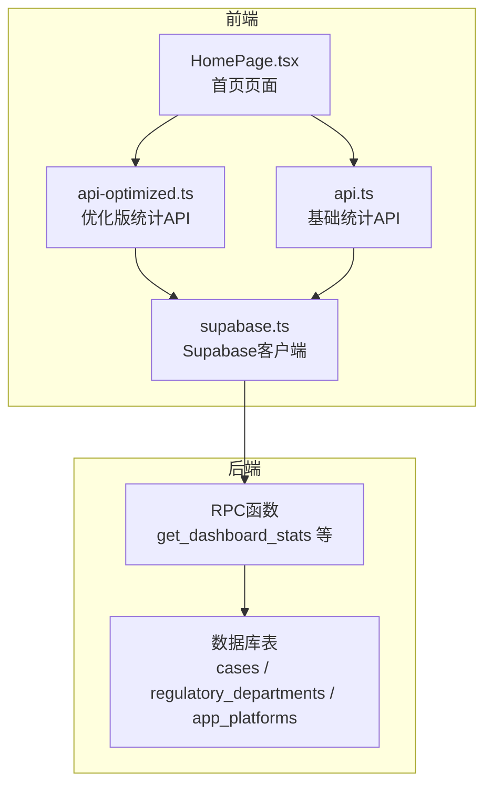
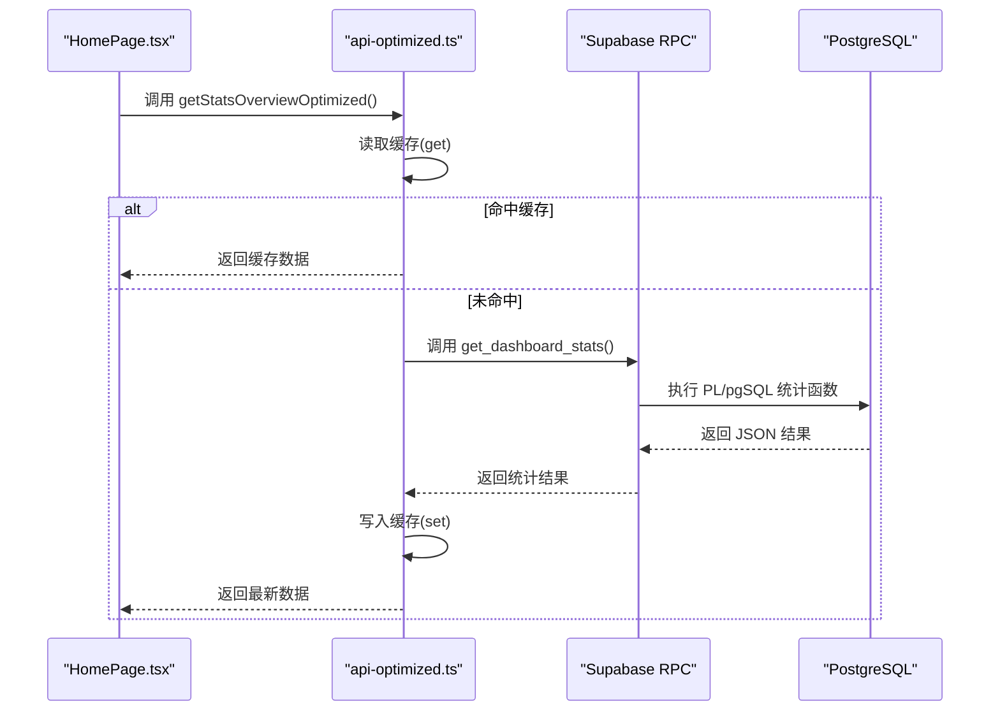
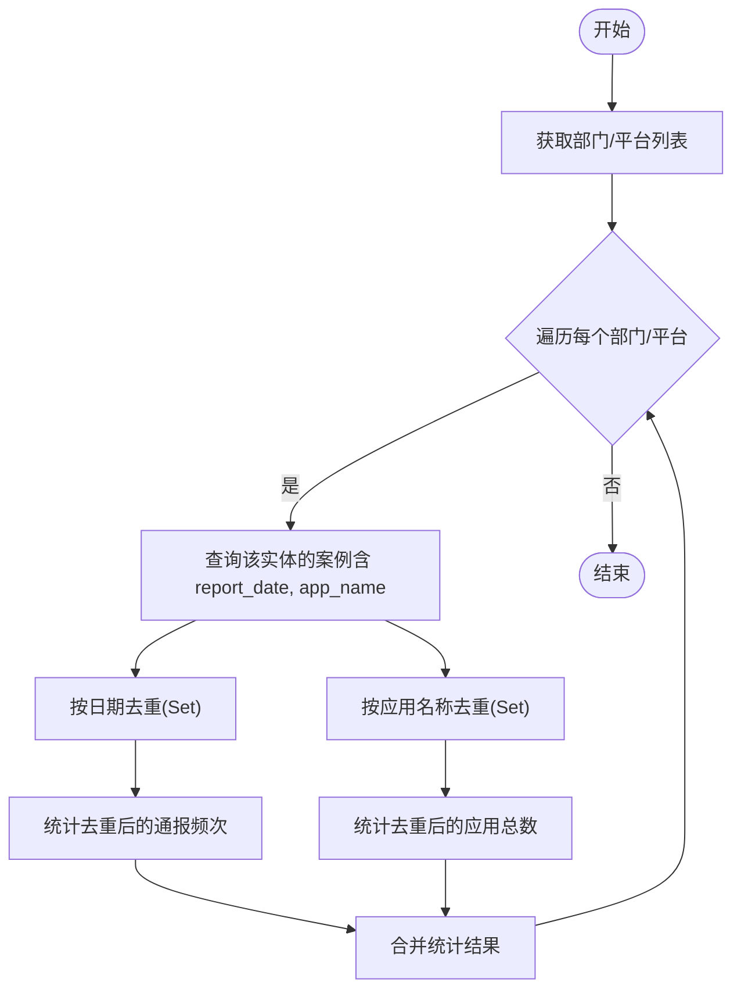
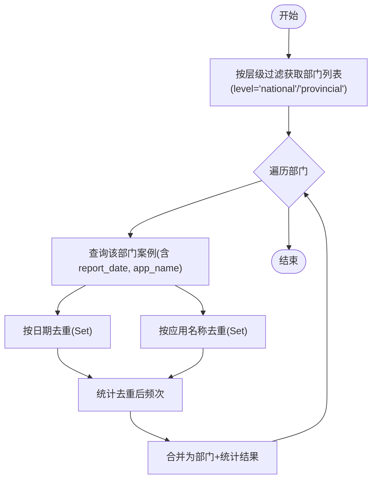
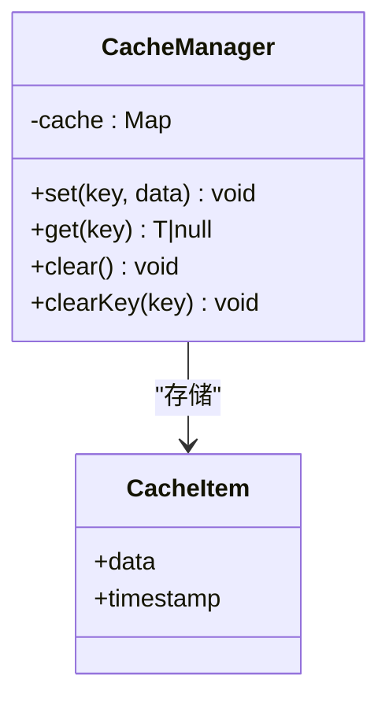
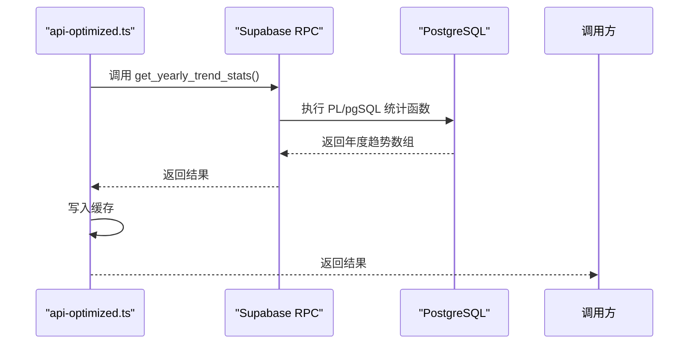
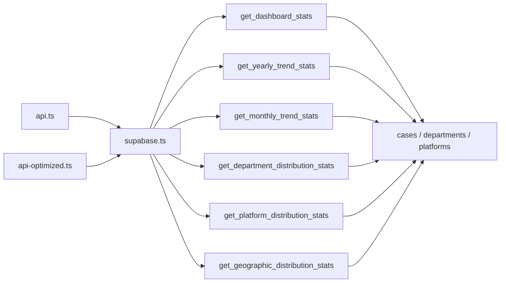

# 统计分析API

<cite>
**本文引用的文件**
- [src/db/api.ts](file://src/db/api.ts)
- [src/db/api-optimized.ts](file://src/db/api-optimized.ts)
- [src/db/supabase.ts](file://src/db/supabase.ts)
- [src/pages/HomePage.tsx](file://src/pages/HomePage.tsx)
- [supabase/migrations/20251230120000_add_dashboard_stats_rpc.sql](file://supabase/migrations/20251230120000_add_dashboard_stats_rpc.sql)
- [supabase/migrations/20251220110000_add_home_charts_rpc.sql](file://supabase/migrations/20251220110000_add_home_charts_rpc.sql)
- [supabase/migrations/20251220120000_split_home_charts_rpc.sql](file://supabase/migrations/20251220120000_split_home_charts_rpc.sql)
- [supabase/migrations/20251230130000_fix_trend_overview_stats.sql](file://supabase/migrations/20251230130000_fix_trend_overview_stats.sql)
- [supabase/migrations_archive/00017_add_stats_rpc_functions.sql](file://supabase/migrations_archive/00017_add_stats_rpc_functions.sql)
- [docs/首页性能优化说明.md](file://docs/首页性能优化说明.md)
</cite>

## 目录
1. [简介](#简介)
2. [项目结构](#项目结构)
3. [核心组件](#核心组件)
4. [架构总览](#架构总览)
5. [详细组件分析](#详细组件分析)
6. [依赖关系分析](#依赖关系分析)
7. [性能考量](#性能考量)
8. [故障排查指南](#故障排查指南)
9. [结论](#结论)
10. [附录](#附录)

## 简介
本文件面向监管部门与应用平台的统计分析场景，系统性梳理并说明以下内容：
- 复合查询实现：getDepartmentsWithStats、getPlatformsWithStats 的统计口径与去重策略
- 层级化统计：getNationalDepartmentsWithStats、getProvincialDepartmentsWithStats 的分层聚合
- 优化版API（api-optimized.ts）：缓存机制（CACHE_DURATION、CacheManager）、缓存命中策略
- 性能对比：基础API与优化版API在首页加载速度上的差异，以及优化版API中 RPC 调用与 5 分钟缓存的作用
- 实际调用示例：年度趋势、月度趋势、分布统计等优化接口的使用路径

## 项目结构
统计相关代码主要分布在以下位置：
- 前端数据库访问层：src/db/api.ts（基础API）、src/db/api-optimized.ts（优化版API）
- Supabase 客户端封装：src/db/supabase.ts
- 页面使用示例：src/pages/HomePage.tsx
- 后端 RPC 函数：supabase/migrations 下的 SQL 文件，定义了 get_dashboard_stats、get_yearly_trend_stats、get_monthly_trend_stats、get_department_distribution_stats、get_platform_distribution_stats、get_geographic_distribution_stats 等函数
- 文档说明：docs/首页性能优化说明.md

图示来源
- [src/pages/HomePage.tsx](file://src/pages/HomePage.tsx#L1-L200)
- [src/db/api.ts](file://src/db/api.ts#L1-L200)
- [src/db/api-optimized.ts](file://src/db/api-optimized.ts#L1-L120)
- [src/db/supabase.ts](file://src/db/supabase.ts#L1-L8)
- [supabase/migrations/20251230120000_add_dashboard_stats_rpc.sql](file://supabase/migrations/20251230120000_add_dashboard_stats_rpc.sql#L1-L216)

章节来源
- [src/pages/HomePage.tsx](file://src/pages/HomePage.tsx#L1-L200)
- [src/db/api.ts](file://src/db/api.ts#L1-L200)
- [src/db/api-optimized.ts](file://src/db/api-optimized.ts#L1-L120)
- [src/db/supabase.ts](file://src/db/supabase.ts#L1-L8)

## 核心组件
- 基础统计API（src/db/api.ts）
  - 部门统计：getDepartmentsWithStats、getNationalDepartmentsWithStats、getProvincialDepartmentsWithStats
  - 平台统计：getPlatformsWithStats
  - 辅助：getProvincesList、getDepartments、getPlatforms 等
- 优化版统计API（src/db/api-optimized.ts）
  - 首页核心指标：getStatsOverviewOptimized（RPC + 5 分钟缓存）
  - 年度/月度趋势：getYearlyTrendOptimized、getMonthlyTrendOptimized
  - 分布统计：getDepartmentDistributionOptimized、getPlatformDistributionOptimized、getGeographicDistributionOptimized
  - 关键词统计：getViolationKeywordsOptimized
  - 批量聚合：getAllChartsDataOptimized
  - 缓存管理：CACHE_DURATION、CacheManager 类
- 页面使用（src/pages/HomePage.tsx）
  - 首页并行加载优化版指标与前端配置
  - 图表数据采用本地 TTL 缓存与服务端 RPC 聚合

章节来源
- [src/db/api.ts](file://src/db/api.ts#L55-L253)
- [src/db/api-optimized.ts](file://src/db/api-optimized.ts#L1-L275)
- [src/pages/HomePage.tsx](file://src/pages/HomePage.tsx#L1-L200)

## 架构总览
优化版统计API通过 Supabase RPC 将复杂统计下推至数据库侧，前端仅做轻量聚合与缓存，显著降低网络往返与前端计算开销。首页加载流程如下：

图示来源
- [src/pages/HomePage.tsx](file://src/pages/HomePage.tsx#L180-L200)
- [src/db/api-optimized.ts](file://src/db/api-optimized.ts#L53-L93)
- [supabase/migrations/20251230120000_add_dashboard_stats_rpc.sql](file://supabase/migrations/20251230120000_add_dashboard_stats_rpc.sql#L1-L216)

## 详细组件分析

### 复合查询：getDepartmentsWithStats 与 getPlatformsWithStats
- 统计口径
  - 累计通报频次：按“部门ID + 通报日期”去重计数，确保同一天同一部门的多次通报仅计1次
  - 相关应用总数：对同一部门/平台关联的案例，按应用名称去重计数
- 实现要点
  - 对每个部门/平台并行发起案例查询，汇总后返回
  - 日期去重：提取日期字符串（YYYY-MM-DD）后使用 Set 去重
  - 应用去重：对 app_name 使用 Set 去重
- 复杂度
  - 时间复杂度：O(N_cases + N_departments/platforms)，空间复杂度：O(N_unique_dates + N_unique_apps)

图示来源
- [src/db/api.ts](file://src/db/api.ts#L66-L124)
- [src/db/api.ts](file://src/db/api.ts#L315-L373)

章节来源
- [src/db/api.ts](file://src/db/api.ts#L66-L124)
- [src/db/api.ts](file://src/db/api.ts#L315-L373)

### 层级化统计：getNationalDepartmentsWithStats 与 getProvincialDepartmentsWithStats
- 国家级/省级过滤：分别通过 level 字段过滤
- 统计口径：与上述复合查询一致，按自然日去重与应用去重
- 返回结构：在部门对象上附加 case_count 与 app_count 字段

图示来源
- [src/db/api.ts](file://src/db/api.ts#L126-L185)
- [src/db/api.ts](file://src/db/api.ts#L187-L253)

章节来源
- [src/db/api.ts](file://src/db/api.ts#L126-L185)
- [src/db/api.ts](file://src/db/api.ts#L187-L253)

### 优化版API：缓存机制与命中策略
- 缓存配置
  - CACHE_DURATION：5 分钟（毫秒）
- CacheManager 类
  - set(key, data)：写入缓存并记录时间戳
  - get(key)：若未过期则返回；否则删除并返回 null
  - clear()/clearKey(key)：清空或清理指定键
- 命中策略
  - 优先读取缓存；未命中则调用 RPC，成功后写入缓存
  - 适用于首页核心指标与各类趋势/分布统计

图示来源
- [src/db/api-optimized.ts](file://src/db/api-optimized.ts#L10-L47)

章节来源
- [src/db/api-optimized.ts](file://src/db/api-optimized.ts#L1-L120)

### 优化版API：RPC 函数与统计口径
- 首页核心指标 get_dashboard_stats
  - 统计维度：累计通报频次（按“部门ID + 通报日期”去重）、累计应用总数（按应用名称去重）、最近通报日期与部门
  - 时间粒度：当月/当季/当年，并计算环比变化（数值与百分比）
- 年度/月度趋势 get_yearly_trend_stats / get_monthly_trend_stats
  - 统计口径：按应用数量去重计数（自然日去重）
- 分布统计
  - get_department_distribution_stats：国家级/省级部门分布（按应用去重）
  - get_platform_distribution_stats：平台分布（按案例计数）
  - get_geographic_distribution_stats：按省份统计（按“部门+日期”去重）

图示来源
- [src/db/api-optimized.ts](file://src/db/api-optimized.ts#L95-L131)
- [supabase/migrations/20251230120000_add_dashboard_stats_rpc.sql](file://supabase/migrations/20251230120000_add_dashboard_stats_rpc.sql#L1-L216)
- [supabase/migrations_archive/00017_add_stats_rpc_functions.sql](file://supabase/migrations_archive/00017_add_stats_rpc_functions.sql#L366-L404)

章节来源
- [src/db/api-optimized.ts](file://src/db/api-optimized.ts#L95-L177)
- [supabase/migrations/20251230120000_add_dashboard_stats_rpc.sql](file://supabase/migrations/20251230120000_add_dashboard_stats_rpc.sql#L1-L216)
- [supabase/migrations_archive/00017_add_stats_rpc_functions.sql](file://supabase/migrations_archive/00017_add_stats_rpc_functions.sql#L366-L404)

### 页面使用示例与调用路径
- 首页加载
  - 并行获取 getStatsOverviewOptimized 与前端配置，显著缩短首屏等待时间
- 图表数据
  - 通过 getHomeChartsData 与 getHomeViolationData 获取首页图表聚合数据
  - 本地 TTL 缓存（5 分钟）与服务端 RPC 聚合结合，减少请求次数与计算开销

章节来源
- [src/pages/HomePage.tsx](file://src/pages/HomePage.tsx#L1-L200)
- [src/db/api.ts](file://src/db/api.ts#L404-L508)

## 依赖关系分析
- 前端依赖
  - api.ts 依赖 supabase.ts 进行数据库访问
  - api-optimized.ts 同样依赖 supabase.ts，但通过 RPC 函数与本地缓存优化性能
- 后端依赖
  - RPC 函数位于 supabase/migrations 中，涉及 cases、regulatory_departments、app_platforms 等表
  - 趋势总览函数 get_trend_overview 修正了统计口径，统一使用“部门+日期”去重

图示来源
- [src/db/api.ts](file://src/db/api.ts#L1-L120)
- [src/db/api-optimized.ts](file://src/db/api-optimized.ts#L1-L120)
- [src/db/supabase.ts](file://src/db/supabase.ts#L1-L8)
- [supabase/migrations/20251230120000_add_dashboard_stats_rpc.sql](file://supabase/migrations/20251230120000_add_dashboard_stats_rpc.sql#L1-L216)
- [supabase/migrations/20251220110000_add_home_charts_rpc.sql](file://supabase/migrations/20251220110000_add_home_charts_rpc.sql#L1-L154)
- [supabase/migrations/20251220120000_split_home_charts_rpc.sql](file://supabase/migrations/20251220120000_split_home_charts_rpc.sql#L1-L176)
- [supabase/migrations/20251230130000_fix_trend_overview_stats.sql](file://supabase/migrations/20251230130000_fix_trend_overview_stats.sql#L1-L134)
- [supabase/migrations_archive/00017_add_stats_rpc_functions.sql](file://supabase/migrations_archive/00017_add_stats_rpc_functions.sql#L366-L404)

章节来源
- [src/db/api.ts](file://src/db/api.ts#L1-L200)
- [src/db/api-optimized.ts](file://src/db/api-optimized.ts#L1-L120)
- [src/db/supabase.ts](file://src/db/supabase.ts#L1-L8)

## 性能考量
- 基础API（api.ts）
  - 每个实体（部门/平台）分别查询案例并进行前端去重与汇总，请求次数较多，前端计算量大
- 优化版API（api-optimized.ts）
  - 通过 RPC 将统计下推至数据库侧，前端仅做轻量聚合与缓存
  - 首页核心指标 getStatsOverviewOptimized 使用 5 分钟缓存，显著降低数据库压力与网络往返
  - 年度/月度趋势与分布统计同样采用 RPC + 缓存，减少重复计算
- 实际收益
  - 首页加载速度明显提升，用户体验更佳
  - 文档中明确列出各 RPC 接口返回结构与使用建议，便于前端对接

章节来源
- [src/db/api-optimized.ts](file://src/db/api-optimized.ts#L1-L120)
- [docs/首页性能优化说明.md](file://docs/首页性能优化说明.md#L474-L562)

## 故障排查指南
- RPC 调用失败
  - 检查 Supabase URL 与匿名密钥配置是否正确
  - 确认 RPC 函数是否存在且具备执行权限
- 缓存未生效
  - 确认 CACHE_DURATION 设置是否合理
  - 在数据更新后主动调用 clearAllCache 或 clearCache 清理缓存
- 统计口径不一致
  - 确认数据库侧 RPC 函数使用的是“部门+日期”去重统计
  - 对比趋势总览函数 get_trend_overview 的口径修正

章节来源
- [src/db/supabase.ts](file://src/db/supabase.ts#L1-L8)
- [src/db/api-optimized.ts](file://src/db/api-optimized.ts#L258-L275)
- [supabase/migrations/20251230130000_fix_trend_overview_stats.sql](file://supabase/migrations/20251230130000_fix_trend_overview_stats.sql#L1-L134)

## 结论
- 基础API适合灵活查询与小规模统计，但存在请求与计算开销
- 优化版API通过 RPC 下推与 5 分钟缓存，显著提升首页加载性能与整体响应速度
- 建议在首页与高频统计场景优先使用优化版API，并在数据变更后及时清理缓存

## 附录
- 实际调用示例（路径）
  - 首页核心指标：调用 getStatsOverviewOptimized（来自 api-optimized.ts）
  - 年度趋势：调用 getYearlyTrendOptimized（来自 api-optimized.ts）
  - 月度趋势：调用 getMonthlyTrendOptimized（来自 api-optimized.ts）
  - 监管部门分布：调用 getDepartmentDistributionOptimized（来自 api-optimized.ts）
  - 应用平台分布：调用 getPlatformDistributionOptimized（来自 api-optimized.ts）
  - 地域分布：调用 getGeographicDistributionOptimized（来自 api-optimized.ts）
  - 关键词统计：调用 getViolationKeywordsOptimized（来自 api-optimized.ts）
  - 批量聚合：调用 getAllChartsDataOptimized（来自 api-optimized.ts）
- RPC 函数说明与返回结构
  - get_dashboard_stats：累计/当月/当季/当年统计与环比
  - get_yearly_trend_stats / get_monthly_trend_stats：年度/月度趋势（按应用数量去重）
  - get_department_distribution_stats：国家级/省级分布
  - get_platform_distribution_stats：平台分布
  - get_geographic_distribution_stats：地域分布（按省份）

章节来源
- [src/db/api-optimized.ts](file://src/db/api-optimized.ts#L53-L275)
- [docs/首页性能优化说明.md](file://docs/首页性能优化说明.md#L474-L562)