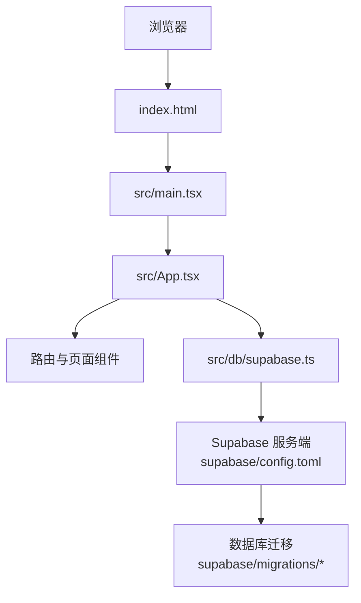
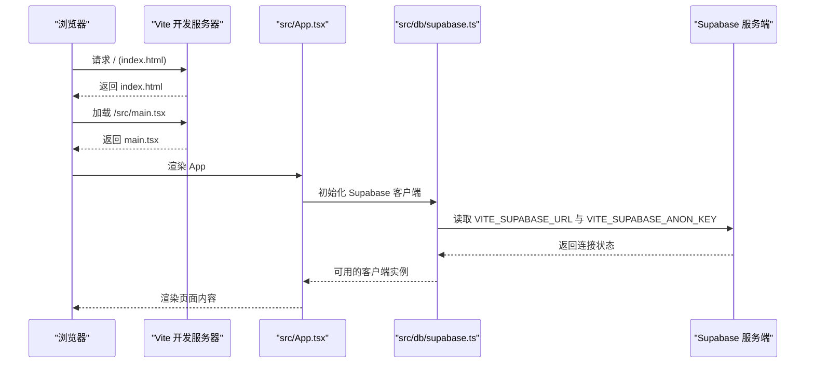
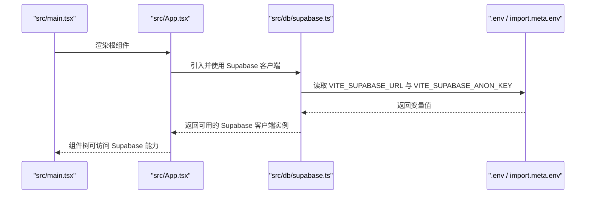
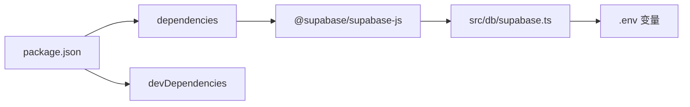

# 快速开始

<cite>
**本文引用的文件**
- [package.json](file://package.json)
- [.env](file://.env)
- [vite.config.ts](file://vite.config.ts)
- [vite.config.dev.ts](file://vite.config.dev.ts)
- [src/db/supabase.ts](file://src/db/supabase.ts)
- [src/main.tsx](file://src/main.tsx)
- [src/App.tsx](file://src/App.tsx)
- [index.html](file://index.html)
- [supabase/config.toml](file://supabase/config.toml)
- [supabase/migrations/00001_create_initial_schema.sql](file://supabase/migrations/00001_create_initial_schema.sql)
- [docs/README.md](file://docs/README.md)
- [scripts/fix_dependencies.js](file://scripts/fix_dependencies.js)
</cite>

## 目录
1. [简介](#简介)
2. [项目结构](#项目结构)
3. [核心组件](#核心组件)
4. [架构总览](#架构总览)
5. [详细组件分析](#详细组件分析)
6. [依赖关系分析](#依赖关系分析)
7. [性能注意事项](#性能注意事项)
8. [故障排查指南](#故障排查指南)
9. [结论](#结论)
10. [附录](#附录)

## 简介
本指南面向首次参与开发的工程师，帮助你在本地快速搭建并运行本项目。项目基于 Vite + React + TypeScript，并通过 Supabase 提供数据库与认证能力。你将学会：
- 安装 pnpm 包管理器
- 安装项目依赖
- 启动开发服务器
- 构建生产版本
- 配置环境变量（尤其是 Supabase 相关）
- 常见问题排查
- 验证本地运行结果

## 项目结构
本项目采用前端单页应用（SPA）架构，入口为 index.html，根组件为 App.tsx，路由由 routes.tsx 配置，数据库客户端封装在 src/db/supabase.ts 中，开发服务器由 Vite 提供。

图表来源
- [index.html](file://index.html#L1-L13)
- [src/main.tsx](file://src/main.tsx#L1-L27)
- [src/App.tsx](file://src/App.tsx#L1-L33)
- [src/db/supabase.ts](file://src/db/supabase.ts#L1-L8)
- [supabase/config.toml](file://supabase/config.toml#L1-L3)
- [supabase/migrations/00001_create_initial_schema.sql](file://supabase/migrations/00001_create_initial_schema.sql#L1-L200)

章节来源
- [index.html](file://index.html#L1-L13)
- [src/main.tsx](file://src/main.tsx#L1-L27)
- [src/App.tsx](file://src/App.tsx#L1-L33)
- [src/db/supabase.ts](file://src/db/supabase.ts#L1-L8)
- [supabase/config.toml](file://supabase/config.toml#L1-L3)
- [supabase/migrations/00001_create_initial_schema.sql](file://supabase/migrations/00001_create_initial_schema.sql#L1-L200)

## 核心组件
- 包管理与脚本
  - 使用 pnpm 作为包管理器，脚本集中在 package.json 的 scripts 字段中，包含 dev、build、preview、test、lint、supabase:migrate:* 等命令。
- 开发服务器与构建
  - Vite 作为开发服务器与打包工具，配置位于 vite.config.ts；开发模式下可结合 vite.config.dev.ts 的插件增强。
- Supabase 客户端
  - 在 src/db/supabase.ts 中创建 Supabase 客户端实例，从 import.meta.env 读取 VITE_SUPABASE_URL 与 VITE_SUPABASE_ANON_KEY。
- 入口与路由
  - index.html 作为 HTML 入口，src/main.tsx 渲染根组件 App.tsx，App.tsx 通过 react-router-dom 管理路由。

章节来源
- [package.json](file://package.json#L1-L111)
- [vite.config.ts](file://vite.config.ts#L1-L25)
- [vite.config.dev.ts](file://vite.config.dev.ts#L1-L117)
- [src/db/supabase.ts](file://src/db/supabase.ts#L1-L8)
- [src/main.tsx](file://src/main.tsx#L1-L27)
- [src/App.tsx](file://src/App.tsx#L1-L33)
- [index.html](file://index.html#L1-L13)

## 架构总览
下图展示了从浏览器到 Supabase 的请求链路，以及开发服务器与构建流程。

图表来源
- [index.html](file://index.html#L1-L13)
- [src/main.tsx](file://src/main.tsx#L1-L27)
- [src/App.tsx](file://src/App.tsx#L1-L33)
- [src/db/supabase.ts](file://src/db/supabase.ts#L1-L8)
- [vite.config.ts](file://vite.config.ts#L1-L25)

## 详细组件分析

### 本地开发环境搭建
- Node.js 版本要求
  - 文档中明确要求 Node.js ≥ 20，建议使用 LTS 版本以获得最佳兼容性。
- pnpm 安装
  - 项目使用 pnpm 作为包管理器，建议全局安装 pnpm 并使用其生态工具链。
- 依赖安装
  - 使用 pnpm 安装依赖，确保网络稳定，必要时可参考 scripts/fix_dependencies.js 的思路进行依赖修复（该脚本用于 npm 场景，若 pnpm 安装异常可参考其清理与重装流程）。
- 启动开发服务器
  - 执行 pnpm dev 启动 Vite 开发服务器，默认监听本地端口（可通过 --host 指定），并在浏览器中打开首页。
- 构建生产版本
  - 执行 pnpm build 生成生产构建产物；如需预览，执行 pnpm preview。

章节来源
- [docs/README.md](file://docs/README.md#L45-L104)
- [package.json](file://package.json#L1-L111)
- [scripts/fix_dependencies.js](file://scripts/fix_dependencies.js#L1-L71)

### 环境变量配置（Supabase 相关）
- 本地变量文件
  - .env 文件中包含 VITE_SUPABASE_URL 与 VITE_SUPABASE_ANON_KEY，这些变量会在打包时注入到 import.meta.env。
- 变量读取位置
  - src/db/supabase.ts 通过 import.meta.env 读取上述变量并创建 Supabase 客户端。
- Supabase 服务端配置
  - supabase/config.toml 中包含认证邮箱相关配置（如关闭邮箱确认），可在本地或云端 Supabase 实例中生效。
- 数据库迁移
  - supabase/migrations/00001_create_initial_schema.sql 定义了初始数据库结构（用户、监管部门、平台、案例、新闻、前端配置、静态内容等），包含 RLS 策略与索引。

章节来源
- [.env](file://.env#L1-L7)
- [src/db/supabase.ts](file://src/db/supabase.ts#L1-L8)
- [supabase/config.toml](file://supabase/config.toml#L1-L3)
- [supabase/migrations/00001_create_initial_schema.sql](file://supabase/migrations/00001_create_initial_schema.sql#L1-L200)

### 开发服务器与构建配置
- Vite 配置
  - vite.config.ts 集成了 React 插件与 SVGR 插件，并设置路径别名 @ 指向 src。
  - vite.config.dev.ts 在开发模式下注入额外插件与中间件，支持 HMR 控制与手动整页刷新接口。
- 入口与渲染
  - index.html 作为 SPA 入口，src/main.tsx 渲染根组件 App.tsx，App.tsx 使用 react-router-dom 管理路由。

章节来源
- [vite.config.ts](file://vite.config.ts#L1-L25)
- [vite.config.dev.ts](file://vite.config.dev.ts#L1-L117)
- [index.html](file://index.html#L1-L13)
- [src/main.tsx](file://src/main.tsx#L1-L27)
- [src/App.tsx](file://src/App.tsx#L1-L33)

### Supabase 客户端初始化流程

图表来源
- [src/main.tsx](file://src/main.tsx#L1-L27)
- [src/App.tsx](file://src/App.tsx#L1-L33)
- [src/db/supabase.ts](file://src/db/supabase.ts#L1-L8)
- [.env](file://.env#L1-L7)

## 依赖关系分析
- 前端依赖
  - React、React Router、Radix UI、ECharts、TailwindCSS 等，详见 package.json 的 dependencies。
- 开发依赖
  - Vite、TypeScript、TailwindCSS、Supabase CLI、测试工具等，详见 package.json 的 devDependencies。
- Supabase 集成
  - 通过 @supabase/supabase-js 与 src/db/supabase.ts 集成，配合 .env 中的 URL 与密钥。

图表来源
- [package.json](file://package.json#L1-L111)
- [src/db/supabase.ts](file://src/db/supabase.ts#L1-L8)
- [.env](file://.env#L1-L7)

章节来源
- [package.json](file://package.json#L1-L111)
- [src/db/supabase.ts](file://src/db/supabase.ts#L1-L8)
- [.env](file://.env#L1-L7)

## 性能注意事项
- 使用 Vite 的 HMR 与按需加载提升开发体验。
- 生产构建前建议清理缓存并重新安装依赖，确保依赖一致性。
- Supabase 查询尽量使用索引与分页，避免一次性拉取大量数据。

## 故障排查指南
- 依赖安装失败
  - 若 pnpm 安装失败，可参考 scripts/fix_dependencies.js 的思路：清理 node_modules 与锁文件，配置 .npmrc，改用 npm 安装并添加 --legacy-peer-deps 参数，必要时使用 --force。
- 端口冲突
  - 开发服务器默认端口可能被占用，可在启动命令中指定 host 与端口（如 pnpm dev -- --host 127.0.0.1），或在 Vite 配置中调整端口。
- 环境变量未加载
  - 确认 .env 文件存在且包含 VITE_SUPABASE_URL 与 VITE_SUPABASE_ANON_KEY；变量名必须以 VITE_ 前缀开头，且在打包时才会注入到 import.meta.env。
- Supabase 连接失败
  - 检查 supabase/config.toml 的认证配置（如邮箱确认），并确认数据库迁移已执行；可使用 package.json 中的 supabase:migrate:* 脚本查看迁移状态与信息。
- 页面空白或路由异常
  - 确认 index.html 的入口与 src/main.tsx 的渲染逻辑正常；检查 src/App.tsx 的路由配置是否正确。

章节来源
- [scripts/fix_dependencies.js](file://scripts/fix_dependencies.js#L1-L71)
- [vite.config.ts](file://vite.config.ts#L1-L25)
- [.env](file://.env#L1-L7)
- [supabase/config.toml](file://supabase/config.toml#L1-L3)
- [package.json](file://package.json#L1-L111)
- [src/App.tsx](file://src/App.tsx#L1-L33)

## 结论
通过以上步骤，你可以完成本地开发环境的搭建与验证。建议在本地先跑通开发服务器，再执行构建与预览，最后结合 Supabase 的迁移与配置，确保数据库与认证功能正常工作。

## 附录

### 快速命令清单
- 安装 pnpm（如未安装）
- 安装依赖：pnpm install
- 启动开发服务器：pnpm dev
- 构建生产版本：pnpm build
- 预览生产构建：pnpm preview
- 查看迁移状态：pnpm run supabase:migrate:status
- 查看迁移文件：pnpm run supabase:migrate:info

章节来源
- [package.json](file://package.json#L1-L111)

### 访问方式与默认页面说明
- 启动后默认访问地址通常为 http://localhost:5173（或指定 host 与端口），首页由 src/App.tsx 的路由配置决定。
- 若页面空白，检查 index.html 的入口与 src/main.tsx 的渲染逻辑。

章节来源
- [index.html](file://index.html#L1-L13)
- [src/main.tsx](file://src/main.tsx#L1-L27)
- [src/App.tsx](file://src/App.tsx#L1-L33)