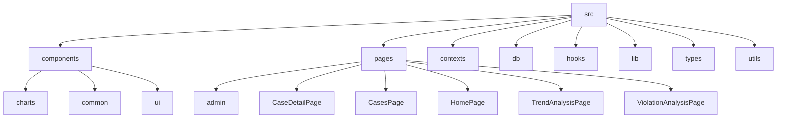
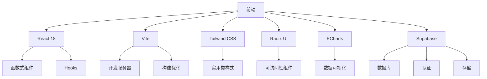
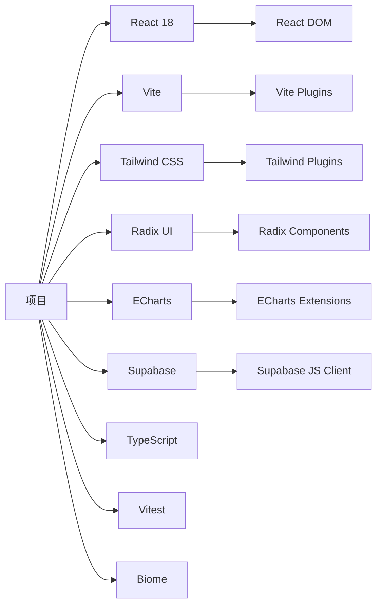

# 技术栈与依赖

<cite>
**本文档引用的文件**  
- [package.json](file://package.json)
- [vite.config.ts](file://vite.config.ts)
- [tailwind.config.js](file://tailwind.config.js)
- [biome.json](file://biome.json)
- [vitest.config.ts](file://vitest.config.ts)
- [tsconfig.json](file://tsconfig.json)
- [tsconfig.app.json](file://tsconfig.app.json)
- [tsconfig.node.json](file://tsconfig.node.json)
- [src/main.tsx](file://src/main.tsx)
- [src/App.tsx](file://src/App.tsx)
- [supabase/config.toml](file://supabase/config.toml)
- [src/db/supabase.ts](file://src/db/supabase.ts)
- [src/components/charts/TrendChart.tsx](file://src/components/charts/TrendChart.tsx)
- [src/components/ui/button.tsx](file://src/components/ui/button.tsx)
- [src/types/types.ts](file://src/types/types.ts)
- [src/hooks/use-toast.tsx](file://src/hooks/use-toast.tsx)
- [src/lib/utils.ts](file://src/lib/utils.ts)
</cite>

## 目录
1. [简介](#简介)
2. [项目结构](#项目结构)
3. [核心组件](#核心组件)
4. [架构概述](#架构概述)
5. [详细组件分析](#详细组件分析)
6. [依赖分析](#依赖分析)
7. [性能考虑](#性能考虑)
8. [故障排除指南](#故障排除指南)
9. [结论](#结论)

## 简介
本项目是一个基于 React 18 的现代化前端应用，采用 Vite 作为构建工具，结合 TypeScript 提供类型安全。项目使用 Tailwind CSS 进行样式设计，Radix UI 提供可访问性组件，ECharts 实现数据可视化，并通过 Supabase 作为后端即服务（BaaS）解决方案。测试框架采用 Vitest，代码格式化和 linting 使用 Biome 工具。整体技术栈体现了现代 Web 开发的最佳实践，注重性能、可维护性和用户体验。

## 项目结构
项目采用功能模块化的目录结构，将组件、页面、类型定义、工具函数等分类组织，便于维护和扩展。



**图示来源**  
- [src/components](file://src/components)
- [src/pages](file://src/pages)

**本节来源**  
- [src](file://src)

## 核心组件
项目的核心组件包括基于 React 18 的函数式组件、使用 Vite 配置的构建流程、Tailwind CSS 的实用类样式系统、Radix UI 的可访问性组件、ECharts 的数据可视化图表以及通过 Supabase 实现的后端集成。TypeScript 类型系统贯穿整个项目，确保类型安全。Vitest 用于单元测试，Biome 负责代码格式化和 linting。

**本节来源**  
- [package.json](file://package.json)
- [vite.config.ts](file://vite.config.ts)
- [tailwind.config.js](file://tailwind.config.js)
- [biome.json](file://biome.json)
- [vitest.config.ts](file://vitest.config.ts)

## 架构概述
项目采用现代化的前端架构，前端使用 React 18 的函数式组件和 Hooks API，通过 Vite 实现快速开发和构建。状态管理采用 React 内置的 Context API（如 ModuleContext），路由使用 react-router-dom。UI 组件基于 Radix UI 构建，样式使用 Tailwind CSS，数据可视化使用 ECharts，后端服务通过 Supabase 提供，包括数据库、认证和存储功能。



**图示来源**  
- [src/main.tsx](file://src/main.tsx)
- [src/App.tsx](file://src/App.tsx)
- [src/db/supabase.ts](file://src/db/supabase.ts)

**本节来源**  
- [src/main.tsx](file://src/main.tsx)
- [src/App.tsx](file://src/App.tsx)
- [supabase/config.toml](file://supabase/config.toml)

## 详细组件分析

### React 18 组件化开发模式
项目全面采用 React 18 的函数式组件和 Hooks API，通过组件组合实现 UI 的模块化开发。组件分为基础 UI 组件（位于 `src/components/ui`）、业务组件（位于 `src/components`）和页面组件（位于 `src/pages`）。

#### 组件结构示例
```mermaid
classDiagram
class Button {
+variant : string
+size : string
+asChild : boolean
+className : string
+render() : JSX.Element
}
class Card {
+children : ReactNode
+className : string
+render() : JSX.Element
}
class TrendChart {
+data : {month : string, count : number}[]
+title : string
+type : 'monthly' | 'yearly'
+render() : JSX.Element
}
Button --> Card : "在卡片中使用"
Card --> TrendChart : "在卡片中使用"
```

**图示来源**  
- [src/components/ui/button.tsx](file://src/components/ui/button.tsx)
- [src/components/charts/TrendChart.tsx](file://src/components/charts/TrendChart.tsx)

**本节来源**  
- [src/components/ui/button.tsx](file://src/components/ui/button.tsx)
- [src/components/charts/TrendChart.tsx](file://src/components/charts/TrendChart.tsx)

### Vite 构建工具配置与优势
Vite 配置通过 `vite.config.ts` 文件定义，使用 `@vitejs/plugin-react` 插件支持 React，`vite-plugin-svgr` 插件将 SVG 转换为 React 组件，并通过 `miaodaDevPlugin` 集成自定义开发插件。配置中还设置了路径别名 `@` 指向 `src` 目录，提升导入体验。

**本节来源**  
- [vite.config.ts](file://vite.config.ts)
- [package.json](file://package.json)

### Tailwind CSS 实用类样式策略
Tailwind CSS 配置在 `tailwind.config.js` 中定义，扩展了主题颜色、边框半径、背景图像、阴影等样式。项目使用实用类（utility classes）直接在 JSX 中编写样式，结合 `cn` 工具函数合并类名，实现高效的样式开发。

**本节来源**  
- [tailwind.config.js](file://tailwind.config.js)
- [src/lib/utils.ts](file://src/lib/utils.ts)

### Radix UI 可访问性组件库集成
项目使用 Radix UI 作为基础组件库，提供高度可定制且符合可访问性标准的 UI 组件。通过 `@radix-ui/react-*` 包引入各种组件，如按钮、卡片、对话框等，并在 `src/components/ui` 目录下进行二次封装，适配项目设计系统。

**本节来源**  
- [package.json](file://package.json)
- [src/components/ui/button.tsx](file://src/components/ui/button.tsx)

### ECharts 数据可视化能力
ECharts 通过 `echarts` 和 `echarts-for-react` 包集成，用于创建各种数据可视化图表。`TrendChart` 组件展示了如何初始化 ECharts 实例、配置图表选项以及处理窗口大小调整事件。

**本节来源**  
- [package.json](file://package.json)
- [src/components/charts/TrendChart.tsx](file://src/components/charts/TrendChart.tsx)

### Supabase 后端即服务集成
Supabase 客户端通过 `@supabase/supabase-js` 包集成，配置在 `src/db/supabase.ts` 文件中。项目使用环境变量 `VITE_SUPABASE_URL` 和 `VITE_SUPABASE_ANON_KEY` 进行连接，实现数据库查询、认证和存储功能。

**本节来源**  
- [package.json](file://package.json)
- [src/db/supabase.ts](file://src/db/supabase.ts)
- [supabase/config.toml](file://supabase/config.toml)

### TypeScript 类型系统应用
TypeScript 配置通过 `tsconfig.json`、`tsconfig.app.json` 和 `tsconfig.node.json` 文件管理。项目在 `src/types/types.ts` 中定义了所有数据模型类型，包括用户角色、监管部门、案例信息等，确保类型安全和开发体验。

**本节来源**  
- [tsconfig.json](file://tsconfig.json)
- [tsconfig.app.json](file://tsconfig.app.json)
- [tsconfig.node.json](file://tsconfig.node.json)
- [src/types/types.ts](file://src/types/types.ts)

### Vitest 测试框架配置与使用
Vitest 配置在 `vitest.config.ts` 文件中定义，设置测试环境为 `jsdom`，使用 `setupTests.ts` 进行测试前设置，并配置代码覆盖率报告。测试脚本通过 `package.json` 中的 `test`、`test:coverage` 等命令运行。

**本节来源**  
- [vitest.config.ts](file://vitest.config.ts)
- [package.json](file://package.json)
- [src/setupTests.ts](file://src/setupTests.ts)

### Biome 代码格式化工具规则配置
Biome 配置在 `biome.json` 文件中定义，启用 linter 并设置规则，如禁止未声明的依赖、禁止重复声明、禁止 CommonJS 模块等。格式化功能当前被禁用，可能由其他工具或团队约定管理。

**本节来源**  
- [biome.json](file://biome.json)
- [package.json](file://package.json)

## 依赖分析
项目依赖关系清晰，分为生产依赖和开发依赖。生产依赖包括 React、Radix UI、ECharts、Supabase 等核心库，开发依赖包括 Vite、TypeScript、Vitest、Biome 等工具链。



**图示来源**  
- [package.json](file://package.json)
- [vite.config.ts](file://vite.config.ts)
- [tailwind.config.js](file://tailwind.config.js)

**本节来源**  
- [package.json](file://package.json)

## 性能考虑
项目通过 Vite 实现快速的开发服务器启动和热模块替换（HMR），生产构建优化代码分割和压缩。ECharts 图表在组件卸载时正确销毁实例，避免内存泄漏。React 的 StrictMode 有助于发现潜在问题。Supabase 的实时功能可根据需要按需引入，避免不必要的性能开销。

## 故障排除指南
常见问题包括环境变量未正确配置导致 Supabase 连接失败、Vite 插件未正确加载、TypeScript 类型错误等。建议检查 `.env` 文件是否存在且包含必要变量，确认 `vite.config.ts` 中的插件配置正确，以及 `tsconfig.json` 文件的配置是否合理。

**本节来源**  
- [.env](file://.env)
- [vite.config.ts](file://vite.config.ts)
- [tsconfig.json](file://tsconfig.json)

## 结论
该项目采用了一套现代化、高效且可维护的技术栈，涵盖了前端开发的各个方面。从 React 18 的组件化开发到 Vite 的快速构建，从 Tailwind CSS 的实用类样式到 Radix UI 的可访问性组件，再到 ECharts 的数据可视化和 Supabase 的后端服务，整个技术栈协同工作，提供了优秀的开发体验和用户体验。通过 TypeScript 的类型系统、Vitest 的测试覆盖和 Biome 的代码质量保证，项目具备良好的可维护性和稳定性。