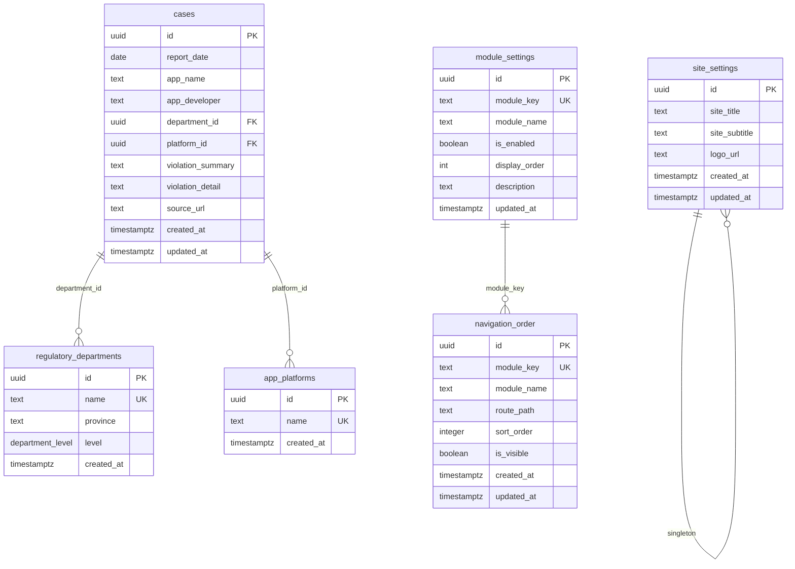

# 数据模型

<cite>
**本文档引用的文件**
- [00001_create_initial_schema.sql](file://supabase/migrations/00001_create_initial_schema.sql)
- [00004_add_department_level.sql](file://supabase/migrations/00004_add_department_level.sql)
- [00008_create_module_settings.sql](file://supabase/migrations/00008_create_module_settings.sql)
- [00014_create_site_settings_table.sql](file://supabase/migrations/00014_create_site_settings_table.sql)
- [00018_create_navigation_order_table.sql](file://supabase/migrations/00018_create_navigation_order_table.sql)
- [api.ts](file://src/db/api.ts)
- [trend-overview-rpc.sql](file://trend-overview-rpc.sql)
- [20251219000000_create_violation_analysis_rpc.sql](file://supabase/migrations/20251219000000_create_violation_analysis_rpc.sql)
</cite>

## 目录
1. [引言](#引言)
2. [核心数据表结构](#核心数据表结构)
3. [cases表详解](#cases表详解)
4. [配置表设计](#配置表设计)
5. [部门层级结构与查询](#部门层级结构与查询)
6. [实体关系图（ERD）](#实体关系图erd)
7. [数据验证与业务约束](#数据验证与业务约束)
8. [性能优化建议](#性能优化建议)

## 引言
本文档详细说明了合规通平台的核心数据模型设计。重点阐述了案例主表`cases`的结构设计、索引策略和数据生命周期管理。同时，对`module_settings`、`navigation_order`、`site_settings`等配置表的设计目的和使用场景进行了说明。文档还解释了监管部门层级结构的实现方式，并提供了实体关系图来展示主要数据表之间的关联关系。

**Section sources**
- [00001_create_initial_schema.sql](file://supabase/migrations/00001_create_initial_schema.sql#L1-L289)

## 核心数据表结构
系统的核心数据模型由多个关键表组成，包括案例主表、监管部门表、应用平台表以及多个配置表。这些表通过外键关联，形成了一个完整的监管案例数据体系。

### 案例主表 (cases)
`cases`表是系统的核心，存储了所有App违规监管案例的详细信息。

### 监管部门表 (regulatory_departments)
`regulatory_departments`表存储了国家级和省级监管部门的信息，支持按级别和省份进行查询。

### 应用平台表 (app_platforms)
`app_platforms`表记录了被通报应用所在的平台信息，如App Store、华为应用市场等。

### 配置表
系统包含多个配置表，用于管理前端模块的可见性、导航顺序和网站基本信息。

**Section sources**
- [00001_create_initial_schema.sql](file://supabase/migrations/00001_create_initial_schema.sql#L24-L138)

## cases表详解
`cases`表是系统的核心数据表，用于存储所有App违规监管案例的详细信息。

### 字段定义
| 字段名 | 类型 | 是否为空 | 说明 |
|--------|------|----------|------|
| id | uuid | 否 | 主键，自动生成 |
| report_date | date | 否 | 通报发布日期 |
| app_name | text | 否 | 被通报应用名称 |
| app_developer | text | 是 | 应用开发者/运营者 |
| department_id | uuid | 是 | 外键，引用regulatory_departments表 |
| platform_id | uuid | 是 | 外键，引用app_platforms表 |
| violation_summary | text | 是 | 违规问题摘要 |
| violation_detail | text | 是 | 详细违规内容 |
| source_url | text | 是 | 原文链接 |
| created_at | timestamptz | 否 | 创建时间，默认为当前时间 |
| updated_at | timestamptz | 否 | 更新时间，默认为当前时间 |

### 索引策略
为了优化查询性能，`cases`表创建了多个索引：
- `idx_cases_report_date`：在`report_date`字段上创建的降序索引，用于按时间范围查询案例
- `idx_cases_department_id`：在`department_id`字段上的索引，用于按监管部门查询案例
- `idx_cases_platform_id`：在`platform_id`字段上的索引，用于按应用平台查询案例

### 数据生命周期
`cases`表的数据生命周期由管理员管理，普通用户只能读取数据。通过行级安全（RLS）策略，确保只有管理员可以插入、更新或删除案例数据。

**Section sources**
- [00001_create_initial_schema.sql](file://supabase/migrations/00001_create_initial_schema.sql#L119-L138)

## 配置表设计
系统包含多个配置表，用于管理前端功能模块的显示、排序和网站基本信息。

### module_settings表
`module_settings`表用于控制前台功能模块的可见性和显示顺序。

#### 设计目的
该表允许管理员动态控制哪些功能模块对用户可见，以及它们在界面上的显示顺序。

#### 字段说明
- `module_key`：模块唯一标识符
- `module_name`：模块显示名称
- `is_enabled`：模块是否启用
- `display_order`：模块显示顺序
- `description`：模块功能描述
- `updated_at`：最后更新时间

#### 使用场景
管理员可以通过管理后台调整模块的启用状态和显示顺序，从而灵活地控制平台的功能布局。

**Section sources**
- [00008_create_module_settings.sql](file://supabase/migrations/00008_create_module_settings.sql#L1-L78)

### navigation_order表
`navigation_order`表用于管理前端导航栏模块的排序和可见性。

#### 设计目的
该表存储了导航栏模块的排序配置，使管理员能够调整模块的显示顺序和控制其可见性。

#### 字段说明
- `module_key`：模块标识
- `module_name`：模块名称
- `route_path`：路由路径
- `sort_order`：排序序号
- `is_visible`：是否可见

#### 使用场景
管理员可以通过管理界面调整导航栏的排序和可见性，而前端应用会根据此表的配置动态生成导航菜单。

**Section sources**
- [00018_create_navigation_order_table.sql](file://supabase/migrations/00018_create_navigation_order_table.sql#L1-L83)

### site_settings表
`site_settings`表用于存储网站的基本配置信息。

#### 设计目的
为系统管理员提供集中管理网站基本信息的能力，包括网站标题、副标题和Logo。

#### 字段说明
- `site_title`：网站主标题，必填，最大200字符
- `site_subtitle`：网站备用名称/简称，可选，最大100字符
- `logo_url`：Logo图片URL，可选

#### 使用场景
管理员可以在管理后台修改网站的标题、副标题和上传新的Logo，这些更改会立即反映在全站的显示中。

**Section sources**
- [00014_create_site_settings_table.sql](file://supabase/migrations/00014_create_site_settings_table.sql#L1-L146)

## 部门层级结构与查询
系统实现了监管部门的层级结构管理，支持国家级和省级部门的区分。

### 层级结构实现
监管部门的层级结构通过`regulatory_departments`表中的`level`字段实现：
- `national`：国家级部门，不关联省份
- `provincial`：省级部门，必须关联具体省份

#### 约束条件
系统通过数据库约束确保数据一致性：
- 省级部门必须有`province`值
- 国家级部门的`province`必须为NULL

#### 索引优化
为了优化查询性能，创建了以下索引：
- `idx_departments_level`：在`level`字段上的索引
- `idx_departments_level_province`：在`level`和`province`字段上的组合索引，用于按省份查询省级部门

### 递归查询方法
虽然当前设计没有使用递归查询，但系统通过以下方式实现部门数据的查询：

#### 获取国家级部门
```sql
SELECT * FROM regulatory_departments WHERE level = 'national';
```

#### 获取省级部门
```sql
SELECT * FROM regulatory_departments WHERE level = 'provincial';
```

#### 按省份获取省级部门
```sql
SELECT * FROM regulatory_departments WHERE level = 'provincial' AND province = '某省份';
```

系统还提供了获取部门统计数据的RPC函数，如`get_trend_overview`，用于分析部门的通报频次。

**Section sources**
- [00004_add_department_level.sql](file://supabase/migrations/00004_add_department_level.sql#L1-L63)
- [trend-overview-rpc.sql](file://trend-overview-rpc.sql#L1-L132)



**Diagram sources**
- [00001_create_initial_schema.sql](file://supabase/migrations/00001_create_initial_schema.sql#L24-L138)
- [00004_add_department_level.sql](file://supabase/migrations/00004_add_department_level.sql#L12-L18)
- [00008_create_module_settings.sql](file://supabase/migrations/00008_create_module_settings.sql#L7-L12)
- [00014_create_site_settings_table.sql](file://supabase/migrations/00014_create_site_settings_table.sql#L18-L22)
- [00018_create_navigation_order_table.sql](file://supabase/migrations/00018_create_navigation_order_table.sql#L7-L13)

## 数据验证与业务约束
系统通过多种机制确保数据的完整性和一致性。

### 数据验证规则
- `cases`表的`report_date`、`app_name`字段为必填
- `regulatory_departments`表的`name`字段为唯一且必填
- `site_settings`表的`site_title`字段长度不超过200字符

### 业务约束
- 省级部门必须有`province`值，国家级部门的`province`必须为NULL
- 模块设置表中的`module_key`必须唯一
- 导航排序表中的`module_key`必须唯一

### 行级安全（RLS）
系统为所有表启用了行级安全策略：
- 所有用户可读取数据
- 仅管理员可写入数据
- 通过`is_admin`函数判断用户角色

**Section sources**
- [00001_create_initial_schema.sql](file://supabase/migrations/00001_create_initial_schema.sql#L68-L75)
- [00004_add_department_level.sql](file://supabase/migrations/00004_add_department_level.sql#L24-L26)

## 性能优化建议
基于当前的数据模型设计，提出以下性能优化建议：

### 索引优化
- 为`cases`表的`report_date`字段创建降序索引，优化时间范围查询
- 为`regulatory_departments`表的`level`和`province`字段创建组合索引，优化按省份查询省级部门
- 为`module_settings`表的`is_enabled`和`display_order`字段创建索引，优化模块查询

### 查询优化
- 使用RPC函数（如`get_trend_overview`）进行复杂统计查询，减少客户端计算
- 在前端API中使用`getAvailableYears`函数获取年份列表，避免全表扫描

### 数据库函数
- 使用`extract_violation_keywords`函数在数据库层面提取违规关键词，提高分析效率
- 使用`get_high_frequency_issues`函数获取高频违规问题统计，确保数据一致性

**Section sources**
- [00001_create_initial_schema.sql](file://supabase/migrations/00001_create_initial_schema.sql#L134-L136)
- [00004_add_department_level.sql](file://supabase/migrations/00004_add_department_level.sql#L47-L52)
- [20251219000000_create_violation_analysis_rpc.sql](file://supabase/migrations/20251219000000_create_violation_analysis_rpc.sql#L1-L133)