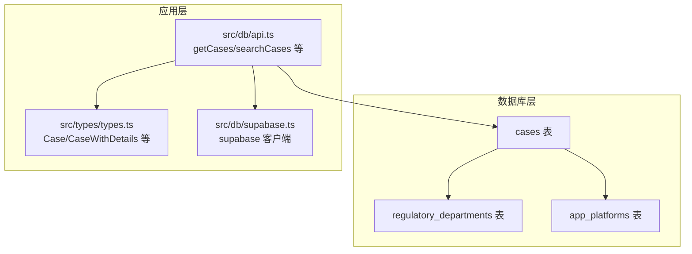
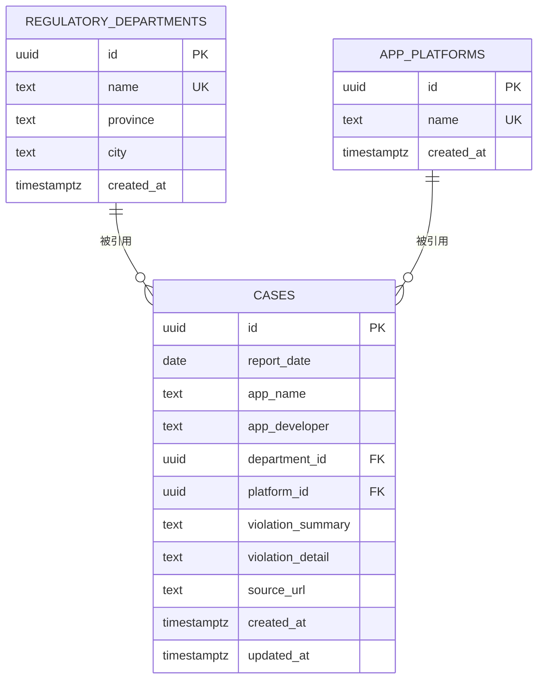
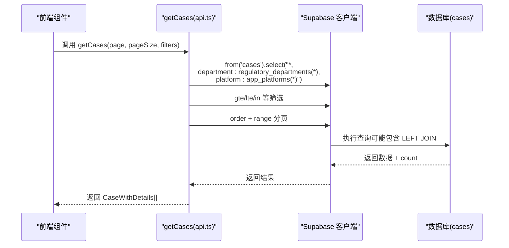
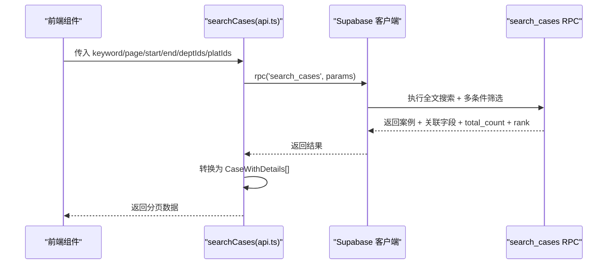
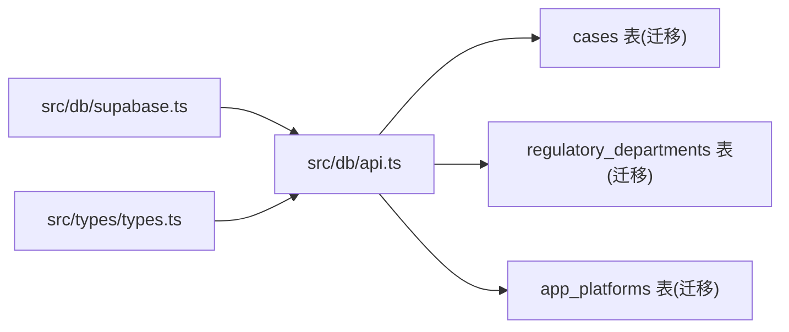

# 关系模型

<cite>
**本文引用的文件**
- [00001_create_initial_schema.sql](file://supabase/migrations/00001_create_initial_schema.sql)
- [api.ts](file://src/db/api.ts)
- [types.ts](file://src/types/types.ts)
- [supabase.ts](file://src/db/supabase.ts)
- [00015_add_fulltext_search.sql](file://supabase/migrations_archive/00015_add_fulltext_search.sql)
- [20251220100000_add_home_charts_indexes.sql](file://supabase/migrations/20251220100000_add_home_charts_indexes.sql)
- [20251219110000_fix_department_distribution.sql](file://supabase/migrations/20251219110000_fix_department_distribution.sql)
- [20251219000000_create_violation_analysis_rpc.sql](file://supabase/migrations/20251219000000_create_violation_analysis_rpc.sql)
- [README-问题修复.md](file://docs/README-问题修复.md)
</cite>

## 目录
1. [简介](#简介)
2. [项目结构](#项目结构)
3. [核心组件](#核心组件)
4. [架构总览](#架构总览)
5. [详细组件分析](#详细组件分析)
6. [依赖分析](#依赖分析)
7. [性能考量](#性能考量)
8. [故障排查指南](#故障排查指南)
9. [结论](#结论)

## 简介
本文件聚焦于案例数据关系模型，系统性阐述 cases 表与 regulatory_departments、app_platforms 等关联表之间的外键关系、引用完整性保障、数据一致性机制与查询路径。基于 Supabase 的数据库迁移与 API 层实现，解释 department_id 与 platform_id 外键的约束定义、ON DELETE 行为、索引策略与查询性能影响；并结合 getCases 查询的 select 语法（如 department:regulatory_departments(*)）说明 Supabase 的表关联与数据聚合方式，最后给出 ERD 图、典型数据访问模式与应用层补偿方案建议。

## 项目结构
- 数据库层：通过 supabase/migrations 下的 SQL 文件定义表结构、外键约束、索引与安全策略。
- 应用层：通过 src/db/api.ts 提供统一的数据访问接口，封装 Supabase 客户端调用与数据转换。
- 类型定义：src/types/types.ts 明确前端展示所需的 CaseWithDetails 等扩展类型。
- Supabase 客户端：src/db/supabase.ts 提供全局 supabase 客户端实例。

图表来源
- [00001_create_initial_schema.sql](file://supabase/migrations/00001_create_initial_schema.sql#L120-L137)
- [api.ts](file://src/db/api.ts#L511-L597)
- [types.ts](file://src/types/types.ts#L28-L95)
- [supabase.ts](file://src/db/supabase.ts#L1-L8)

章节来源
- [00001_create_initial_schema.sql](file://supabase/migrations/00001_create_initial_schema.sql#L120-L137)
- [api.ts](file://src/db/api.ts#L511-L597)
- [types.ts](file://src/types/types.ts#L28-L95)
- [supabase.ts](file://src/db/supabase.ts#L1-L8)

## 核心组件
- cases 表：存储案例主数据，包含 report_date、app_name、app_developer、department_id、platform_id 等字段。
- regulatory_departments 表：存储监管部门元数据，包含 name、province、city 等字段。
- app_platforms 表：存储应用平台元数据，包含 name 字段。
- 外键约束：cases.department_id 引用 regulatory_departments(id)，cases.platform_id 引用 app_platforms(id)。
- ON DELETE 行为：外键定义为 ON DELETE SET NULL，避免级联删除破坏数据完整性。
- 索引：cases 上针对 report_date、department_id、platform_id 的索引，以及额外的复合索引以优化查询。
- 查询接口：getCases 使用 Supabase 的 select 语法进行关联查询；searchCases 通过 RPC 函数实现全文搜索与多条件筛选。

章节来源
- [00001_create_initial_schema.sql](file://supabase/migrations/00001_create_initial_schema.sql#L120-L137)
- [20251220100000_add_home_charts_indexes.sql](file://supabase/migrations/20251220100000_add_home_charts_indexes.sql#L1-L3)
- [api.ts](file://src/db/api.ts#L511-L597)
- [00015_add_fulltext_search.sql](file://supabase/migrations_archive/00015_add_fulltext_search.sql#L80-L198)

## 架构总览
下图展示三张核心表之间的实体关系与一对多语义（以部门与平台为参照，案例为被参照方）：

图表来源
- [00001_create_initial_schema.sql](file://supabase/migrations/00001_create_initial_schema.sql#L100-L137)

## 详细组件分析

### 外键关系与引用完整性
- 外键定义
  - cases.department_id 引用 regulatory_departments(id)，ON DELETE SET NULL
  - cases.platform_id 引用 app_platforms(id)，ON DELETE SET NULL
- 引用完整性保障
  - 通过外键约束确保 cases 中的 department_id、platform_id 必须存在于对应表中。
  - ON DELETE SET NULL 意味着当删除监管机构或平台时，其关联的案例不会被级联删除，而是将对应字段置空，从而保持数据完整性与历史可追溯性。
- 级联更新/删除策略现状
  - 当前未定义 ON UPDATE/CASCADE，因此在上游表主键变更时不会自动同步下游案例记录。
  - 若上游表被删除，案例记录仍保留，仅关联字段为空。

章节来源
- [00001_create_initial_schema.sql](file://supabase/migrations/00001_create_initial_schema.sql#L120-L137)

### 索引与查询性能
- 索引策略
  - 单列索引：cases.report_date、cases.department_id、cases.platform_id
  - 复合索引：cases(department_id, report_date)、cases(platform_id, report_date)
- 性能影响
  - 日期范围查询、按部门/平台过滤、以及按通报日期排序的查询将受益于这些索引。
  - 复合索引可显著降低涉及部门/平台与日期的联结查询成本。

章节来源
- [20251220100000_add_home_charts_indexes.sql](file://supabase/migrations/20251220100000_add_home_charts_indexes.sql#L1-L3)

### Supabase 查询与表关联（getCases）
- getCases 的 select 语法
  - 使用 select("*, department:regulatory_departments(*), platform:app_platforms(*)") 实现“关联查询”，将关联表的全部字段作为嵌套对象返回。
  - 该语法在 Supabase 中会生成类似 LEFT JOIN 的效果，并将关联表字段以别名形式注入到结果集中。
- 查询流程
  - 构造基础查询：from('cases').select(...)
  - 应用筛选：gte/lte、in 等条件
  - 排序与分页：order + range
  - 返回：包含 count 的分页结果
- 性能影响
  - 关联查询会增加网络往返与序列化开销；建议仅在必要时展开关联字段。
  - 对于高频列表页，可考虑使用 RPC 或预聚合视图减少关联成本。

图表来源
- [api.ts](file://src/db/api.ts#L511-L597)

章节来源
- [api.ts](file://src/db/api.ts#L511-L597)

### 全文搜索与多条件筛选（searchCases）
- RPC 函数 search_cases
  - 支持关键词搜索（全文 + 模糊），日期范围、部门 ID、平台 ID 多条件筛选。
  - 返回字段包含案例字段与关联表字段（部门名称、省/市、平台名称），并计算相关性得分。
- 数据库层实现要点
  - cases 表新增 search_vector 列，建立 GIN 索引，触发器自动维护。
  - RPC 函数中对 report_date 进行 date 类型转换，避免类型不匹配。
- 前端调用与数据转换
  - 前端通过 supabase.rpc('search_cases', ...) 调用，再将返回数据映射为 CaseWithDetails 结构。

图表来源
- [api.ts](file://src/db/api.ts#L421-L508)
- [00015_add_fulltext_search.sql](file://supabase/migrations_archive/00015_add_fulltext_search.sql#L80-L198)
- [README-问题修复.md](file://docs/README-问题修复.md#L1-L120)

章节来源
- [api.ts](file://src/db/api.ts#L421-L508)
- [00015_add_fulltext_search.sql](file://supabase/migrations_archive/00015_add_fulltext_search.sql#L80-L198)
- [README-问题修复.md](file://docs/README-问题修复.md#L1-L120)

### 典型数据访问模式
- 通过部门名称获取所属案例列表
  - 方法一：先查询部门 ID，再以 department_id 过滤 cases
  - 方法二：使用 RPC search_cases，关键词包含部门名称，利用模糊匹配与相关性排序
- 通过平台名称获取所属案例列表
  - 同上，使用 platform 名称作为关键词或直接以 platform_id 过滤
- 组合筛选
  - 同时按日期范围、部门集合、平台集合进行筛选，结合分页与排序

章节来源
- [api.ts](file://src/db/api.ts#L511-L597)
- [api.ts](file://src/db/api.ts#L421-L508)

### 级联更新/删除策略缺失的风险与应用层补偿
- 风险
  - 未定义 ON UPDATE/CASCADE：上游主键变更不会同步至下游案例，可能导致数据不一致。
  - 未定义 ON DELETE CASCADE：删除上游记录不会清理下游数据，可能产生“悬挂引用”。
- 应用层补偿方案
  - 删除上游记录前，先扫描并更新/清空 cases 中对应的 department_id/platform_id（置空或迁移至替代值），再执行删除。
  - 在业务入口处增加校验：禁止删除仍有案例引用的部门/平台，或提供“迁移/归档”流程。
  - 定期审计：通过 SQL 统计 orphaned 案例（department_id 或 platform_id 非空但上游不存在）并修复。

章节来源
- [00001_create_initial_schema.sql](file://supabase/migrations/00001_create_initial_schema.sql#L120-L137)

## 依赖分析
- 组件耦合
  - api.ts 依赖 supabase.ts 提供的客户端实例。
  - api.ts 依赖 types.ts 的类型定义，保证前后端数据结构一致。
  - 数据库层通过迁移文件定义表结构、外键与索引，直接影响查询性能与一致性。
- 外部依赖
  - Supabase JS 客户端负责与数据库通信。
  - PostgreSQL 全文检索能力（中文分词）由迁移文件中的触发器与索引提供。

图表来源
- [supabase.ts](file://src/db/supabase.ts#L1-L8)
- [api.ts](file://src/db/api.ts#L511-L597)
- [types.ts](file://src/types/types.ts#L28-L95)
- [00001_create_initial_schema.sql](file://supabase/migrations/00001_create_initial_schema.sql#L100-L137)

章节来源
- [supabase.ts](file://src/db/supabase.ts#L1-L8)
- [api.ts](file://src/db/api.ts#L511-L597)
- [types.ts](file://src/types/types.ts#L28-L95)
- [00001_create_initial_schema.sql](file://supabase/migrations/00001_create_initial_schema.sql#L100-L137)

## 性能考量
- 索引优先
  - 为高频查询字段（report_date、department_id、platform_id）建立单列与复合索引。
  - 使用 GIN 索引加速全文搜索，配合触发器自动维护 search_vector。
- 查询优化
  - 列表页尽量避免不必要的关联展开；仅在详情页或需要展示关联字段时使用 select 关联语法。
  - 使用 RPC 函数集中处理复杂筛选与排序，减少前端多次请求。
- 数据一致性与冗余
  - 通过 ON DELETE SET NULL 保持历史数据完整；若需更强约束，可在应用层增加校验与补偿流程。

[本节为通用性能指导，不直接分析具体文件]

## 故障排查指南
- 案例查询失败（字段名/类型不匹配）
  - 现象：RPC 函数中字段名错误（如 d.location）与类型不匹配（report_date 类型不一致）导致查询报错。
  - 修复：将 d.location 改为 d.province，修正 report_date 类型与日期转换。
  - 验证：在数据库层执行函数测试，确认返回字段与类型正确；前端调用成功。
- 全文搜索性能问题
  - 检查是否已创建 search_vector 列与 GIN 索引。
  - 确认触发器已启用并维护 search_vector。
- 分页与排序异常
  - 确认 RPC 函数的排序逻辑与前端传参一致。
  - 检查索引是否覆盖常用筛选组合。

章节来源
- [README-问题修复.md](file://docs/README-问题修复.md#L1-L120)
- [00015_add_fulltext_search.sql](file://supabase/migrations_archive/00015_add_fulltext_search.sql#L80-L198)

## 结论
本关系模型以 cases 为核心，通过 regulatory_departments 与 app_platforms 提供监管与平台维度的元数据支撑。外键约束与 ON DELETE SET NULL 确保删除上游记录时不会破坏下游数据完整性；索引策略与 RPC 函数共同保障查询性能与功能完备性。建议在应用层补充删除前的补偿流程与定期审计，以应对未定义的级联更新/删除策略带来的潜在风险。