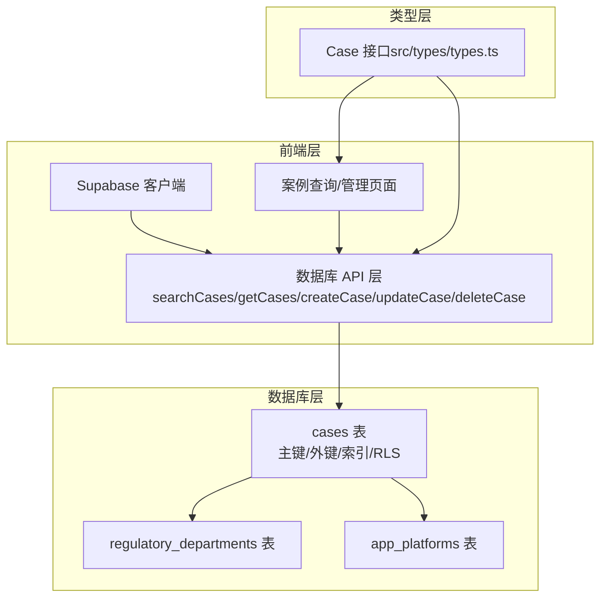
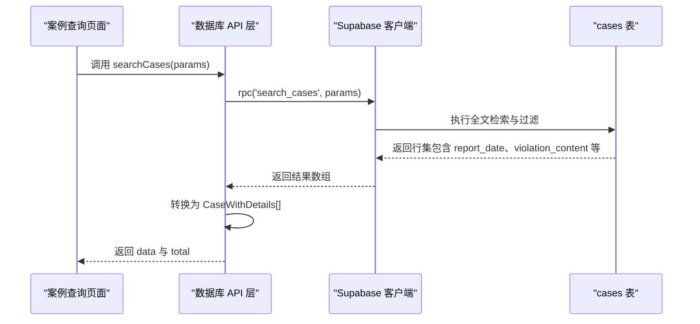

# 字段定义

<cite>
**本文引用的文件**
- [cases 表初始化脚本](file://supabase/migrations/00001_create_initial_schema.sql)
- [违规内容字段合并脚本](file://supabase/migrations/00007_merge_violation_fields.sql)
- [Supabase 客户端配置](file://src/db/supabase.ts)
- [数据库 API 层（含案例查询与 CRUD）](file://src/db/api.ts)
- [案例查询页面（前端展示与截断逻辑）](file://src/pages/CasesPage.tsx)
- [案例管理页面（表单与导入）](file://src/pages/admin/CaseManagePage.tsx)
- [TypeScript 类型定义（Case 接口）](file://src/types/types.ts)
- [数据完整性测试（部门关联检查）](file://test-data-integrity.ts)
- [案例查询失败问题修复报告](file://docs/问题修复报告.md)
- [修复验证清单（字段类型与 RPC 函数）](file://docs/修复验证清单.md)
- [字符限制快速参考（字段截断与长度）](file://docs/#U5b57#U7b26#U9650#U5236#U5feb#U901f#U53c2#U8003.md)
</cite>

## 目录
1. [简介](#简介)
2. [项目结构与数据流概览](#项目结构与数据流概览)
3. [核心字段定义与业务含义](#核心字段定义与业务含义)
4. [时间戳字段 created_at 与 updated_at 的机制与作用](#时间戳字段-created_at-与-updated_at-的机制与作用)
5. [TypeScript 类型与数据库字段映射](#typescript-类型与数据库字段映射)
6. [Supabase 查询返回的字段结构示例路径](#supabase-查询返回的字段结构示例路径)
7. [字段命名规范与前后端一致性](#字段命名规范与前后端一致性)
8. [数据质量与最佳实践（空值、长度限制等）](#数据质量与最佳实践空值长度限制等)
9. [依赖关系与架构图](#依赖关系与架构图)
10. [结论](#结论)

## 简介
本文件围绕 cases 表的字段进行系统化梳理，重点覆盖 report_date、app_name、violation_content、department_id、platform_id 等核心字段的定义、约束、业务含义与使用场景；同时解释 created_at、updated_at 时间戳的自动生成机制及其在业务逻辑中的作用；结合 src/types/types.ts 中的 Case 接口，明确前后端字段映射关系；最后提供 Supabase 查询返回字段结构的示例路径与字段命名规范建议，并给出数据质量最佳实践。

## 项目结构与数据流概览
- 数据库层：cases 表由初始化脚本创建，包含主键、外键、索引与 RLS 策略；违规内容字段在迁移脚本中由两列合并为一列。
- 前端层：通过 Supabase 客户端在 src/db/api.ts 中封装查询与 CRUD；页面组件在 src/pages 下消费这些 API。
- 类型层：src/types/types.ts 定义 Case 接口，作为前后端一致性的契约。

图表来源
- [cases 表初始化脚本](file://supabase/migrations/00001_create_initial_schema.sql#L120-L139)
- [Supabase 客户端配置](file://src/db/supabase.ts#L1-L8)
- [数据库 API 层（含案例查询与 CRUD）](file://src/db/api.ts#L404-L725)
- [TypeScript 类型定义（Case 接口）](file://src/types/types.ts#L28-L39)

章节来源
- [cases 表初始化脚本](file://supabase/migrations/00001_create_initial_schema.sql#L120-L139)
- [Supabase 客户端配置](file://src/db/supabase.ts#L1-L8)
- [数据库 API 层（含案例查询与 CRUD）](file://src/db/api.ts#L404-L725)
- [TypeScript 类型定义（Case 接口）](file://src/types/types.ts#L28-L39)

## 核心字段定义与业务含义
以下字段均来自 cases 表的定义与迁移脚本，业务含义以仓库文档与代码注释为准。

- report_date（通报发布日期）
  - 数据类型：date（数据库层）
  - 约束：非空
  - 业务含义：案例对应的监管通报发布日期，用于统计“按日通报频次”等指标。
  - 使用场景：前端筛选、统计报表、全文搜索过滤。
  - 注意：RPC 函数曾因字段类型不匹配导致报错，现已修复为 date 类型。

- app_name（被通报应用名称）
  - 数据类型：text（数据库层）
  - 约束：非空
  - 业务含义：被通报的应用名称，用于去重统计“应用数量”。
  - 使用场景：列表展示、搜索、统计。

- violation_content（主要违规内容）
  - 数据类型：text（数据库层）
  - 约束：允许空值
  - 业务含义：由违规摘要与详细内容合并而来，统一为“主要违规内容”，便于检索与展示。
  - 使用场景：全文检索、列表展示（前端对长度进行截断与 Tooltip 展示）。

- department_id（监管部门 ID）
  - 数据类型：uuid（数据库层）
  - 约束：外键引用 regulatory_departments(id)，删除时置空
  - 业务含义：关联到监管机构，支持按部门统计与筛选。
  - 使用场景：筛选、统计、详情页关联展示。

- platform_id（应用平台 ID）
  - 数据类型：uuid（数据库层）
  - 约束：外键引用 app_platforms(id)，删除时置空
  - 业务含义：关联到应用平台（如 App Store、华为应用市场等），支持按平台统计与筛选。
  - 使用场景：筛选、统计、详情页关联展示。

- app_developer（应用开发者/运营者）
  - 数据类型：text（数据库层）
  - 约束：允许空值
  - 业务含义：可选字段，用于补充开发者或运营者信息。
  - 使用场景：列表展示、搜索。

- source_url（原文链接）
  - 数据类型：text（数据库层）
  - 约束：允许空值
  - 业务含义：指向原始通报的链接，便于溯源。
  - 使用场景：详情页展示、跳转。

章节来源
- [cases 表初始化脚本](file://supabase/migrations/00001_create_initial_schema.sql#L120-L132)
- [违规内容字段合并脚本](file://supabase/migrations/00007_merge_violation_fields.sql#L1-L41)
- [案例查询失败问题修复报告](file://docs/问题修复报告.md#L21-L74)
- [修复验证清单（字段类型与 RPC 函数）](file://docs/修复验证清单.md#L44-L58)

## 时间戳字段 created_at 与 updated_at 的机制与作用
- created_at
  - 数据类型：timestamptz（数据库层，默认 now()）
  - 自动生成：插入时自动写入当前时间。
  - 业务作用：记录案例首次入库时间，用于排序、审计与统计。

- updated_at
  - 数据类型：timestamptz（数据库层，默认 now()）
  - 自动生成：插入与更新时均会更新。
  - 业务作用：记录最近一次变更时间，用于排序、审计与缓存失效判断。

- 前端更新逻辑
  - 在更新案例时，前端显式传入 updated_at 以确保数据库触发器或应用层更新生效（参见 API 层更新函数）。

章节来源
- [cases 表初始化脚本](file://supabase/migrations/00001_create_initial_schema.sql#L120-L132)
- [数据库 API 层（含案例查询与 CRUD）](file://src/db/api.ts#L609-L617)

## TypeScript 类型与数据库字段映射
- Case 接口字段与数据库字段一一对应，类型均为字符串（ISO 8601 字符串），便于前端统一处理。
- 关键映射关系：
  - report_date ↔ report_date
  - app_name ↔ app_name
  - violation_content ↔ violation_content
  - department_id ↔ department_id
  - platform_id ↔ platform_id
  - app_developer ↔ app_developer
  - source_url ↔ source_url
  - created_at ↔ created_at
  - updated_at ↔ updated_at

章节来源
- [TypeScript 类型定义（Case 接口）](file://src/types/types.ts#L28-L39)

## Supabase 查询返回的字段结构示例路径
- 搜索案例（全文检索）返回字段结构示例路径：
  - [searchCases 返回字段结构与转换逻辑](file://src/db/api.ts#L421-L508)
  - [searchCases 参数与 RPC 调用](file://src/db/api.ts#L425-L444)
- 分页查询（带关联表）返回字段结构示例路径：
  - [getCases 查询与关联字段选择](file://src/db/api.ts#L511-L554)
- 单条案例详情返回字段结构示例路径：
  - [getCaseById 查询与关联字段选择](file://src/db/api.ts#L584-L597)

章节来源
- [数据库 API 层（含案例查询与 CRUD）](file://src/db/api.ts#L421-L597)

## 字段命名规范与前后端一致性
- 命名规范
  - 数据库层：采用 snake_case（如 report_date、department_id、violation_content）。
  - 前端类型层：采用 camelCase（如 reportDate、departmentId、violationContent）。
  - 前端 API 返回：统一为 camelCase（Case 接口字段）。
- 前后端一致性
  - API 返回字段与 Case 接口严格一致，避免额外转换。
  - 页面展示层（如 CasesPage.tsx）对字段进行截断与 Tooltip 展示，不改变字段名与类型。

章节来源
- [TypeScript 类型定义（Case 接口）](file://src/types/types.ts#L28-L39)
- [案例查询页面（前端展示与截断逻辑）](file://src/pages/CasesPage.tsx#L1-L200)

## 数据质量与最佳实践（空值、长度限制等）
- 空值处理
  - report_date、app_name 为非空字段，必须保证导入与提交时必填。
  - violation_content、department_id、platform_id、app_developer、source_url 允许空值，前端展示应兼容空值（如显示占位符）。
  - 数据完整性测试建议：检查 cases 与 regulatory_departments 的关联完整性，避免统计偏差。

- 字符长度限制
  - 前端对多字段进行截断与 Tooltip 展示，统一提升可读性与表格布局一致性。
  - 典型限制：
    - 应用名称、开发者/运营者、监管部门、应用平台：25 字符
    - 主要违规内容：20 字符（更紧凑的列宽）
  - 实施位置：
    - [案例查询页面的截断与 Tooltip 逻辑](file://src/pages/CasesPage.tsx#L1-L200)
    - [字符限制快速参考文档](file://docs/#U5b57#U7b26#U9650#U5236#U5feb#U901f#U53c2#U8003.md#L1-L174)

- 数据验证与清洗
  - 违规内容标准化：提供关键词映射与合规性校验，减少不一致表述。
  - 参考：
    - [合规性规则库（关键词映射与校验）](file://src/db/compliance_rules.ts#L1-L112)

- 导入与去重
  - 导入流程包含数据验证与去重逻辑，保留最新数据并删除重复旧数据。
  - 参考：
    - [智能导入与去重实现](file://src/db/api.ts#L666-L725)

- 时间字段类型一致性
  - RPC 函数曾因 report_date 类型不匹配导致错误，现已修正为 date 类型。
  - 参考：
    - [案例查询失败问题修复报告](file://docs/问题修复报告.md#L21-L74)
    - [修复验证清单（字段类型验证）](file://docs/修复验证清单.md#L44-L58)

章节来源
- [数据完整性测试（部门关联检查）](file://test-data-integrity.ts#L1-L26)
- [案例查询页面（前端展示与截断逻辑）](file://src/pages/CasesPage.tsx#L1-L200)
- [字符限制快速参考（字段截断与长度）](file://docs/#U5b57#U7b26#U9650#U5236#U5feb#U901f#U53c2#U8003.md#L1-L174)
- [合规性规则库（关键词映射与校验）](file://src/db/compliance_rules.ts#L1-L112)
- [数据库 API 层（含案例查询与 CRUD）](file://src/db/api.ts#L666-L725)
- [案例查询失败问题修复报告](file://docs/问题修复报告.md#L21-L74)
- [修复验证清单（字段类型与 RPC 函数）](file://docs/修复验证清单.md#L44-L58)

## 依赖关系与架构图
- 数据库层依赖
  - cases 表依赖 regulatory_departments 与 app_platforms 的外键关系。
  - 违规内容字段由迁移脚本合并，确保历史数据不丢失。
- 前端依赖
  - 页面组件依赖 API 层提供的查询与 CRUD 方法。
  - 类型层为前后端契约，确保字段名与类型一致。
- 错误与修复
  - RPC 函数曾因字段名与类型不匹配导致运行时错误，现已修复并通过验证清单确认。

图表来源
- [数据库 API 层（含案例查询与 CRUD）](file://src/db/api.ts#L421-L508)
- [Supabase 客户端配置](file://src/db/supabase.ts#L1-L8)

章节来源
- [数据库 API 层（含案例查询与 CRUD）](file://src/db/api.ts#L421-L508)
- [Supabase 客户端配置](file://src/db/supabase.ts#L1-L8)

## 结论
- cases 表的核心字段与约束清晰，report_date、app_name、violation_content、department_id、platform_id 是业务分析与检索的关键。
- created_at 与 updated_at 由数据库默认值自动维护，前端在更新时也显式更新 updated_at，确保一致性。
- 前后端通过 Case 接口实现字段级契约，避免额外转换成本。
- 前端对违规内容等长文本字段进行截断与 Tooltip 展示，兼顾可读性与可用性。
- 导入与去重流程保障数据质量，RPC 函数类型修正避免了运行时错误。
- 建议持续关注字段长度与展示策略的一致性，以及外键关联完整性，确保统计与分析准确可靠。