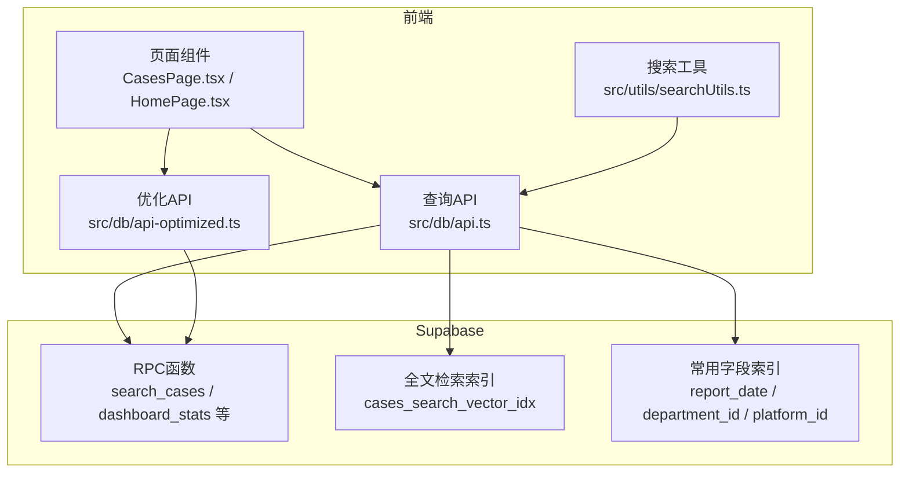
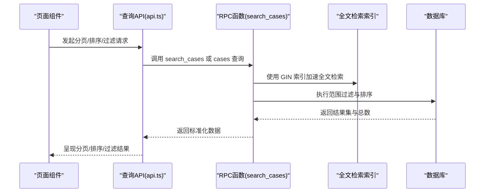
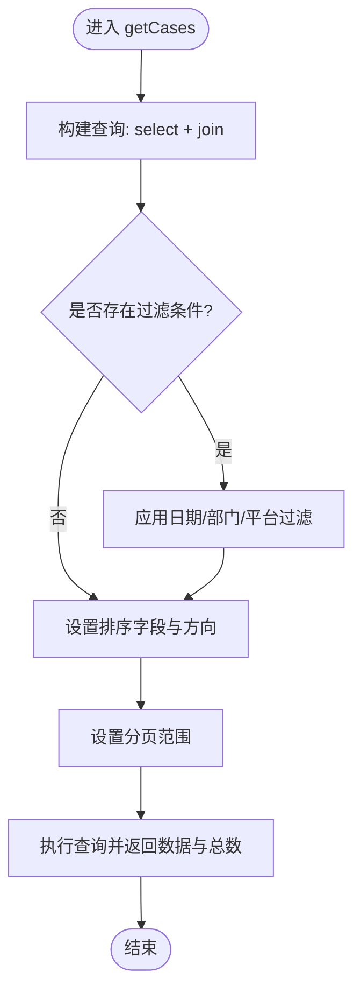
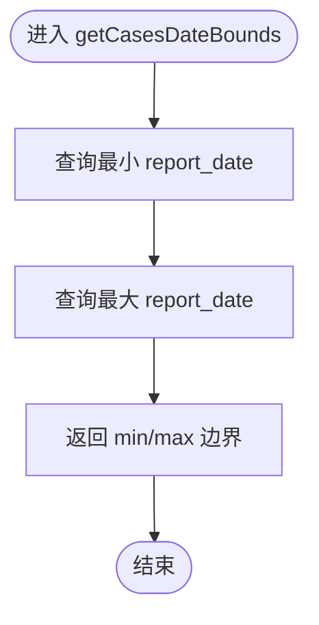
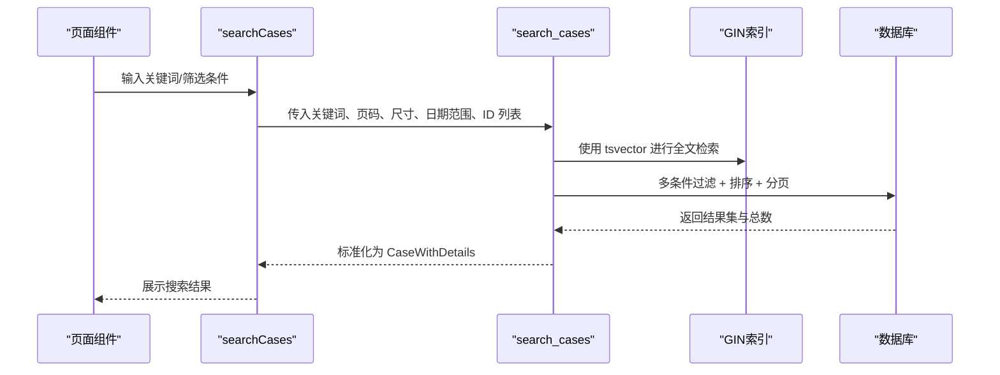
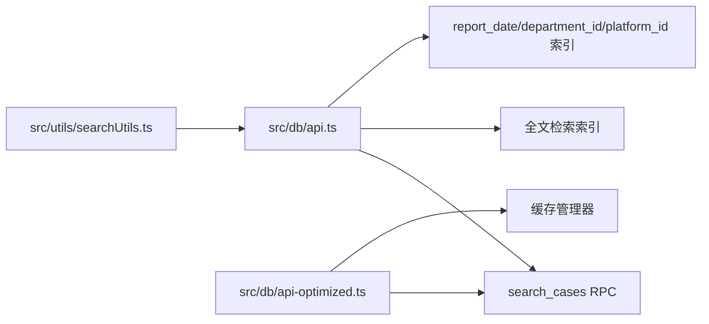

# 查询优化

<cite>
**本文引用的文件**
- [src/db/api.ts](file://src/db/api.ts)
- [src/db/api-optimized.ts](file://src/db/api-optimized.ts)
- [src/utils/searchUtils.ts](file://src/utils/searchUtils.ts)
- [supabase/migrations/00015_add_fulltext_search.sql](file://supabase/migrations/00015_add_fulltext_search.sql)
- [supabase/migrations/00017_add_application_count_to_cases.sql](file://supabase/migrations/00017_add_application_count_to_cases.sql)
- [supabase/migrations/20251220100000_add_home_charts_indexes.sql](file://supabase/migrations/20251220100000_add_home_charts_indexes.sql)
- [supabase/migrations/20251230120000_add_dashboard_stats_rpc.sql](file://supabase/migrations/20251230120000_add_dashboard_stats_rpc.sql)
- [test-data-integrity.ts](file://test-data-integrity.ts)
- [docs/关键词检索优化技术方案.md](file://docs/关键词检索优化技术方案.md)
- [docs/首页性能优化说明.md](file://docs/首页性能优化说明.md)
- [docs/性能优化快速参考.md](file://docs/性能优化快速参考.md)
</cite>

## 目录
1. [简介](#简介)
2. [项目结构](#项目结构)
3. [核心组件](#核心组件)
4. [架构总览](#架构总览)
5. [详细组件分析](#详细组件分析)
6. [依赖关系分析](#依赖关系分析)
7. [性能考量](#性能考量)
8. [故障排查指南](#故障排查指南)
9. [结论](#结论)
10. [附录](#附录)

## 简介
本文件围绕案例数据模型的查询优化展开，系统总结高频查询模式（分页、排序、范围过滤、全文检索）的性能优化策略。以 api.ts 中的 getCases、getCasesDateBounds 等函数为切入点，结合 Supabase 的全文检索与 RPC 函数能力，给出索引设计、查询执行计划优化、N+1 与空值关联规避、以及性能监控与慢查询分析方法，帮助开发者持续优化查询性能。

## 项目结构
- 前端查询接口集中在 src/db/api.ts，提供分页、排序、范围过滤、全文检索等能力；同时提供优化版 API（src/db/api-optimized.ts）通过 RPC 与缓存降低请求与计算成本。
- 全文检索与索引由 supabase/migrations/00015_add_fulltext_search.sql 定义；首页统计 RPC 与索引由 00017、20251220100000、20251230120000 等迁移文件负责。
- 数据完整性检查由 test-data-integrity.ts 提供，有助于定位空值关联与统计偏差问题。



**图示来源**
- [src/db/api.ts](file://src/db/api.ts#L511-L582)
- [src/db/api-optimized.ts](file://src/db/api-optimized.ts#L57-L112)
- [supabase/migrations/00015_add_fulltext_search.sql](file://supabase/migrations/00015_add_fulltext_search.sql#L1-L47)
- [supabase/migrations/20251220100000_add_home_charts_indexes.sql](file://supabase/migrations/20251220100000_add_home_charts_indexes.sql#L1-L4)

**章节来源**
- [src/db/api.ts](file://src/db/api.ts#L511-L582)
- [src/db/api-optimized.ts](file://src/db/api-optimized.ts#L57-L112)
- [supabase/migrations/00015_add_fulltext_search.sql](file://supabase/migrations/00015_add_fulltext_search.sql#L1-L47)
- [supabase/migrations/20251220100000_add_home_charts_indexes.sql](file://supabase/migrations/20251220100000_add_home_charts_indexes.sql#L1-L4)

## 核心组件
- 分页与排序查询：getCases 支持按 report_date 等字段排序与分页，结合范围过滤（report_date、department_id、platform_id）。
- 日期边界查询：getCasesDateBounds 通过最小/最大 report_date 快速获取时间范围。
- 全文检索：searchCases 通过 RPC 函数 search_cases 实现中文分词、权重排序与多条件过滤。
- 优化版 API：api-optimized.ts 使用 RPC 与缓存，减少请求次数与前端计算。
- 搜索工具：searchUtils.ts 提供关键词预处理、同义词建议、防抖等辅助能力。

**章节来源**
- [src/db/api.ts](file://src/db/api.ts#L511-L582)
- [src/db/api.ts](file://src/db/api.ts#L406-L508)
- [src/db/api-optimized.ts](file://src/db/api-optimized.ts#L57-L112)
- [src/utils/searchUtils.ts](file://src/utils/searchUtils.ts#L1-L128)

## 架构总览
下图展示了“页面组件 → 查询API → RPC函数/索引”的调用链路与优化点。



**图示来源**
- [src/db/api.ts](file://src/db/api.ts#L406-L508)
- [src/db/api.ts](file://src/db/api.ts#L511-L582)
- [supabase/migrations/00015_add_fulltext_search.sql](file://supabase/migrations/00015_add_fulltext_search.sql#L1-L47)

## 详细组件分析

### 组件A：分页查询与范围过滤（getCases）
- 查询要点
  - 分页：使用 range(from, to) 实现高效分页。
  - 排序：order(sortBy, { ascending }) 支持按 report_date 等字段排序。
  - 过滤：gte/lte（report_date）、in（department_id、platform_id）。
- 执行计划优化建议
  - 为 report_date、department_id、platform_id 建立单列索引与复合索引，覆盖常见过滤组合。
  - 若排序字段与过滤字段一致，优先使用复合索引以避免额外排序开销。
- N+1 与空值关联规避
  - 通过 join 查询一次性拉取关联部门与平台信息，避免逐条查询。
  - 在统计类查询中，若出现空值关联，需在统计逻辑中显式过滤或标注。



**图示来源**
- [src/db/api.ts](file://src/db/api.ts#L511-L554)

**章节来源**
- [src/db/api.ts](file://src/db/api.ts#L511-L554)

### 组件B：日期边界查询（getCasesDateBounds）
- 查询要点
  - 分别查询最小/最大 report_date，用于时间选择器与范围校验。
- 执行计划优化建议
  - 为 report_date 建立索引，避免全表扫描。
  - 若频繁查询边界，可考虑缓存最近边界值。



**图示来源**
- [src/db/api.ts](file://src/db/api.ts#L556-L582)

**章节来源**
- [src/db/api.ts](file://src/db/api.ts#L556-L582)

### 组件C：全文检索（searchCases）
- 查询要点
  - 通过 RPC 函数 search_cases 实现中文分词、权重排序、相关性排序与分页。
  - 支持关键词、日期范围、部门/平台 ID 列表等多条件过滤。
- 执行计划优化建议
  - 使用 GIN 索引加速 tsvector 全文检索。
  - 为 report_date、department_id、platform_id 建立索引，提升多条件过滤性能。
- 优化策略
  - 前端对关键词进行预处理与防抖，减少无效请求。
  - 使用 searchUtils.ts 的同义词建议提升召回。



**图示来源**
- [src/db/api.ts](file://src/db/api.ts#L406-L508)
- [supabase/migrations/00015_add_fulltext_search.sql](file://supabase/migrations/00015_add_fulltext_search.sql#L1-L47)
- [src/utils/searchUtils.ts](file://src/utils/searchUtils.ts#L1-L128)

**章节来源**
- [src/db/api.ts](file://src/db/api.ts#L406-L508)
- [src/utils/searchUtils.ts](file://src/utils/searchUtils.ts#L1-L128)
- [supabase/migrations/00015_add_fulltext_search.sql](file://supabase/migrations/00015_add_fulltext_search.sql#L1-L47)

### 组件D：优化版 API（api-optimized.ts）
- 查询要点
  - 使用 RPC 函数统一后端统计口径，减少前端计算。
  - 内置缓存管理器，降低重复请求与数据库压力。
- 优化策略
  - 将多个图表数据聚合为一次 RPC 调用，减少并发与往返。
  - 采用 5 分钟缓存窗口，平衡实时性与性能。

```mermaid
sequenceDiagram
participant UI as "页面组件"
participant Opt as "优化版API"
participant RPC as "RPC函数"
participant Cache as "缓存管理器"
UI->>Opt : 请求首页统计/趋势/分布
Opt->>Cache : 读取缓存
alt 命中缓存
Cache-->>Opt : 返回缓存数据
else 未命中缓存
Opt->>RPC : 调用后端统计RPC
RPC-->>Opt : 返回聚合数据
Opt->>Cache : 写入缓存
end
Opt-->>UI : 返回数据
```

**图示来源**
- [src/db/api-optimized.ts](file://src/db/api-optimized.ts#L57-L112)
- [src/db/api-optimized.ts](file://src/db/api-optimized.ts#L221-L256)

**章节来源**
- [src/db/api-optimized.ts](file://src/db/api-optimized.ts#L57-L112)
- [src/db/api-optimized.ts](file://src/db/api-optimized.ts#L221-L256)

## 依赖关系分析
- 查询 API 依赖 Supabase RPC 与索引：
  - searchCases 依赖 search_cases RPC 与 GIN 索引。
  - getCases 依赖 report_date、department_id、platform_id 索引。
- 优化版 API 依赖 RPC 函数与缓存管理器。
- 搜索工具依赖前端 UI 与查询 API。



**图示来源**
- [src/db/api.ts](file://src/db/api.ts#L406-L508)
- [src/db/api.ts](file://src/db/api.ts#L511-L582)
- [src/db/api-optimized.ts](file://src/db/api-optimized.ts#L57-L112)
- [src/utils/searchUtils.ts](file://src/utils/searchUtils.ts#L1-L128)
- [supabase/migrations/00015_add_fulltext_search.sql](file://supabase/migrations/00015_add_fulltext_search.sql#L1-L47)
- [supabase/migrations/20251220100000_add_home_charts_indexes.sql](file://supabase/migrations/20251220100000_add_home_charts_indexes.sql#L1-L4)

**章节来源**
- [src/db/api.ts](file://src/db/api.ts#L406-L508)
- [src/db/api.ts](file://src/db/api.ts#L511-L582)
- [src/db/api-optimized.ts](file://src/db/api-optimized.ts#L57-L112)
- [src/utils/searchUtils.ts](file://src/utils/searchUtils.ts#L1-L128)
- [supabase/migrations/00015_add_fulltext_search.sql](file://supabase/migrations/00015_add_fulltext_search.sql#L1-L47)
- [supabase/migrations/20251220100000_add_home_charts_indexes.sql](file://supabase/migrations/20251220100000_add_home_charts_indexes.sql#L1-L4)

## 性能考量

### 索引设计与必要性
- report_date
  - 必要性：范围过滤与排序最频繁，建立单列索引可显著降低扫描成本。
  - 建议：同时考虑复合索引（department_id, report_date DESC）与（platform_id, report_date DESC），覆盖常见过滤+排序组合。
- department_id
  - 必要性：多处过滤与 join 使用，建立索引可避免全表扫描与临时排序。
- platform_id
  - 必要性：与 department_id 类似，建立索引提升过滤与 join 性能。
- 全文检索
  - 必要性：search_cases 使用 tsvector 与 GIN 索引，提升中文分词与相关性排序性能。
  - 建议：结合 report_date、department_id、platform_id 的复合索引，减少回表与排序。

**章节来源**
- [supabase/migrations/00015_add_fulltext_search.sql](file://supabase/migrations/00015_add_fulltext_search.sql#L1-L47)
- [supabase/migrations/20251220100000_add_home_charts_indexes.sql](file://supabase/migrations/20251220100000_add_home_charts_indexes.sql#L1-L4)
- [docs/关键词检索优化技术方案.md](file://docs/关键词检索优化技术方案.md#L448-L479)

### 查询执行计划优化
- 分页与排序
  - 使用 range(from, to) 与 order 排序，避免一次性加载全部数据。
  - 对排序字段建立索引，减少排序开销。
- 范围过滤
  - 使用 gte/lte 与 in，配合索引，避免隐式转换导致的索引失效。
- 全文检索
  - 使用 GIN 索引与 tsvector，结合权重排序，减少回表与二次排序。
- 统计与聚合
  - 使用 RPC 函数在数据库侧完成聚合，前端仅做展示，降低网络与计算成本。

**章节来源**
- [src/db/api.ts](file://src/db/api.ts#L511-L554)
- [src/db/api.ts](file://src/db/api.ts#L406-L508)
- [src/db/api-optimized.ts](file://src/db/api-optimized.ts#L57-L112)

### 避免 N+1 查询与空值关联
- N+1 查询规避
  - 使用 join 一次性拉取关联部门与平台信息，避免逐条查询。
  - 优化版 API 通过一次 RPC 聚合多个统计，减少多次请求。
- 空值关联规避
  - 在统计逻辑中显式过滤空值（如 department_id），避免统计偏差。
  - 使用 test-data-integrity.ts 的完整性检查，及时发现空值关联问题。

**章节来源**
- [src/db/api.ts](file://src/db/api.ts#L511-L554)
- [test-data-integrity.ts](file://test-data-integrity.ts#L1-L99)
- [src/db/api-optimized.ts](file://src/db/api-optimized.ts#L221-L256)

### 性能监控与慢查询分析
- 前端性能
  - 使用 Chrome DevTools Network 标签观察加载时间与请求数。
  - 结合缓存命中率与 RPC 调用次数评估优化效果。
- 后端性能
  - 使用 Supabase Dashboard 的查询日志与慢查询分析功能，定位热点查询。
  - 通过 RPC 函数与索引使用情况，评估执行计划是否合理。
- 指标建议
  - 首屏时间、HTTP 请求数、数据传输量、缓存命中率、RPC 调用次数、慢查询占比。

**章节来源**
- [docs/性能优化快速参考.md](file://docs/性能优化快速参考.md#L1-L96)
- [docs/首页性能优化说明.md](file://docs/首页性能优化说明.md#L249-L332)

## 故障排查指南
- 全文检索字段/类型不匹配
  - 现象：RPC 函数报错，提示字段不存在或类型不匹配。
  - 处理：修正字段名与类型，确保与表结构一致。
- 分页/排序异常
  - 现象：分页错乱或排序异常。
  - 处理：确认排序字段与索引是否匹配，避免隐式转换。
- 空值关联导致统计偏差
  - 现象：统计结果异常偏大或偏小。
  - 处理：在统计逻辑中过滤空值，使用完整性检查脚本验证。

**章节来源**
- [docs/问题修复报告.md](file://docs/问题修复报告.md#L1-L74)
- [docs/README-问题修复.md](file://docs/README-问题修复.md#L1-L134)
- [test-data-integrity.ts](file://test-data-integrity.ts#L1-L99)

## 结论
通过对 getCases、getCasesDateBounds、searchCases 等高频查询路径的分析，结合 Supabase 的全文检索与 RPC 能力，建议优先建立 report_date、department_id、platform_id 的单列与复合索引，配合分页、排序与范围过滤的执行计划优化，显著降低查询成本。同时，使用优化版 API 与缓存机制减少请求与前端计算，借助搜索工具与数据完整性检查规避 N+1 与空值关联问题，最终形成可持续的查询性能优化闭环。

## 附录

### 索引与迁移文件摘要
- 全文检索与索引
  - [supabase/migrations/00015_add_fulltext_search.sql](file://supabase/migrations/00015_add_fulltext_search.sql#L1-L47)
- 常用字段索引
  - [supabase/migrations/20251220100000_add_home_charts_indexes.sql](file://supabase/migrations/20251220100000_add_home_charts_indexes.sql#L1-L4)
- 应用计数字段
  - [supabase/migrations/00017_add_application_count_to_cases.sql](file://supabase/migrations/00017_add_application_count_to_cases.sql#L1-L25)
- 仪表盘统计 RPC
  - [supabase/migrations/20251230120000_add_dashboard_stats_rpc.sql](file://supabase/migrations/20251230120000_add_dashboard_stats_rpc.sql#L1-L22)

**章节来源**
- [supabase/migrations/00015_add_fulltext_search.sql](file://supabase/migrations/00015_add_fulltext_search.sql#L1-L47)
- [supabase/migrations/20251220100000_add_home_charts_indexes.sql](file://supabase/migrations/20251220100000_add_home_charts_indexes.sql#L1-L4)
- [supabase/migrations/00017_add_application_count_to_cases.sql](file://supabase/migrations/00017_add_application_count_to_cases.sql#L1-L25)
- [supabase/migrations/20251230120000_add_dashboard_stats_rpc.sql](file://supabase/migrations/20251230120000_add_dashboard_stats_rpc.sql#L1-L22)