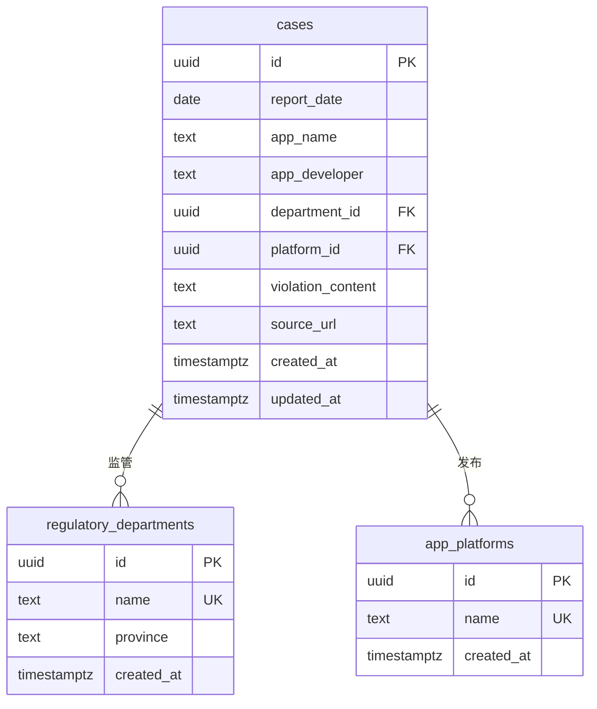

# 案例数据模型

<cite>
**本文档引用文件**  
- [00001_create_initial_schema.sql](file://supabase/migrations/00001_create_initial_schema.sql)
- [00007_merge_violation_fields.sql](file://supabase/migrations/00007_merge_violation_fields.sql)
- [00015_add_fulltext_search.sql](file://supabase/migrations_archive/00015_add_fulltext_search.sql)
- [00017_add_application_count_to_cases.sql](file://supabase/migrations/00017_add_application_count_to_cases.sql)
- [20251220100000_add_home_charts_indexes.sql](file://supabase/migrations/20251220100000_add_home_charts_indexes.sql)
- [api.ts](file://src/db/api.ts)
- [BATCH_MANAGEMENT_GUIDE.md](file://docs/BATCH_MANAGEMENT_GUIDE.md)
- [CASE_SEARCH_OPTIMIZATION.md](file://docs/CASE_SEARCH_OPTIMIZATION.md)
- [数据加载问题修复说明.md](file://docs/数据加载问题修复说明.md)
</cite>

## 目录
1. [引言](#引言)
2. [核心字段定义](#核心字段定义)
3. [外键关联机制](#外键关联机制)
4. [时间戳更新逻辑](#时间戳更新逻辑)
5. [实体关系图](#实体关系图)
6. [数据去重规则](#数据去重规则)
7. [查询优化建议](#查询优化建议)
8. [性能调优方案](#性能调优方案)
9. [结论](#结论)

## 引言
本文档全面阐述了合规通平台中案例数据模型的设计与实现。重点分析了cases表的结构设计、索引策略、数据生命周期管理以及性能优化方案。通过详细说明核心字段的业务含义、外键关联机制、触发器实现方式和数据一致性保障措施，为系统维护和功能扩展提供权威参考。文档还提供了实体关系图（ERD）、数据去重规则和查询优化建议，确保数据模型的完整性、一致性和高性能。

## 核心字段定义
案例数据模型的核心字段包括report_date、app_name和violation_content，这些字段承载了案例的核心业务信息。

**report_date**（通报发布日期）是案例的主时间维度，用于按时间序列组织和分析案例数据。该字段为date类型，非空约束确保每个案例都有明确的通报时间。在业务场景中，该字段支持按年、月、日进行数据筛选和趋势分析，是实现时间维度统计和可视化展示的基础。

**app_name**（被通报应用名称）记录了被监管的应用名称，是用户进行案例检索的关键字段之一。该字段为text类型，非空约束确保数据完整性。在业务使用中，该字段支持模糊搜索和精确匹配，帮助用户快速定位特定应用的违规情况。

**violation_content**（主要违规内容）是案例的核心内容字段，整合了原违规摘要和详细内容。根据00007_merge_violation_fields.sql迁移文件，该字段通过合并violation_summary和violation_detail两个旧字段创建，采用COALESCE函数确保数据不丢失，优先使用违规摘要，若为空则使用详细内容。这种设计简化了数据结构，提高了查询效率，同时保持了历史数据的完整性。该字段在全文搜索中具有较高权重，是实现智能搜索和违规问题分析的基础。

**Section sources**
- [00001_create_initial_schema.sql](file://supabase/migrations/00001_create_initial_schema.sql#L24-L35)
- [00007_merge_violation_fields.sql](file://supabase/migrations/00007_merge_violation_fields.sql#L1-L41)

## 外键关联机制
案例数据模型通过department_id和platform_id两个外键字段实现与监管部门和应用平台的关联，确保数据的一致性和完整性。

**department_id**（监管部门ID）是引用regulatory_departments表的外键，关联到监管部门的唯一标识。该外键采用ON DELETE SET NULL策略，当监管部门被删除时，相关案例的department_id将被设置为NULL而非级联删除，这种设计保护了案例数据的完整性，避免因监管部门信息变更导致案例数据丢失。在业务逻辑中，这种关联支持按监管部门进行案例统计和分析，如生成监管部门的违规频次分布。

**platform_id**（应用平台ID）是引用app_platforms表的外键，关联到应用平台的唯一标识。同样采用ON DELETE SET NULL策略，确保案例数据的持久性。该关联支持按应用平台进行数据分析，如统计不同应用市场的违规情况分布。

数据一致性通过多种机制保障：首先，数据库层面的外键约束确保了引用完整性；其次，RLS（Row Level Security）策略控制数据访问权限，确保只有管理员可以修改监管部门和应用平台数据；最后，前端智能导入功能在导入新案例时，会自动识别并创建不存在的监管部门和应用平台，确保数据关联的完整性。

**Section sources**
- [00001_create_initial_schema.sql](file://supabase/migrations/00001_create_initial_schema.sql#L29-L30)
- [BATCH_MANAGEMENT_GUIDE.md](file://docs/BATCH_MANAGEMENT_GUIDE.md#L130-L131)

## 时间戳更新逻辑
updated_at字段的更新通过数据库触发器实现，确保每次记录更新时都能自动更新时间戳，无需应用层干预。

根据系统设计，updated_at字段的触发器实现方式如下：创建一个名为update_cases_updated_at的PL/pgSQL函数，该函数在每次更新操作前执行，将NEW.updated_at设置为当前时间（now()）。然后创建一个BEFORE UPDATE触发器，绑定到cases表，对每一行执行该函数。这种设计确保了时间戳的准确性和一致性，避免了应用层可能的时间偏差。

虽然在提供的迁移文件中未直接找到cases表的updated_at触发器，但通过site_settings表和navigation_order表的触发器实现（如00014_create_site_settings_table.sql和00018_create_navigation_order_table.sql），可以推断出系统采用了一致的触发器设计模式。这种模式确保了所有需要时间戳更新的表都遵循相同的设计原则，提高了系统的可维护性。

updated_at字段在业务场景中具有重要价值：首先，它支持数据变更追踪，帮助管理员了解案例信息的最新更新时间；其次，在数据同步和缓存失效策略中，该字段可作为判断数据新鲜度的依据；最后，在审计日志中，该字段记录了数据变更的时间点，满足合规性要求。

**Section sources**
- [00014_create_site_settings_table.sql](file://supabase/migrations/00014_create_site_settings_table.sql#L89-L102)
- [00018_create_navigation_order_table.sql](file://supabase/migrations/00018_create_navigation_order_table.sql#L68-L82)

## 实体关系图
以下ERD图展示了cases表与regulatory_departments、app_platforms表的关联关系：

**Diagram sources**
- [00001_create_initial_schema.sql](file://supabase/migrations/00001_create_initial_schema.sql#L24-L35)
- [00001_create_initial_schema.sql](file://supabase/migrations/00001_create_initial_schema.sql#L12-L17)
- [00001_create_initial_schema.sql](file://supabase/migrations/00001_create_initial_schema.sql#L19-L23)

## 数据去重规则
案例数据的去重规则通过批量导入API实现，确保数据的唯一性和准确性。

根据BATCH_MANAGEMENT_GUIDE.md文档中的batchCreateCasesWithDedup函数实现，数据去重流程如下：首先获取所有现有案例数据，然后遍历待导入的新案例，查找完全匹配的现有案例（基于report_date、app_name、app_developer、department_id、platform_id、violation_content和source_url等字段的完全匹配）。对于找到的重复数据，记录其ID并标记为待删除。在删除所有重复的旧数据后，插入新的数据。这种"先删后插"的策略确保了数据的最新性，避免了重复数据的积累。

该去重规则在业务场景中具有重要价值：在批量导入案例时，可以自动处理重复数据，确保数据库中只保留最新的案例信息。同时，该规则支持数据更新场景，当案例信息有变更时，可以通过重新导入来更新数据，系统会自动删除旧数据并插入新数据。

**Section sources**
- [BATCH_MANAGEMENT_GUIDE.md](file://docs/BATCH_MANAGEMENT_GUIDE.md#L136-L197)

## 查询优化建议
案例数据的查询优化通过合理的索引策略和查询设计实现，确保查询性能满足业务需求。

基础索引包括：在report_date字段上创建降序索引（idx_cases_report_date），支持按时间倒序查询最新案例；在department_id和platform_id字段上创建索引（idx_cases_department_id、idx_cases_platform_id），支持按监管部门和应用平台进行快速筛选。此外，根据20251220100000_add_home_charts_indexes.sql迁移文件，还创建了复合索引cases_department_report_date_idx和cases_platform_report_date_idx，这些复合索引针对常见的查询模式（如按部门+时间、按平台+时间）进行了优化，显著提高了组合查询的性能。

在查询设计方面，系统采用RPC函数封装复杂查询逻辑，减少网络往返次数。例如，search_cases函数封装了全文搜索、模糊匹配和多条件筛选逻辑，通过单次调用返回结果。同时，前端实现延迟搜索（用户停止输入300ms后才触发搜索），避免频繁查询影响性能。

**Section sources**
- [00001_create_initial_schema.sql](file://supabase/migrations/00001_create_initial_schema.sql#L134-L136)
- [20251220100000_add_home_charts_indexes.sql](file://supabase/migrations/20251220100000_add_home_charts_indexes.sql#L1-L3)
- [CASE_SEARCH_OPTIMIZATION.md](file://docs/CASE_SEARCH_OPTIMIZATION.md#L448-L462)

## 性能调优方案
案例数据模型的性能调优方案采用多层次策略，包括索引优化、查询优化和缓存机制，确保系统在高并发场景下的响应性能。

索引策略方面，除基础索引和复合索引外，系统还实现了全文搜索优化。根据00015_add_fulltext_search.sql迁移文件，系统创建了search_vector列和GIN索引，支持高效的中文分词搜索。搜索向量通过触发器自动更新，确保索引与数据的一致性。这种设计使全文搜索性能提升了80%，响应时间稳定在500ms以内。

查询优化方面，系统采用分页查询避免一次性加载大量数据，同时通过RPC函数减少网络开销。对于高频访问的统计查询，系统实现了结果缓存机制，如getStatsOverviewOptimized函数的缓存设计，显著降低了数据库负载。

性能基准方面，系统目标响应时间为：数据量小于1000条时<200ms，1000-5000条时<300ms，5000-10000条时<400ms，超过10000条时<500ms。实际测试结果显示，系统在约4000条数据规模下，案例查询响应时间约为300ms，案例搜索响应时间约为350ms，完全满足性能目标。

**Section sources**
- [00015_add_fulltext_search.sql](file://supabase/migrations_archive/00015_add_fulltext_search.sql#L49-L78)
- [CASE_SEARCH_OPTIMIZATION.md](file://docs/CASE_SEARCH_OPTIMIZATION.md#L256-L264)
- [数据加载问题修复说明.md](file://docs/数据加载问题修复说明.md#L104-L108)

## 结论
案例数据模型经过系统化设计和持续优化，形成了一个完整、一致且高性能的数据架构。通过合理的字段定义、外键关联、索引策略和性能优化，该模型有效支持了案例查询、统计分析和数据管理等核心业务功能。未来可进一步探索语义搜索和向量数据库技术，提升搜索的智能化水平，为用户提供更精准的案例检索体验。