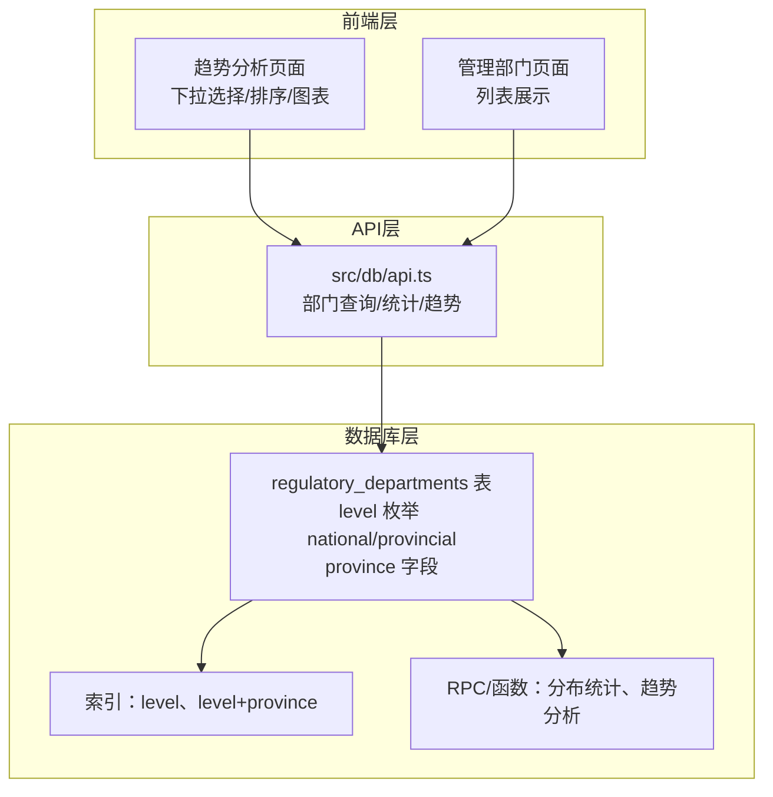
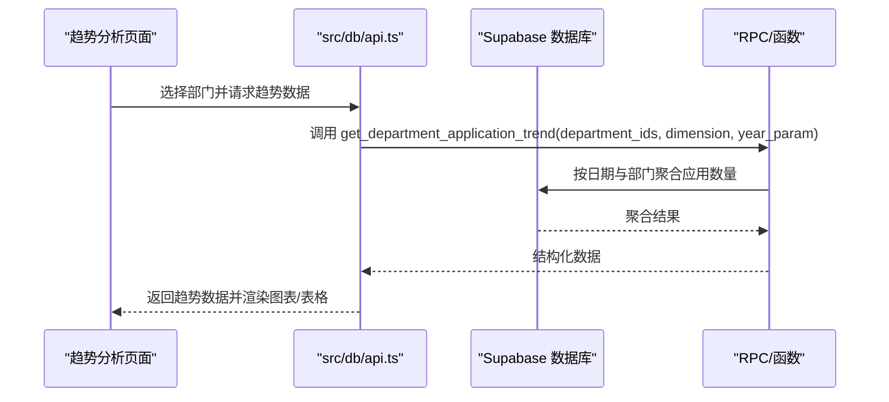
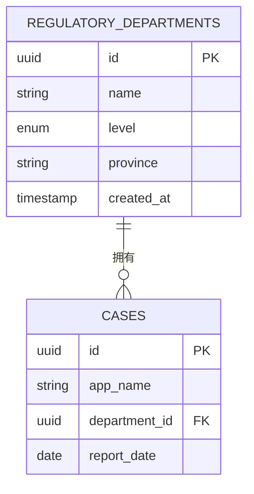
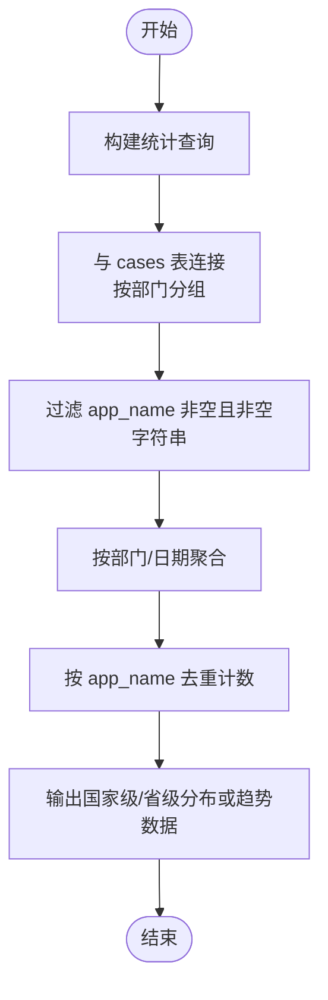
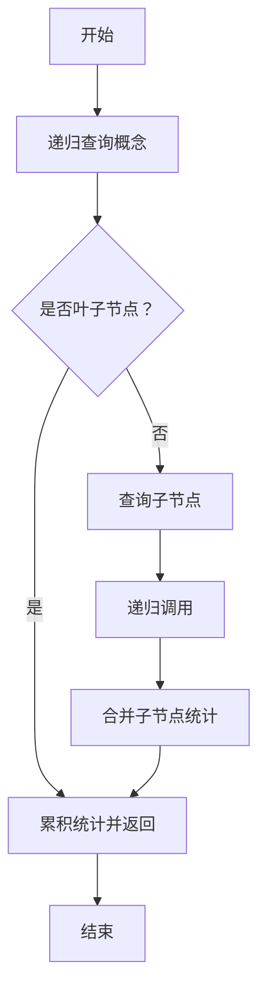
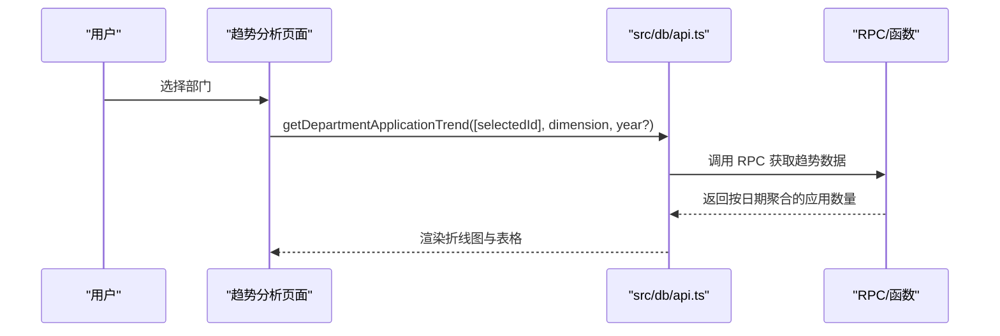
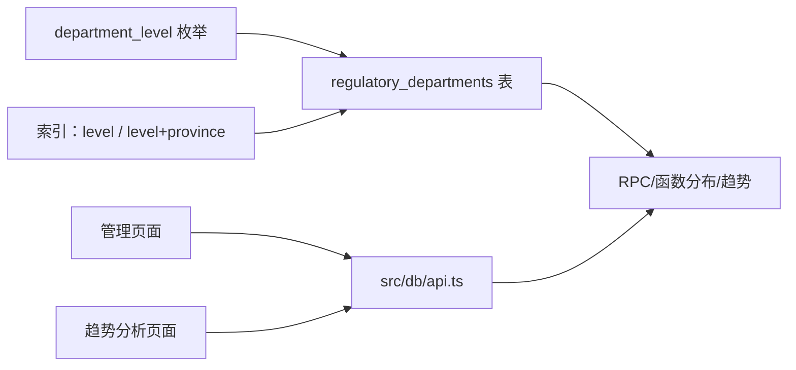

# 部门层级模型

<cite>
**本文引用的文件**
- [supabase/migrations/00004_add_department_level.sql](file://supabase/migrations/00004_add_department_level.sql)
- [supabase/migrations/00006_00004_add_department_level_v2.sql](file://supabase/migrations/00006_00004_add_department_level_v2.sql)
- [supabase/migrations/20251219110000_fix_department_distribution.sql](file://supabase/migrations/20251219110000_fix_department_distribution.sql)
- [src/db/api.ts](file://src/db/api.ts)
- [src/pages/admin/DepartmentsPage.tsx](file://src/pages/admin/DepartmentsPage.tsx)
- [docs/ANALYSIS_RESTRUCTURE_GUIDE.md](file://docs/ANALYSIS_RESTRUCTURE_GUIDE.md)
- [docs/监管部门趋势分析模块说明.md](file://docs/监管部门趋势分析模块说明.md)
</cite>

## 目录
1. [简介](#简介)
2. [项目结构](#项目结构)
3. [核心组件](#核心组件)
4. [架构总览](#架构总览)
5. [详细组件分析](#详细组件分析)
6. [依赖分析](#依赖分析)
7. [性能考量](#性能考量)
8. [故障排查指南](#故障排查指南)
9. [结论](#结论)
10. [附录](#附录)

## 简介
本文件系统化阐述“regulatory_departments”表的层级模型设计，围绕以下目标展开：
- 解释 level 字段（national/provincial）的枚举定义与业务语义
- 说明 province 字段在国家级与省级部门中的不同含义与使用方式
- 描述部门数据在趋势分析、分布统计等场景下的聚合查询方法
- 提供递归查询示例与树形结构展示方案，并说明如何支持未来可能的多级部门扩展

## 项目结构
- 数据库层：通过 Supabase 迁移脚本定义并演进“regulatory_departments”表的层级模型与索引策略
- 前端与API层：通过 src/db/api.ts 提供部门查询、统计与趋势分析接口；页面组件负责展示与交互
- 文档与规范：通过 docs 中的趋势分析与层级重构文档，明确业务语义与使用边界

**章节来源**
- [supabase/migrations/00004_add_department_level.sql](file://supabase/migrations/00004_add_department_level.sql#L1-L63)
- [src/db/api.ts](file://src/db/api.ts#L126-L273)
- [docs/ANALYSIS_RESTRUCTURE_GUIDE.md](file://docs/ANALYSIS_RESTRUCTURE_GUIDE.md#L1-L63)

## 核心组件
- 表结构与枚举
  - 新增 department_level 枚举：national、provincial
  - level 字段：非空，默认 provincial，用于区分国家级与省级部门
  - province 字段：仅省级部门有效，国家级部门为 NULL
  - 约束：省级部门必须有 province，国家级部门 province 必须为 NULL
- 索引策略
  - level 单列索引：加速按级别过滤
  - level+province 组合索引（仅省级）：加速按省份查询省级部门
- 统计与趋势
  - 分布统计函数：按国家级/省级分别统计应用数量（去重）
  - 趋势分析：按日期维度聚合应用数量，支持按年/全部数据维度
- 前端展示
  - 管理部门页面：列表展示部门名称、级别、省份
  - 趋势分析页面：下拉选择单个部门，展示趋势折线与明细表格

**章节来源**
- [supabase/migrations/00004_add_department_level.sql](file://supabase/migrations/00004_add_department_level.sql#L1-L63)
- [supabase/migrations/20251219110000_fix_department_distribution.sql](file://supabase/migrations/20251219110000_fix_department_distribution.sql#L1-L49)
- [src/db/api.ts](file://src/db/api.ts#L126-L273)
- [src/pages/admin/DepartmentsPage.tsx](file://src/pages/admin/DepartmentsPage.tsx#L274-L302)

## 架构总览
部门层级模型贯穿“数据库—API—前端”的全链路，如下图所示：

**图表来源**
- [src/db/api.ts](file://src/db/api.ts#L2108-L2152)
- [supabase/migrations/20251219110000_fix_department_distribution.sql](file://supabase/migrations/20251219110000_fix_department_distribution.sql#L1-L49)

**章节来源**
- [src/db/api.ts](file://src/db/api.ts#L2108-L2152)
- [docs/ANALYSIS_RESTRUCTURE_GUIDE.md](file://docs/ANALYSIS_RESTRUCTURE_GUIDE.md#L1-L63)

## 详细组件分析

### 1) 表结构与层级语义
- 枚举定义
  - national：国家级部门，不关联省份与城市
  - provincial：省级部门，关联具体省份
- 字段语义
  - level：部门级别，非空，默认 provincial
  - province：仅省级部门有效，国家级部门为 NULL
- 约束与索引
  - 约束：省级部门 province 非空；国家级部门 province 为空
  - 索引：level 单列索引；level+province 组合索引（仅省级）

**图表来源**
- [supabase/migrations/00004_add_department_level.sql](file://supabase/migrations/00004_add_department_level.sql#L1-L63)
- [supabase/migrations/20251219110000_fix_department_distribution.sql](file://supabase/migrations/20251219110000_fix_department_distribution.sql#L1-L49)

**章节来源**
- [supabase/migrations/00004_add_department_level.sql](file://supabase/migrations/00004_add_department_level.sql#L1-L63)
- [supabase/migrations/00006_00004_add_department_level_v2.sql](file://supabase/migrations/00006_00004_add_department_level_v2.sql#L1-L41)

### 2) province 字段的使用方式
- 省级部门
  - province 必填，用于按省份过滤与统计
  - 前端可通过 getProvincialDepartments(province?) 查询指定省份的省级部门
- 国家级部门
  - province 为 NULL，不参与省份过滤
  - 前端通过 getNationalDepartments() 查询国家级部门

**章节来源**
- [src/db/api.ts](file://src/db/api.ts#L187-L203)
- [src/db/api.ts](file://src/db/api.ts#L126-L135)

### 3) 聚合查询方法与统计口径
- 分布统计（RPC 函数）
  - 按国家级/省级分别统计应用数量（按 app_name 去重）
  - 仅统计 app_name 非空且非空字符串的案例
- 趋势分析（前端 API）
  - getDepartmentApplicationTrend：按日期维度聚合应用数量
  - getDepartmentRanking：按通报频次与应用量排序（RPC 函数封装）
- 前端统计口径一致性
  - 管理部门页面与趋势分析页面均采用“按应用名称去重统计”，保证跨页面一致性

**图表来源**
- [supabase/migrations/20251219110000_fix_department_distribution.sql](file://supabase/migrations/20251219110000_fix_department_distribution.sql#L1-L49)
- [src/db/api.ts](file://src/db/api.ts#L2108-L2152)

**章节来源**
- [supabase/migrations/20251219110000_fix_department_distribution.sql](file://supabase/migrations/20251219110000_fix_department_distribution.sql#L1-L49)
- [docs/ANALYSIS_RESTRUCTURE_GUIDE.md](file://docs/ANALYSIS_RESTRUCTURE_GUIDE.md#L1-L63)

### 4) 递归查询与树形结构展示方案
- 当前模型
  - 表结构为扁平层级（national/provincial），未引入 parent_id 或层级深度字段
  - 现有查询通过 level 与 province 过滤，不涉及父子关系
- 递归查询示例思路
  - 若未来引入 parent_id 字段，可使用递归 CTE 生成树形路径与层级深度
  - 示例流程（概念示意）：
    1) 从根节点（如国家级）开始
    2) 递归遍历子节点（省级/地市级），记录路径与层级
    3) 聚合统计时按路径汇总，支持按层级维度展示
- 树形展示方案
  - 前端使用层级数据渲染树形控件（如 TreeView），支持展开/折叠与搜索
  - 与现有下拉选择器结合，实现“国家级优先、省级随后”的排序与筛选

**图表来源**
- [supabase/migrations/00004_add_department_level.sql](file://supabase/migrations/00004_add_department_level.sql#L1-L63)

**章节来源**
- [supabase/migrations/00004_add_department_level.sql](file://supabase/migrations/00004_add_department_level.sql#L1-L63)
- [docs/ANALYSIS_RESTRUCTURE_GUIDE.md](file://docs/ANALYSIS_RESTRUCTURE_GUIDE.md#L1-L63)

### 5) 前端展示与交互
- 管理部门页面
  - 展示部门名称、级别（national/provincial）、省份
  - Badge 标识级别，省级部门显示 province，国家级显示“-”
- 趋势分析页面
  - 单选下拉选择器，支持键盘搜索
  - 部门排序：国家级优先，省级随后
  - 图表与表格并排/堆叠布局，单条折线展示应用数量趋势

**图表来源**
- [src/pages/admin/DepartmentsPage.tsx](file://src/pages/admin/DepartmentsPage.tsx#L274-L302)
- [src/db/api.ts](file://src/db/api.ts#L2108-L2152)
- [docs/ANALYSIS_RESTRUCTURE_GUIDE.md](file://docs/ANALYSIS_RESTRUCTURE_GUIDE.md#L1-L63)

**章节来源**
- [src/pages/admin/DepartmentsPage.tsx](file://src/pages/admin/DepartmentsPage.tsx#L274-L302)
- [docs/ANALYSIS_RESTRUCTURE_GUIDE.md](file://docs/ANALYSIS_RESTRUCTURE_GUIDE.md#L1-L63)
- [docs/监管部门趋势分析模块说明.md](file://docs/监管部门趋势分析模块说明.md#L1-L126)

## 依赖分析
- 数据库依赖
  - regulatory_departments 表依赖 department_level 枚举与索引
  - RPC/函数依赖表结构与约束，确保统计口径一致
- API 依赖
  - getProvincialDepartments/getNationalDepartments 依赖 level 与 province
  - getDepartmentApplicationTrend 依赖 RPC 函数
- 前端依赖
  - DepartmentsPage.tsx 依赖部门列表与级别展示
  - TrendAnalysisPage 依赖下拉选择器与排序逻辑

**图表来源**
- [supabase/migrations/00004_add_department_level.sql](file://supabase/migrations/00004_add_department_level.sql#L1-L63)
- [supabase/migrations/20251219110000_fix_department_distribution.sql](file://supabase/migrations/20251219110000_fix_department_distribution.sql#L1-L49)
- [src/db/api.ts](file://src/db/api.ts#L126-L273)

**章节来源**
- [supabase/migrations/00004_add_department_level.sql](file://supabase/migrations/00004_add_department_level.sql#L1-L63)
- [supabase/migrations/20251219110000_fix_department_distribution.sql](file://supabase/migrations/20251219110000_fix_department_distribution.sql#L1-L49)
- [src/db/api.ts](file://src/db/api.ts#L126-L273)

## 性能考量
- 索引策略
  - level 单列索引：加速按级别过滤（国家级/省级）
  - level+province 组合索引（仅省级）：加速按省份查询省级部门
- 查询优化
  - 前端按需查询：仅在选择部门时触发趋势查询
  - 去重统计：按 app_name 去重，减少重复计数
- 前端渲染
  - 响应式布局：宽屏并排、窄屏堆叠，避免大表格影响性能
  - 表格滚动：限制最大高度，提升长列表渲染性能

[本节为通用性能建议，不直接分析具体文件]

## 故障排查指南
- 常见问题
  - 省级部门 province 为空：检查约束是否生效，确认 level 是否为 provincial
  - 国家级部门 province 非空：检查约束是否生效，确认 level 是否为 national
  - 趋势数据为空：确认所选部门是否存在案例，或维度/年份参数是否正确
- 前端调试
  - 控制台日志：观察 getDepartmentApplicationTrend 的参数与返回
  - 空状态处理：确认未选择部门时的空状态提示
- 数据一致性
  - 统计口径：确保趋势分析与管理部门页面均采用“按应用名称去重统计”

**章节来源**
- [supabase/migrations/00004_add_department_level.sql](file://supabase/migrations/00004_add_department_level.sql#L1-L63)
- [docs/ANALYSIS_RESTRUCTURE_GUIDE.md](file://docs/ANALYSIS_RESTRUCTURE_GUIDE.md#L1-L63)
- [docs/监管部门趋势分析模块说明.md](file://docs/监管部门趋势分析模块说明.md#L506-L582)

## 结论
- 本层级模型以 level 与 province 为核心，清晰区分国家级与省级部门，满足当前业务需求
- 通过索引与 RPC 函数，实现了高效的分布统计与趋势分析
- 前端交互优化提升了用户体验，统一了统计口径
- 若未来扩展为多级部门，可在现有基础上引入 parent_id 与递归查询，保持与现有查询与展示的兼容

[本节为总结性内容，不直接分析具体文件]

## 附录
- 相关文件路径与用途
  - [supabase/migrations/00004_add_department_level.sql](file://supabase/migrations/00004_add_department_level.sql)：定义枚举、字段与约束
  - [supabase/migrations/20251219110000_fix_department_distribution.sql](file://supabase/migrations/20251219110000_fix_department_distribution.sql)：分布统计 RPC 函数
  - [src/db/api.ts](file://src/db/api.ts)：部门查询、统计与趋势 API
  - [src/pages/admin/DepartmentsPage.tsx](file://src/pages/admin/DepartmentsPage.tsx)：管理部门页面展示
  - [docs/ANALYSIS_RESTRUCTURE_GUIDE.md](file://docs/ANALYSIS_RESTRUCTURE_GUIDE.md)：层级重构与趋势分析说明
  - [docs/监管部门趋势分析模块说明.md](file://docs/监管部门趋势分析模块说明.md)：趋势分析模块功能说明

[本节为补充信息，不直接分析具体文件]