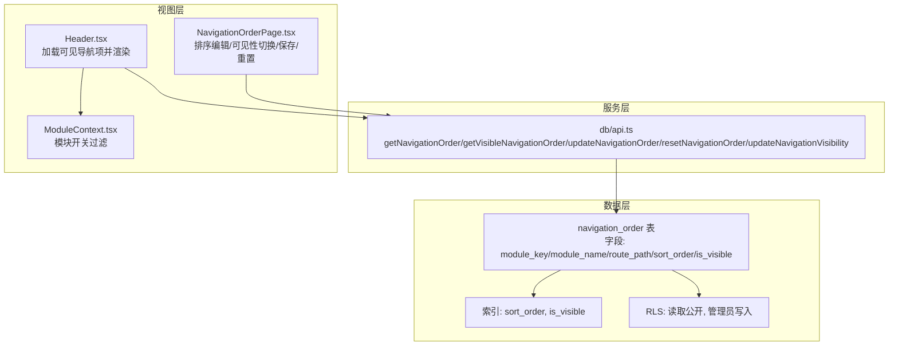
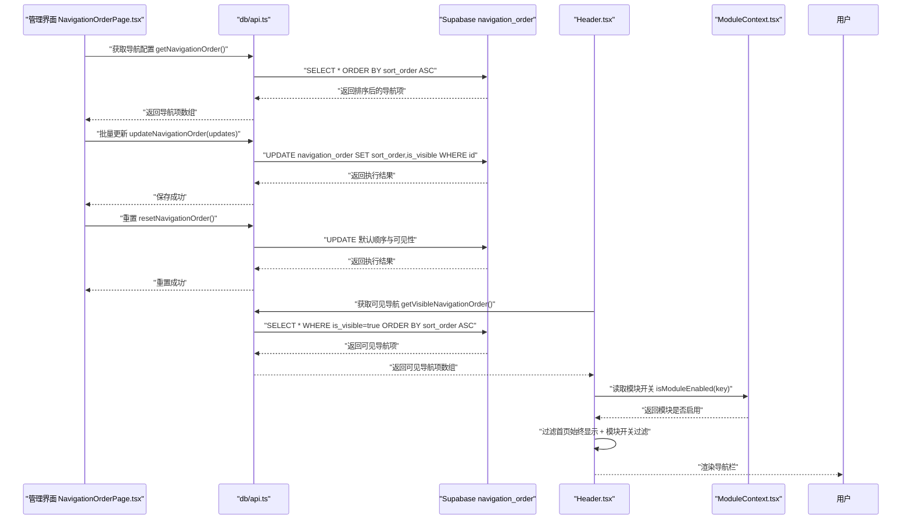
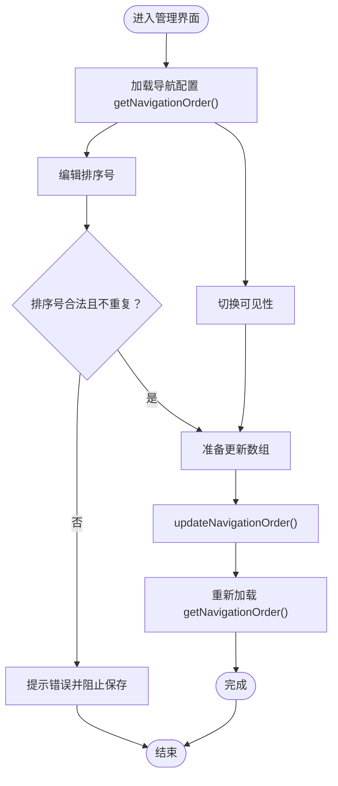
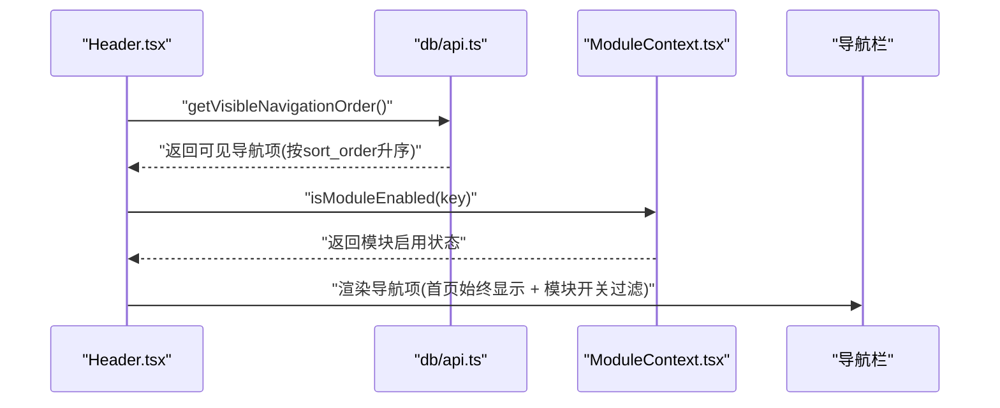
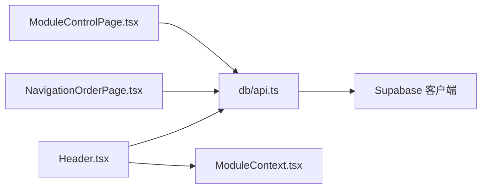

# 导航设置

<cite>
**本文引用的文件**
- [supabase/migrations/00018_create_navigation_order_table.sql](file://supabase/migrations/00018_create_navigation_order_table.sql)
- [src/db/api.ts](file://src/db/api.ts)
- [src/types/types.ts](file://src/types/types.ts)
- [src/components/common/Header.tsx](file://src/components/common/Header.tsx)
- [src/pages/admin/NavigationOrderPage.tsx](file://src/pages/admin/NavigationOrderPage.tsx)
- [src/pages/admin/ModuleControlPage.tsx](file://src/pages/admin/ModuleControlPage.tsx)
- [src/contexts/ModuleContext.tsx](file://src/contexts/ModuleContext.tsx)
- [src/db/supabase.ts](file://src/db/supabase.ts)
</cite>

## 目录
1. [简介](#简介)
2. [项目结构](#项目结构)
3. [核心组件](#核心组件)
4. [架构总览](#架构总览)
5. [详细组件分析](#详细组件分析)
6. [依赖关系分析](#依赖关系分析)
7. [性能考虑](#性能考虑)
8. [故障排查指南](#故障排查指南)
9. [结论](#结论)

## 简介
本文件围绕 navigation_order 表构建的导航设置数据模型，系统性解析其如何实现动态导航菜单的排序与显示控制。重点覆盖：
- sort_order 字段的排序算法与前端渲染应用
- module_key 与路由系统的关联机制及 route_path 的正确性保障
- is_visible 字段的动态显示/隐藏控制
- 管理界面 NavigationOrderPage.tsx 的拖拽排序与数据同步流程
- 导航配置的缓存策略、权限控制与性能优化建议

## 项目结构
导航设置涉及三层协同：
- 数据层：Supabase navigation_order 表（含排序、可见性、路由路径等字段）
- 服务层：前端数据库 API（查询、批量更新、重置）
- 视图层：管理界面（排序与可见性编辑）、头部导航渲染（按可见性与模块开关过滤）

图表来源
- [supabase/migrations/00018_create_navigation_order_table.sql](file://supabase/migrations/00018_create_navigation_order_table.sql#L29-L83)
- [src/db/api.ts](file://src/db/api.ts#L2762-L2848)
- [src/pages/admin/NavigationOrderPage.tsx](file://src/pages/admin/NavigationOrderPage.tsx#L1-L296)
- [src/components/common/Header.tsx](file://src/components/common/Header.tsx#L66-L80)
- [src/contexts/ModuleContext.tsx](file://src/contexts/ModuleContext.tsx#L1-L62)

章节来源
- [supabase/migrations/00018_create_navigation_order_table.sql](file://supabase/migrations/00018_create_navigation_order_table.sql#L29-L83)
- [src/db/api.ts](file://src/db/api.ts#L2762-L2848)
- [src/components/common/Header.tsx](file://src/components/common/Header.tsx#L66-L80)
- [src/pages/admin/NavigationOrderPage.tsx](file://src/pages/admin/NavigationOrderPage.tsx#L1-L296)
- [src/contexts/ModuleContext.tsx](file://src/contexts/ModuleContext.tsx#L1-L62)

## 核心组件
- 数据模型：navigation_order 表
  - 关键字段：module_key（唯一标识）、module_name（显示名）、route_path（路由路径）、sort_order（排序序号）、is_visible（是否可见）
  - 索引：对 sort_order 与 is_visible 建立索引以提升查询性能
  - RLS：读取对所有人开放；仅管理员可写入
- API 层：db/api.ts
  - 查询接口：按 sort_order 升序返回全部或可见导航项
  - 更新接口：批量更新排序与可见性；单条可见性更新；重置为默认顺序
- 视图层：
  - 管理界面 NavigationOrderPage.tsx：支持排序号编辑、可见性切换、保存与重置
  - Header.tsx：加载可见导航项，并结合模块开关过滤（首页始终显示）
  - ModuleContext.tsx：提供模块开关状态，供 Header 渲染时过滤

章节来源
- [supabase/migrations/00018_create_navigation_order_table.sql](file://supabase/migrations/00018_create_navigation_order_table.sql#L29-L83)
- [src/db/api.ts](file://src/db/api.ts#L2762-L2848)
- [src/types/types.ts](file://src/types/types.ts#L173-L184)
- [src/components/common/Header.tsx](file://src/components/common/Header.tsx#L66-L80)
- [src/pages/admin/NavigationOrderPage.tsx](file://src/pages/admin/NavigationOrderPage.tsx#L1-L296)
- [src/contexts/ModuleContext.tsx](file://src/contexts/ModuleContext.tsx#L1-L62)

## 架构总览
导航设置的数据流与控制链路如下：

图表来源
- [src/pages/admin/NavigationOrderPage.tsx](file://src/pages/admin/NavigationOrderPage.tsx#L26-L113)
- [src/db/api.ts](file://src/db/api.ts#L2762-L2848)
- [src/components/common/Header.tsx](file://src/components/common/Header.tsx#L66-L80)
- [src/contexts/ModuleContext.tsx](file://src/contexts/ModuleContext.tsx#L1-L62)

## 详细组件分析

### 数据模型：navigation_order 表
- 字段语义
  - module_key：模块唯一标识，用于前端渲染与权限控制
  - module_name：导航显示文本
  - route_path：对应前端路由路径，用于 Link 跳转
  - sort_order：排序序号，数值越小越靠前
  - is_visible：是否可见，影响前端渲染
- 索引与性能
  - 对 sort_order 建立索引，保证排序查询高效
  - 对 is_visible 建立索引，加速可见性过滤
- 安全策略
  - 读取：所有人可读取导航配置
  - 写入：仅管理员可修改导航配置
- 初始数据
  - 包含首页、案例查询、监管资讯、监管部门、趋势分析、问题分析等模块的默认顺序与可见性

章节来源
- [supabase/migrations/00018_create_navigation_order_table.sql](file://supabase/migrations/00018_create_navigation_order_table.sql#L29-L83)

### API 层：导航配置读写
- getNavigationOrder
  - 作用：获取全部导航项，按 sort_order 升序排列
  - 用途：管理界面展示与排序编辑
- getVisibleNavigationOrder
  - 作用：仅获取 is_visible=true 的导航项，按 sort_order 升序排列
  - 用途：Header 渲染导航栏
- updateNavigationOrder
  - 作用：批量更新多个导航项的 sort_order 与 is_visible
  - 用途：管理界面保存排序与可见性
- updateNavigationVisibility
  - 作用：单条更新 is_visible
  - 用途：管理界面即时切换某模块可见性
- resetNavigationOrder
  - 作用：将导航顺序重置为默认值，同时设为可见
  - 用途：管理界面一键恢复默认

章节来源
- [src/db/api.ts](file://src/db/api.ts#L2762-L2848)

### 类型定义：NavigationOrder
- 作用：前端类型约束 navigation_order 表字段
- 字段：id、module_key、module_name、route_path、sort_order、is_visible、created_at、updated_at

章节来源
- [src/types/types.ts](file://src/types/types.ts#L173-L184)

### 视图层：管理界面 NavigationOrderPage.tsx
- 功能点
  - 加载：首次加载调用 getNavigationOrder，深拷贝到编辑态
  - 排序编辑：输入框直接修改 sort_order，前端按 sort_order 升序展示
  - 可见性切换：Switch 切换 is_visible，即时更新编辑态与已加载态
  - 保存：校验排序号不重复，准备更新数组，调用 updateNavigationOrder，随后重新加载
  - 重置：调用 resetNavigationOrder，恢复默认顺序与可见性
  - 预览：按编辑态排序号排序，仅显示可见模块
- 注意事项
  - 排序号需为正整数且不重复
  - 保存后立即生效，无需刷新页面即可看到新顺序

图表来源
- [src/pages/admin/NavigationOrderPage.tsx](file://src/pages/admin/NavigationOrderPage.tsx#L26-L113)
- [src/db/api.ts](file://src/db/api.ts#L2762-L2848)

章节来源
- [src/pages/admin/NavigationOrderPage.tsx](file://src/pages/admin/NavigationOrderPage.tsx#L1-L296)
- [src/db/api.ts](file://src/db/api.ts#L2762-L2848)

### 视图层：模块控制界面 ModuleControlPage.tsx
- 功能点
  - 与 NavigationOrderPage 类似，但侧重“模块可见性控制”
  - 通过 Switch 控制 is_visible
  - 保存时同样校验排序号不重复
- 与导航排序的关系
  - 两者共享同一张表与 API，但 ModuleControlPage 更强调“模块开关”而非“排序细节”

章节来源
- [src/pages/admin/ModuleControlPage.tsx](file://src/pages/admin/ModuleControlPage.tsx#L1-L274)
- [src/db/api.ts](file://src/db/api.ts#L2762-L2848)

### 视图层：Header.tsx 导航渲染
- 加载可见导航项：调用 getVisibleNavigationOrder，按 sort_order 升序渲染
- 模块开关过滤：首页模块始终显示；其他模块根据 ModuleContext 的 isModuleEnabled(key) 进行过滤
- 路由跳转：使用 route_path 作为 Link 的 to 参数

图表来源
- [src/components/common/Header.tsx](file://src/components/common/Header.tsx#L66-L80)
- [src/contexts/ModuleContext.tsx](file://src/contexts/ModuleContext.tsx#L1-L62)
- [src/db/api.ts](file://src/db/api.ts#L2762-L2848)

章节来源
- [src/components/common/Header.tsx](file://src/components/common/Header.tsx#L66-L80)
- [src/contexts/ModuleContext.tsx](file://src/contexts/ModuleContext.tsx#L1-L62)
- [src/db/api.ts](file://src/db/api.ts#L2762-L2848)

### 排序算法与前端渲染
- 排序算法
  - 后端：按 sort_order 升序返回
  - 前端：管理界面按编辑态 sort_order 升序排序展示，便于直观预览
- 渲染逻辑
  - Header.tsx 仅渲染 is_visible=true 的导航项，且受模块开关过滤
  - module_key 作为 Link 的 key，route_path 作为 to，确保导航链接正确性

章节来源
- [src/db/api.ts](file://src/db/api.ts#L2762-L2848)
- [src/components/common/Header.tsx](file://src/components/common/Header.tsx#L119-L133)

### module_key 与路由系统的关联机制
- module_key
  - 作为导航项的唯一标识，用于前端渲染与模块开关过滤
- route_path
  - 作为 Link 的目标路径，确保导航链接正确性
- Header.tsx 中的 Link 使用 route_path 作为 to，避免硬编码路径导致的不一致

章节来源
- [src/types/types.ts](file://src/types/types.ts#L173-L184)
- [src/components/common/Header.tsx](file://src/components/common/Header.tsx#L119-L133)

### is_visible 的动态显示与隐藏
- 数据层：is_visible=true 时才参与前端渲染
- 管理层：支持单条切换 updateNavigationVisibility 与批量切换 updateNavigationOrder
- 前端：Header.tsx 仅渲染可见项；ModuleControlPage.tsx 提供开关控制
- 特殊处理：首页模块始终显示，不受 is_visible 影响

章节来源
- [src/db/api.ts](file://src/db/api.ts#L2762-L2848)
- [src/components/common/Header.tsx](file://src/components/common/Header.tsx#L66-L80)
- [src/pages/admin/ModuleControlPage.tsx](file://src/pages/admin/ModuleControlPage.tsx#L60-L66)

### 管理界面拖拽排序的技术实现与数据同步
- 技术实现
  - 管理界面采用“输入框编辑排序号”的方式实现排序调整
  - 前端在保存前进行排序号合法性校验（正整数、不重复）
  - 保存时调用 updateNavigationOrder 批量更新
- 数据同步
  - 保存成功后重新加载 getNavigationOrder，确保 UI 与数据库一致
  - Header.tsx 读取 getVisibleNavigationOrder，立即反映最新可见性与顺序

章节来源
- [src/pages/admin/NavigationOrderPage.tsx](file://src/pages/admin/NavigationOrderPage.tsx#L40-L113)
- [src/db/api.ts](file://src/db/api.ts#L2762-L2848)

## 依赖关系分析
- 组件耦合
  - Header.tsx 依赖 db/api.ts 的 getVisibleNavigationOrder 与 ModuleContext 的 isModuleEnabled
  - NavigationOrderPage.tsx 依赖 db/api.ts 的 getNavigationOrder、updateNavigationOrder、resetNavigationOrder、updateNavigationVisibility
  - ModuleControlPage.tsx 依赖 db/api.ts 的 getNavigationOrder、updateNavigationOrder、resetNavigationOrder
- 外部依赖
  - Supabase 客户端：通过 src/db/supabase.ts 初始化，用于数据库访问
  - RLS 策略：读取公开、写入管理员

图表来源
- [src/components/common/Header.tsx](file://src/components/common/Header.tsx#L66-L80)
- [src/pages/admin/NavigationOrderPage.tsx](file://src/pages/admin/NavigationOrderPage.tsx#L1-L296)
- [src/pages/admin/ModuleControlPage.tsx](file://src/pages/admin/ModuleControlPage.tsx#L1-L274)
- [src/db/api.ts](file://src/db/api.ts#L2762-L2848)
- [src/db/supabase.ts](file://src/db/supabase.ts#L1-L8)

章节来源
- [src/components/common/Header.tsx](file://src/components/common/Header.tsx#L66-L80)
- [src/pages/admin/NavigationOrderPage.tsx](file://src/pages/admin/NavigationOrderPage.tsx#L1-L296)
- [src/pages/admin/ModuleControlPage.tsx](file://src/pages/admin/ModuleControlPage.tsx#L1-L274)
- [src/db/api.ts](file://src/db/api.ts#L2762-L2848)
- [src/db/supabase.ts](file://src/db/supabase.ts#L1-L8)

## 性能考虑
- 查询优化
  - 对 sort_order 与 is_visible 建立索引，减少排序与过滤成本
  - Header.tsx 仅查询 is_visible=true 的导航项，降低渲染与网络负载
- 批量更新
  - updateNavigationOrder 使用 Promise.all 并发更新，减少往返次数
- 缓存策略建议
  - Header.tsx 可在本地缓存最近一次可见导航项，避免频繁请求
  - 管理界面可在编辑态使用内存状态，仅在保存时与后端同步
- 路由一致性
  - route_path 与实际路由保持一致，避免无效跳转与 404

[本节为通用建议，不直接分析具体文件]

## 故障排查指南
- 保存失败
  - 检查排序号是否为正整数且不重复
  - 确认管理员权限是否有效
- 导航不显示
  - 确认 is_visible 是否为 true
  - 确认模块开关 ModuleContext 的 isModuleEnabled(key) 是否为 true
- 路由跳转异常
  - 检查 route_path 是否与实际路由一致
  - 确认 Header.tsx 的 Link to 使用的是 route_path

章节来源
- [src/pages/admin/NavigationOrderPage.tsx](file://src/pages/admin/NavigationOrderPage.tsx#L71-L113)
- [src/components/common/Header.tsx](file://src/components/common/Header.tsx#L119-L133)
- [src/db/api.ts](file://src/db/api.ts#L2762-L2848)

## 结论
navigation_order 表通过明确的字段语义与完善的索引/RLS 策略，为动态导航提供了稳定的数据基础。配合 db/api.ts 的查询与批量更新能力，以及管理界面与 Header 的协同，实现了“排序可调、可见可控、路由正确”的导航体验。建议在生产环境中持续关注排序号校验、可见性过滤与缓存策略，以获得更佳的用户体验与性能表现。