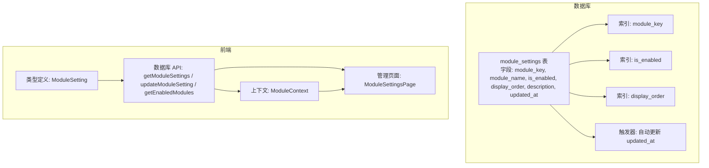
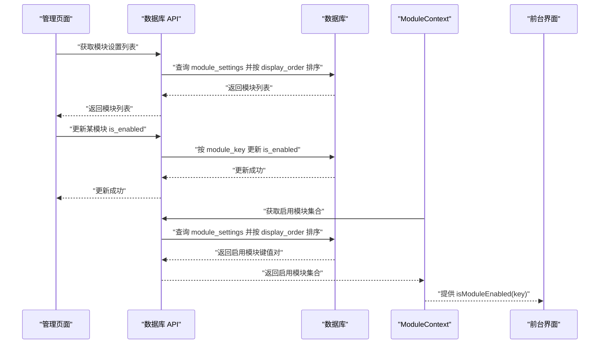
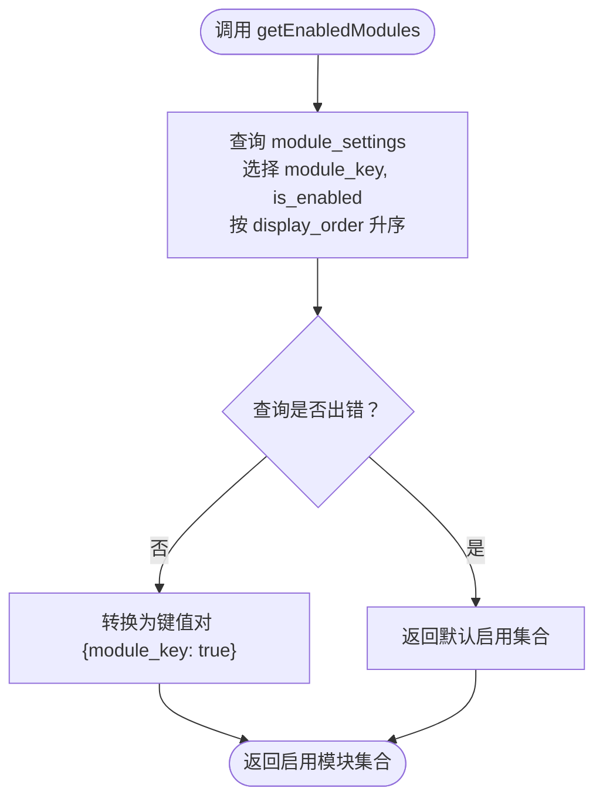
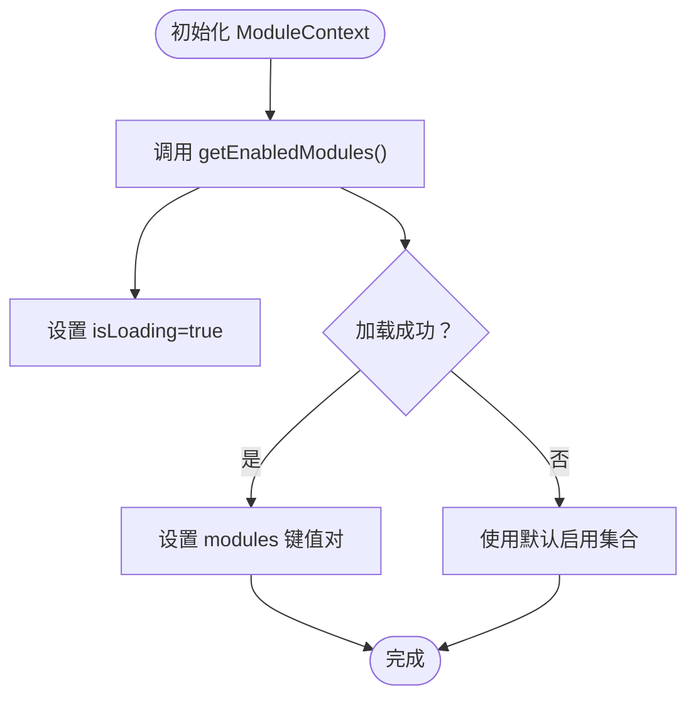
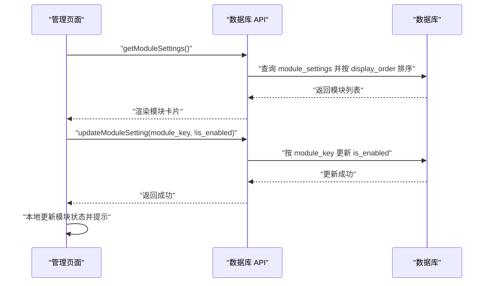
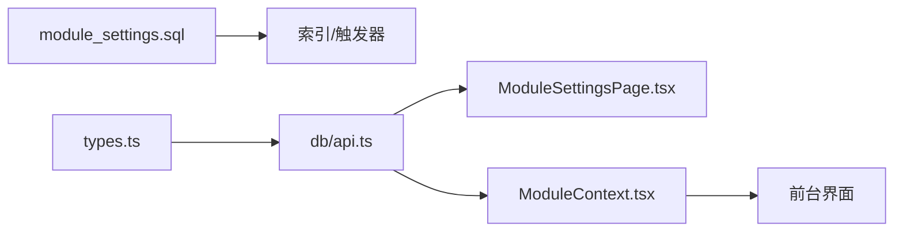

# 模块设置

<cite>
**本文引用的文件**
- [supabase/migrations/00008_create_module_settings.sql](file://supabase/migrations/00008_create_module_settings.sql)
- [src/db/api.ts](file://src/db/api.ts)
- [src/types/types.ts](file://src/types/types.ts)
- [src/contexts/ModuleContext.tsx](file://src/contexts/ModuleContext.tsx)
- [src/pages/admin/ModuleSettingsPage.tsx](file://src/pages/admin/ModuleSettingsPage.tsx)
- [supabase/migrations/00018_create_navigation_order_table.sql](file://supabase/migrations/00018_create_navigation_order_table.sql)
</cite>

## 目录
1. [简介](#简介)
2. [项目结构](#项目结构)
3. [核心组件](#核心组件)
4. [架构总览](#架构总览)
5. [详细组件分析](#详细组件分析)
6. [依赖关系分析](#依赖关系分析)
7. [性能考量](#性能考量)
8. [故障排查指南](#故障排查指南)
9. [结论](#结论)

## 简介
本文件围绕 module_settings 表的设计与使用进行系统化说明，重点涵盖：
- module_key 唯一性约束的实现机制及其作为全局标识的作用
- display_order 字段如何控制模块在前端界面的显示顺序
- is_enabled 字段如何实现模块的启用与禁用功能
- 结合 ModuleContext.tsx 的状态管理逻辑，说明前端如何响应模块配置变化
- 模块配置的缓存策略、更新同步机制与性能优化建议

## 项目结构
模块设置相关的核心文件分布在数据库迁移、前端类型定义、数据库 API、上下文与管理页面中：
- 数据库层：通过迁移脚本创建 module_settings 表，并建立索引与触发器
- 类型层：定义 ModuleSetting 类型，统一前后端数据契约
- 前端 API 层：提供获取模块设置、更新模块状态等方法
- 上下文层：在客户端维护模块启用状态并支持刷新
- 管理页面：提供可视化界面以启用/禁用模块并观察变更

**图示来源**
- [supabase/migrations/00008_create_module_settings.sql](file://supabase/migrations/00008_create_module_settings.sql#L1-L78)
- [src/types/types.ts](file://src/types/types.ts#L81-L89)
- [src/db/api.ts](file://src/db/api.ts#L2536-L2577)
- [src/contexts/ModuleContext.tsx](file://src/contexts/ModuleContext.tsx#L1-L62)
- [src/pages/admin/ModuleSettingsPage.tsx](file://src/pages/admin/ModuleSettingsPage.tsx#L1-L167)

**章节来源**
- [supabase/migrations/00008_create_module_settings.sql](file://supabase/migrations/00008_create_module_settings.sql#L1-L78)
- [src/types/types.ts](file://src/types/types.ts#L81-L89)
- [src/db/api.ts](file://src/db/api.ts#L2536-L2577)
- [src/contexts/ModuleContext.tsx](file://src/contexts/ModuleContext.tsx#L1-L62)
- [src/pages/admin/ModuleSettingsPage.tsx](file://src/pages/admin/ModuleSettingsPage.tsx#L1-L167)

## 核心组件
- 数据表：module_settings
  - 唯一标识：module_key（唯一、非空）
  - 名称：module_name（非空）
  - 启用状态：is_enabled（布尔，默认 true）
  - 显示顺序：display_order（整数，默认 0）
  - 描述：description（文本）
  - 更新时间：updated_at（时间戳，默认 now）
  - 安全策略：允许所有用户读取；不启用行级安全
  - 索引：针对 module_key、is_enabled、display_order 建立索引
  - 触发器：更新记录时自动更新 updated_at
- 类型定义：ModuleSetting
  - 与数据库字段一一对应，便于前后端契约一致
- 数据库 API：
  - getModuleSettings：获取全部模块设置并按 display_order 升序排序
  - updateModuleSetting：按 module_key 更新 is_enabled
  - getEnabledModules：获取启用模块的键值对（用于前台渲染）
- 上下文：ModuleContext
  - 在应用启动时拉取启用模块集合
  - 提供 isModuleEnabled(key) 判断模块是否启用
  - 提供 refreshModules() 刷新模块状态
- 管理页面：ModuleSettingsPage
  - 展示模块列表与描述
  - 提供开关切换模块启用状态
  - 成功/失败反馈与加载态处理

**章节来源**
- [supabase/migrations/00008_create_module_settings.sql](file://supabase/migrations/00008_create_module_settings.sql#L1-L78)
- [src/types/types.ts](file://src/types/types.ts#L81-L89)
- [src/db/api.ts](file://src/db/api.ts#L2536-L2577)
- [src/contexts/ModuleContext.tsx](file://src/contexts/ModuleContext.tsx#L1-L62)
- [src/pages/admin/ModuleSettingsPage.tsx](file://src/pages/admin/ModuleSettingsPage.tsx#L1-L167)

## 架构总览
从前端到数据库的整体流程如下：
- 管理页面加载模块设置列表
- 用户切换模块启用状态
- 前端调用数据库 API 更新 is_enabled
- 前端本地状态更新并提示结果
- 前台应用通过 ModuleContext 获取启用模块集合，决定渲染哪些模块

**图示来源**
- [src/pages/admin/ModuleSettingsPage.tsx](file://src/pages/admin/ModuleSettingsPage.tsx#L1-L167)
- [src/db/api.ts](file://src/db/api.ts#L2536-L2577)
- [src/contexts/ModuleContext.tsx](file://src/contexts/ModuleContext.tsx#L1-L62)

## 详细组件分析

### 数据表设计：module_settings
- 唯一性约束与全局标识
  - module_key 设为唯一且非空，保证每个模块拥有全局唯一的标识符，便于前端通过 key 快速定位与判断启用状态
- 启用与禁用
  - is_enabled 默认 true，表示模块默认启用；通过 updateModuleSetting 按 module_key 更新
- 显示顺序
  - display_order 默认 0，前端查询时按升序排序，数值越小越靠前
- 索引与触发器
  - 为 module_key、is_enabled、display_order 建立索引，提升查询性能
  - 触发器自动更新 updated_at，便于审计与缓存失效
- 安全策略
  - 允许所有用户读取，不启用行级安全，满足前台展示需求

**章节来源**
- [supabase/migrations/00008_create_module_settings.sql](file://supabase/migrations/00008_create_module_settings.sql#L1-L78)

### 类型定义：ModuleSetting
- 与数据库字段一一对应，确保前后端契约一致，避免字段不匹配导致的运行时错误
- 用于管理页面与上下文的状态管理

**章节来源**
- [src/types/types.ts](file://src/types/types.ts#L81-L89)

### 数据库 API：模块设置管理
- getModuleSettings
  - 查询全部模块设置并按 display_order 升序排序，用于管理页面展示
- updateModuleSetting
  - 通过 module_key 更新 is_enabled，实现模块启用/禁用
- getEnabledModules
  - 查询启用模块的键值对，用于前台渲染判断

**图示来源**
- [src/db/api.ts](file://src/db/api.ts#L2568-L2577)

**章节来源**
- [src/db/api.ts](file://src/db/api.ts#L2536-L2577)

### 上下文：ModuleContext
- 初始化与加载
  - 应用启动时异步拉取启用模块集合，设置 isLoading 并在失败时回退到默认启用集合
- 启用判断
  - isModuleEnabled(key) 若本地存在则返回对应布尔值，否则默认启用
- 刷新机制
  - refreshModules() 再次拉取启用模块集合，便于管理员操作后即时生效

**图示来源**
- [src/contexts/ModuleContext.tsx](file://src/contexts/ModuleContext.tsx#L1-L62)

**章节来源**
- [src/contexts/ModuleContext.tsx](file://src/contexts/ModuleContext.tsx#L1-L62)

### 管理页面：ModuleSettingsPage
- 加载与展示
  - 首次加载调用 getModuleSettings 获取模块列表，按 display_order 排序
  - 展示模块名称、描述与启用状态
- 启用/禁用
  - 切换开关时调用 updateModuleSetting，更新数据库后本地立即更新 UI
  - 成功/失败分别提示 toast
- 交互细节
  - 按模块 key 映射图标，便于识别
  - 支持返回上级页面

**图示来源**
- [src/pages/admin/ModuleSettingsPage.tsx](file://src/pages/admin/ModuleSettingsPage.tsx#L1-L167)
- [src/db/api.ts](file://src/db/api.ts#L2551-L2566)

**章节来源**
- [src/pages/admin/ModuleSettingsPage.tsx](file://src/pages/admin/ModuleSettingsPage.tsx#L1-L167)
- [src/db/api.ts](file://src/db/api.ts#L2551-L2566)

### 显示顺序：display_order
- 数据库侧
  - 查询时按 display_order 升序排序，数值越小越靠前
- 前台侧
  - ModuleContext 中的 getEnabledModules 也按 display_order 升序返回，确保渲染顺序稳定
- 管理侧
  - 管理页面展示模块列表，用户可通过开关控制启用状态；若需调整顺序，可结合导航排序表 navigation_order（见下一节）

**章节来源**
- [src/db/api.ts](file://src/db/api.ts#L2536-L2548)
- [src/db/api.ts](file://src/db/api.ts#L2568-L2577)
- [supabase/migrations/00018_create_navigation_order_table.sql](file://supabase/migrations/00018_create_navigation_order_table.sql#L1-L120)

### 启用/禁用：is_enabled
- 数据库更新
  - 通过 updateModuleSetting 按 module_key 更新 is_enabled
- 前台渲染
  - ModuleContext.getEnabledModules 返回启用模块集合，前台据此决定是否渲染对应模块
  - 若本地无该模块键，返回默认启用，保证系统可用性

**章节来源**
- [src/db/api.ts](file://src/db/api.ts#L2551-L2566)
- [src/contexts/ModuleContext.tsx](file://src/contexts/ModuleContext.tsx#L1-L62)

### 全局标识：module_key 唯一性
- 数据库层面
  - module_key 设置为唯一且非空，确保每个模块拥有全局唯一标识
- 前端层面
  - ModuleContext 使用 module_key 作为键，isModuleEnabled(key) 通过键值对判断启用状态
  - 管理页面以 module_key 作为更新依据，避免误操作

**章节来源**
- [supabase/migrations/00008_create_module_settings.sql](file://supabase/migrations/00008_create_module_settings.sql#L1-L78)
- [src/contexts/ModuleContext.tsx](file://src/contexts/ModuleContext.tsx#L1-L62)
- [src/db/api.ts](file://src/db/api.ts#L2551-L2566)

### 导航排序与模块顺序的关系
- navigation_order 表用于管理导航栏模块的排序与可见性，其字段包括 sort_order 与 is_visible
- module_settings 的 display_order 用于模块设置列表的排序与前台渲染顺序
- 两者协同工作：管理页面可同时维护模块启用状态与导航排序，确保最终前台展示符合预期

**章节来源**
- [supabase/migrations/00018_create_navigation_order_table.sql](file://supabase/migrations/00018_create_navigation_order_table.sql#L1-L120)
- [src/db/api.ts](file://src/db/api.ts#L2764-L2851)

## 依赖关系分析
- 模块设置表依赖关系
  - 索引依赖：module_key、is_enabled、display_order
  - 触发器依赖：updated_at 自动更新
- 前端依赖关系
  - ModuleSettingsPage 依赖数据库 API 与类型定义
  - ModuleContext 依赖数据库 API 与 React 上下文
  - 数据库 API 依赖 Supabase 客户端

**图示来源**
- [supabase/migrations/00008_create_module_settings.sql](file://supabase/migrations/00008_create_module_settings.sql#L1-L78)
- [src/types/types.ts](file://src/types/types.ts#L81-L89)
- [src/db/api.ts](file://src/db/api.ts#L2536-L2577)
- [src/pages/admin/ModuleSettingsPage.tsx](file://src/pages/admin/ModuleSettingsPage.tsx#L1-L167)
- [src/contexts/ModuleContext.tsx](file://src/contexts/ModuleContext.tsx#L1-L62)

**章节来源**
- [supabase/migrations/00008_create_module_settings.sql](file://supabase/migrations/00008_create_module_settings.sql#L1-L78)
- [src/types/types.ts](file://src/types/types.ts#L81-L89)
- [src/db/api.ts](file://src/db/api.ts#L2536-L2577)
- [src/pages/admin/ModuleSettingsPage.tsx](file://src/pages/admin/ModuleSettingsPage.tsx#L1-L167)
- [src/contexts/ModuleContext.tsx](file://src/contexts/ModuleContext.tsx#L1-L62)

## 性能考量
- 索引优化
  - 已为 module_key、is_enabled、display_order 建立索引，有助于：
    - 快速按 module_key 定位模块
    - 快速过滤启用模块
    - 快速按 display_order 排序
- 查询范围
  - getEnabledModules 仅选择 module_key 与 is_enabled，减少网络传输与解析开销
- 缓存策略建议
  - 前端可采用轻量缓存：在 ModuleContext 中缓存启用模块集合，设置合理过期时间（如几分钟），并在管理员更新后主动调用 refreshModules() 刷新
  - 对于高频读取场景，可在 API 层引入后端缓存（如 RPC 或服务端缓存），并结合 updated_at 字段做失效控制
- 更新同步
  - 管理页面更新 is_enabled 后，立即刷新 ModuleContext，确保前台即时生效
  - 若存在多个并发更新，建议在 API 层增加幂等更新与冲突处理（例如基于版本号或 updated_at 的乐观锁）

[本节为通用性能建议，不直接分析具体文件，故无“章节来源”标注]

## 故障排查指南
- 管理页面无法加载模块设置
  - 检查 getModuleSettings 的网络请求是否报错
  - 确认数据库连接与权限正常
- 启用/禁用切换无效
  - 检查 updateModuleSetting 是否抛出错误
  - 确认 module_key 是否正确传入
- 前台模块未按预期显示
  - 检查 ModuleContext.getEnabledModules 是否返回正确的键值对
  - 确认 display_order 是否按预期排序
- 数据库更新未生效
  - 检查触发器是否正常更新 updated_at
  - 确认索引是否存在并有效

**章节来源**
- [src/pages/admin/ModuleSettingsPage.tsx](file://src/pages/admin/ModuleSettingsPage.tsx#L1-L167)
- [src/db/api.ts](file://src/db/api.ts#L2551-L2566)
- [src/contexts/ModuleContext.tsx](file://src/contexts/ModuleContext.tsx#L1-L62)
- [supabase/migrations/00008_create_module_settings.sql](file://supabase/migrations/00008_create_module_settings.sql#L1-L78)

## 结论
module_settings 表通过 module_key 唯一性约束提供了稳定的全局标识，配合 is_enabled 与 display_order 实现了模块的启用/禁用与顺序控制。前端通过 ModuleContext 与 ModuleSettingsPage 形成闭环：后台配置变更后，前端可即时感知并渲染相应模块。数据库层面的索引与触发器保障了查询性能与审计能力。建议在生产环境中引入前端缓存与后端缓存相结合的策略，并在 API 层完善并发更新与冲突处理，以进一步提升稳定性与性能。