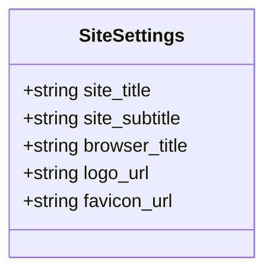
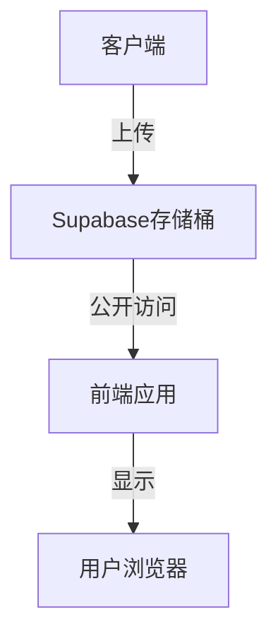
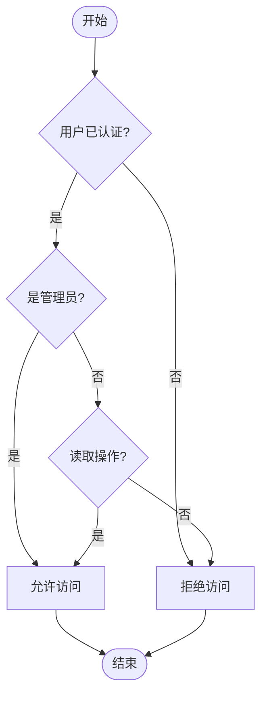
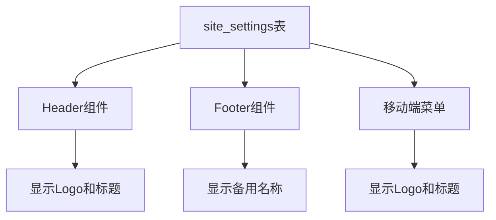
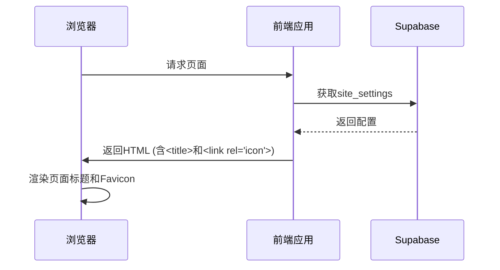
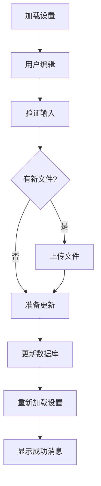

# 网站设置

<cite>
**本文档引用的文件**   
- [00014_create_site_settings_table.sql](file://supabase/migrations/00014_create_site_settings_table.sql)
- [00015_add_browser_title_to_site_settings.sql](file://supabase/migrations/00015_add_browser_title_to_site_settings.sql)
- [SiteSettingsPage.tsx](file://src/pages/admin/SiteSettingsPage.tsx)
- [types.ts](file://src/types/types.ts)
- [api.ts](file://src/db/api.ts)
- [PageMeta.tsx](file://src/components/common/PageMeta.tsx)
- [useBrowserTitle.ts](file://src/hooks/useBrowserTitle.ts)
- [Header.tsx](file://src/components/common/Header.tsx)
- [use-supabase-upload.ts](file://src/hooks/use-supabase-upload.ts)
- [supabase.ts](file://src/db/supabase.ts)
</cite>

## 目录
1. [简介](#简介)
2. [数据模型设计](#数据模型设计)
3. [核心字段详解](#核心字段详解)
4. [媒体资源管理](#媒体资源管理)
5. [前端渲染与SEO](#前端渲染与seo)
6. [配置管理界面](#配置管理界面)
7. [最佳实践](#最佳实践)

## 简介
网站设置数据模型是系统的核心配置模块，通过`site_settings`表集中管理网站的基本信息。该模型支持管理员配置网站的全局外观，包括主标题、备用名称、Logo和浏览器标签图标等。所有配置项均通过Supabase数据库存储，并实现了实时生效机制，确保前台展示与后台配置保持同步。该系统还集成了Supabase存储桶，支持安全的媒体资源上传和管理。

**Section sources**
- [00014_create_site_settings_table.sql](file://supabase/migrations/00014_create_site_settings_table.sql#L1-L146)
- [00015_add_browser_title_to_site_settings.sql](file://supabase/migrations/00015_add_browser_title_to_site_settings.sql#L1-L36)

## 数据模型设计
网站设置数据模型基于Supabase数据库的`site_settings`表，采用单记录设计模式，确保系统始终存在且仅存在一条配置记录。该表通过行级安全（RLS）策略控制访问权限，所有用户可读取配置用于前台展示，仅管理员可修改配置。

```mermaid
erDiagram
site_settings {
uuid id PK
text site_title NN
text site_subtitle
text browser_title
text logo_url
text favicon_url
timestamptz created_at
timestamptz updated_at
}
```

**Diagram sources **
- [00014_create_site_settings_table.sql](file://supabase/migrations/00014_create_site_settings_table.sql#L40-L48)
- [00015_add_browser_title_to_site_settings.sql](file://supabase/migrations/00015_add_browser_title_to_site_settings.sql#L25-L27)

**Section sources**
- [00014_create_site_settings_table.sql](file://supabase/migrations/00014_create_site_settings_table.sql#L40-L146)
- [types.ts](file://src/types/types.ts#L161-L171)

## 核心字段详解
网站设置表包含多个核心字段，每个字段都有特定的用途和约束条件。

### 文本字段
文本字段用于定义网站的基本信息，包括主标题、备用名称和浏览器标签标题。



**Diagram sources **
- [types.ts](file://src/types/types.ts#L162-L171)

#### site_title 字段
`site_title`字段是网站的主标题，为必填字段，最大长度限制为200个字符。该字段用于网站的全称或主要展示标题，在页面头部、Logo旁等位置显示。在数据库层面，该字段被定义为NOT NULL，并通过CHECK约束确保字符长度不超过200。

**Section sources**
- [00014_create_site_settings_table.sql](file://supabase/migrations/00014_create_site_settings_table.sql#L43)
- [types.ts](file://src/types/types.ts#L164)

#### site_subtitle 字段
`site_subtitle`字段是网站的备用名称或简称，为可选字段，最大长度限制为100个字符。该字段用于特定场景的替代名称或简短展示，如页脚、移动端等空间有限的区域。在数据库层面，该字段允许为空，并通过CHECK约束确保字符长度不超过100。

**Section sources**
- [00014_create_site_settings_table.sql](file://supabase/migrations/00014_create_site_settings_table.sql#L44)
- [types.ts](file://src/types/types.ts#L165)

#### browser_title 字段
`browser_title`字段用于控制浏览器标签页显示的标题，为可选字段，最大长度限制为100个字符。如果该字段为空，前端将使用默认标题"合规通 Case Wiki"。该字段对SEO优化至关重要，建议标题简洁明了，不超过60个字符以确保在浏览器标签中完整显示。

**Section sources**
- [00015_add_browser_title_to_site_settings.sql](file://supabase/migrations/00015_add_browser_title_to_site_settings.sql#L25-L35)
- [types.ts](file://src/types/types.ts#L166)

## 媒体资源管理
网站设置系统通过Supabase存储桶集成，实现了安全的媒体资源管理，支持Logo和Favicon的上传、存储和访问。

### 存储桶配置
系统创建了专用的存储桶`app-800go8thhcsh_logos`用于存储Logo和Favicon文件。该存储桶配置为公开访问，文件大小限制为2MB，允许的MIME类型包括image/png、image/jpeg、image/svg+xml等常见图片格式。



**Diagram sources **
- [00014_create_site_settings_table.sql](file://supabase/migrations/00014_create_site_settings_table.sql#L104-L113)
- [use-supabase-upload.ts](file://src/hooks/use-supabase-upload.ts#L10-L48)

**Section sources**
- [00014_create_site_settings_table.sql](file://supabase/migrations/00014_create_site_settings_table.sql#L104-L145)
- [use-supabase-upload.ts](file://src/hooks/use-supabase-upload.ts#L58-L197)

### 访问策略
存储桶的访问策略通过Supabase的行级安全（RLS）实现，确保只有管理员可以上传、更新和删除文件，而所有用户都可以读取文件用于前台展示。



**Diagram sources **
- [00014_create_site_settings_table.sql](file://supabase/migrations/00014_create_site_settings_table.sql#L115-L145)

**Section sources**
- [00014_create_site_settings_table.sql](file://supabase/migrations/00014_create_site_settings_table.sql#L115-L145)

## 前端渲染与SEO
网站设置的配置项通过前端组件实时渲染，影响网站的全局外观和SEO优化效果。

### 全局外观影响
网站的主标题、备用名称和Logo等配置项直接影响网站的全局视觉呈现。这些配置在页面头部、移动端菜单、页脚等多个位置统一显示，确保品牌形象的一致性。



**Diagram sources **
- [Header.tsx](file://src/components/common/Header.tsx#L100-L116)
- [Footer.tsx](file://src/components/common/Footer.tsx#L83-L101)

**Section sources**
- [Header.tsx](file://src/components/common/Header.tsx#L100-L116)
- [Footer.tsx](file://src/components/common/Footer.tsx#L83-L101)

### SEO优化
浏览器标签标题（browser_title）和Favicon是重要的SEO元素。`browser_title`字段直接决定HTML `<title>`标签的内容，影响搜索引擎的索引和排名。Favicon则提升网站的专业形象和品牌识别度。



**Diagram sources **
- [PageMeta.tsx](file://src/components/common/PageMeta.tsx#L7-L40)
- [useBrowserTitle.ts](file://src/hooks/useBrowserTitle.ts#L8-L23)

**Section sources**
- [PageMeta.tsx](file://src/components/common/PageMeta.tsx#L7-L40)
- [useBrowserTitle.ts](file://src/hooks/useBrowserTitle.ts#L8-L23)

## 配置管理界面
`SiteSettingsPage.tsx`是网站设置的管理界面，提供直观的表单让用户配置网站的基本信息。

### 配置更新流程
配置更新流程包括加载当前设置、用户编辑、验证输入、上传媒体文件和保存到数据库等步骤。系统实现了实时预览功能，用户在上传Logo或Favicon后可以立即看到效果。



**Diagram sources **
- [SiteSettingsPage.tsx](file://src/pages/admin/SiteSettingsPage.tsx#L54-L414)

**Section sources**
- [SiteSettingsPage.tsx](file://src/pages/admin/SiteSettingsPage.tsx#L22-L946)

### 实时生效机制
配置更新后，系统通过重新加载设置数据实现配置的实时生效。前端组件监听配置变化，自动更新页面上的标题、Logo等元素，无需刷新页面即可看到更改效果。

## 最佳实践
为了确保网站设置系统的稳定运行和良好用户体验，建议遵循以下最佳实践。

### 媒体资源上传
上传Logo和Favicon时，建议使用正方形图片，最小尺寸为200x200像素。支持PNG、JPG、SVG等格式，文件大小不超过2MB。对于Favicon，建议提供16×16px、32×32px、48×48px等多种尺寸。

**Section sources**
- [SiteSettingsPage.tsx](file://src/pages/admin/SiteSettingsPage.tsx#L84-L97)
- [SiteSettingsPage.tsx](file://src/pages/admin/SiteSettingsPage.tsx#L116-L129)

### 缓存刷新
当更新Logo或Favicon后，建议清除浏览器缓存或使用版本化URL（如添加时间戳参数）来强制刷新缓存，确保用户看到最新的图片。

### 错误处理
系统实现了完善的错误处理机制，包括文件格式验证、大小限制、URL格式验证等。当上传失败时，系统会显示详细的错误信息，并建议用户切换到URL输入模式作为替代方案。

**Section sources**
- [SiteSettingsPage.tsx](file://src/pages/admin/SiteSettingsPage.tsx#L70-L76)
- [SiteSettingsPage.tsx](file://src/pages/admin/SiteSettingsPage.tsx#L406-L413)