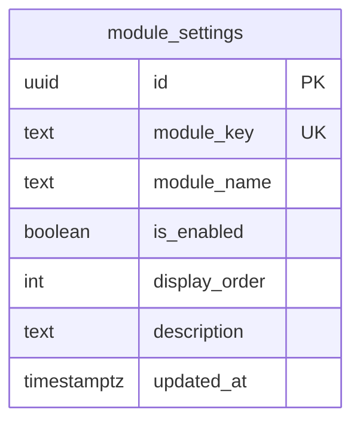
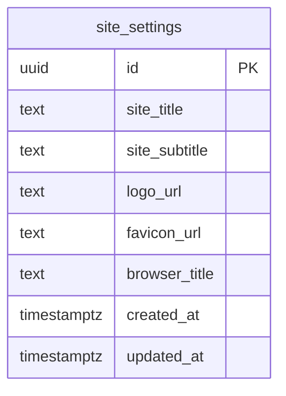
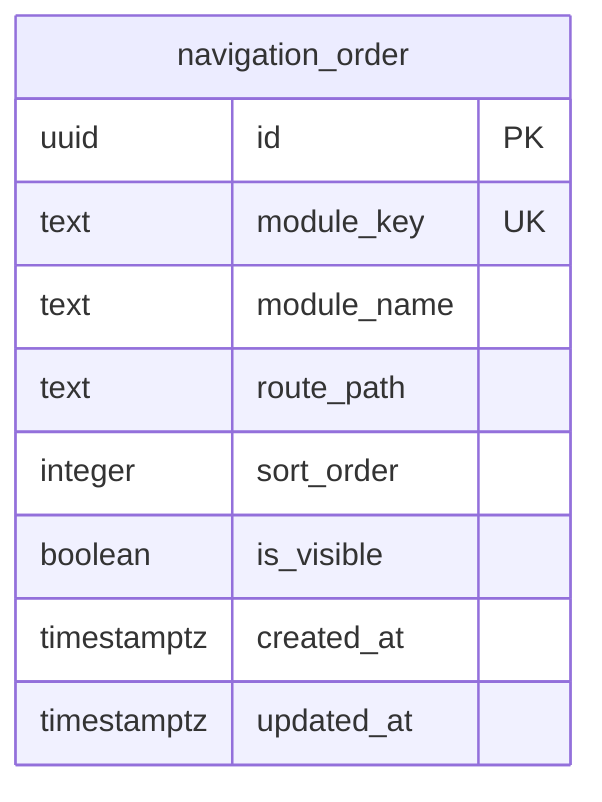
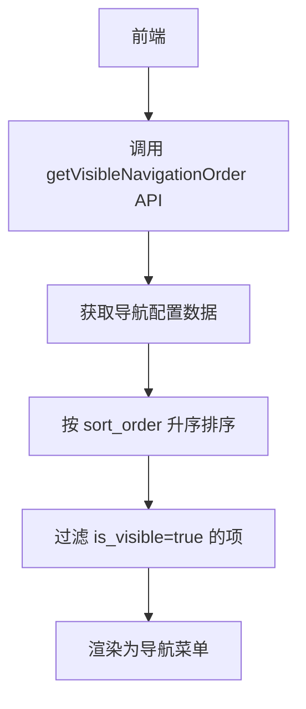
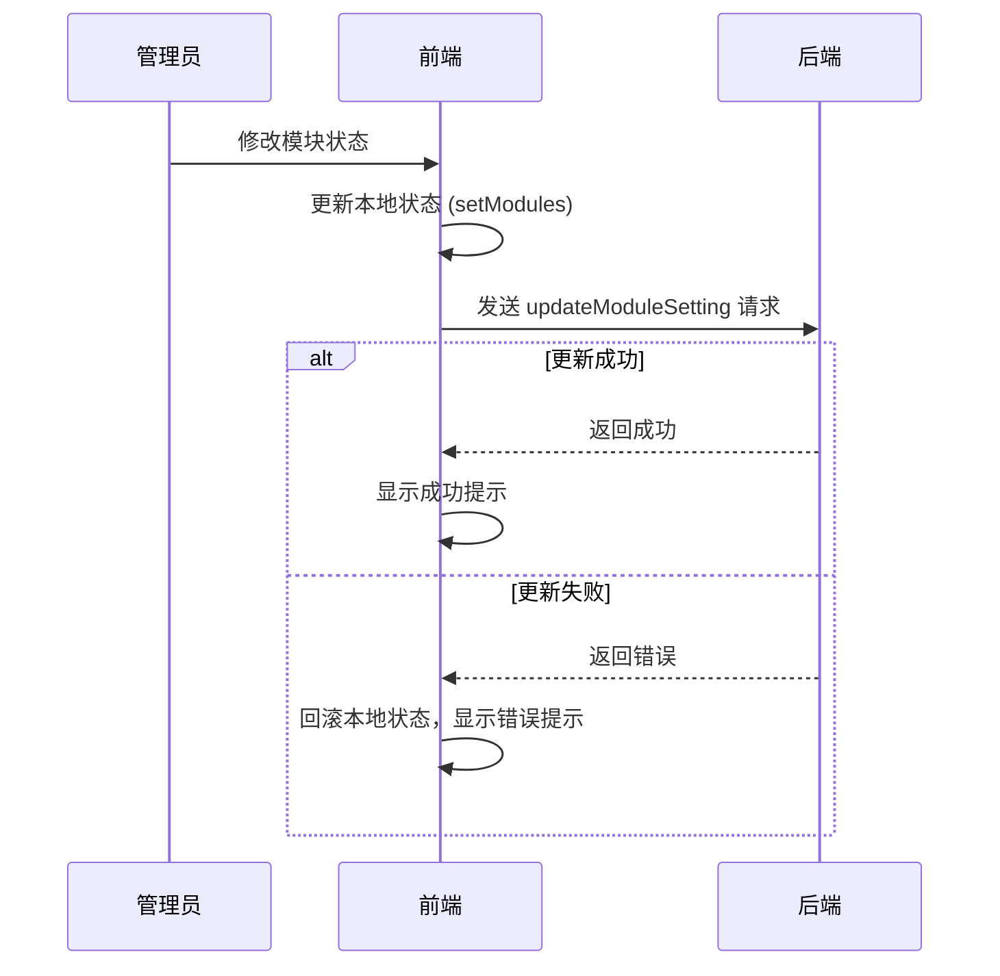
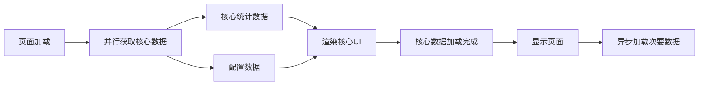

# 配置数据模型

<cite>
**本文档引用文件**   
- [00008_create_module_settings.sql](file://supabase/migrations/00008_create_module_settings.sql)
- [00014_create_site_settings_table.sql](file://supabase/migrations/00014_create_site_settings_table.sql)
- [00018_create_navigation_order_table.sql](file://supabase/migrations/00018_create_navigation_order_table.sql)
- [ModuleSettingsPage.tsx](file://src/pages/admin/ModuleSettingsPage.tsx)
- [SiteSettingsPage.tsx](file://src/pages/admin/SiteSettingsPage.tsx)
- [NavigationOrderPage.tsx](file://src/pages/admin/NavigationOrderPage.tsx)
- [api.ts](file://src/db/api.ts)
- [types.ts](file://src/types/types.ts)
</cite>

## 目录
1. [模块设置表 (module_settings)](#模块设置表-module_settings)
2. [站点设置表 (site_settings)](#站点设置表-site_settings)
3. [导航排序表 (navigation_order)](#导航排序表-navigation_order)
4. [配置数据缓存与同步机制](#配置数据缓存与同步机制)
5. [最佳实践](#最佳实践)

## 模块设置表 (module_settings)

`module_settings` 表是控制前台功能模块可见性和显示顺序的核心配置表。它通过 `module_key` 唯一标识每个模块，并提供启用/禁用和排序功能。

该表的设计旨在实现模块化管理，允许管理员在不修改代码的情况下动态调整系统功能的展示。每个模块都有一个唯一的 `module_key`（如 `cases`、`news`），确保了配置的准确性和可追溯性。



**图表来源**
- [00008_create_module_settings.sql](file://supabase/migrations/00008_create_module_settings.sql#L30-L39)

**章节来源**
- [00008_create_module_settings.sql](file://supabase/migrations/00008_create_module_settings.sql#L1-L78)
- [ModuleSettingsPage.tsx](file://src/pages/admin/ModuleSettingsPage.tsx#L1-L167)

### module_key 唯一性约束

`module_key` 字段被定义为 `UNIQUE NOT NULL`，这是整个配置系统稳定运行的关键。此约束确保了每个模块的标识符在系统中是唯一的，防止了配置冲突和数据混乱。

```sql
module_key text UNIQUE NOT NULL,
```

这种设计模式使得前端可以通过 `module_key` 安全地查询和引用模块配置，而无需担心重复或歧义。例如，`cases` 键始终指向“案例查询模块”，`trends` 键始终指向“趋势分析模块”。这种强约束是实现模块化和可维护性的基础。

**章节来源**
- [00008_create_module_settings.sql](file://supabase/migrations/00008_create_module_settings.sql#L33)

### display_order 排序机制

`display_order` 字段用于控制模块在前台的显示顺序。其设计遵循简单有效的原则，使用整数进行排序，数值越小，优先级越高。

```sql
display_order int DEFAULT 0 NOT NULL,
```

排序机制通过在查询时使用 `ORDER BY display_order ASC` 来实现。例如，在 `api.ts` 中的 `getModuleSettings` 函数就应用了此排序：

```typescript
.from('module_settings')
.select('*')
.order('display_order', { ascending: true });
```

这种机制允许管理员通过简单的数字调整来改变模块的排列，而无需复杂的拖拽逻辑或位置交换算法，极大地简化了管理操作。

**章节来源**
- [00008_create_module_settings.sql](file://supabase/migrations/00008_create_module_settings.sql#L36)
- [api.ts](file://src/db/api.ts#L2536-L2540)

## 站点设置表 (site_settings)

`site_settings` 表用于存储网站的基本信息和品牌标识，是实现网站个性化配置的核心。它包含了网站的标题、Logo等关键信息。

该表的设计考虑了数据安全和访问控制，启用了行级安全（RLS），确保只有管理员可以修改配置，而所有用户都可以读取配置以用于前台展示。



**图表来源**
- [00014_create_site_settings_table.sql](file://supabase/migrations/00014_create_site_settings_table.sql#L41-L48)

**章节来源**
- [00014_create_site_settings_table.sql](file://supabase/migrations/00014_create_site_settings_table.sql#L1-L146)
- [SiteSettingsPage.tsx](file://src/pages/admin/SiteSettingsPage.tsx#L1-L800)

### 媒体资源字段存储与访问

`site_settings` 表中的 `logo_url` 和 `favicon_url` 字段存储了媒体资源的URL。系统支持两种资源管理方式：**上传至内部存储桶**和**引用外部URL**。

#### 存储路径与策略

- **内部存储**：系统创建了名为 `app-800go8thhcsh_logos` 的公开存储桶。上传的Logo和Favicon文件将存储在此桶中，其URL为 `https://<supabase-url>/storage/v1/object/public/app-800go8thhcsh_logos/<filename>`。
- **外部引用**：管理员可以直接输入外部图床（如 ImgBB、Imgur）的图片URL。

#### 访问策略

- **上传限制**：仅管理员可上传，文件大小限制为2MB，允许的MIME类型为 `image/png`, `image/jpeg`, `image/svg+xml`。
- **访问权限**：存储桶设置为公开，确保所有用户都能访问Logo和Favicon。
- **前端集成**：`Header` 组件会调用 `getSiteSettings` API 获取配置，并动态渲染Logo和标题。

这种双模式设计提供了极大的灵活性，既保证了核心资源的可控性，又允许在存储桶不可用时通过外部资源快速恢复。

**章节来源**
- [00014_create_site_settings_table.sql](file://supabase/migrations/00014_create_site_settings_table.sql#L104-L145)
- [SiteSettingsPage.tsx](file://src/pages/admin/SiteSettingsPage.tsx#L79-L284)

## 导航排序表 (navigation_order)

`navigation_order` 表专门用于管理前端导航菜单的排序和显示控制，实现了导航栏的动态配置。

与 `module_settings` 表不同，此表更侧重于UI层面的布局，允许管理员独立于模块启用状态来调整导航项的顺序和可见性。



**图表来源**
- [00018_create_navigation_order_table.sql](file://supabase/migrations/00018_create_navigation_order_table.sql#L30-L39)

**章节来源**
- [00018_create_navigation_order_table.sql](file://supabase/migrations/00018_create_navigation_order_table.sql#L1-L83)
- [NavigationOrderPage.tsx](file://src/pages/admin/NavigationOrderPage.tsx#L1-L296)

### 动态导航菜单实现

导航菜单的动态排序与显示控制通过以下机制实现：

1.  **数据获取**：前端通过 `getNavigationOrder` 或 `getVisibleNavigationOrder` API 获取导航配置。
2.  **排序**：根据 `sort_order` 字段对数据进行升序排序。
3.  **过滤**：根据 `is_visible` 字段过滤出可见的导航项。
4.  **渲染**：将处理后的数据映射为导航菜单项。



**图表来源**
- [api.ts](file://src/db/api.ts#L2767-L2789)

管理员可以通过 `NavigationOrderPage` 管理页面直观地调整 `sort_order` 数值和 `is_visible` 开关，所有更改在保存后立即生效，无需重启服务。

**章节来源**
- [api.ts](file://src/db/api.ts#L2767-L2848)
- [NavigationOrderPage.tsx](file://src/pages/admin/NavigationOrderPage.tsx#L1-L296)

## 配置数据缓存与同步机制

为了提升性能和用户体验，系统对配置数据采用了合理的缓存与同步策略。

### 缓存策略

- **客户端缓存**：前端组件（如 `ModuleSettingsPage`）在加载配置后，会将其存储在组件状态（`useState`）中。在用户进行修改但未保存期间，所有操作都在本地状态中进行，避免了频繁的API调用。
- **浏览器缓存**：由于配置数据相对稳定，浏览器会缓存 `GET` 请求的响应，减少重复加载时的网络开销。

### 更新同步机制

系统采用“先本地，后远程”的同步模式，确保操作的流畅性和数据的一致性。



**图表来源**
- [ModuleSettingsPage.tsx](file://src/pages/admin/ModuleSettingsPage.tsx#L35-L63)

此机制的核心在于**乐观更新**：前端先假设操作会成功，立即更新UI，给用户即时反馈。如果后端更新失败，则回滚UI并提示错误。这极大地提升了管理后台的响应速度。

**章节来源**
- [ModuleSettingsPage.tsx](file://src/pages/admin/ModuleSettingsPage.tsx#L35-L63)
- [api.ts](file://src/db/api.ts#L2555-L2565)

## 最佳实践

### 前端响应式加载

对于包含配置数据的页面，应采用响应式加载策略，优先展示核心内容。



**图表来源**
- [首页性能优化说明.md](file://docs/首页性能优化说明.md#L180-L218)

例如，在首页加载时，应优先获取 `StatsOverview` 和 `FrontendConfig`，确保页面骨架和核心数据能快速呈现，再异步加载图表等次要数据。

### 配置管理最佳实践

1.  **使用 `module_key` 作为唯一标识**：在代码中引用模块时，始终使用 `module_key`，避免使用可能变化的 `module_name`。
2.  **提供默认值**：在前端代码中，应对配置数据的获取失败或空值提供合理的默认值，保证系统稳定性。
3.  **批量操作**：对于需要同时更新多个配置项的场景（如导航排序），应使用批量更新API（`updateNavigationOrder`），减少网络请求次数。
4.  **输入验证**：在管理页面中，对用户输入进行严格验证（如字符长度、URL格式、文件类型），并在保存前进行二次确认。