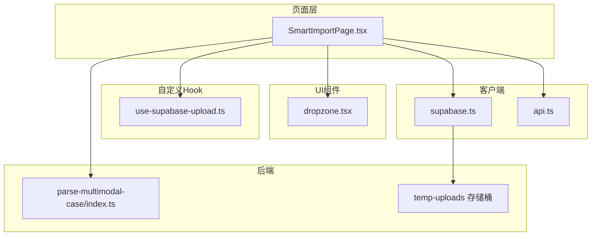
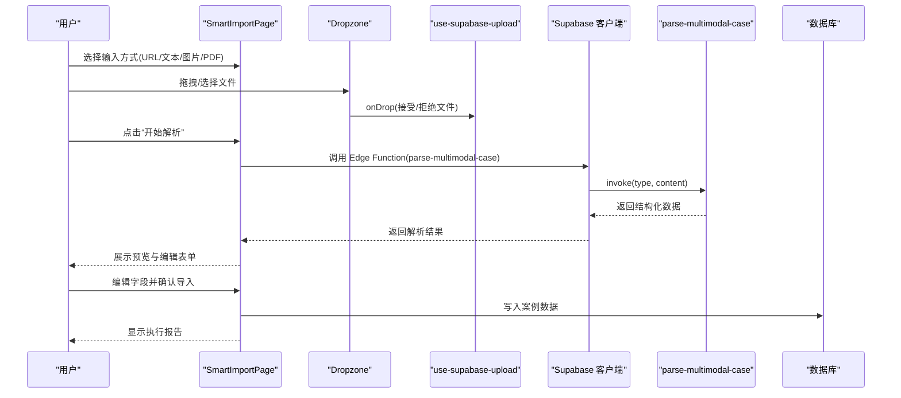
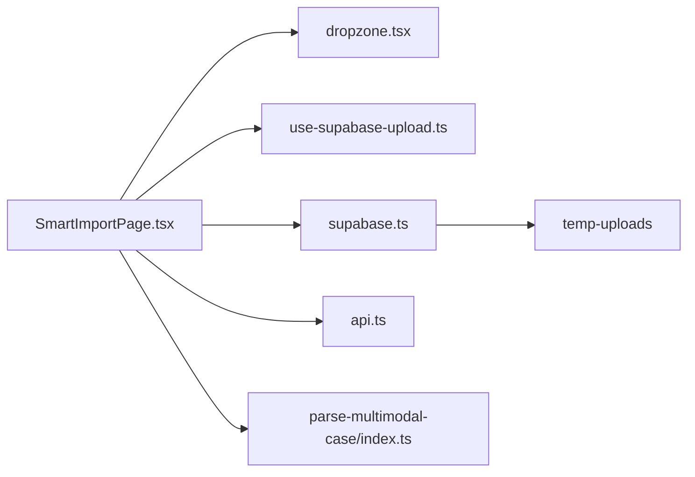

# 前端上传与交互

<cite>
**本文引用的文件**
- [SmartImportPage.tsx](file://src/pages/admin/SmartImportPage.tsx)
- [dropzone.tsx](file://src/components/dropzone.tsx)
- [use-supabase-upload.ts](file://src/hooks/use-supabase-upload.ts)
- [supabase.ts](file://src/db/supabase.ts)
- [api.ts](file://src/db/api.ts)
- [index.ts](file://supabase/functions/parse-multimodal-case/index.ts)
- [00002_create_temp_uploads_bucket.sql](file://supabase/migrations/00002_create_temp_uploads_bucket.sql)
</cite>

## 目录
1. [简介](#简介)
2. [项目结构](#项目结构)
3. [核心组件](#核心组件)
4. [架构总览](#架构总览)
5. [详细组件分析](#详细组件分析)
6. [依赖关系分析](#依赖关系分析)
7. [性能考量](#性能考量)
8. [故障排查指南](#故障排查指南)
9. [结论](#结论)
10. [附录](#附录)

## 简介
本文件面向“智能案例导入”页面（SmartImportPage），系统性梳理前端上传与交互流程，重点覆盖：
- 基于现有组件的拖拽上传交互设计与文件校验（类型、大小、数量）
- use-supabase-upload 自定义 Hook 如何与 Supabase 存储桶集成，实现上传、错误反馈与状态管理
- 上传后数据预览与用户可编辑字段的交互方式
- 错误提示与用户体验优化策略

说明：当前仓库中 SmartImportPage 的图片/PDF 上传采用“本地校验+临时存储”的模式；CSV/Excel 的批量导入由独立的“案例管理”页面负责，不在本文件讨论范围内。

## 项目结构
SmartImportPage 位于页面层，依赖 UI 组件、自定义 Hook、Supabase 客户端与后端 Edge Function。整体组织如下：
- 页面层：SmartImportPage.tsx
- UI 组件：dropzone.tsx
- 自定义 Hook：use-supabase-upload.ts
- Supabase 客户端：supabase.ts
- 数据访问层：api.ts
- 后端函数：parse-multimodal-case/index.ts
- 存储桶配置：supabase/migrations/00002_create_temp_uploads_bucket.sql



图表来源
- [SmartImportPage.tsx](file://src/pages/admin/SmartImportPage.tsx#L1-L120)
- [dropzone.tsx](file://src/components/dropzone.tsx#L1-L60)
- [use-supabase-upload.ts](file://src/hooks/use-supabase-upload.ts#L1-L60)
- [supabase.ts](file://src/db/supabase.ts#L1-L8)
- [api.ts](file://src/db/api.ts#L1-L60)
- [index.ts](file://supabase/functions/parse-multimodal-case/index.ts#L1-L40)
- [00002_create_temp_uploads_bucket.sql](file://supabase/migrations/00002_create_temp_uploads_bucket.sql#L1-L30)

章节来源
- [SmartImportPage.tsx](file://src/pages/admin/SmartImportPage.tsx#L1-L120)
- [dropzone.tsx](file://src/components/dropzone.tsx#L1-L60)
- [use-supabase-upload.ts](file://src/hooks/use-supabase-upload.ts#L1-L60)
- [supabase.ts](file://src/db/supabase.ts#L1-L8)
- [api.ts](file://src/db/api.ts#L1-L60)
- [index.ts](file://supabase/functions/parse-multimodal-case/index.ts#L1-L40)
- [00002_create_temp_uploads_bucket.sql](file://supabase/migrations/00002_create_temp_uploads_bucket.sql#L1-L30)

## 核心组件
- SmartImportPage：多模态输入入口，负责 Tab 切换、输入校验、调用 Edge Function、渲染预览与导入执行报告
- Dropzone 组件：拖拽上传 UI，展示文件列表、错误与成功状态，触发上传
- use-supabase-upload Hook：封装 react-dropzone，对接 Supabase Storage，管理文件集合、上传状态与错误
- Supabase 客户端：创建 Supabase 实例，用于调用 Edge Function 与 Storage
- Edge Function：parse-multimodal-case，统一处理 URL/文本/图片/PDF 四类输入，返回结构化数据

章节来源
- [SmartImportPage.tsx](file://src/pages/admin/SmartImportPage.tsx#L1-L120)
- [dropzone.tsx](file://src/components/dropzone.tsx#L1-L60)
- [use-supabase-upload.ts](file://src/hooks/use-supabase-upload.ts#L1-L60)
- [supabase.ts](file://src/db/supabase.ts#L1-L8)
- [index.ts](file://supabase/functions/parse-multimodal-case/index.ts#L1-L40)

## 架构总览
SmartImportPage 的上传与解析流程如下：



图表来源
- [SmartImportPage.tsx](file://src/pages/admin/SmartImportPage.tsx#L105-L177)
- [dropzone.tsx](file://src/components/dropzone.tsx#L120-L179)
- [use-supabase-upload.ts](file://src/hooks/use-supabase-upload.ts#L108-L159)
- [index.ts](file://supabase/functions/parse-multimodal-case/index.ts#L22-L121)
- [api.ts](file://src/db/api.ts#L599-L626)

## 详细组件分析

### SmartImportPage 上传与解析流程
- 输入方式与校验
  - URL/文本：直接校验非空
  - 图片/PDF：要求已上传文件存在
- 文件上传
  - 本地类型与大小校验（图片≤5MB，PDF≤10MB）
  - 上传至 Supabase Storage 的 temp-uploads 桶，生成公开 URL
  - 成功后显示“上传成功”，失败弹出错误提示
- 调用 Edge Function
  - 统一调用 parse-multimodal-case，传入 type 与 content
  - 解析成功后设置解析数据与编辑副本，失败弹出错误提示
- 预览与编辑
  - 展示置信度与警告
  - 可编辑字段：应用名称、通报日期、开发者、监管部门、应用平台、违规摘要、原文链接
- 导入执行
  - 校验必填字段
  - 并发获取部门/平台列表，自动创建缺失项
  - 写入案例数据，生成执行报告，清理临时文件

章节来源
- [SmartImportPage.tsx](file://src/pages/admin/SmartImportPage.tsx#L46-L103)
- [SmartImportPage.tsx](file://src/pages/admin/SmartImportPage.tsx#L105-L177)
- [SmartImportPage.tsx](file://src/pages/admin/SmartImportPage.tsx#L189-L335)
- [SmartImportPage.tsx](file://src/pages/admin/SmartImportPage.tsx#L611-L736)
- [SmartImportPage.tsx](file://src/pages/admin/SmartImportPage.tsx#L741-L823)

### Dropzone 组件与 use-supabase-upload Hook
- Dropzone 组件职责
  - 展示空状态、文件列表、错误与成功状态
  - 提供“上传”按钮，触发批量上传
  - 支持移除文件、显示文件大小、最大文件数提示
- use-supabase-upload Hook 能力
  - 基于 react-dropzone 的 onDrop、accept、maxSize、maxFiles、multiple
  - 管理 files、successes、errors、loading、isSuccess 状态
  - onUpload 并行上传，支持部分重试（仅对上次失败的文件）
  - 自动清理“文件过多”错误（当文件数回到上限以内）

```mermaid
classDiagram
class Dropzone {
+props : className, children, getRootProps, getInputProps
+isSuccess : boolean
+isDragActive : boolean
+isDragReject : boolean
+errors : FileError[]
+files : File[]
}
class UseSupabaseUpload {
+files : File[]
+successes : string[]
+errors : {name,message}[]
+loading : boolean
+isSuccess : boolean
+onDrop(acceptedFiles, fileRejections)
+onUpload()
+setFiles(files)
+setErrors(errors)
}
Dropzone --> UseSupabaseUpload : "消费状态与回调"
```

图表来源
- [dropzone.tsx](file://src/components/dropzone.tsx#L1-L60)
- [dropzone.tsx](file://src/components/dropzone.tsx#L62-L179)
- [use-supabase-upload.ts](file://src/hooks/use-supabase-upload.ts#L58-L195)

章节来源
- [dropzone.tsx](file://src/components/dropzone.tsx#L1-L179)
- [use-supabase-upload.ts](file://src/hooks/use-supabase-upload.ts#L58-L195)

### Supabase 存储桶与安全策略
- temp-uploads 存储桶
  - 公开访问关闭，仅认证用户可访问
  - 文件大小限制：10MB
  - 允许类型：image/jpeg、image/png、image/jpg、application/pdf
- RLS 策略
  - 仅管理员可上传、读取、删除 temp-uploads 中的对象
- 前端上传路径
  - SmartImportPage 将文件上传到 temp-uploads/temp/{timestamp}-{filename}
  - 生成公开 URL 供 Edge Function 解析使用

章节来源
- [00002_create_temp_uploads_bucket.sql](file://supabase/migrations/00002_create_temp_uploads_bucket.sql#L1-L54)
- [SmartImportPage.tsx](file://src/pages/admin/SmartImportPage.tsx#L73-L90)

### Edge Function：parse-multimodal-case
- 输入类型路由
  - URL：抓取网页内容（限制大小、协议校验、超时控制）
  - 文本：直接处理
  - 图片/PDF：当前版本返回提示信息（未来将集成 OCR/PDF 解析）
- 输出结构
  - 包含 report_date、app_name、developer、department、platform、violation_summary、violation_detail、source_url、confidence、warnings、input_type
- 错误处理
  - 参数缺失、类型非法、网络/超时、内部异常均返回明确错误信息

章节来源
- [index.ts](file://supabase/functions/parse-multimodal-case/index.ts#L1-L121)
- [index.ts](file://supabase/functions/parse-multimodal-case/index.ts#L131-L213)
- [index.ts](file://supabase/functions/parse-multimodal-case/index.ts#L214-L368)

### 数据预览与用户编辑交互
- 预览卡片
  - 展示置信度等级与警告列表
  - 显示原始来源链接（若有）
- 编辑表单
  - 字段：应用名称（必填）、通报日期（必填）、开发者、监管部门、应用平台、违规摘要、原文链接
  - 交互：受控组件，实时更新编辑副本
- 导入执行
  - 必填校验、并发获取部门/平台列表、自动创建缺失项
  - 写入数据库，生成执行报告，清理临时文件

章节来源
- [SmartImportPage.tsx](file://src/pages/admin/SmartImportPage.tsx#L591-L736)
- [SmartImportPage.tsx](file://src/pages/admin/SmartImportPage.tsx#L741-L823)
- [api.ts](file://src/db/api.ts#L599-L626)

## 依赖关系分析
- 组件耦合
  - SmartImportPage 依赖 Dropzone 与 use-supabase-upload，形成“UI-状态-上传”的清晰边界
  - use-supabase-upload 仅依赖 Supabase 客户端与 react-dropzone，内聚性良好
- 外部依赖
  - Supabase Storage：临时文件存储与公开 URL 生成
  - Supabase Edge Function：统一解析入口
  - 后端数据库：写入案例数据
- 潜在循环依赖
  - 当前文件间无循环导入，结构清晰



图表来源
- [SmartImportPage.tsx](file://src/pages/admin/SmartImportPage.tsx#L1-L120)
- [dropzone.tsx](file://src/components/dropzone.tsx#L1-L60)
- [use-supabase-upload.ts](file://src/hooks/use-supabase-upload.ts#L1-L60)
- [supabase.ts](file://src/db/supabase.ts#L1-L8)
- [api.ts](file://src/db/api.ts#L1-L60)
- [index.ts](file://supabase/functions/parse-multimodal-case/index.ts#L1-L40)
- [00002_create_temp_uploads_bucket.sql](file://supabase/migrations/00002_create_temp_uploads_bucket.sql#L1-L30)

## 性能考量
- 上传性能
  - use-supabase-upload 支持批量上传与部分重试，减少用户等待
  - 前端限制文件数量与大小，避免超大对象导致网络拥塞
- 解析性能
  - Edge Function 对 URL 抓取设置了超时与大小限制，避免长时间阻塞
  - 文本/图片/PDF 的处理逻辑尽量轻量化，图片/PDF 当前版本返回提示，避免复杂计算
- UI 响应
  - Loading 状态与禁用按钮提升交互反馈
  - 分步流程（上传→解析→编辑→导入）降低单次操作复杂度

[本节为通用指导，无需列出具体文件来源]

## 故障排查指南
- 上传失败
  - 检查文件类型是否为图片或 PDF
  - 检查文件大小是否超过限制（图片≤5MB，PDF≤10MB）
  - 查看 Supabase 存储桶策略与 RLS 是否允许当前用户访问
- 解析失败
  - URL 输入需为 HTTP/HTTPS，且内容大小不超过限制
  - 文本输入需包含足够上下文信息
  - 图片/PDF 当前版本需手动填写信息
- 导入失败
  - 确认必填字段（应用名称、通报日期）已填写
  - 检查部门/平台是否存在，必要时允许自动创建
  - 查看执行报告中的警告与错误详情

章节来源
- [SmartImportPage.tsx](file://src/pages/admin/SmartImportPage.tsx#L46-L103)
- [SmartImportPage.tsx](file://src/pages/admin/SmartImportPage.tsx#L105-L177)
- [SmartImportPage.tsx](file://src/pages/admin/SmartImportPage.tsx#L189-L335)
- [index.ts](file://supabase/functions/parse-multimodal-case/index.ts#L131-L213)
- [00002_create_temp_uploads_bucket.sql](file://supabase/migrations/00002_create_temp_uploads_bucket.sql#L1-L54)

## 结论
SmartImportPage 通过“本地校验 + Supabase 临时存储 + Edge Function 统一解析”的架构，实现了多模态输入与上传流程的清晰分离。use-supabase-upload Hook 提供了稳健的上传状态管理与错误反馈，配合 Dropzone 组件提升了交互体验。当前图片/PDF 的解析仍需人工核对，后续可扩展 OCR/PDF 解析能力以进一步提升自动化水平。

[本节为总结性内容，无需列出具体文件来源]

## 附录

### 文件格式与大小限制
- 图片：JPG、PNG（最大 5MB）
- PDF：PDF（最大 10MB）
- 存储桶：temp-uploads（最大 10MB，仅管理员可读写）

章节来源
- [SmartImportPage.tsx](file://src/pages/admin/SmartImportPage.tsx#L46-L103)
- [00002_create_temp_uploads_bucket.sql](file://supabase/migrations/00002_create_temp_uploads_bucket.sql#L1-L30)

### CSV/Excel 批量导入（独立页面）
- 该功能由“案例管理”页面提供，包含数据验证、错误提示与批量导入逻辑
- 本文件不涉及该页面的实现细节

章节来源
- [api.ts](file://src/db/api.ts#L666-L725)
- [api.ts](file://src/db/api.ts#L727-L800)