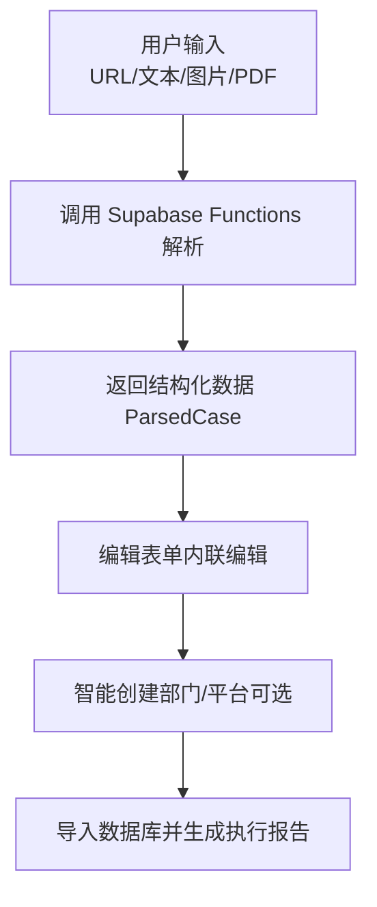
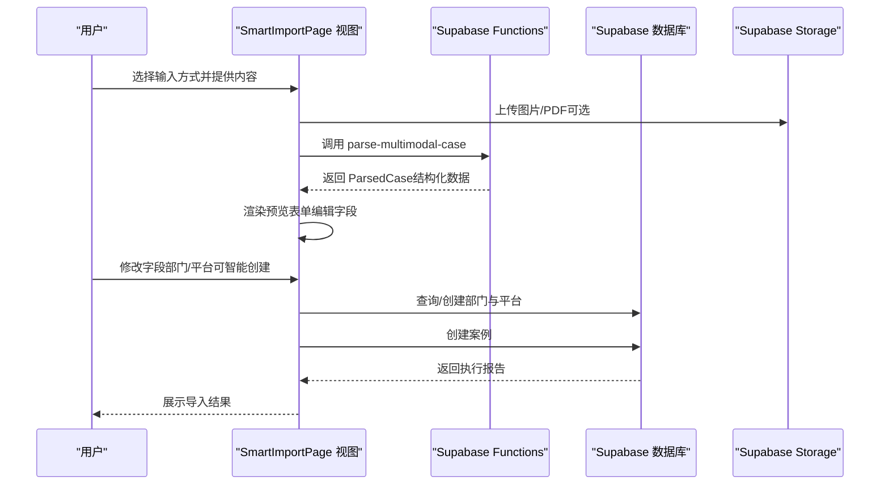
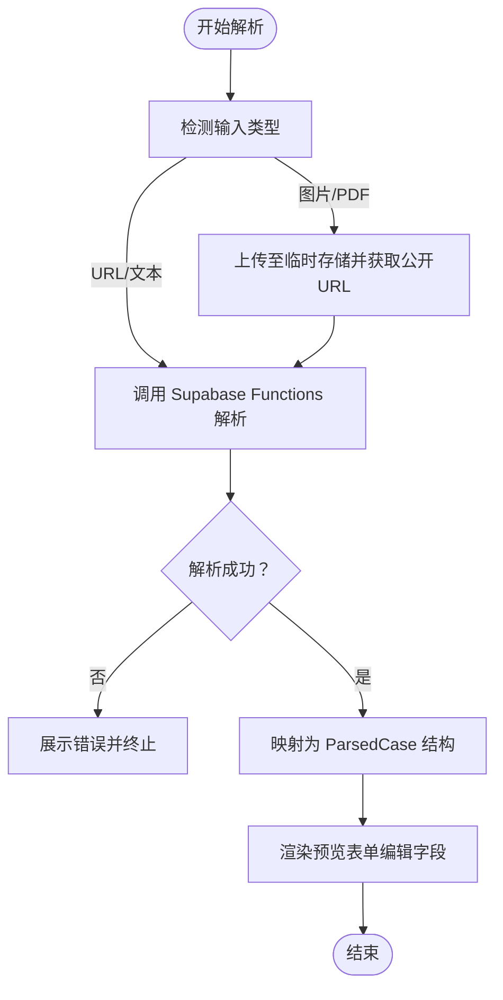
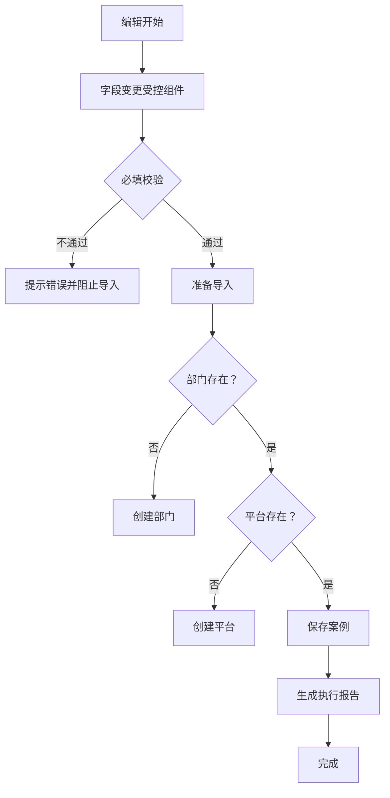
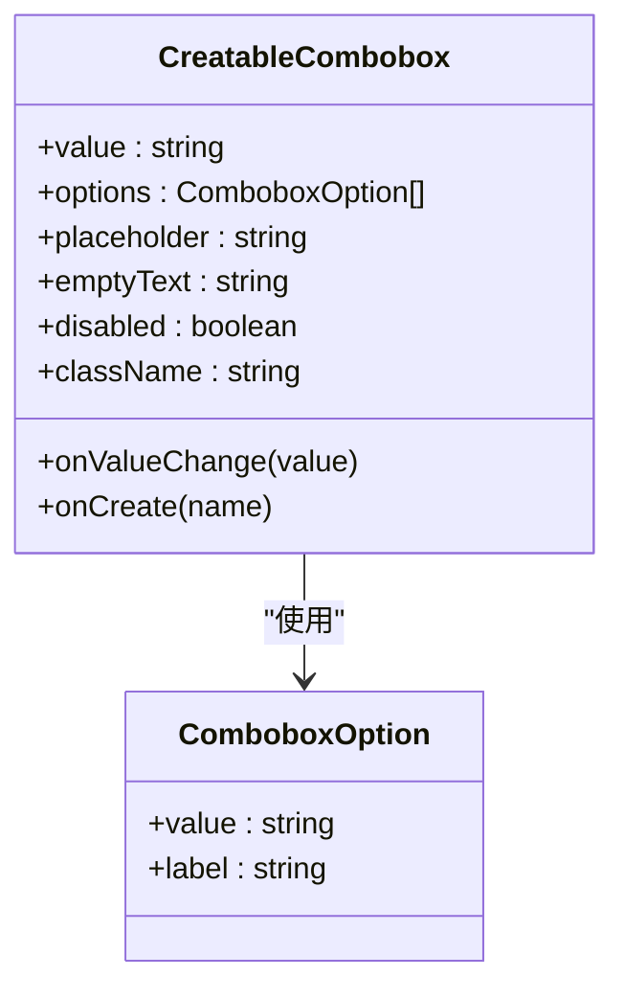
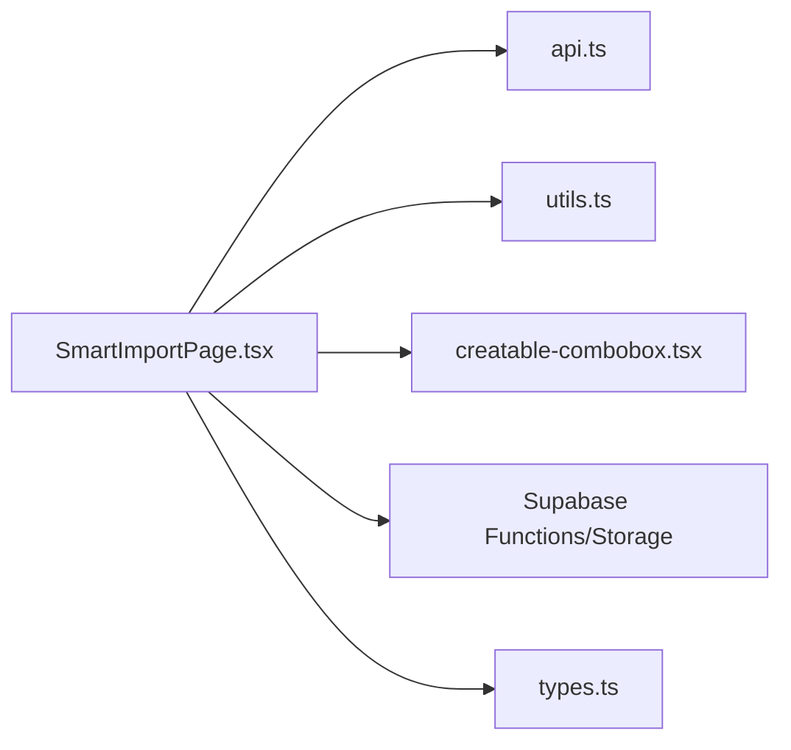

# 数据预览与交互编辑

<cite>
**本文引用的文件**
- [SmartImportPage.tsx](file://src/pages/admin/SmartImportPage.tsx)
- [creatable-combobox.tsx](file://src/components/ui/creatable-combobox.tsx)
- [api.ts](file://src/db/api.ts)
- [utils.ts](file://src/lib/utils.ts)
- [use-debounce.ts](file://src/hooks/use-debounce.ts)
- [use-supabase-upload.ts](file://src/hooks/use-supabase-upload.ts)
- [types.ts](file://src/types/types.ts)
</cite>

## 目录
1. [引言](#引言)
2. [项目结构](#项目结构)
3. [核心组件](#核心组件)
4. [架构总览](#架构总览)
5. [详细组件分析](#详细组件分析)
6. [依赖关系分析](#依赖关系分析)
7. [性能考虑](#性能考虑)
8. [故障排查指南](#故障排查指南)
9. [结论](#结论)

## 引言
本文聚焦于 SmartImportPage 中“上传成功后数据预览表格”的渲染逻辑，围绕以下目标展开：
- 如何解析 CSV/Excel 内容并映射为结构化数据表，展示前几行样本供用户确认；
- 可编辑字段的设计模式：内联编辑、输入验证、实时保存状态反馈；
- 用户如何修正识别错误字段（如部门名称、平台名称），并通过 creatable-combobox.tsx 实现“智能创建新条目”；
- 性能优化策略：虚拟滚动处理大数据集、防抖提交机制，确保界面响应流畅。

## 项目结构
SmartImportPage 位于后台管理页面，负责多模态输入（URL、文本、图片、PDF）的解析与预览，随后进入“检查并编辑数据”阶段，最终导入数据库。其核心流程如下：
- 输入选择与上传（图片/PDF）；
- 调用 Supabase Functions 执行解析；
- 展示解析结果（置信度、警告、字段预览）；
- 用户编辑字段（含可选的智能创建部门/平台）；
- 导入数据库并生成执行报告。

图表来源
- [SmartImportPage.tsx](file://src/pages/admin/SmartImportPage.tsx#L105-L187)
- [api.ts](file://src/db/api.ts#L599-L608)

章节来源
- [SmartImportPage.tsx](file://src/pages/admin/SmartImportPage.tsx#L105-L187)
- [api.ts](file://src/db/api.ts#L599-L608)

## 核心组件
- SmartImportPage：负责输入、解析、预览、编辑、导入全流程。
- creatable-combobox：提供可创建新选项的下拉组合框，支持“智能创建”。
- 数据库 API：提供 getDepartments/getPlatforms/createDepartment/createPlatform 等能力。
- 工具函数：parseExcelDate（日期解析）、useDebounce（防抖）、use-supabase-upload（上传 Hook）。
- 类型定义：ParsedCase、CaseImportData 等。

章节来源
- [SmartImportPage.tsx](file://src/pages/admin/SmartImportPage.tsx#L16-L31)
- [creatable-combobox.tsx](file://src/components/ui/creatable-combobox.tsx#L1-L156)
- [api.ts](file://src/db/api.ts#L56-L64)
- [utils.ts](file://src/lib/utils.ts#L41-L118)
- [use-debounce.ts](file://src/hooks/use-debounce.ts#L1-L15)
- [use-supabase-upload.ts](file://src/hooks/use-supabase-upload.ts#L1-L198)
- [types.ts](file://src/types/types.ts#L133-L142)

## 架构总览
SmartImportPage 的数据流自上而下分为三层：
- 视图层（UI）：Tabs、Input、Textarea、Alert、Button 等；
- 业务层（逻辑）：handleParse、handleImport、编辑状态管理；
- 数据层（API）：Supabase Functions、Supabase Storage、数据库 CRUD。

图表来源
- [SmartImportPage.tsx](file://src/pages/admin/SmartImportPage.tsx#L105-L335)
- [api.ts](file://src/db/api.ts#L56-L64)
- [api.ts](file://src/db/api.ts#L275-L284)
- [api.ts](file://src/db/api.ts#L375-L384)
- [api.ts](file://src/db/api.ts#L599-L608)

## 详细组件分析

### 1) CSV/Excel 文件解析与结构化映射
- SmartImportPage 当前支持“URL、文本、图片、PDF”四类输入。其中图片与 PDF 的上传仅用于生成公开 URL，解析仍由 Supabase Functions 完成。
- 解析成功后，服务端返回结构化数据 ParsedCase，前端将其赋值给 parsedData 与 editedData，用于预览与编辑。
- 对于日期字段，若来自 Excel，可借助 parseExcelDate 进行标准化（YYYY-MM-DD）。该工具在 CaseManagePage 中被直接使用，用于批量导入场景。

图表来源
- [SmartImportPage.tsx](file://src/pages/admin/SmartImportPage.tsx#L105-L187)
- [utils.ts](file://src/lib/utils.ts#L41-L118)

章节来源
- [SmartImportPage.tsx](file://src/pages/admin/SmartImportPage.tsx#L105-L187)
- [utils.ts](file://src/lib/utils.ts#L41-L118)

### 2) 数据预览表格与内联编辑
- SmartImportPage 渲染一个网格表单，包含应用名称、通报日期、开发者/运营者、监管部门、应用平台、主要违规内容、原文链接等字段。
- 字段采用受控组件模式：每个输入框绑定 editedData 的对应属性，onChange 时通过浅拷贝更新状态，实现“内联编辑”。
- 必填校验：导入前会对应用名称与通报日期进行非空校验，失败则弹出提示。
- 置信度与警告：解析结果包含 confidence 与 warnings，界面以徽章与 Alert 展示，帮助用户判断准确性。

图表来源
- [SmartImportPage.tsx](file://src/pages/admin/SmartImportPage.tsx#L189-L335)
- [api.ts](file://src/db/api.ts#L275-L284)
- [api.ts](file://src/db/api.ts#L375-L384)

章节来源
- [SmartImportPage.tsx](file://src/pages/admin/SmartImportPage.tsx#L189-L335)
- [api.ts](file://src/db/api.ts#L275-L284)
- [api.ts](file://src/db/api.ts#L375-L384)

### 3) 可编辑字段设计模式
- 内联编辑：每个字段均为 Input/Textarea，值来自 editedData，onChange 更新状态，无需额外提交按钮即可即时生效。
- 输入验证：导入前进行必填校验；解析阶段 warnings 作为辅助提示。
- 实时保存状态反馈：导入过程中设置 importing 状态，按钮禁用并显示加载动画；成功后生成执行报告，toast 提示。

章节来源
- [SmartImportPage.tsx](file://src/pages/admin/SmartImportPage.tsx#L189-L335)

### 4) 修正识别错误字段与智能创建
- 部门与平台字段：若用户输入的值在数据库中不存在，SmartImportPage 会在导入前尝试创建新条目（createDepartment/createPlatform），并在执行报告中汇总“已自动创建”的条目。
- 智能创建组件：creatable-combobox.tsx 提供“搜索/选择 + 新增”能力，支持 onCreate 回调创建新选项。虽然 SmartImportPage 的编辑表单使用 Input，但该组件可作为未来“下拉+智能创建”的替代方案。

图表来源
- [creatable-combobox.tsx](file://src/components/ui/creatable-combobox.tsx#L1-L156)

章节来源
- [creatable-combobox.tsx](file://src/components/ui/creatable-combobox.tsx#L1-L156)
- [SmartImportPage.tsx](file://src/pages/admin/SmartImportPage.tsx#L214-L276)
- [api.ts](file://src/db/api.ts#L275-L284)
- [api.ts](file://src/db/api.ts#L375-L384)

### 5) CSV/Excel 的日期解析与标准化
- parseExcelDate 支持 Excel 序列号、ISO、斜杠、中文等多种日期格式，统一输出 YYYY-MM-DD。
- 在 CaseManagePage 的批量导入中直接使用该工具进行日期标准化，保证数据一致性。

章节来源
- [utils.ts](file://src/lib/utils.ts#L41-L118)
- [SmartImportPage.tsx](file://src/pages/admin/CaseManagePage.tsx#L392-L418)

## 依赖关系分析
- SmartImportPage 依赖：
  - Supabase Functions（parse-multimodal-case）解析输入；
  - Supabase Storage（temp-uploads）临时存储图片/PDF；
  - 数据库 API（getDepartments/getPlatforms/createDepartment/createPlatform/createCase）；
  - 工具函数（parseExcelDate）；
  - UI 组件（Input/Textarea/Button/Tabs/Alert/Badge 等）。
- creatable-combobox 作为独立 UI 组件，可被复用到其他需要“智能创建”的表单中。

图表来源
- [SmartImportPage.tsx](file://src/pages/admin/SmartImportPage.tsx#L1-L120)
- [api.ts](file://src/db/api.ts#L56-L64)
- [utils.ts](file://src/lib/utils.ts#L41-L118)
- [creatable-combobox.tsx](file://src/components/ui/creatable-combobox.tsx#L1-L156)
- [types.ts](file://src/types/types.ts#L133-L142)

章节来源
- [SmartImportPage.tsx](file://src/pages/admin/SmartImportPage.tsx#L1-L120)
- [api.ts](file://src/db/api.ts#L56-L64)
- [utils.ts](file://src/lib/utils.ts#L41-L118)
- [creatable-combobox.tsx](file://src/components/ui/creatable-combobox.tsx#L1-L156)
- [types.ts](file://src/types/types.ts#L133-L142)

## 性能考虑
- 大数据集预览表格的虚拟滚动
  - 当前 SmartImportPage 的预览表单为小规模字段编辑，未见虚拟滚动实现。若未来扩展为“批量预览表格”，建议引入虚拟滚动组件（如 react-window 或 @tanstack/react-table 的虚拟化能力），以降低 DOM 节点数量，提升渲染性能。
- 防抖提交机制
  - SmartImportPage 的字段编辑为即时更新，未内置防抖。可在高频输入场景（如长文本）结合 use-debounce Hook，延迟写入数据库或生成中间态报告，减少请求频率与 UI 抖动。
- 上传与解析并发
  - 图片/PDF 上传与解析分别走 Storage 与 Functions，SmartImportPage 已通过 Promise 并发获取部门/平台列表，避免串行阻塞。

章节来源
- [use-debounce.ts](file://src/hooks/use-debounce.ts#L1-L15)
- [SmartImportPage.tsx](file://src/pages/admin/SmartImportPage.tsx#L214-L219)

## 故障排查指南
- 上传失败
  - 检查文件类型与大小限制；查看 toast 错误提示；确认 Supabase Storage temp-uploads 桶权限与路径。
- 解析失败
  - 确认输入内容（URL/文本）符合要求；查看返回的 warnings；必要时切换为文本输入以提高准确性。
- 导入失败
  - 核对必填字段（应用名称、通报日期）；检查部门/平台创建是否成功；查看执行报告中的 warnings 与创建项汇总。
- 日期格式问题
  - 若 Excel 导入日期异常，使用 parseExcelDate 进行标准化；确保数据库字段类型为 date。

章节来源
- [SmartImportPage.tsx](file://src/pages/admin/SmartImportPage.tsx#L60-L103)
- [SmartImportPage.tsx](file://src/pages/admin/SmartImportPage.tsx#L105-L187)
- [SmartImportPage.tsx](file://src/pages/admin/SmartImportPage.tsx#L189-L335)
- [utils.ts](file://src/lib/utils.ts#L41-L118)

## 结论
SmartImportPage 通过“多模态输入 + 结构化解析 + 内联编辑 + 智能创建 + 执行报告”的闭环，实现了从原始内容到结构化数据的高效转化。当前实现注重可用性与可维护性，后续可在“批量预览表格虚拟化”和“编辑防抖提交”方面进一步优化，以应对更大规模数据与更复杂的交互场景。