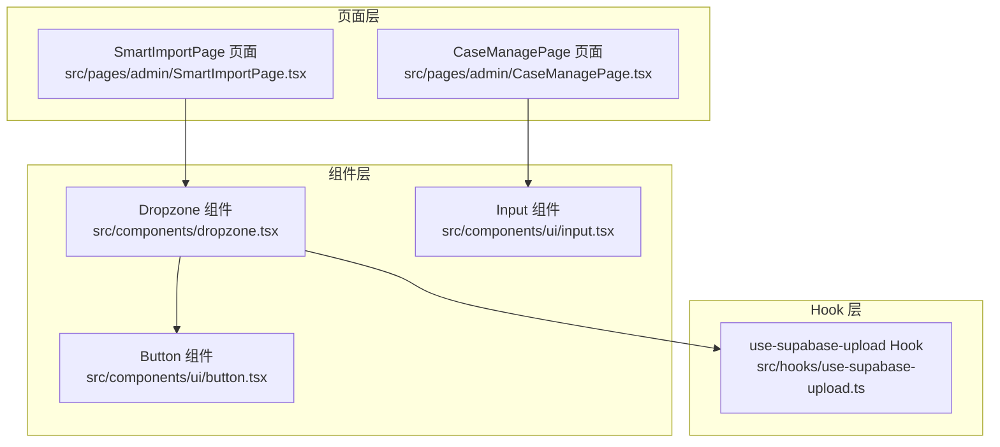
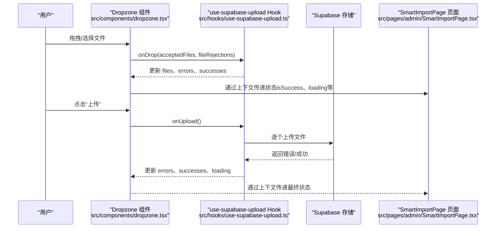
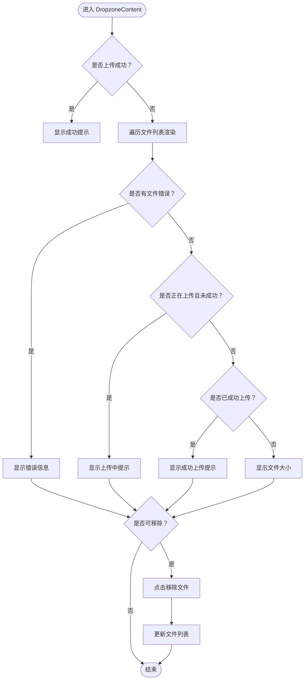
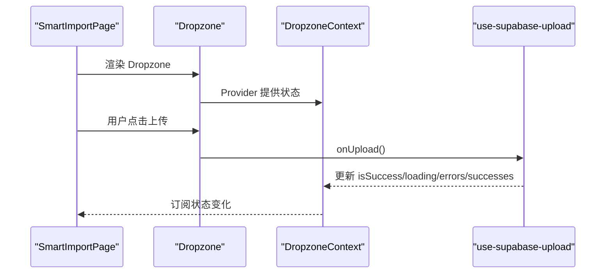
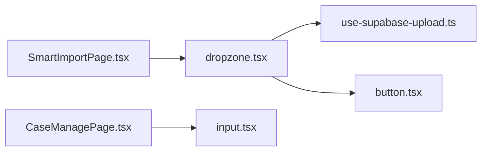

# 文件上传组件

<cite>
**本文引用的文件**
- [dropzone.tsx](file://src/components/dropzone.tsx)
- [use-supabase-upload.ts](file://src/hooks/use-supabase-upload.ts)
- [SmartImportPage.tsx](file://src/pages/admin/SmartImportPage.tsx)
- [CaseManagePage.tsx](file://src/pages/admin/CaseManagePage.tsx)
- [button.tsx](file://src/components/ui/button.tsx)
- [input.tsx](file://src/components/ui/input.tsx)
</cite>

## 目录
1. [简介](#简介)
2. [项目结构](#项目结构)
3. [核心组件](#核心组件)
4. [架构总览](#架构总览)
5. [详细组件分析](#详细组件分析)
6. [依赖关系分析](#依赖关系分析)
7. [性能考量](#性能考量)
8. [故障排查指南](#故障排查指南)
9. [结论](#结论)
10. [附录](#附录)

## 简介
本文件上传组件文档聚焦于拖拽上传组件的实现机制与交互设计，涵盖：
- 拖拽上传的交互流程与视觉反馈
- 文件类型与大小限制策略
- 多文件上传支持与用户反馈提示
- 组件通过React状态管理文件列表、上传状态与错误信息的方式
- 与父组件SmartImportPage的通信模式
- 无障碍访问（a11y）支持与键盘操作指南
- 实际代码示例路径与集成方法
- 不同浏览器下的兼容性处理建议

## 项目结构
该仓库采用按功能分层的组织方式，文件上传能力由通用Hook与UI组件共同构成，并在业务页面中复用。



图表来源
- [dropzone.tsx](file://src/components/dropzone.tsx#L1-L228)
- [use-supabase-upload.ts](file://src/hooks/use-supabase-upload.ts#L1-L198)
- [SmartImportPage.tsx](file://src/pages/admin/SmartImportPage.tsx#L1-L200)
- [CaseManagePage.tsx](file://src/pages/admin/CaseManagePage.tsx#L850-L870)
- [button.tsx](file://src/components/ui/button.tsx#L1-L58)
- [input.tsx](file://src/components/ui/input.tsx#L1-L22)

章节来源
- [dropzone.tsx](file://src/components/dropzone.tsx#L1-L228)
- [use-supabase-upload.ts](file://src/hooks/use-supabase-upload.ts#L1-L198)
- [SmartImportPage.tsx](file://src/pages/admin/SmartImportPage.tsx#L1-L200)
- [CaseManagePage.tsx](file://src/pages/admin/CaseManagePage.tsx#L850-L870)
- [button.tsx](file://src/components/ui/button.tsx#L1-L58)
- [input.tsx](file://src/components/ui/input.tsx#L1-L22)

## 核心组件
- Dropzone 组件：封装拖拽区域、文件列表展示、上传按钮与空状态提示，基于上下文暴露上传状态与操作。
- use-supabase-upload Hook：集中管理文件集合、上传状态、错误与成功记录，封装react-dropzone配置与Supabase上传逻辑。
- SmartImportPage 页面：演示如何在业务场景中使用Dropzone与Hook，包含文件类型与大小校验、上传与解析流程。
- CaseManagePage 页面：展示Excel导入场景，体现CSV/Excel文件的接受类型与验证策略。

章节来源
- [dropzone.tsx](file://src/components/dropzone.tsx#L1-L228)
- [use-supabase-upload.ts](file://src/hooks/use-supabase-upload.ts#L1-L198)
- [SmartImportPage.tsx](file://src/pages/admin/SmartImportPage.tsx#L1-L200)
- [CaseManagePage.tsx](file://src/pages/admin/CaseManagePage.tsx#L850-L870)

## 架构总览
下图展示了从用户拖拽到上传完成的端到端流程，以及与父组件的通信关系。



图表来源
- [dropzone.tsx](file://src/components/dropzone.tsx#L1-L228)
- [use-supabase-upload.ts](file://src/hooks/use-supabase-upload.ts#L85-L198)
- [SmartImportPage.tsx](file://src/pages/admin/SmartImportPage.tsx#L1-L200)

## 详细组件分析

### Dropzone 组件实现机制
- 上下文与属性
  - 通过上下文向子组件暴露Hook返回的状态与方法，避免深层传参。
  - 通过getRootProps/getInputProps接管拖拽与点击行为，noClick开启以禁用默认点击触发，交由外部引导点击。
- 视觉反馈
  - 根据isDragActive/isDragReject/isSuccess/isInvalid切换边框样式与背景色，直观提示状态。
  - 成功后显示“已成功上传N个文件”的提示。
- 文件列表渲染
  - 支持图片预览与非图片图标；对每个文件显示名称、大小、错误信息或上传状态。
  - 当超出最大文件数时，显示明确的限制提示。
- 上传按钮
  - 在非loading且无错误时启用；显示上传中动画与文案。
  - 支持部分重试：若之前有失败文件，再次点击仅上传未成功的文件。



图表来源
- [dropzone.tsx](file://src/components/dropzone.tsx#L62-L179)

章节来源
- [dropzone.tsx](file://src/components/dropzone.tsx#L1-L228)

### use-supabase-upload Hook 设计要点
- 文件与状态管理
  - files：包含预览URL与错误数组的文件集合。
  - loading：上传过程中的全局状态。
  - errors/successes：分别记录失败与成功的文件名，用于部分重试与最终判断。
  - isSuccess：当无错误且成功数量等于文件总数时为真。
- react-dropzone 集成
  - onDrop：合并有效与无效文件，去重并设置预览与错误。
  - accept/maxSize/maxFiles/multiple：由调用方传入，统一约束文件类型与数量/大小。
  - noClick：禁用默认点击，交由Dropzone容器控制。
- 上传逻辑
  - onUpload：支持“部分重试”——若存在历史错误，则仅上传未成功的文件与仍有错误的文件。
  - 并发上传：Promise.all聚合响应，更新errors与successes。
  - 生命周期清理：当files清空时清空errors；当文件数量不超过maxFiles时移除“文件过多”错误标记。

```mermaid
classDiagram
class UseSupabaseUpload {
+files : FileWithPreview[]
+loading : boolean
+errors : {name,message}[]
+successes : string[]
+isSuccess : boolean
+onDrop(acceptedFiles,fileRejections)
+onUpload()
+maxFileSize : number
+maxFiles : number
+allowedMimeTypes : string[]
}
class FileWithPreview {
+preview : string
+errors : FileError[]
}
UseSupabaseUpload --> FileWithPreview : "管理"
```

图表来源
- [use-supabase-upload.ts](file://src/hooks/use-supabase-upload.ts#L1-L198)

章节来源
- [use-supabase-upload.ts](file://src/hooks/use-supabase-upload.ts#L1-L198)

### 与父组件 SmartImportPage 的通信
- 通过上下文传递状态
  - Dropzone 将Hook返回的isSuccess、loading、errors、successes、files等状态注入上下文，子组件直接消费。
- 业务侧校验与上传
  - SmartImportPage 对图片/PDF进行类型与大小校验，并调用Supabase Storage上传临时文件，再获取公开URL供后续解析使用。
- 上传按钮与状态联动
  - Dropzone 的上传按钮与Hook的onUpload绑定，父组件无需直接操作上传逻辑，只需监听状态变化。



图表来源
- [dropzone.tsx](file://src/components/dropzone.tsx#L1-L228)
- [use-supabase-upload.ts](file://src/hooks/use-supabase-upload.ts#L1-L198)
- [SmartImportPage.tsx](file://src/pages/admin/SmartImportPage.tsx#L1-L200)

章节来源
- [dropzone.tsx](file://src/components/dropzone.tsx#L1-L228)
- [use-supabase-upload.ts](file://src/hooks/use-supabase-upload.ts#L1-L198)
- [SmartImportPage.tsx](file://src/pages/admin/SmartImportPage.tsx#L1-L200)

### 文件类型与大小限制策略
- 类型限制
  - use-supabase-upload 通过accept参数接收允许的MIME类型数组，统一在Hook层生效。
  - SmartImportPage 中对图片/PDF有额外的类型与大小校验，属于业务侧约束。
  - CaseManagePage 中Excel导入使用accept=".xlsx,.xls"，体现CSV/Excel文件的接受类型。
- 大小限制
  - use-supabase-upload 通过maxSize统一限制单文件大小。
  - SmartImportPage 中图片最大5MB、PDF最大10MB，属于业务侧限制。
- 多文件限制
  - use-supabase-upload 通过maxFiles限制文件数量；当文件数超过上限时，会显示错误提示并阻止上传。
  - Hook在文件数量回到上限以内时，会自动移除“文件过多”错误标记。

章节来源
- [use-supabase-upload.ts](file://src/hooks/use-supabase-upload.ts#L108-L115)
- [SmartImportPage.tsx](file://src/pages/admin/SmartImportPage.tsx#L46-L70)
- [CaseManagePage.tsx](file://src/pages/admin/CaseManagePage.tsx#L850-L870)

### 用户反馈与提示
- 空状态提示
  - DropzoneEmptyState 显示上传说明、最大文件数与最大文件大小提示。
- 文件列表反馈
  - 错误信息：包含尺寸超限、类型不符等具体原因。
  - 上传中：显示“上传中”提示。
  - 成功：显示“已成功上传”提示。
- 成功状态
  - isSuccess为真时，显示“已成功上传N个文件”的汇总提示。

章节来源
- [dropzone.tsx](file://src/components/dropzone.tsx#L182-L215)
- [dropzone.tsx](file://src/components/dropzone.tsx#L84-L100)
- [dropzone.tsx](file://src/components/dropzone.tsx#L120-L140)
- [dropzone.tsx](file://src/components/dropzone.tsx#L130-L140)

### 无障碍访问（a11y）与键盘操作
- 焦点与键盘
  - Button 组件具备焦点可见样式与键盘交互语义，适合在拖拽区域内的按钮使用。
  - Input 组件具备aria-invalid与焦点样式，便于屏幕阅读器识别错误状态。
- 拖拽区域
  - Dropzone 通过getRootProps接管拖拽事件，建议在容器上添加适当的aria-*属性（如aria-describedby）以提升可访问性。
- 建议实践
  - 为拖拽区域添加role="region"与aria-label，明确其功能。
  - 为“选择文件”链接添加title或aria-label，说明用途。
  - 为上传按钮添加aria-disabled与aria-describedby，告知当前不可用的原因。

章节来源
- [button.tsx](file://src/components/ui/button.tsx#L1-L58)
- [input.tsx](file://src/components/ui/input.tsx#L1-L22)
- [dropzone.tsx](file://src/components/dropzone.tsx#L1-L228)

### 集成示例与最佳实践
- 在页面中引入Dropzone与Hook
  - 通过use-supabase-upload初始化，传入bucketName、path、allowedMimeTypes、maxFileSize、maxFiles、supabase实例等参数。
  - 将Hook返回的getRootProps/getInputProps与Dropzone组合使用，确保noClick开启并由Dropzone容器接管点击。
- 与父组件通信
  - 通过useDropzoneContext在子组件中读取状态与方法，避免层层传参。
  - 父组件仅负责业务侧的类型/大小校验与上传流程，不直接操作上传逻辑。
- 错误与成功提示
  - 利用Hook的errors/successes与isSuccess状态，结合DropzoneContent渲染用户反馈。
  - 对于业务侧上传（如SmartImportPage），建议在上传成功后给出Toast提示，并在失败时提供明确的错误信息。

章节来源
- [dropzone.tsx](file://src/components/dropzone.tsx#L1-L228)
- [use-supabase-upload.ts](file://src/hooks/use-supabase-upload.ts#L1-L198)
- [SmartImportPage.tsx](file://src/pages/admin/SmartImportPage.tsx#L1-L200)

## 依赖关系分析
- 组件与Hook
  - Dropzone 依赖use-supabase-upload提供的状态与方法，通过上下文解耦。
- 页面与组件
  - SmartImportPage 通过Dropzone与Hook实现拖拽上传，同时保留业务侧的类型/大小校验。
  - CaseManagePage 通过原生input的accept属性限定Excel文件类型。
- UI组件
  - Button/Input 提供基础交互与可访问性样式，适配拖拽区域内的按钮与输入控件。



图表来源
- [SmartImportPage.tsx](file://src/pages/admin/SmartImportPage.tsx#L1-L200)
- [dropzone.tsx](file://src/components/dropzone.tsx#L1-L228)
- [use-supabase-upload.ts](file://src/hooks/use-supabase-upload.ts#L1-L198)
- [CaseManagePage.tsx](file://src/pages/admin/CaseManagePage.tsx#L850-L870)
- [button.tsx](file://src/components/ui/button.tsx#L1-L58)
- [input.tsx](file://src/components/ui/input.tsx#L1-L22)

章节来源
- [dropzone.tsx](file://src/components/dropzone.tsx#L1-L228)
- [use-supabase-upload.ts](file://src/hooks/use-supabase-upload.ts#L1-L198)
- [SmartImportPage.tsx](file://src/pages/admin/SmartImportPage.tsx#L1-L200)
- [CaseManagePage.tsx](file://src/pages/admin/CaseManagePage.tsx#L850-L870)
- [button.tsx](file://src/components/ui/button.tsx#L1-L58)
- [input.tsx](file://src/components/ui/input.tsx#L1-L22)

## 性能考量
- 上传并发
  - Hook内部使用Promise.all并发上传，提高吞吐量；但需注意网络与服务端压力。
- 预览与内存
  - 为每个文件生成Object URL用于预览，大量文件可能导致内存占用上升；建议在文件移除或上传完成后及时释放。
- 重试策略
  - 部分重试减少重复上传，提升用户体验；但应避免无限重试导致资源浪费。
- UI渲染
  - 文件列表渲染频繁更新时，建议对列表项进行稳定化处理（如key稳定），减少不必要的重渲染。

## 故障排查指南
- 常见错误与定位
  - 文件过多：当文件数量超过maxFiles时，会显示错误提示；确认maxFiles配置与业务侧限制。
  - 文件过大：当单文件超过maxSize或业务侧限制时，显示尺寸超限提示；核对Hook与页面的限制配置。
  - 类型不符：当MIME不在allowedMimeTypes内时，会显示类型错误；核对accept配置与业务侧校验。
- 上传失败
  - Hook返回的错误数组包含失败文件名与错误信息；可在DropzoneContent中展示具体原因。
  - 若出现部分失败，可再次点击上传按钮进行“部分重试”。

章节来源
- [use-supabase-upload.ts](file://src/hooks/use-supabase-upload.ts#L147-L158)
- [dropzone.tsx](file://src/components/dropzone.tsx#L120-L140)

## 结论
该文件上传组件通过Hook与UI组件的分离设计，实现了灵活的拖拽上传、统一的类型/大小/数量限制、完善的用户反馈与可访问性支持。配合父组件的业务校验与上传流程，能够满足多样化的文件上传需求。建议在实际集成中：
- 明确Hook的限制参数与业务侧限制的一致性
- 合理使用部分重试与并发上传策略
- 注重预览与内存管理
- 强化可访问性与键盘操作体验

## 附录
- 实际代码示例路径
  - 拖拽区域与文件列表渲染：[dropzone.tsx](file://src/components/dropzone.tsx#L62-L179)
  - Hook状态与上传逻辑：[use-supabase-upload.ts](file://src/hooks/use-supabase-upload.ts#L85-L198)
  - 父组件业务侧上传与校验：[SmartImportPage.tsx](file://src/pages/admin/SmartImportPage.tsx#L46-L103)
  - Excel导入类型接受：[CaseManagePage.tsx](file://src/pages/admin/CaseManagePage.tsx#L850-L870)
  - UI可访问性样式：[button.tsx](file://src/components/ui/button.tsx#L1-L58)、[input.tsx](file://src/components/ui/input.tsx#L1-L22)