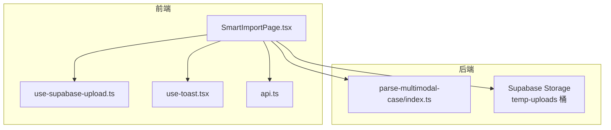
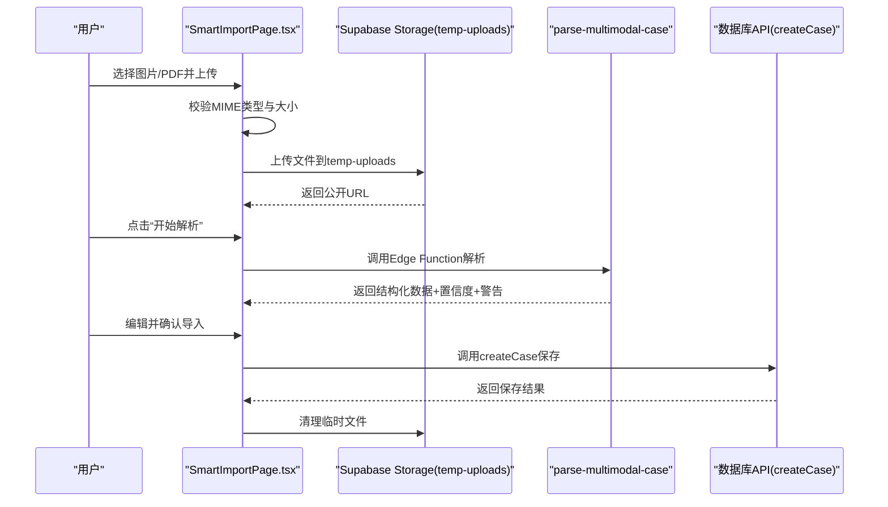
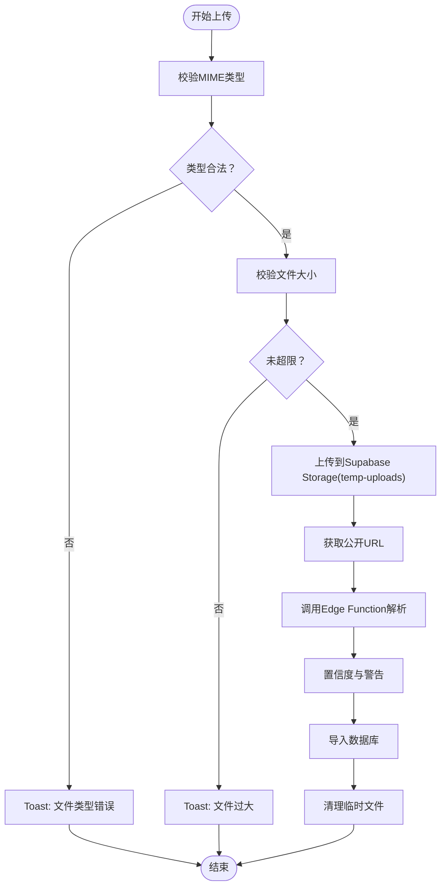
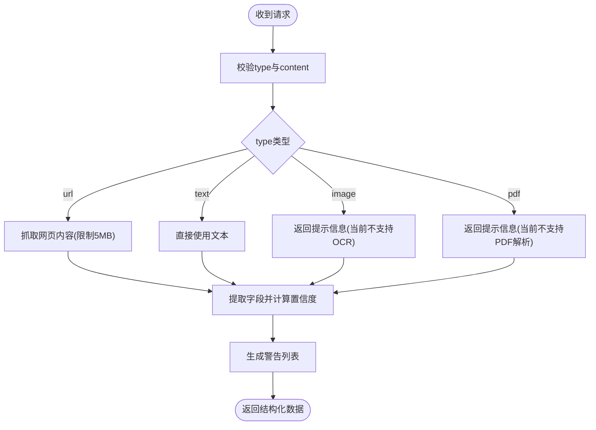
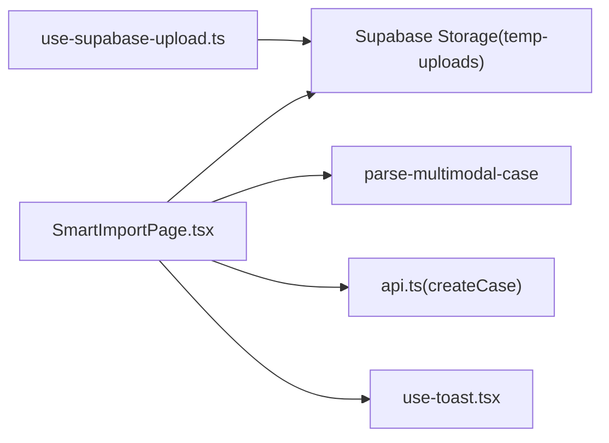

# 文件验证与错误处理

<cite>
**本文引用的文件**
- [SmartImportPage.tsx](file://src/pages/admin/SmartImportPage.tsx)
- [use-supabase-upload.ts](file://src/hooks/use-supabase-upload.ts)
- [use-toast.tsx](file://src/hooks/use-toast.tsx)
- [api.ts](file://src/db/api.ts)
- [index.ts](file://supabase/functions/parse-multimodal-case/index.ts)
- [00002_create_temp_uploads_bucket.sql](file://supabase/migrations/00002_create_temp_uploads_bucket.sql)
- [Supabase存储桶问题说明.md](file://docs/Supabase存储桶问题说明.md)
</cite>

## 目录
1. [简介](#简介)
2. [项目结构](#项目结构)
3. [核心组件](#核心组件)
4. [架构总览](#架构总览)
5. [详细组件分析](#详细组件分析)
6. [依赖关系分析](#依赖关系分析)
7. [性能考量](#性能考量)
8. [故障排查指南](#故障排查指南)
9. [结论](#结论)

## 简介
本文件聚焦“SmartImportPage”中文件上传前的验证流程与错误处理机制，涵盖：
- 文件格式校验（MIME类型检测）
- 大小限制检查（图片最大5MB、PDF最大10MB）
- 结构完整性预判（基于AI解析的置信度与警告）
- 用户体验：Toast通知、错误高亮与修复建议
- use-supabase-upload中对上传过程的网络异常、权限不足、存储桶错误的捕获与分类
- 常见错误代码与解决方案对照表

## 项目结构
SmartImportPage位于管理后台，提供多模态输入（URL、文本、图片、PDF），其中图片与PDF上传采用Supabase Storage临时桶进行预处理，随后通过Edge Function进行解析。



图表来源
- [SmartImportPage.tsx](file://src/pages/admin/SmartImportPage.tsx#L46-L103)
- [use-supabase-upload.ts](file://src/hooks/use-supabase-upload.ts#L108-L159)
- [use-toast.tsx](file://src/hooks/use-toast.tsx#L139-L189)
- [api.ts](file://src/db/api.ts#L599-L626)
- [index.ts](file://supabase/functions/parse-multimodal-case/index.ts#L1-L129)
- [00002_create_temp_uploads_bucket.sql](file://supabase/migrations/00002_create_temp_uploads_bucket.sql#L1-L55)

章节来源
- [SmartImportPage.tsx](file://src/pages/admin/SmartImportPage.tsx#L46-L103)
- [use-supabase-upload.ts](file://src/hooks/use-supabase-upload.ts#L108-L159)
- [index.ts](file://supabase/functions/parse-multimodal-case/index.ts#L1-L129)
- [00002_create_temp_uploads_bucket.sql](file://supabase/migrations/00002_create_temp_uploads_bucket.sql#L1-L55)

## 核心组件
- SmartImportPage.tsx：负责文件上传前的格式与大小校验、上传至Supabase Storage、获取公开URL、调用Edge Function解析、导入数据库并清理临时文件。
- use-supabase-upload.ts：通用的Dropzone封装，提供MIME类型限制、大小限制、并发上传与错误聚合。
- use-toast.tsx：全局Toast通知系统，统一展示错误与成功提示。
- api.ts：数据库API封装，导入阶段调用createCase等接口。
- parse-multimodal-case/index.ts：Edge Function，统一处理URL/文本/图片/PDF输入，返回结构化数据与置信度。
- 00002_create_temp_uploads_bucket.sql：Supabase迁移脚本，创建temp-uploads桶及RLS策略。

章节来源
- [SmartImportPage.tsx](file://src/pages/admin/SmartImportPage.tsx#L46-L103)
- [use-supabase-upload.ts](file://src/hooks/use-supabase-upload.ts#L108-L159)
- [use-toast.tsx](file://src/hooks/use-toast.tsx#L139-L189)
- [api.ts](file://src/db/api.ts#L599-L626)
- [index.ts](file://supabase/functions/parse-multimodal-case/index.ts#L1-L129)
- [00002_create_temp_uploads_bucket.sql](file://supabase/migrations/00002_create_temp_uploads_bucket.sql#L1-L55)

## 架构总览
SmartImportPage的上传与解析流程如下：



图表来源
- [SmartImportPage.tsx](file://src/pages/admin/SmartImportPage.tsx#L46-L103)
- [index.ts](file://supabase/functions/parse-multimodal-case/index.ts#L1-L129)
- [api.ts](file://src/db/api.ts#L599-L626)
- [00002_create_temp_uploads_bucket.sql](file://supabase/migrations/00002_create_temp_uploads_bucket.sql#L1-L55)

## 详细组件分析

### 文件上传前验证流程（SmartImportPage）
- MIME类型检测
  - 图片：仅允许JPG/JPEG/PNG；PDF：仅允许PDF。
  - 若类型不匹配，立即通过Toast提示“文件类型错误”，并终止上传。
- 大小限制检查
  - 图片最大5MB；PDF最大10MB。
  - 超限时通过Toast提示“文件过大”，并显示对应上限。
- 结构完整性预判
  - 解析阶段返回置信度与警告列表；置信度低于阈值或出现警告时，引导用户核对字段。
- 错误提示机制
  - 使用use-toast.tsx统一弹出Toast，区分错误/成功/警告三类。
  - 对必填字段（应用名称、通报日期）在导入前进行二次校验，失败时Toast提示并阻止提交。



图表来源
- [SmartImportPage.tsx](file://src/pages/admin/SmartImportPage.tsx#L46-L103)
- [index.ts](file://supabase/functions/parse-multimodal-case/index.ts#L1-L129)

章节来源
- [SmartImportPage.tsx](file://src/pages/admin/SmartImportPage.tsx#L46-L103)

### use-supabase-upload中的上传与错误分类
- 通用上传钩子
  - 支持allowedMimeTypes、maxFileSize、maxFiles、upsert等配置。
  - 内置Dropzone集成，支持多文件、重复文件过滤与错误聚合。
- 错误分类
  - 类型错误：MIME不在allowedMimeTypes内。
  - 大小错误：文件超过maxFileSize。
  - 数量错误：超过maxFiles。
  - 上传错误：存储桶不存在、权限不足、网络异常等。
- 重试与局部成功
  - 支持对上次失败的文件进行增量重试，避免全量重传。

```mermaid
classDiagram
class UseSupabaseUpload {
+files : FileWithPreview[]
+errors : {name,message}[]
+successes : string[]
+loading : boolean
+onUpload()
+dropzoneProps
}
class FileWithPreview {
+preview : string
+errors : FileError[]
}
UseSupabaseUpload --> FileWithPreview : "管理文件集合"
```

图表来源
- [use-supabase-upload.ts](file://src/hooks/use-supabase-upload.ts#L1-L198)

章节来源
- [use-supabase-upload.ts](file://src/hooks/use-supabase-upload.ts#L108-L159)

### Edge Function解析与结构完整性
- 输入类型路由：url/text/image/pdf
- 结构化输出字段：通报日期、应用名称、开发者、监管部门、平台、违规摘要/详情、置信度、警告、输入类型
- 置信度计算：提取字段数量/7
- 警告：未识别字段或内容过大等



图表来源
- [index.ts](file://supabase/functions/parse-multimodal-case/index.ts#L1-L129)

章节来源
- [index.ts](file://supabase/functions/parse-multimodal-case/index.ts#L1-L129)

### 数据库导入与清理
- 导入阶段对必填字段进行二次校验，失败则Toast提示并阻止提交。
- 成功后调用createCase保存，生成执行报告并Toast提示。
- 清理临时文件：若为图片/PDF且已导入成功，则删除temp-uploads中的对应对象。

章节来源
- [SmartImportPage.tsx](file://src/pages/admin/SmartImportPage.tsx#L190-L335)
- [api.ts](file://src/db/api.ts#L599-L626)

## 依赖关系分析
- SmartImportPage依赖Supabase Storage与Edge Function；依赖use-toast进行用户反馈；依赖api.ts进行数据库操作。
- use-supabase-upload作为通用上传工具，可复用到其他页面，但SmartImportPage中未直接使用其Dropzone UI，而是自定义了图片/PDF上传入口。
- Edge Function依赖Supabase环境变量与权限策略；SmartImportPage通过temp-uploads桶上传文件，再由函数解析。



图表来源
- [SmartImportPage.tsx](file://src/pages/admin/SmartImportPage.tsx#L46-L103)
- [use-supabase-upload.ts](file://src/hooks/use-supabase-upload.ts#L108-L159)
- [index.ts](file://supabase/functions/parse-multimodal-case/index.ts#L1-L129)
- [api.ts](file://src/db/api.ts#L599-L626)
- [use-toast.tsx](file://src/hooks/use-toast.tsx#L139-L189)

章节来源
- [SmartImportPage.tsx](file://src/pages/admin/SmartImportPage.tsx#L46-L103)
- [use-supabase-upload.ts](file://src/hooks/use-supabase-upload.ts#L108-L159)
- [index.ts](file://supabase/functions/parse-multimodal-case/index.ts#L1-L129)
- [api.ts](file://src/db/api.ts#L599-L626)
- [use-toast.tsx](file://src/hooks/use-toast.tsx#L139-L189)

## 性能考量
- 上传前本地校验（MIME与大小）减少无效请求与后端压力。
- Edge Function对URL抓取设置超时（30秒）与内容大小限制（5MB），避免资源占用过高。
- 导入成功后及时清理临时文件，降低存储占用。

[本节为通用指导，不涉及具体文件分析]

## 故障排查指南

### 常见错误与解决方案对照
- 存储桶不存在
  - 现象：上传失败或解析失败提示存储桶不存在
  - 原因：temp-uploads桶未创建或未正确授权
  - 解决：参考文档手动创建桶并配置RLS策略
  - 参考
    - [Supabase存储桶问题说明.md](file://docs/Supabase存储桶问题说明.md#L1-L347)
    - [00002_create_temp_uploads_bucket.sql](file://supabase/migrations/00002_create_temp_uploads_bucket.sql#L1-L55)
- 权限不足
  - 现象：提示无法上传/读取/删除
  - 原因：非管理员用户或未满足RLS策略
  - 解决：确保登录为管理员并满足RLS策略
  - 参考
    - [00002_create_temp_uploads_bucket.sql](file://supabase/migrations/00002_create_temp_uploads_bucket.sql#L29-L54)
- 网络异常/超时
  - 现象：URL抓取超时、HTTP错误、函数调用失败
  - 原因：目标站点不可达、响应过大、函数超时
  - 解决：检查URL有效性、减少内容大小、稍后重试
  - 参考
    - [index.ts](file://supabase/functions/parse-multimodal-case/index.ts#L132-L191)
- 文件类型不支持
  - 现象：Toast提示“文件类型错误”
  - 原因：非JPG/JPEG/PNG或非PDF
  - 解决：转换为支持格式
  - 参考
    - [SmartImportPage.tsx](file://src/pages/admin/SmartImportPage.tsx#L46-L59)
- 文件过大
  - 现象：Toast提示“文件过大”
  - 原因：图片>5MB或PDF>10MB
  - 解决：压缩或拆分文件
  - 参考
    - [SmartImportPage.tsx](file://src/pages/admin/SmartImportPage.tsx#L60-L69)
- 解析失败/置信度低
  - 现象：解析失败或警告较多
  - 原因：内容不规范、字段不完整
  - 解决：补充字段、使用更清晰的文本/图片/PDF
  - 参考
    - [index.ts](file://supabase/functions/parse-multimodal-case/index.ts#L1-L129)
    - [SmartImportPage.tsx](file://src/pages/admin/SmartImportPage.tsx#L105-L187)

### 错误分类与用户指引
- 客户端问题（用户可自行解决）
  - 文件类型/大小不符、URL无效、内容不规范
  - 指引：按提示修正文件格式与大小、提供更清晰内容
- 服务端问题（需管理员介入）
  - 存储桶未创建/策略未配置、权限不足、网络异常
  - 指引：检查桶与策略、联系管理员、稍后重试

章节来源
- [Supabase存储桶问题说明.md](file://docs/Supabase存储桶问题说明.md#L1-L347)
- [00002_create_temp_uploads_bucket.sql](file://supabase/migrations/00002_create_temp_uploads_bucket.sql#L1-L55)
- [index.ts](file://supabase/functions/parse-multimodal-case/index.ts#L132-L191)
- [SmartImportPage.tsx](file://src/pages/admin/SmartImportPage.tsx#L46-L103)

## 结论
SmartImportPage在上传前实现了严格的MIME与大小校验，并通过Edge Function提供统一的解析与结构完整性评估。错误处理以Toast为核心反馈手段，结合必填字段校验与临时文件清理，提升了整体用户体验与可靠性。对于存储桶与权限问题，建议管理员按文档指引完成配置，确保上传与解析流程稳定运行。