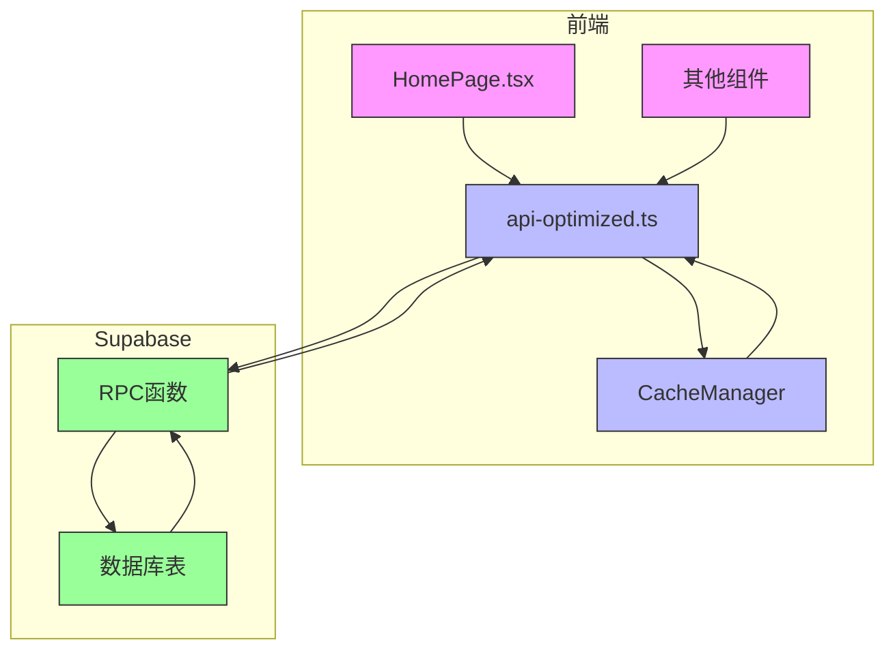
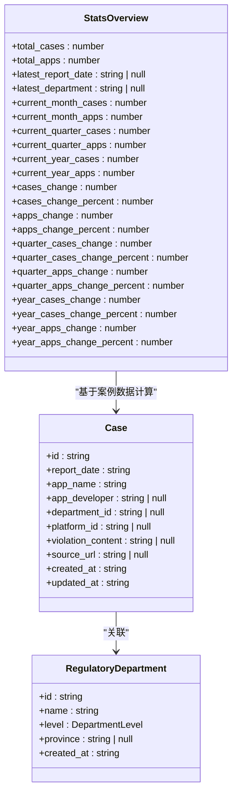
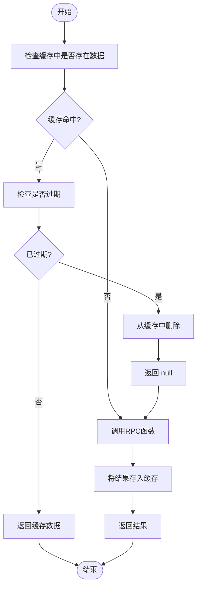
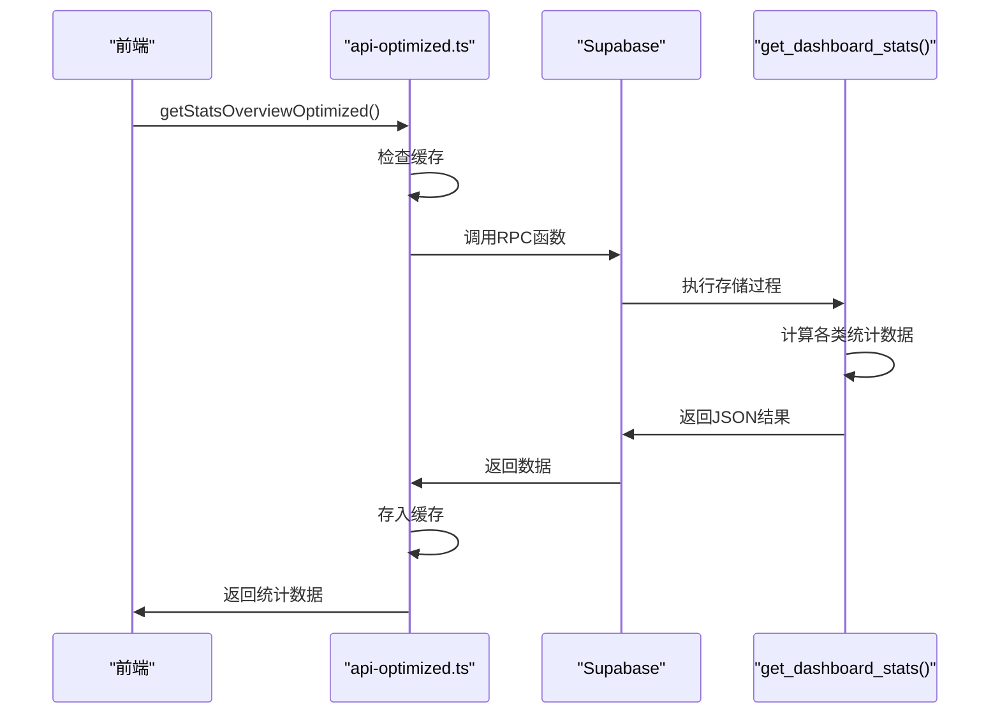
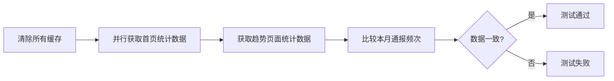
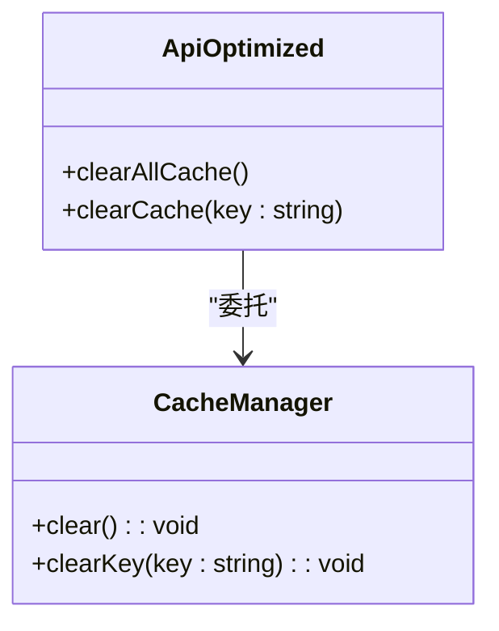
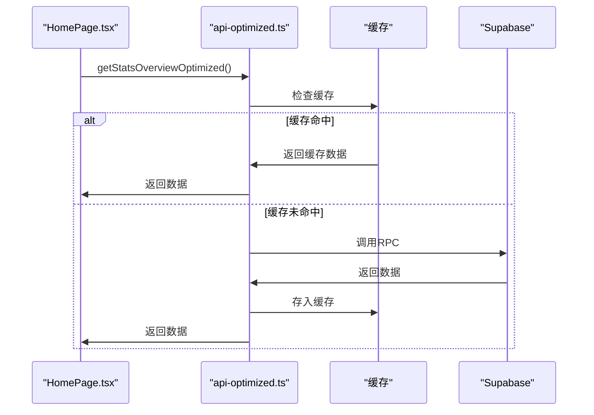

# API集成与数据持久化

<cite>
**本文档引用文件**   
- [api-optimized.ts](file://src/db/api-optimized.ts)
- [supabase.ts](file://src/db/supabase.ts)
- [types.ts](file://src/types/types.ts)
- [20251230120000_add_dashboard_stats_rpc.sql](file://supabase/migrations/20251230120000_add_dashboard_stats_rpc.sql)
- [api.ts](file://src/db/api.ts)
- [HomePage.tsx](file://src/pages/HomePage.tsx)
- [consistency.test.ts](file://src/db/consistency.test.ts)
</cite>

## 目录
1. [简介](#简介)
2. [系统架构概述](#系统架构概述)
3. [核心数据结构](#核心数据结构)
4. [API优化与缓存机制](#api优化与缓存机制)
5. [RPC函数调用模式](#rpc函数调用模式)
6. [数据一致性保障](#数据一致性保障)
7. [缓存失效策略](#缓存失效策略)
8. [前端集成示例](#前端集成示例)
9. [结论](#结论)

## 简介
本文档详细说明了解析结果与后端数据库的交互机制，重点描述了`ParsedCase`接口数据结构如何通过优化的API写入Supabase数据库。文档深入分析了`api-optimized.ts`中缓存管理器（CacheManager）的工作原理、5分钟缓存策略及缓存键设计。同时，解释了RPC函数调用模式（如`get_dashboard_stats`）与数据写入的一致性保障机制，并涵盖了`clearAllCache`和`clearCache`函数在数据更新后的缓存失效策略，确保前端展示数据的实时性。

## 系统架构概述
系统采用前后端分离架构，前端通过Supabase客户端与后端数据库进行交互。关键的统计数据显示通过优化的API层实现，该层利用后端RPC（远程过程调用）函数和前端缓存机制来提升性能。数据流从Supabase数据库开始，通过RPC函数进行聚合计算，然后由前端的优化API层进行缓存管理，最终提供给前端组件进行展示。



**Diagram sources**
- [HomePage.tsx](file://src/pages/HomePage.tsx)
- [api-optimized.ts](file://src/db/api-optimized.ts)
- [20251230120000_add_dashboard_stats_rpc.sql](file://supabase/migrations/20251230120000_add_dashboard_stats_rpc.sql)

## 核心数据结构
系统的核心数据结构定义在`types.ts`文件中，其中`StatsOverview`接口是首页统计数据的主要结构。该接口定义了累计通报频次、应用总数、最新通报信息以及月度、季度和年度的环比变化等关键指标。



**Diagram sources**
- [types.ts](file://src/types/types.ts)

**Section sources**
- [types.ts](file://src/types/types.ts#L102-L131)

## API优化与缓存机制
### 缓存管理器（CacheManager）工作原理
`api-optimized.ts`文件中的`CacheManager`类是前端缓存机制的核心。它使用一个`Map`数据结构来存储缓存项，每个缓存项包含数据本身和时间戳。当获取数据时，系统首先检查缓存中是否存在有效数据，如果存在且未过期，则直接返回缓存数据，避免了重复的网络请求。



**Diagram sources**
- [api-optimized.ts](file://src/db/api-optimized.ts#L17-L47)

### 5分钟缓存策略
系统采用5分钟的固定缓存策略，通过常量`CACHE_DURATION`定义：

```typescript
const CACHE_DURATION = 5 * 60 * 1000; // 5分钟缓存
```

此策略在性能和数据实时性之间取得了平衡。对于首页统计数据这类不需要实时更新的信息，5分钟的缓存可以显著减少对后端的请求压力，同时保证用户在合理时间内看到最新的数据。

### 缓存键设计
缓存键的设计遵循清晰、唯一的原则。每个优化的API函数都有一个对应的缓存键，如：
- `homepage_stats`：首页核心统计数据
- `yearly_trend`：年度趋势数据
- `monthly_trend`：月度趋势数据
- `department_distribution`：监管部门分布数据

这种命名方式使得缓存键具有良好的可读性和可维护性，便于开发人员理解和调试。

**Section sources**
- [api-optimized.ts](file://src/db/api-optimized.ts#L10-L47)

## RPC函数调用模式
### get_dashboard_stats RPC函数
`get_dashboard_stats`是系统中最关键的RPC函数之一，定义在`20251230120000_add_dashboard_stats_rpc.sql`迁移文件中。该函数是一个PostgreSQL存储过程，负责计算首页所需的所有核心统计数据。



**Diagram sources**
- [api-optimized.ts](file://src/db/api-optimized.ts#L57-L92)
- [20251230120000_add_dashboard_stats_rpc.sql](file://supabase/migrations/20251230120000_add_dashboard_stats_rpc.sql)

### 数据计算逻辑
`get_dashboard_stats`函数执行了复杂的计算逻辑，包括：
1. **累计统计**：计算总通报频次和应用总数
2. **时间范围统计**：分别计算本月、本季度、本年度的统计数据
3. **环比计算**：计算与上月、上季度、上年度相比的变化量和变化百分比
4. **最新信息**：获取最近一次通报的日期和部门

这些计算都在数据库层面完成，避免了前端进行复杂的计算，提高了整体性能。

**Section sources**
- [20251230120000_add_dashboard_stats_rpc.sql](file://supabase/migrations/20251230120000_add_dashboard_stats_rpc.sql)

## 数据一致性保障
为了确保不同页面间的数据一致性，系统实施了严格的测试和验证机制。`consistency.test.ts`文件中的测试用例验证了首页和趋势页面之间的数据一致性。



该测试首先清除所有缓存以确保获取最新数据，然后并行获取首页和趋势页面的统计数据，最后比较关键指标的一致性。这种机制确保了用户在不同页面看到的数据是同步和一致的。

**Section sources**
- [consistency.test.ts](file://src/db/consistency.test.ts)

## 缓存失效策略
### 数据更新后的缓存失效
当系统中的数据发生更新时（如新增案例、修改部门信息等），必须及时清除相关缓存，以确保前端展示的数据是最新和准确的。系统提供了两种缓存清除函数：



### clearAllCache函数
`clearAllCache`函数用于在发生重大数据更新时清除所有缓存。该函数简单地调用`CacheManager`的`clear`方法，清空整个缓存Map。

```typescript
export function clearAllCache() {
  cacheManager.clear();
}
```

### clearCache函数
`clearCache`函数用于清除特定的缓存项。当只需要更新某一部分数据时，可以使用此函数精确地清除对应的缓存，避免不必要的全量刷新。

```typescript
export function clearCache(key: string) {
  cacheManager.clearKey(key);
}
```

这些函数通常在数据写入操作完成后调用，确保后续的数据读取能够获取到最新的数据。

**Section sources**
- [api-optimized.ts](file://src/db/api-optimized.ts#L262-L271)

## 前端集成示例
`HomePage.tsx`是前端集成优化API的典型示例。该页面在加载时调用`getStatsOverviewOptimized`函数获取核心统计数据，并利用缓存机制提升加载性能。



页面通过`useCallback`和`useEffect`等React Hooks管理数据加载状态，并在加载过程中显示适当的加载指示器，提供了良好的用户体验。

**Section sources**
- [HomePage.tsx](file://src/pages/HomePage.tsx#L182-L200)

## 结论
本文档详细阐述了系统中API集成与数据持久化的机制。通过后端RPC函数和前端缓存管理的结合，系统实现了高性能的数据访问和展示。`CacheManager`的5分钟缓存策略有效减少了对后端的请求压力，而精心设计的缓存键和失效策略确保了数据的实时性和一致性。RPC函数在数据库层面执行复杂的计算，避免了前端的性能瓶颈。整体架构设计合理，既保证了用户体验，又确保了系统的可维护性和可扩展性。