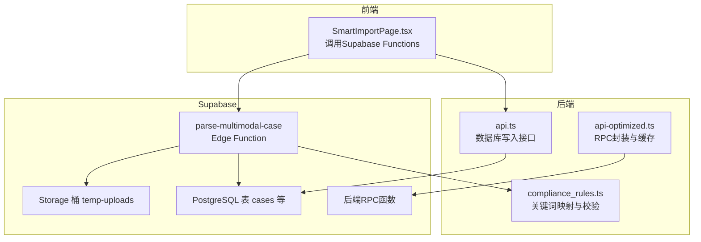
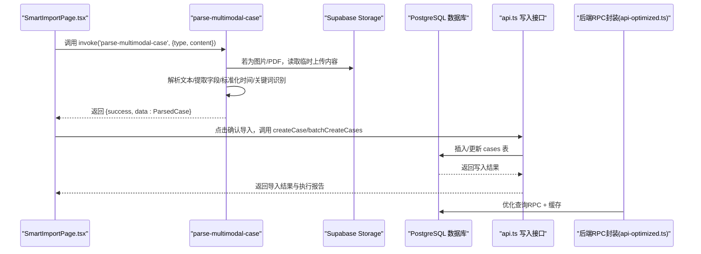
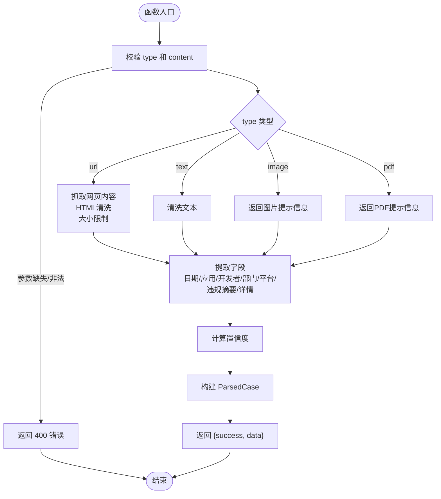
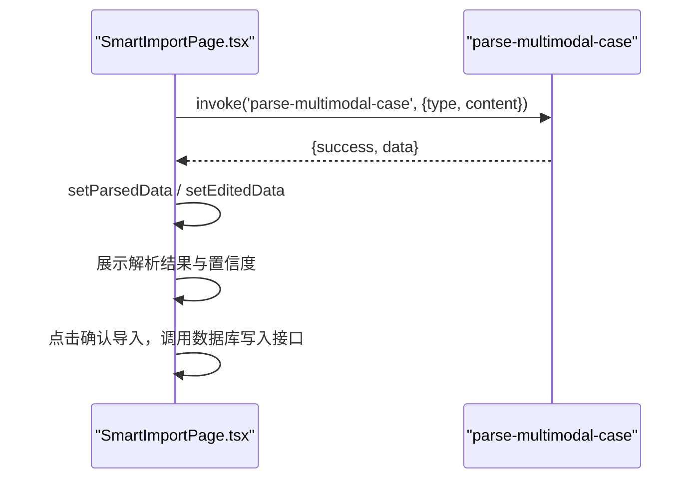
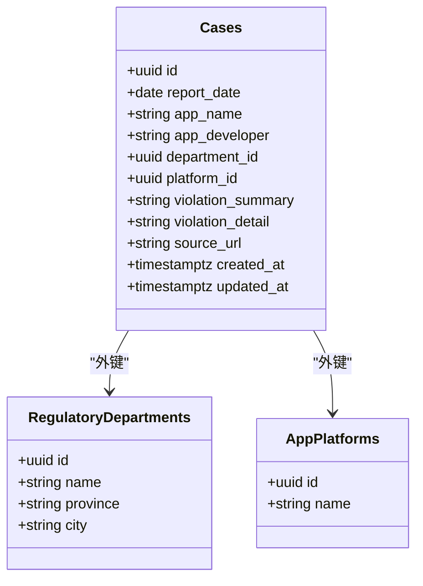
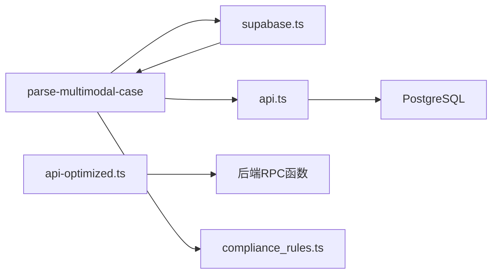

# 后端解析与数据提取

<cite>
**本文引用的文件**
- [parse-multimodal-case/index.ts](file://supabase/functions/parse-multimodal-case/index.ts)
- [SmartImportPage.tsx](file://src/pages/admin/SmartImportPage.tsx)
- [api-optimized.ts](file://src/db/api-optimized.ts)
- [supabase.ts](file://src/db/supabase.ts)
- [api.ts](file://src/db/api.ts)
- [compliance_rules.ts](file://src/db/compliance_rules.ts)
- [00001_create_initial_schema.sql](file://supabase/migrations/00001_create_initial_schema.sql)
- [00002_create_temp_uploads_bucket.sql](file://supabase/migrations/00002_create_temp_uploads_bucket.sql)
- [20251219000000_create_violation_analysis_rpc.sql](file://supabase/migrations/20251219000000_create_violation_analysis_rpc.sql)
- [20251219120000_optimize_violation_extraction.sql](file://supabase/migrations/20251219120000_optimize_violation_extraction.sql)
- [20251220120000_split_home_charts_rpc.sql](file://supabase/migrations/20251220120000_split_home_charts_rpc.sql)
</cite>

## 目录
1. [简介](#简介)
2. [项目结构](#项目结构)
3. [核心组件](#核心组件)
4. [架构总览](#架构总览)
5. [详细组件分析](#详细组件分析)
6. [依赖关系分析](#依赖关系分析)
7. [性能考量](#性能考量)
8. [故障排查指南](#故障排查指南)
9. [结论](#结论)
10. [附录](#附录)

## 简介
本文件聚焦于“parse-multimodal-case”云函数的后端解析工作机制，说明其如何接收多模态输入（URL、文本、图片、PDF），从Supabase存储中读取内容，解析多模态案例数据（文本与表格混合内容），并进行结构化数据提取（字段映射、时间格式标准化、违规关键词识别等）。同时阐述与前端“智能导入”页面的调用关系，以及与数据库写入流程的衔接，确保高效、可靠地将解析结果写入cases表。文档还覆盖异常处理与日志记录策略，以保障数据处理的稳定性。

## 项目结构
后端解析功能由以下部分组成：
- Supabase Edge Function：parse-multimodal-case，负责多模态输入解析与结构化输出
- 前端页面：SmartImportPage，负责用户输入与调用Edge Function
- 数据库：cases表与相关表（监管部门、平台），以及后端RPC函数
- 存储：Supabase Storage临时上传桶，用于图片/PDF等文件的临时存放
- 规则库：合规规则映射与关键词规范化/校验

图示来源
- [parse-multimodal-case/index.ts](file://supabase/functions/parse-multimodal-case/index.ts#L1-L129)
- [SmartImportPage.tsx](file://src/pages/admin/SmartImportPage.tsx#L2006-L2032)
- [api.ts](file://src/db/api.ts#L599-L608)
- [api-optimized.ts](file://src/db/api-optimized.ts#L57-L93)
- [compliance_rules.ts](file://src/db/compliance_rules.ts#L1-L112)
- [00002_create_temp_uploads_bucket.sql](file://supabase/migrations/00002_create_temp_uploads_bucket.sql#L1-L55)

章节来源
- [parse-multimodal-case/index.ts](file://supabase/functions/parse-multimodal-case/index.ts#L1-L129)
- [SmartImportPage.tsx](file://src/pages/admin/SmartImportPage.tsx#L2006-L2032)
- [api.ts](file://src/db/api.ts#L599-L608)
- [api-optimized.ts](file://src/db/api-optimized.ts#L57-L93)
- [compliance_rules.ts](file://src/db/compliance_rules.ts#L1-L112)
- [00002_create_temp_uploads_bucket.sql](file://supabase/migrations/00002_create_temp_uploads_bucket.sql#L1-L55)

## 核心组件
- parse-multimodal-case Edge Function：接收type/content，按输入类型处理内容，提取结构化字段，计算置信度并返回
- SmartImportPage：前端调用Supabase Functions.invoke，展示解析结果与导入执行报告
- 数据库写入：api.ts提供createCase/batchCreateCases等接口，配合后端RPC与缓存优化
- 存储：temp-uploads桶用于图片/PDF临时上传，RLS策略限定管理员权限
- 合规规则：compliance_rules.ts提供关键词映射与校验，支撑违规关键词识别与标准化

章节来源
- [parse-multimodal-case/index.ts](file://supabase/functions/parse-multimodal-case/index.ts#L1-L129)
- [SmartImportPage.tsx](file://src/pages/admin/SmartImportPage.tsx#L2006-L2032)
- [api.ts](file://src/db/api.ts#L599-L608)
- [api-optimized.ts](file://src/db/api-optimized.ts#L57-L93)
- [compliance_rules.ts](file://src/db/compliance_rules.ts#L1-L112)
- [00002_create_temp_uploads_bucket.sql](file://supabase/migrations/00002_create_temp_uploads_bucket.sql#L1-L55)

## 架构总览
下图展示了从前端到后端解析再到数据库写入的完整链路，以及与Supabase Storage的交互。

图示来源
- [SmartImportPage.tsx](file://src/pages/admin/SmartImportPage.tsx#L2006-L2032)
- [parse-multimodal-case/index.ts](file://supabase/functions/parse-multimodal-case/index.ts#L1-L129)
- [api.ts](file://src/db/api.ts#L599-L608)
- [api-optimized.ts](file://src/db/api-optimized.ts#L57-L93)

## 详细组件分析

### parse-multimodal-case 云函数
- 输入参数
  - type: 'url' | 'text' | 'image' | 'pdf'
  - content: 字符串（URL、文本、或文件URL）
- 处理流程
  - 参数校验与类型路由
  - 根据type执行对应处理：
    - URL：抓取网页内容，HTML清洗，限制大小，返回纯文本
    - 文本：简单清洗与空白处理
    - 图片/PDF：当前版本返回提示信息（未来可接入OCR/解析）
  - 结构化字段提取
    - 日期：多种正则匹配，标准化为YYYY-MM-DD
    - 应用名称、开发者、监管部门、平台、违规摘要、违规详情
    - 计算置信度：已提取字段数/7
    - warnings：未识别字段的提示集合
    - input_type：记录输入类型
  - 错误处理：捕获异常并返回500
  - 日志：控制台记录错误

图示来源
- [parse-multimodal-case/index.ts](file://supabase/functions/parse-multimodal-case/index.ts#L22-L129)
- [parse-multimodal-case/index.ts](file://supabase/functions/parse-multimodal-case/index.ts#L132-L212)
- [parse-multimodal-case/index.ts](file://supabase/functions/parse-multimodal-case/index.ts#L214-L368)

章节来源
- [parse-multimodal-case/index.ts](file://supabase/functions/parse-multimodal-case/index.ts#L1-L129)
- [parse-multimodal-case/index.ts](file://supabase/functions/parse-multimodal-case/index.ts#L132-L212)
- [parse-multimodal-case/index.ts](file://supabase/functions/parse-multimodal-case/index.ts#L214-L368)

### 前端调用与展示
- 前端通过Supabase Functions.invoke调用parse-multimodal-case，传入activeTab（即type）与content
- 成功后设置解析结果与编辑态数据，展示置信度与字段提取统计
- 导入完成后展示执行报告，包含操作类型、输入方式、案例ID、提取字段统计与警告信息

图示来源
- [SmartImportPage.tsx](file://src/pages/admin/SmartImportPage.tsx#L2006-L2032)

章节来源
- [SmartImportPage.tsx](file://src/pages/admin/SmartImportPage.tsx#L2006-L2032)

### 数据库写入与优化
- 写入接口
  - createCase：插入单条案例
  - batchCreateCases：批量插入
  - updateCase/deleteCase：更新/删除
- 优化策略
  - api-optimized.ts提供RPC封装与缓存（5分钟），减少前端请求次数与数据库压力
  - 并行获取多个RPC数据，降低首屏加载时间
- 数据模型
  - cases表包含report_date、app_name、app_developer、department_id、platform_id、violation_summary、violation_detail、source_url等字段

图示来源
- [00001_create_initial_schema.sql](file://supabase/migrations/00001_create_initial_schema.sql#L1-L139)
- [api.ts](file://src/db/api.ts#L599-L608)
- [api-optimized.ts](file://src/db/api-optimized.ts#L57-L93)

章节来源
- [api.ts](file://src/db/api.ts#L599-L608)
- [api-optimized.ts](file://src/db/api-optimized.ts#L57-L93)
- [00001_create_initial_schema.sql](file://supabase/migrations/00001_create_initial_schema.sql#L1-L139)

### 存储与安全
- temp-uploads桶用于图片/PDF临时上传
- 策略限制：仅管理员可上传/读取/删除；文件大小限制10MB；MIME类型限制为图片与PDF
- 建议：结合定时任务定期清理过期文件

章节来源
- [00002_create_temp_uploads_bucket.sql](file://supabase/migrations/00002_create_temp_uploads_bucket.sql#L1-L55)

### 违规关键词识别与合规规则
- 后端RPC函数中使用extract_violation_keywords对violation_content进行关键词抽取与聚合
- 前端/后端可结合compliance_rules.ts进行关键词映射与校验，确保描述的完整性与一致性
- 优化后的RPC拆分统计逻辑，提升查询效率

章节来源
- [20251219000000_create_violation_analysis_rpc.sql](file://supabase/migrations/20251219000000_create_violation_analysis_rpc.sql#L94-L132)
- [20251219120000_optimize_violation_extraction.sql](file://supabase/migrations/20251219120000_optimize_violation_extraction.sql#L121-L176)
- [20251220120000_split_home_charts_rpc.sql](file://supabase/migrations/20251220120000_split_home_charts_rpc.sql#L146-L175)
- [compliance_rules.ts](file://src/db/compliance_rules.ts#L1-L112)

## 依赖关系分析
- parse-multimodal-case依赖Supabase Edge Runtime能力，内部无外部依赖
- 前端通过supabase.ts创建客户端，调用Functions.invoke
- 数据写入依赖api.ts提供的数据库接口
- 查询优化依赖api-optimized.ts的RPC封装与缓存
- 违规关键词处理依赖数据库侧RPC函数与规则库

图示来源
- [parse-multimodal-case/index.ts](file://supabase/functions/parse-multimodal-case/index.ts#L1-L129)
- [supabase.ts](file://src/db/supabase.ts#L1-L8)
- [api.ts](file://src/db/api.ts#L599-L608)
- [api-optimized.ts](file://src/db/api-optimized.ts#L57-L93)
- [compliance_rules.ts](file://src/db/compliance_rules.ts#L1-L112)

章节来源
- [parse-multimodal-case/index.ts](file://supabase/functions/parse-multimodal-case/index.ts#L1-L129)
- [supabase.ts](file://src/db/supabase.ts#L1-L8)
- [api.ts](file://src/db/api.ts#L599-L608)
- [api-optimized.ts](file://src/db/api-optimized.ts#L57-L93)
- [compliance_rules.ts](file://src/db/compliance_rules.ts#L1-L112)

## 性能考量
- Edge Function端：
  - URL抓取设置超时（约30秒），避免长时间阻塞
  - HTML清洗与大小限制，防止大体积内容影响解析与网络
  - 简化版图片/PDF处理，避免复杂依赖导致延迟
- 前端优化：
  - api-optimized.ts采用RPC封装与缓存（5分钟），并行获取多组RPC数据，显著降低首屏加载时间
- 数据库：
  - cases表建立索引（report_date、department_id、platform_id），提升查询性能
  - RPC函数在数据库侧完成关键词提取与聚合，减少网络往返

章节来源
- [parse-multimodal-case/index.ts](file://supabase/functions/parse-multimodal-case/index.ts#L132-L191)
- [api-optimized.ts](file://src/db/api-optimized.ts#L57-L93)
- [00001_create_initial_schema.sql](file://supabase/migrations/00001_create_initial_schema.sql#L134-L137)

## 故障排查指南
- 常见错误与处理
  - 参数缺失/非法：返回400，检查type与content是否正确传递
  - URL抓取失败：检查协议（仅http/https）、超时（约30秒）、内容大小（上限5MB）
  - 图片/PDF解析提示：当前版本为简化实现，需手动补充信息
  - 系统错误：捕获异常并返回500，前端显示“解析失败”，查看控制台日志
- 日志记录
  - Edge Function：控制台记录错误堆栈，便于定位问题
  - 前端：toast提示解析成功/失败，执行报告展示warnings
- 存储问题
  - 确认上传桶策略：仅管理员可操作；检查文件大小与MIME类型
- 数据写入问题
  - 检查cases表字段约束与外键关系；确认RPC封装与缓存未过期

章节来源
- [parse-multimodal-case/index.ts](file://supabase/functions/parse-multimodal-case/index.ts#L22-L129)
- [SmartImportPage.tsx](file://src/pages/admin/SmartImportPage.tsx#L2006-L2032)
- [00002_create_temp_uploads_bucket.sql](file://supabase/migrations/00002_create_temp_uploads_bucket.sql#L1-L55)

## 结论
parse-multimodal-case云函数提供了统一的多模态解析入口，能够稳定地从URL、文本、图片、PDF中提取结构化案例数据，并通过置信度与警告信息帮助人工复核。前端通过Supabase Functions.invoke与数据库写入接口协同工作，后端RPC封装与缓存进一步提升了整体性能与可靠性。结合Supabase Storage与合规规则库，系统实现了从输入到入库的闭环处理，满足合规通平台对案例导入与分析的需求。

## 附录
- 数据模型与字段映射
  - cases表字段与前端编辑态字段保持一致，便于导入与展示
- 违规关键词处理流程
  - 数据库侧RPC函数抽取关键词并统计，前端/后端可结合规则库进行映射与校验

章节来源
- [00001_create_initial_schema.sql](file://supabase/migrations/00001_create_initial_schema.sql#L120-L132)
- [20251219000000_create_violation_analysis_rpc.sql](file://supabase/migrations/20251219000000_create_violation_analysis_rpc.sql#L94-L132)
- [compliance_rules.ts](file://src/db/compliance_rules.ts#L1-L112)