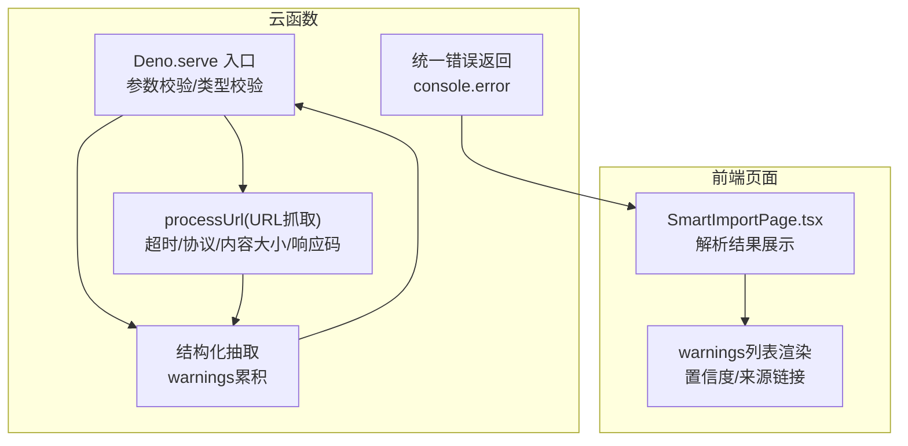
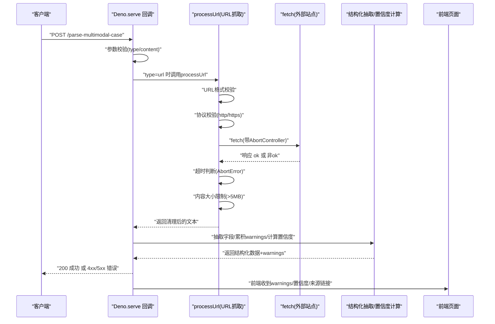
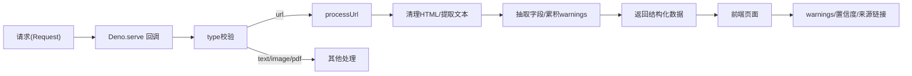

# 异常处理与日志记录

<cite>
**本文引用的文件**
- [index.ts](file://supabase/functions/parse-multimodal-case/index.ts)
- [SmartImportPage.tsx](file://src/pages/admin/SmartImportPage.tsx)
</cite>

## 目录
1. [简介](#简介)
2. [项目结构](#项目结构)
3. [核心组件](#核心组件)
4. [架构总览](#架构总览)
5. [详细组件分析](#详细组件分析)
6. [依赖关系分析](#依赖关系分析)
7. [性能考量](#性能考量)
8. [故障排查指南](#故障排查指南)
9. [结论](#结论)

## 简介
本文件系统化梳理云函数的异常处理与日志记录机制，重点覆盖以下方面：
- Deno.serve外层try-catch的全局错误捕获策略
- 各处理阶段（URL抓取超时、协议验证失败、内容过大等）的具体错误类型与HTTP状态码返回规范
- warnings数组在解析过程中的累积机制与前端提示价值
- console.error日志输出格式、错误堆栈跟踪与监控价值
- 错误代码分类（参数缺失、类型无效、网络错误、解析失败等）及对应的用户提示文案设计建议

## 项目结构
本次文档聚焦于“多模态案例解析”云函数与前端“智能导入”页面对异常处理与日志记录的协同实现：
- 云函数：负责输入校验、URL抓取与解析、结构化抽取、warnings累积与统一错误返回
- 前端页面：负责展示warnings与错误提示，并引导用户修正输入

图表来源
- [index.ts](file://supabase/functions/parse-multimodal-case/index.ts#L22-L129)
- [index.ts](file://supabase/functions/parse-multimodal-case/index.ts#L132-L191)
- [SmartImportPage.tsx](file://src/pages/admin/SmartImportPage.tsx#L600-L640)

章节来源
- [index.ts](file://supabase/functions/parse-multimodal-case/index.ts#L22-L129)
- [SmartImportPage.tsx](file://src/pages/admin/SmartImportPage.tsx#L600-L640)

## 核心组件
- 云函数入口与全局错误捕获
  - 外层Deno.serve回调内进行参数完整性与type合法性校验；若校验失败，立即返回对应HTTP状态码与错误消息
  - 若发生未预期异常，统一捕获并通过console.error输出错误信息，返回500错误
- URL抓取与网络错误处理
  - URL格式校验失败：抛出明确错误
  - 协议非http/https：抛出明确错误
  - 请求超时（AbortController）：抛出明确错误
  - 响应非ok：抛出包含状态码与状态文本的错误
  - 内容过大（>5MB）：抛出明确错误
- 结构化抽取与warnings累积
  - 对每个字段尝试抽取，若失败则向warnings追加一条提示
  - 计算置信度：已提取字段数/总字段数
- 前端展示与用户提示
  - 当warnings存在时，以Alert形式展示；同时展示置信度与来源链接，便于用户核对与修正

章节来源
- [index.ts](file://supabase/functions/parse-multimodal-case/index.ts#L22-L129)
- [index.ts](file://supabase/functions/parse-multimodal-case/index.ts#L132-L191)
- [SmartImportPage.tsx](file://src/pages/admin/SmartImportPage.tsx#L600-L640)

## 架构总览
下面的序列图展示了从请求进入云函数到返回解析结果与错误信息的完整流程，包括URL抓取阶段的关键分支与错误路径。

图表来源
- [index.ts](file://supabase/functions/parse-multimodal-case/index.ts#L22-L129)
- [index.ts](file://supabase/functions/parse-multimodal-case/index.ts#L132-L191)

## 详细组件分析

### 云函数入口与全局错误捕获
- 参数缺失与类型非法
  - 当缺少type或content，或type不在允许集合内时，直接返回400错误与明确消息
- 未预期异常
  - 外层try-catch捕获所有异常，通过console.error输出错误对象，返回500错误
- 返回规范
  - 成功：200，JSON包含success与data
  - 参数错误：400，JSON包含error
  - 服务器内部错误：500，JSON包含error

章节来源
- [index.ts](file://supabase/functions/parse-multimodal-case/index.ts#L22-L129)

### URL抓取阶段的错误类型与状态码
- URL格式无效
  - 触发时机：URL构造失败
  - 行为：抛出错误，最终由外层catch捕获并返回500
  - 建议前端提示：请检查URL格式
- 协议非http/https
  - 触发时机：协议不在允许集合
  - 行为：抛出错误，最终返回500
  - 建议前端提示：仅支持HTTP/HTTPS协议
- 请求超时（30秒）
  - 触发时机：AbortController触发
  - 行为：抛出错误，最终返回500
  - 建议前端提示：请求超时，请稍后重试或检查网络
- 响应非ok
  - 触发时机：response.ok为false
  - 行为：抛出包含状态码与状态文本的错误，最终返回500
  - 建议前端提示：网络错误，状态码xxx
- 内容过大（>5MB）
  - 触发时机：文本长度超过阈值
  - 行为：抛出错误，最终返回500
  - 建议前端提示：网页内容过大，无法解析

章节来源
- [index.ts](file://supabase/functions/parse-multimodal-case/index.ts#L132-L191)

### 解析阶段的warnings累积机制
- warnings累积逻辑
  - 对每个字段执行抽取，若未提取到值，则向warnings追加一条提示
  - 字段包括：通报日期、应用名称、开发者、监管部门、平台、违规摘要、违规详情
- 置信度计算
  - 已提取字段数除以总字段数，作为质量指标
- 前端展示
  - 当warnings存在时，以Alert形式展示；同时展示置信度与来源链接，辅助用户核对与修正

章节来源
- [index.ts](file://supabase/functions/parse-multimodal-case/index.ts#L72-L116)
- [SmartImportPage.tsx](file://src/pages/admin/SmartImportPage.tsx#L600-L640)

### 日志记录与监控价值
- console.error输出
  - 位置：外层catch中输出错误对象
  - 作用：便于边缘运行时与平台侧收集错误堆栈与上下文
- 建议的增强
  - 在关键分支增加结构化日志（如包含type、URL片段、状态码、耗时等），便于后续监控与告警
  - 对重复性错误（如超时、内容过大）进行聚合统计，辅助容量与限流策略

章节来源
- [index.ts](file://supabase/functions/parse-multimodal-case/index.ts#L122-L129)

### 错误分类与用户提示文案设计
- 分类建议
  - 参数缺失：type或content缺失
  - 类型无效：type不在允许集合
  - 网络错误：URL格式无效、协议不支持、请求超时、响应非ok、内容过大
  - 解析失败：字段提取为空（由warnings体现）
- 文案设计要点
  - 明确可操作：例如“请检查URL格式”、“仅支持HTTP/HTTPS协议”、“请求超时，请稍后重试”
  - 与实际错误一致：避免误导性提示
  - 与warnings联动：前端展示warnings时，文案与后端提示保持一致口径

章节来源
- [index.ts](file://supabase/functions/parse-multimodal-case/index.ts#L22-L129)
- [index.ts](file://supabase/functions/parse-multimodal-case/index.ts#L132-L191)
- [SmartImportPage.tsx](file://src/pages/admin/SmartImportPage.tsx#L600-L640)

## 依赖关系分析
- 云函数内部依赖
  - 输入类型switch：根据type路由到不同处理分支
  - processUrl：封装URL抓取与清理逻辑
  - 抽取函数：按字段逐一抽取，累积warnings
- 前端依赖
  - 展示warnings、置信度、来源链接，形成闭环反馈

图表来源
- [index.ts](file://supabase/functions/parse-multimodal-case/index.ts#L22-L129)
- [index.ts](file://supabase/functions/parse-multimodal-case/index.ts#L132-L191)
- [SmartImportPage.tsx](file://src/pages/admin/SmartImportPage.tsx#L600-L640)

章节来源
- [index.ts](file://supabase/functions/parse-multimodal-case/index.ts#L22-L129)
- [index.ts](file://supabase/functions/parse-multimodal-case/index.ts#L132-L191)
- [SmartImportPage.tsx](file://src/pages/admin/SmartImportPage.tsx#L600-L640)

## 性能考量
- URL抓取超时与内容大小限制
  - 30秒超时与5MB上限有助于防止资源滥用与长尾延迟
- HTML清理与正则替换
  - 清理脚本与样式标签、实体转义、多余空白，提升后续抽取效率
- 建议
  - 对频繁访问的URL可引入缓存策略（如基于URL哈希的边缘缓存）
  - 对高并发场景考虑限流与重试退避

章节来源
- [index.ts](file://supabase/functions/parse-multimodal-case/index.ts#L132-L191)

## 故障排查指南
- 快速定位
  - 查看云函数日志：关注console.error输出的错误对象
  - 检查HTTP状态码：400表示参数/类型问题，500表示服务器异常
- 常见问题与处置
  - 参数缺失/类型无效：补齐type与content，确保type在允许集合内
  - URL格式无效：确认URL可访问且格式正确
  - 协议不支持：改为http/https
  - 请求超时：检查网络连通性或稍后重试
  - 响应非ok：查看目标站点状态码与返回内容
  - 内容过大：拆分内容或改用更小的页面
- 前端辅助
  - 利用warnings与置信度提示，优先修正缺失字段
  - 如有来源链接，可回溯原始页面核对

章节来源
- [index.ts](file://supabase/functions/parse-multimodal-case/index.ts#L22-L129)
- [index.ts](file://supabase/functions/parse-multimodal-case/index.ts#L132-L191)
- [SmartImportPage.tsx](file://src/pages/admin/SmartImportPage.tsx#L600-L640)

## 结论
该云函数通过外层全局错误捕获、严格的URL抓取与网络错误处理、结构化抽取与warnings累积，形成了清晰的异常处理与日志记录体系。前端页面通过warnings、置信度与来源链接，为用户提供可操作的提示与修正路径。建议在现有基础上进一步完善结构化日志与监控告警，以提升可观测性与稳定性。