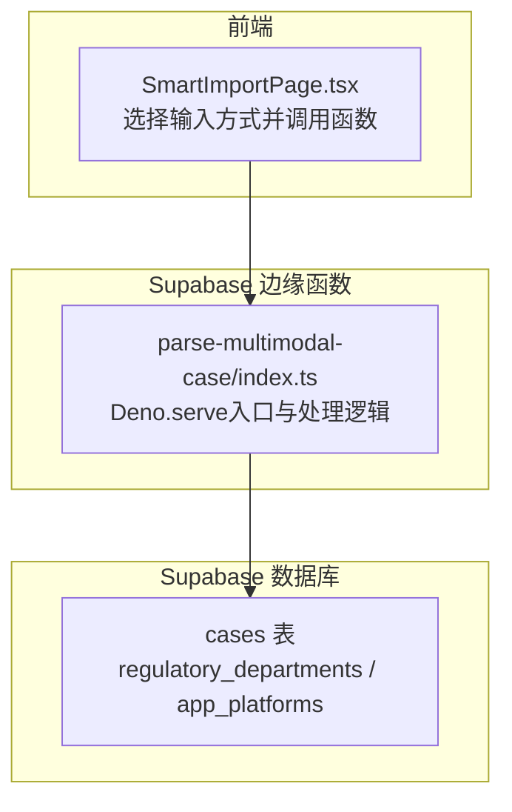
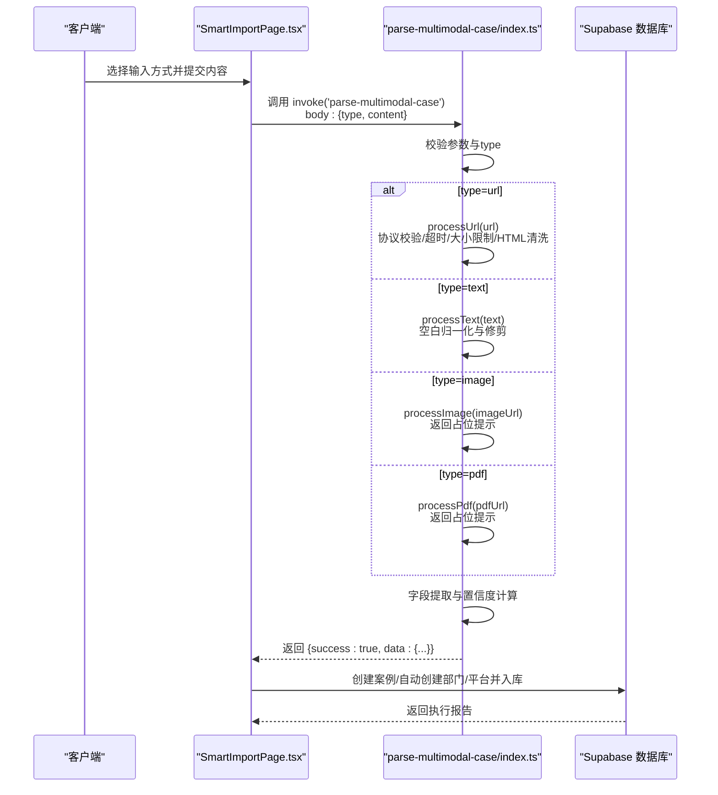
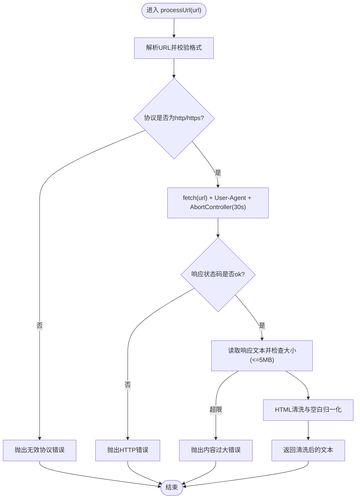

# 文件处理与内容提取

<cite>
**本文引用的文件**
- [index.ts](file://supabase/functions/parse-multimodal-case/index.ts)
- [SmartImportPage.tsx](file://src/pages/admin/SmartImportPage.tsx)
- [MULTIMODAL_UPGRADE_PLAN.md](file://docs/MULTIMODAL_UPGRADE_PLAN.md)
- [00001_create_initial_schema.sql](file://supabase/migrations/00001_create_initial_schema.sql)
- [api.ts](file://src/db/api.ts)
</cite>

## 目录
1. [简介](#简介)
2. [项目结构](#项目结构)
3. [核心组件](#核心组件)
4. [架构总览](#架构总览)
5. [详细组件分析](#详细组件分析)
6. [依赖分析](#依赖分析)
7. [性能考量](#性能考量)
8. [故障排查指南](#故障排查指南)
9. [结论](#结论)

## 简介
本文件围绕 parse-multimodal-case 云函数的文件处理机制展开，重点说明 processUrl、processText、processImage 和 processPdf 四个处理函数的工作流程，并结合前端调用链路，解释 URL 内容抓取的安全检查、超时控制与 HTML 清理策略；文本输入的标准化处理；图片与 PDF 的占位提示机制；以及错误处理与内容大小限制（5MB）的实现方式。同时覆盖 User-Agent 设置、协议验证等网络请求最佳实践，帮助读者全面理解多模态输入的处理路径选择逻辑与边界约束。

## 项目结构
parse-multimodal-case 云函数位于 Supabase 边缘函数目录，前端通过 Supabase Functions SDK 调用该函数，完成多模态输入的统一解析与结构化输出。数据库 schema 定义了案例主表及关联表，用于最终入库。

图表来源
- [index.ts](file://supabase/functions/parse-multimodal-case/index.ts#L22-L129)
- [SmartImportPage.tsx](file://src/pages/admin/SmartImportPage.tsx#L105-L177)
- [00001_create_initial_schema.sql](file://supabase/migrations/00001_create_initial_schema.sql#L120-L137)

章节来源
- [index.ts](file://supabase/functions/parse-multimodal-case/index.ts#L22-L129)
- [SmartImportPage.tsx](file://src/pages/admin/SmartImportPage.tsx#L105-L177)
- [00001_create_initial_schema.sql](file://supabase/migrations/00001_create_initial_schema.sql#L120-L137)

## 核心组件
- 入口与路由：Deno.serve 接收请求，解析 type/content 参数，按类型分派至对应处理函数。
- URL 抓取与清洗：processUrl 对 URL 进行格式校验、协议限制、超时控制、内容大小限制与 HTML 清洗。
- 文本标准化：processText 对文本进行空白字符归一化与修剪。
- 图片/PDF 占位提示：processImage/processPdf 返回提示信息，引导用户手动填写。
- 结构化提取：extractDate、extractAppName、extractDeveloper、extractDepartment、extractPlatform、extractViolationSummary、extractViolationDetail 从文本中抽取字段。
- 置信度与警告：统计提取字段数量，计算置信度，并汇总警告信息。

章节来源
- [index.ts](file://supabase/functions/parse-multimodal-case/index.ts#L22-L129)
- [index.ts](file://supabase/functions/parse-multimodal-case/index.ts#L132-L212)
- [index.ts](file://supabase/functions/parse-multimodal-case/index.ts#L214-L368)

## 架构总览
下面的序列图展示了从前端到边缘函数再到数据库的整体流程，以及不同类型输入的处理路径选择逻辑。

图表来源
- [SmartImportPage.tsx](file://src/pages/admin/SmartImportPage.tsx#L105-L177)
- [index.ts](file://supabase/functions/parse-multimodal-case/index.ts#L22-L129)
- [index.ts](file://supabase/functions/parse-multimodal-case/index.ts#L132-L212)
- [index.ts](file://supabase/functions/parse-multimodal-case/index.ts#L214-L368)
- [api.ts](file://src/db/api.ts#L599-L626)

## 详细组件分析

### URL 输入处理：processUrl
- 协议验证：仅允许 http/https 协议，拒绝其他协议。
- 超时控制：使用 AbortController，在 30 秒后中断请求。
- User-Agent 设置：设置为浏览器友好的 UA，提升兼容性。
- 内容大小限制：对响应体长度进行 5MB 限制，防止内存与网络压力。
- HTML 清洗：移除 script/style 标签、实体转义还原、标签替换为空格、多余空白归一化与修剪。
- 错误处理：对非 2xx 响应抛出错误；超时捕获 AbortError 并转换为“请求超时”错误。

图表来源
- [index.ts](file://supabase/functions/parse-multimodal-case/index.ts#L132-L191)

章节来源
- [index.ts](file://supabase/functions/parse-multimodal-case/index.ts#L132-L191)

### 文本输入处理：processText
- 标准化策略：将连续空白字符归一化为单个空格，并去除首尾空白。
- 作用：保证后续正则匹配与字段提取的一致性。

章节来源
- [index.ts](file://supabase/functions/parse-multimodal-case/index.ts#L193-L199)

### 图片输入处理：processImage
- 占位提示机制：返回包含提示信息的字符串，告知当前版本不支持自动识别图片内容，需用户手动填写。
- 未来扩展：文档中明确当前为简化实现，后续可接入 OCR 服务或图像理解 API。

章节来源
- [index.ts](file://supabase/functions/parse-multimodal-case/index.ts#L200-L212)
- [MULTIMODAL_UPGRADE_PLAN.md](file://docs/MULTIMODAL_UPGRADE_PLAN.md#L560-L580)

### PDF 输入处理：processPdf
- 占位提示机制：返回包含提示信息的字符串，告知当前版本不支持自动解析 PDF，需用户手动填写。
- 未来扩展：文档中明确当前为简化实现，后续可接入 PDF 解析库或 OCR 流程。

章节来源
- [index.ts](file://supabase/functions/parse-multimodal-case/index.ts#L207-L212)
- [MULTIMODAL_UPGRADE_PLAN.md](file://docs/MULTIMODAL_UPGRADE_PLAN.md#L560-L580)

### 结构化提取与置信度
- 字段提取：按顺序调用 extractDate、extractAppName、extractDeveloper、extractDepartment、extractPlatform、extractViolationSummary、extractViolationDetail。
- 置信度计算：统计成功提取的字段数量除以总字段数（7），得到 0~1 的置信度。
- 警告生成：若某字段未提取，添加对应警告信息。
- 输出封装：将提取结果、置信度、警告与输入类型封装为 ParsedCase 返回给前端。

章节来源
- [index.ts](file://supabase/functions/parse-multimodal-case/index.ts#L72-L119)
- [index.ts](file://supabase/functions/parse-multimodal-case/index.ts#L214-L368)

### 字段提取算法要点
- 日期提取：支持多种常见日期格式与“发布时间/通报时间”前缀，统一输出为 YYYY-MM-DD。
- 应用名称提取：优先匹配“应用名称/App名称/软件名称”等关键字，支持书名号包裹与“存在...问题”句式。
- 开发者/运营者提取：匹配“开发者/运营者/开发单位/开发商”等关键字，或识别含“公司/企业/工作室/团队”的组织类名称。
- 监管部门提取：内置国家级与省级部门关键词，支持“省/市+网信办/市场监管局”等组合。
- 平台提取：内置主流应用商店与平台名称集合。
- 违规摘要与详情：基于关键词匹配与句长约束，限制摘要长度与详情总长度，确保输出可控。

章节来源
- [index.ts](file://supabase/functions/parse-multimodal-case/index.ts#L214-L368)

## 依赖分析
- 前端调用：SmartImportPage.tsx 通过 supabase.functions.invoke('parse-multimodal-case') 传递 {type, content}，并在成功后进入编辑与导入阶段。
- 数据库交互：导入阶段调用 createCase/createDepartment/createPlatform 等 API，自动创建缺失的部门与平台，并将案例写入 cases 表。
- 数据库结构：cases 表包含 report_date、app_name、app_developer、department_id、platform_id、violation_summary、violation_detail、source_url 等字段，与云函数输出结构一一对应。

图表来源
- [SmartImportPage.tsx](file://src/pages/admin/SmartImportPage.tsx#L105-L177)
- [api.ts](file://src/db/api.ts#L599-L626)
- [00001_create_initial_schema.sql](file://supabase/migrations/00001_create_initial_schema.sql#L120-L137)

章节来源
- [SmartImportPage.tsx](file://src/pages/admin/SmartImportPage.tsx#L105-L177)
- [api.ts](file://src/db/api.ts#L599-L626)
- [00001_create_initial_schema.sql](file://supabase/migrations/00001_create_initial_schema.sql#L120-L137)

## 性能考量
- URL 抓取超时：30 秒超时避免长时间占用资源。
- 内容大小限制：5MB 限制防止大体积网页导致内存与网络压力。
- HTML 清洗：移除脚本与样式标签，减少无关内容，提高后续字段提取效率。
- 前端文件上传大小限制：图片 5MB、PDF 10MB，配合后端 5MB 限制形成双保险。
- 置信度与警告：帮助前端快速评估提取质量，减少无效重试。

章节来源
- [index.ts](file://supabase/functions/parse-multimodal-case/index.ts#L146-L191)
- [SmartImportPage.tsx](file://src/pages/admin/SmartImportPage.tsx#L46-L69)
- [MULTIMODAL_UPGRADE_PLAN.md](file://docs/MULTIMODAL_UPGRADE_PLAN.md#L630-L641)

## 故障排查指南
- 参数缺失或类型错误
  - 现象：返回 400，提示缺少 type/content 或 type 不在 ['url','text','image','pdf']。
  - 排查：确认前端传参是否正确，type 与 content 是否存在且合法。
- URL 格式无效
  - 现象：抛出“URL格式无效”。
  - 排查：检查 URL 是否可被 new URL() 解析。
- 协议不受支持
  - 现象：抛出“仅支持HTTP/HTTPS协议”。
  - 排查：确认 URL 使用 http/https。
- 请求超时
  - 现象：抛出“请求超时（30秒）”。
  - 排查：检查网络连通性、目标站点响应速度，必要时缩短抓取范围或改用文本输入。
- 网页内容过大
  - 现象：抛出“网页内容过大（超过5MB）”。
  - 排查：改用文本输入或提供更精简的网页链接。
- 非 2xx 响应
  - 现象：抛出“HTTP x: y”错误。
  - 排查：检查目标站点状态码与访问权限。
- 字段提取不足
  - 现象：置信度较低，警告较多。
  - 排查：在前端手动补充字段，或提供更规范的文本内容。

章节来源
- [index.ts](file://supabase/functions/parse-multimodal-case/index.ts#L22-L129)
- [index.ts](file://supabase/functions/parse-multimodal-case/index.ts#L132-L191)

## 结论
parse-multimodal-case 云函数通过统一的输入类型路由与标准化的处理流程，实现了对 URL、文本、图片、PDF 的多模态支持。其中 URL 抓取具备严格的协议校验、超时控制与内容大小限制，并对 HTML 进行清洗；文本输入进行空白标准化；图片与 PDF 采用占位提示机制，为后续集成 OCR/PDF 解析留出空间。前端 SmartImportPage 与数据库 API 协同完成解析、编辑与入库，形成闭环。建议在生产环境中持续完善字段提取规则与错误提示，逐步引入 OCR 与 PDF 解析能力，以进一步提升自动化水平与准确性。