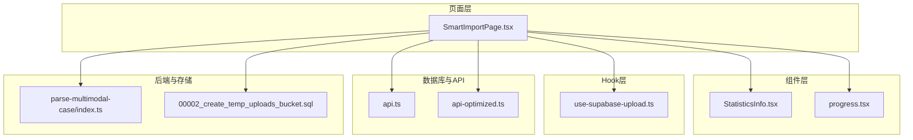
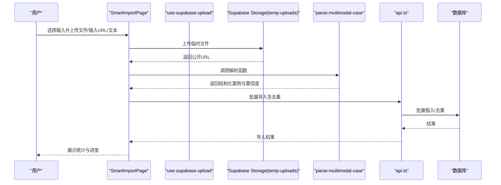
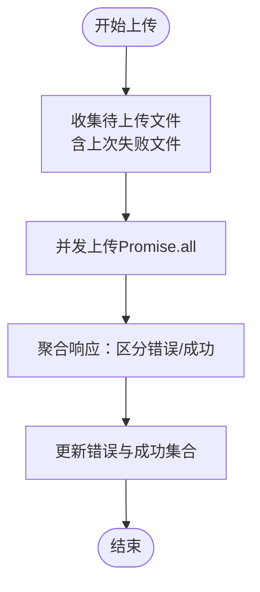
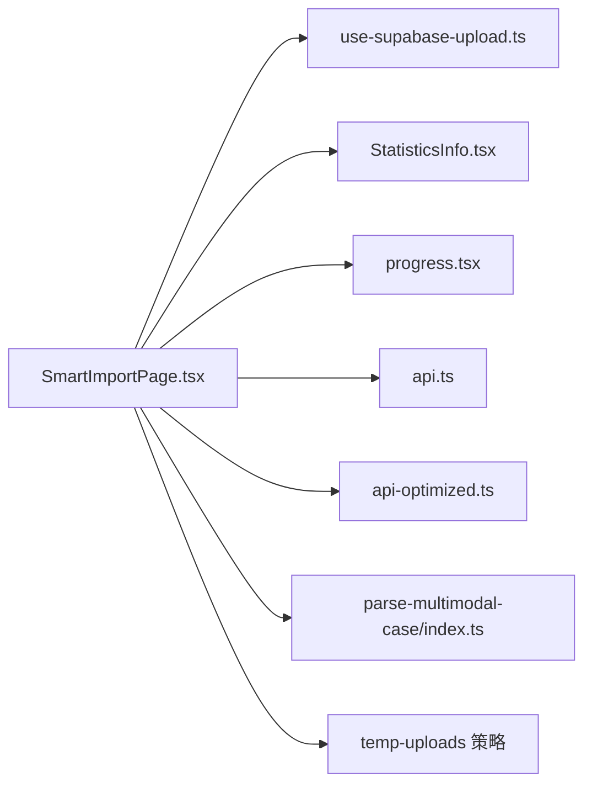

# 前端批量上传与性能优化

<cite>
**本文引用的文件**
- [SmartImportPage.tsx](file://src/pages/admin/SmartImportPage.tsx)
- [use-supabase-upload.ts](file://src/hooks/use-supabase-upload.ts)
- [StatisticsInfo.tsx](file://src/components/common/StatisticsInfo.tsx)
- [progress.tsx](file://src/components/ui/progress.tsx)
- [api.ts](file://src/db/api.ts)
- [api-optimized.ts](file://src/db/api-optimized.ts)
- [index.ts](file://supabase/functions/parse-multimodal-case/index.ts)
- [00002_create_temp_uploads_bucket.sql](file://supabase/migrations/00002_create_temp_uploads_bucket.sql)
</cite>

## 目录
1. [引言](#引言)
2. [项目结构](#项目结构)
3. [核心组件](#核心组件)
4. [架构总览](#架构总览)
5. [详细组件分析](#详细组件分析)
6. [依赖关系分析](#依赖关系分析)
7. [性能考量](#性能考量)
8. [故障排查指南](#故障排查指南)
9. [结论](#结论)
10. [附录](#附录)

## 引言
本文件聚焦“前端批量导入性能优化”，围绕 SmartImportPage 中的大文件分块上传机制、use-supabase-upload Hook 的断点续传与并发控制、流式处理降低内存占用、StatisticsInfo 组件的实时统计展示、上传进度条实现、错误重试策略与弱网降级方案，以及分批调度与资源释放机制展开。目标是帮助读者在面对大文件与复杂导入流程时，理解前端如何通过合理的架构与策略提升稳定性与用户体验。

## 项目结构
本项目采用按功能域组织的结构，导入流程涉及页面层（SmartImportPage）、通用组件（StatisticsInfo、Progress）、自定义 Hook（use-supabase-upload）、数据库与 API 层（api.ts、api-optimized.ts），以及后端边缘函数（parse-multimodal-case）与 Supabase 存储桶策略（temp-uploads）。

图示来源
- [SmartImportPage.tsx](file://src/pages/admin/SmartImportPage.tsx#L1-L896)
- [use-supabase-upload.ts](file://src/hooks/use-supabase-upload.ts#L1-L198)
- [StatisticsInfo.tsx](file://src/components/common/StatisticsInfo.tsx#L1-L58)
- [progress.tsx](file://src/components/ui/progress.tsx#L1-L30)
- [api.ts](file://src/db/api.ts#L1-L800)
- [api-optimized.ts](file://src/db/api-optimized.ts#L1-L275)
- [index.ts](file://supabase/functions/parse-multimodal-case/index.ts#L1-L368)
- [00002_create_temp_uploads_bucket.sql](file://supabase/migrations/00002_create_temp_uploads_bucket.sql#L1-L55)

章节来源
- [SmartImportPage.tsx](file://src/pages/admin/SmartImportPage.tsx#L1-L896)
- [use-supabase-upload.ts](file://src/hooks/use-supabase-upload.ts#L1-L198)
- [StatisticsInfo.tsx](file://src/components/common/StatisticsInfo.tsx#L1-L58)
- [progress.tsx](file://src/components/ui/progress.tsx#L1-L30)
- [api.ts](file://src/db/api.ts#L1-L800)
- [api-optimized.ts](file://src/db/api-optimized.ts#L1-L275)
- [index.ts](file://supabase/functions/parse-multimodal-case/index.ts#L1-L368)
- [00002_create_temp_uploads_bucket.sql](file://supabase/migrations/00002_create_temp_uploads_bucket.sql#L1-L55)

## 核心组件
- SmartImportPage：负责输入采集、文件上传、解析调用、导入执行与结果展示；在导入阶段通过 API 层批量创建案例，并在弱网环境下提供重试与降级提示。
- use-supabase-upload：封装 Dropzone 与 Supabase Storage 上传，支持断点续传（仅对上次未成功的文件再次上传）、并发控制（Promise.all 并发）、错误聚合与成功集合维护。
- StatisticsInfo：以卡片形式展示统计说明，适合在导入过程中展示已处理条目、成功/失败计数等关键指标。
- progress：Radix UI 进度条组件，用于直观显示上传进度。
- api.ts / api-optimized.ts：提供批量导入与去重、RPC 查询优化与缓存策略，支撑前端在导入阶段的并发与性能优化。
- parse-multimodal-case 边缘函数：统一解析 URL/文本/图片/PDF 输入，返回结构化案例数据与置信度，前端据此生成导入报告。

章节来源
- [SmartImportPage.tsx](file://src/pages/admin/SmartImportPage.tsx#L1-L896)
- [use-supabase-upload.ts](file://src/hooks/use-supabase-upload.ts#L1-L198)
- [StatisticsInfo.tsx](file://src/components/common/StatisticsInfo.tsx#L1-L58)
- [progress.tsx](file://src/components/ui/progress.tsx#L1-L30)
- [api.ts](file://src/db/api.ts#L628-L725)
- [api-optimized.ts](file://src/db/api-optimized.ts#L1-L275)
- [index.ts](file://supabase/functions/parse-multimodal-case/index.ts#L1-L368)

## 架构总览
前端导入链路由页面驱动，通过 Supabase Storage 上传临时文件，调用边缘函数解析，再经 API 层批量导入数据库。use-supabase-upload 提供断点续传与并发控制，StatisticsInfo 与 Progress 提升用户反馈体验。

图示来源
- [SmartImportPage.tsx](file://src/pages/admin/SmartImportPage.tsx#L1-L896)
- [use-supabase-upload.ts](file://src/hooks/use-supabase-upload.ts#L1-L198)
- [index.ts](file://supabase/functions/parse-multimodal-case/index.ts#L1-L368)
- [api.ts](file://src/db/api.ts#L628-L725)

## 详细组件分析

### SmartImportPage 中的批量导入与性能优化
- 大文件上传与断点续传
  - 页面在图片/PDF上传后，将文件上传至 temp-uploads 存储桶，获取公开 URL 后进入解析阶段。
  - 断点续传能力来自 use-supabase-upload：当存在错误文件时，再次触发上传仅针对上次未成功的文件进行重试，避免全量重传。
- 并发控制与批量导入
  - 导入阶段通过 API 层提供的批量导入接口，减少多次往返请求；同时提供去重逻辑，保证数据一致性。
- 流式处理与内存占用
  - 当前页面未实现大文件分块上传（如 Blob.slice 分片），但通过边缘函数对 URL/文本进行解析，限制网页内容大小与超时时间，间接降低前端内存压力。
- 实时统计与进度
  - 导入完成后，页面生成执行报告，包含字段提取统计与警告信息；可结合 StatisticsInfo 组件展示关键指标。
- 错误重试与弱网降级
  - 边缘函数对 URL 抓取设置超时（30 秒），并在解析阶段对异常进行捕获与返回；页面层面提供 Toast 提示与重试入口。
- 资源释放
  - 成功导入后，页面清理临时文件（删除 temp-uploads 中的临时对象），避免存储冗余。

章节来源
- [SmartImportPage.tsx](file://src/pages/admin/SmartImportPage.tsx#L1-L896)
- [api.ts](file://src/db/api.ts#L628-L725)
- [index.ts](file://supabase/functions/parse-multimodal-case/index.ts#L131-L191)

### use-supabase-upload Hook 的断点续传与并发控制
- 断点续传
  - 通过维护 successes 与 errors 集合，再次触发上传时仅对上次未成功的文件进行重试，避免重复上传已成功的文件。
- 并发控制
  - 使用 Promise.all 对待上传文件进行并发处理，提高吞吐量；同时对每个文件的上传结果进行聚合，分别更新错误与成功集合。
- 错误与成功状态
  - 返回 isSuccess 状态，便于 UI 判断整体上传结果；支持 upsert、缓存控制等参数传递给 Supabase Storage。

图示来源
- [use-supabase-upload.ts](file://src/hooks/use-supabase-upload.ts#L117-L159)

章节来源
- [use-supabase-upload.ts](file://src/hooks/use-supabase-upload.ts#L1-L198)

### StatisticsInfo 组件与进度条
- StatisticsInfo：以卡片形式展示统计说明，适合在导入阶段展示“已处理条目数”“成功/失败统计”等关键指标，帮助用户了解导入进度与质量。
- Progress：基于 Radix UI 的进度条组件，可用于展示上传进度或导入进度，配合 Loading 状态与 Toast 提示提升交互体验。

章节来源
- [StatisticsInfo.tsx](file://src/components/common/StatisticsInfo.tsx#L1-L58)
- [progress.tsx](file://src/components/ui/progress.tsx#L1-L30)

### 边缘函数解析与超时控制
- parse-multimodal-case 对 URL/文本/图片/PDF 进行统一解析，返回结构化案例与置信度；对 URL 抓取设置 30 秒超时，防止长时间阻塞与内存占用。
- 文本输入与图片/PDF 提示：当前版本对图片/PDF 不提供 OCR 或解析，返回提示信息，引导用户手动填写，避免前端复杂处理。

章节来源
- [index.ts](file://supabase/functions/parse-multimodal-case/index.ts#L1-L368)

### 存储桶策略与安全
- temp-uploads 存储桶：
  - 仅管理员可上传/读取/删除；
  - 限制文件大小与 MIME 类型；
  - 通过 RLS 策略保障访问安全。

章节来源
- [00002_create_temp_uploads_bucket.sql](file://supabase/migrations/00002_create_temp_uploads_bucket.sql#L1-L55)

## 依赖关系分析
- 页面依赖 Hook 与组件：SmartImportPage 依赖 use-supabase-upload 与 StatisticsInfo/Progress。
- API 层依赖 Supabase：批量导入与去重逻辑在 api.ts 中实现；api-optimized.ts 提供 RPC 查询与缓存优化。
- 后端依赖：parse-multimodal-case 作为边缘函数处理解析逻辑。
- 存储依赖：SmartImportPage 与 use-supabase-upload 依赖 Supabase Storage 与 temp-uploads 策略。

图示来源
- [SmartImportPage.tsx](file://src/pages/admin/SmartImportPage.tsx#L1-L896)
- [use-supabase-upload.ts](file://src/hooks/use-supabase-upload.ts#L1-L198)
- [StatisticsInfo.tsx](file://src/components/common/StatisticsInfo.tsx#L1-L58)
- [progress.tsx](file://src/components/ui/progress.tsx#L1-L30)
- [api.ts](file://src/db/api.ts#L1-L800)
- [api-optimized.ts](file://src/db/api-optimized.ts#L1-L275)
- [index.ts](file://supabase/functions/parse-multimodal-case/index.ts#L1-L368)
- [00002_create_temp_uploads_bucket.sql](file://supabase/migrations/00002_create_temp_uploads_bucket.sql#L1-L55)

## 性能考量
- 并发上传：use-supabase-upload 使用 Promise.all 并发上传，显著提升吞吐；建议根据网络状况与服务器承载能力动态调整并发数量。
- 断点续传：仅重试失败文件，减少重复传输，提升弱网场景下的成功率。
- 边缘函数限流：URL 抓取设置超时与内容大小限制，避免前端长时间等待与内存暴涨。
- 批量导入与去重：API 层提供批量导入与去重，减少往返次数与重复数据写入。
- 缓存优化：api-optimized.ts 提供 RPC 查询与缓存，降低前端请求频率与渲染压力。
- 资源释放：导入成功后清理临时文件，避免存储与带宽浪费。

[本节为通用性能指导，无需列出具体文件来源]

## 故障排查指南
- 上传失败
  - 检查文件类型与大小限制；确认 temp-uploads 策略是否允许当前用户上传。
  - 观察 use-supabase-upload 的错误集合，定位失败文件并重试。
- 解析失败
  - URL 抓取超时或内容过大：边缘函数对 URL 抓取设置了 30 秒超时与 5MB 内容限制；请检查网络与内容大小。
  - 文本解析置信度低：查看 warnings 与置信度，必要时手动修正字段。
- 导入失败
  - 批量导入接口返回错误：检查必填字段与去重逻辑；查看导入报告中的警告信息。
- 进度与统计
  - 使用 StatisticsInfo 展示关键指标；结合 Progress 组件直观反馈上传/导入进度。

章节来源
- [use-supabase-upload.ts](file://src/hooks/use-supabase-upload.ts#L117-L159)
- [index.ts](file://supabase/functions/parse-multimodal-case/index.ts#L131-L191)
- [api.ts](file://src/db/api.ts#L628-L725)
- [StatisticsInfo.tsx](file://src/components/common/StatisticsInfo.tsx#L1-L58)
- [progress.tsx](file://src/components/ui/progress.tsx#L1-L30)

## 结论
SmartImportPage 通过 use-supabase-upload 的断点续传与并发控制、边缘函数的超时与内容限制、API 层的批量导入与去重、以及 StatisticsInfo/Progress 的可视化反馈，构建了面向大文件与复杂导入场景的高性能前端流程。在弱网环境下，断点续传与错误重试机制有效提升了稳定性；通过资源释放与缓存优化，进一步降低了前端与后端的压力。未来可在前端实现分块上传与流式处理，以进一步降低内存占用与提升长文件上传体验。

[本节为总结性内容，无需列出具体文件来源]

## 附录

### 分批调度算法与资源释放机制（概念性说明）
- 分批调度（概念）
  - 将大文件按固定大小切分为多个片段，按批次顺序上传，每批完成后记录进度；若某批失败则仅重试该批，其余批次保持不变。
- 资源释放（概念）
  - 上传成功后及时释放内存中的片段数据；导入完成后清理临时文件与缓存，避免资源泄漏。

[本节为概念性说明，不对应具体代码文件，故无图示与来源标注]