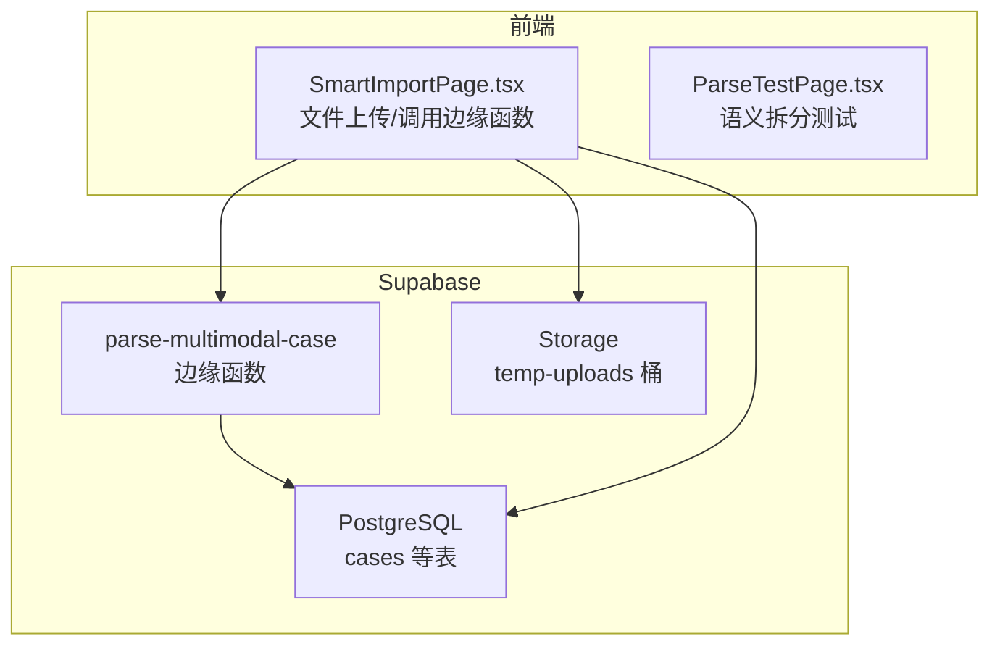
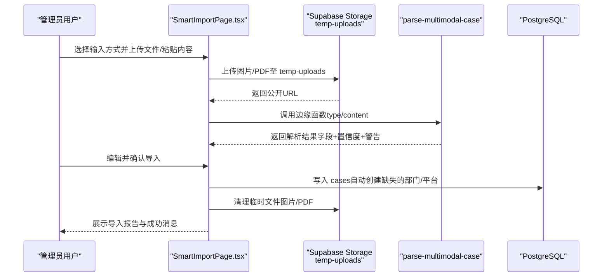
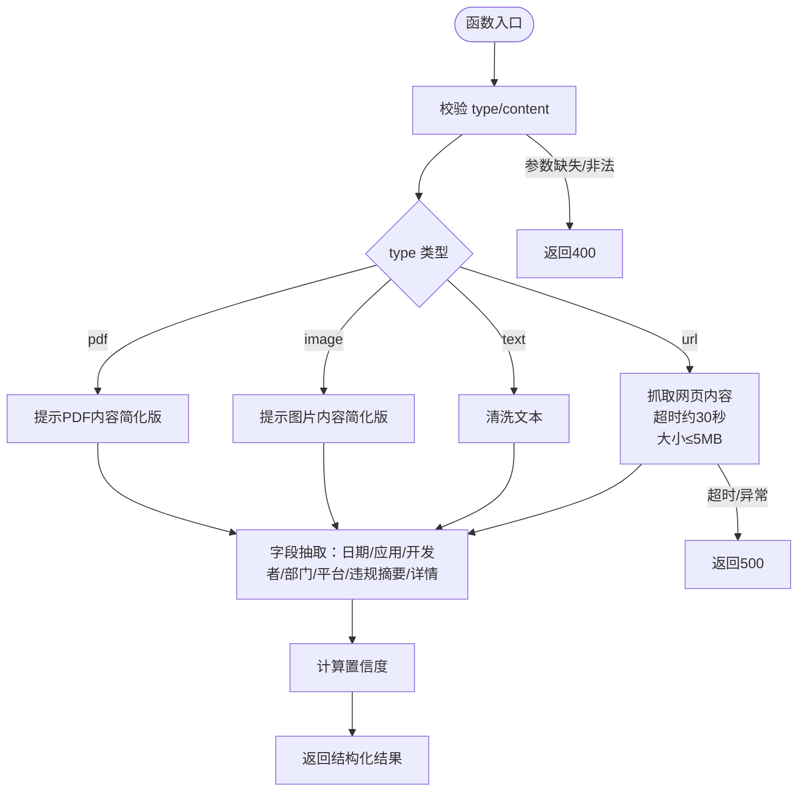
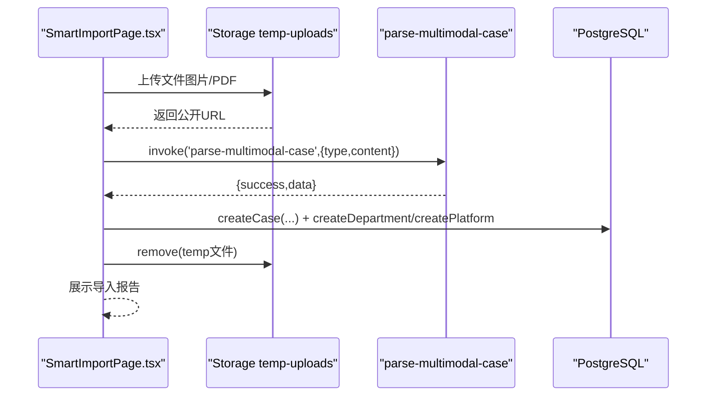
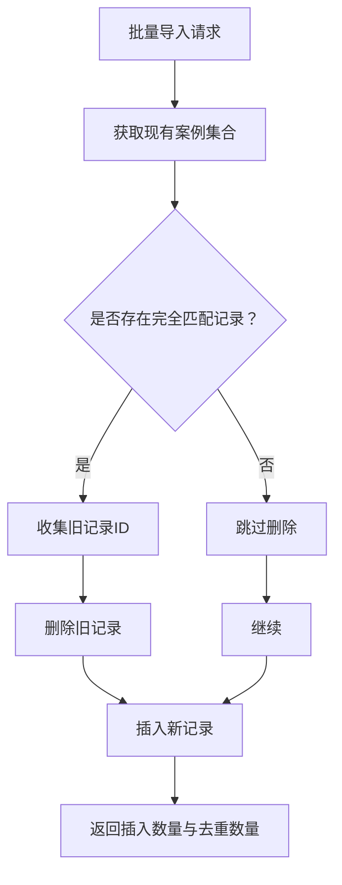
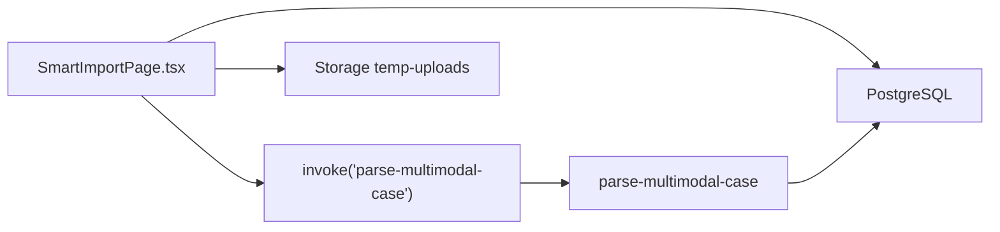

# 后端异步处理与任务队列

<cite>
**本文引用的文件**
- [supabase/functions/parse-multimodal-case/index.ts](file://supabase/functions/parse-multimodal-case/index.ts)
- [src/pages/admin/SmartImportPage.tsx](file://src/pages/admin/SmartImportPage.tsx)
- [src/db/api.ts](file://src/db/api.ts)
- [supabase/migrations/00002_create_temp_uploads_bucket.sql](file://supabase/migrations/00002_create_temp_uploads_bucket.sql)
- [src/pages/admin/ParseTestPage.tsx](file://src/pages/admin/ParseTestPage.tsx)
- [docs/MULTIMODAL_UPGRADE_PLAN.md](file://docs/MULTIMODAL_UPGRADE_PLAN.md)
- [docs/BATCH_MANAGEMENT_GUIDE.md](file://docs/BATCH_MANAGEMENT_GUIDE.md)
- [vercel.json](file://vercel.json)
- [supabase/config.toml](file://supabase/config.toml)
</cite>

## 目录
1. [简介](#简介)
2. [项目结构](#项目结构)
3. [核心组件](#核心组件)
4. [架构总览](#架构总览)
5. [详细组件分析](#详细组件分析)
6. [依赖关系分析](#依赖关系分析)
7. [性能与资源限制](#性能与资源限制)
8. [故障排查与日志](#故障排查与日志)
9. [结论](#结论)
10. [附录](#附录)

## 简介
本文件面向“后端批量导入处理机制”的技术文档，聚焦 parse-multimodal-case 云函数如何接收上传文件并进行异步解析，覆盖文件格式识别、数据清洗、语义拆分等处理流程；解释函数的资源限制配置（内存、执行时间）与超时规避策略；描述临时存储桶的生命周期管理、任务状态持久化机制，以及如何通过 API-optimized 接口通知前端处理进度；涵盖错误日志记录、部分成功场景的数据一致性保障，以及高并发下的限流与隔离设计。

## 项目结构
本项目采用“前端 + Supabase 边缘函数 + 存储 + 数据库”的分层架构。智能导入页面负责用户交互与文件上传，边缘函数负责解析与抽取，数据库负责持久化与统计。

图表来源
- [src/pages/admin/SmartImportPage.tsx](file://src/pages/admin/SmartImportPage.tsx#L105-L177)
- [supabase/functions/parse-multimodal-case/index.ts](file://supabase/functions/parse-multimodal-case/index.ts#L22-L129)
- [supabase/migrations/00002_create_temp_uploads_bucket.sql](file://supabase/migrations/00002_create_temp_uploads_bucket.sql#L19-L55)

章节来源
- [src/pages/admin/SmartImportPage.tsx](file://src/pages/admin/SmartImportPage.tsx#L1-L200)
- [supabase/functions/parse-multimodal-case/index.ts](file://supabase/functions/parse-multimodal-case/index.ts#L1-L129)
- [supabase/migrations/00002_create_temp_uploads_bucket.sql](file://supabase/migrations/00002_create_temp_uploads_bucket.sql#L1-L55)

## 核心组件
- parse-multimodal-case 边缘函数：接收多模态输入（URL、文本、图片、PDF），执行内容抓取/清洗、字段抽取与置信度计算，并返回结构化结果。
- 智能导入页面：提供 URL/文本/图片/PDF 四种输入方式，上传图片/PDF 至 temp-uploads 桶，调用边缘函数解析，支持编辑与确认导入。
- 临时存储桶 temp-uploads：限定类型与大小，RLS 策略仅管理员可上传/读取/删除，用于存放用户上传的图片/PDF。
- 数据库 API：提供批量导入、去重、统计等能力，配合边缘函数实现数据一致性与高效写入。

章节来源
- [supabase/functions/parse-multimodal-case/index.ts](file://supabase/functions/parse-multimodal-case/index.ts#L1-L129)
- [src/pages/admin/SmartImportPage.tsx](file://src/pages/admin/SmartImportPage.tsx#L105-L177)
- [supabase/migrations/00002_create_temp_uploads_bucket.sql](file://supabase/migrations/00002_create_temp_uploads_bucket.sql#L19-L55)
- [src/db/api.ts](file://src/db/api.ts#L628-L725)

## 架构总览
下面以序列图展示一次“智能导入”的端到端流程，从前端上传到边缘函数解析再到数据库入库与清理临时文件。

图表来源
- [src/pages/admin/SmartImportPage.tsx](file://src/pages/admin/SmartImportPage.tsx#L105-L177)
- [supabase/functions/parse-multimodal-case/index.ts](file://supabase/functions/parse-multimodal-case/index.ts#L22-L129)
- [supabase/migrations/00002_create_temp_uploads_bucket.sql](file://supabase/migrations/00002_create_temp_uploads_bucket.sql#L19-L55)
- [src/db/api.ts](file://src/db/api.ts#L599-L626)

## 详细组件分析

### parse-multimodal-case 边缘函数
- 输入参数与路由
  - type: 'url' | 'text' | 'image' | 'pdf'
  - content: 对应 URL、文本、或文件公开 URL
- 处理流程
  - URL 输入：校验协议（http/https）、超时控制（约 30 秒）、内容大小限制（约 5MB）、HTML 清洗与文本提取
  - 文本输入：去除多余空白
  - 图片/PDF 输入：当前版本返回提示信息（提示用户手动填写），完整 OCR/PDF 解析能力预留
  - 字段抽取：日期、应用名称、开发者、监管部门、平台、违规摘要、违规详情
  - 置信度：基于抽取字段数量计算
  - 输出：success/data 或 error
- 错误处理
  - 参数校验失败返回 400
  - 运行异常捕获并返回 500
  - URL 抓取超时抛出超时错误
- 资源限制与超时规避
  - fetch 请求设置超时（约 30 秒）
  - HTML 内容大小上限（约 5MB）
  - 正则与字符串处理为纯 CPU 计算，无外部网络依赖

图表来源
- [supabase/functions/parse-multimodal-case/index.ts](file://supabase/functions/parse-multimodal-case/index.ts#L22-L129)
- [supabase/functions/parse-multimodal-case/index.ts](file://supabase/functions/parse-multimodal-case/index.ts#L132-L191)
- [supabase/functions/parse-multimodal-case/index.ts](file://supabase/functions/parse-multimodal-case/index.ts#L214-L368)

章节来源
- [supabase/functions/parse-multimodal-case/index.ts](file://supabase/functions/parse-multimodal-case/index.ts#L1-L129)
- [supabase/functions/parse-multimodal-case/index.ts](file://supabase/functions/parse-multimodal-case/index.ts#L132-L191)
- [supabase/functions/parse-multimodal-case/index.ts](file://supabase/functions/parse-multimodal-case/index.ts#L214-L368)

### 智能导入页面（前端）
- 文件上传与临时存储
  - 仅允许图片（JPG/PNG）与 PDF，大小限制分别为 5MB 与 10MB
  - 上传至 temp-uploads 桶，生成公开 URL
  - 成功后提示“文件已上传，可以开始解析”
- 调用边缘函数
  - 根据当前 Tab 构造 {type, content} 发起调用
  - 解析成功后展示置信度与警告，支持编辑
- 导入数据库
  - 自动创建缺失的监管部门与平台
  - 写入 cases 表，生成导入报告
  - 清理临时文件（图片/PDF）

图表来源
- [src/pages/admin/SmartImportPage.tsx](file://src/pages/admin/SmartImportPage.tsx#L105-L177)
- [src/pages/admin/SmartImportPage.tsx](file://src/pages/admin/SmartImportPage.tsx#L189-L335)
- [supabase/migrations/00002_create_temp_uploads_bucket.sql](file://supabase/migrations/00002_create_temp_uploads_bucket.sql#L19-L55)

章节来源
- [src/pages/admin/SmartImportPage.tsx](file://src/pages/admin/SmartImportPage.tsx#L105-L177)
- [src/pages/admin/SmartImportPage.tsx](file://src/pages/admin/SmartImportPage.tsx#L189-L335)

### 临时存储桶生命周期管理
- 创建与策略
  - 桶名：temp-uploads
  - 公开访问：否
  - 文件大小限制：10MB
  - 允许 MIME：image/*、application/pdf
  - RLS 策略：仅管理员可上传/读取/删除
- 生命周期
  - 建议通过定时任务或手动清理策略定期删除旧对象
  - 页面导入完成后主动删除临时文件

章节来源
- [supabase/migrations/00002_create_temp_uploads_bucket.sql](file://supabase/migrations/00002_create_temp_uploads_bucket.sql#L19-L55)
- [src/pages/admin/SmartImportPage.tsx](file://src/pages/admin/SmartImportPage.tsx#L320-L324)

### 任务状态持久化与进度通知
- 当前实现
  - parse-multimodal-case 为同步边缘函数，解析完成后立即返回结果
  - 前端通过调用 invoke 同步等待结果，无需额外状态持久化
- 异步化建议
  - 若未来扩展为异步任务（队列/工作流），可在数据库新增任务表，记录状态（排队/处理中/完成/失败），前端轮询或 WebSocket 推送进度
  - 本仓库未发现现成的异步任务表与推送机制

章节来源
- [supabase/functions/parse-multimodal-case/index.ts](file://supabase/functions/parse-multimodal-case/index.ts#L22-L129)
- [src/pages/admin/SmartImportPage.tsx](file://src/pages/admin/SmartImportPage.tsx#L153-L177)

### 数据一致性与部分成功
- 部分成功场景
  - 边缘函数返回 warnings，前端展示并允许人工修正
  - 导入阶段仍可写入数据库，但建议在业务层对缺失关键字段进行阻断或标记
- 去重与批量导入
  - 提供批量导入与去重 API，避免重复数据入库
  - 去重策略：比较多个字段组合，删除旧记录后再插入新记录

图表来源
- [src/db/api.ts](file://src/db/api.ts#L667-L725)

章节来源
- [src/db/api.ts](file://src/db/api.ts#L628-L725)
- [docs/BATCH_MANAGEMENT_GUIDE.md](file://docs/BATCH_MANAGEMENT_GUIDE.md#L130-L189)

### 语义拆分与高频问题统计
- 前端测试页面展示了“违规问题”文本的语义拆分逻辑（按中文分号拆分），用于高频问题统计与分析
- 数据库侧可使用字符串函数拆分并统计，前端展示拆分后的独立问题

章节来源
- [src/pages/admin/ParseTestPage.tsx](file://src/pages/admin/ParseTestPage.tsx#L1-L120)
- [docs/MULTIMODAL_UPGRADE_PLAN.md](file://docs/MULTIMODAL_UPGRADE_PLAN.md#L22-L61)

## 依赖关系分析
- 前端依赖
  - 调用 Supabase Functions.invoke 调用 parse-multimodal-case
  - 使用 Supabase Storage 上传图片/PDF 至 temp-uploads
  - 使用 Supabase 客户端写入 cases 表
- 后端依赖
  - parse-multimodal-case 依赖浏览器 fetch（Edge Runtime）进行网页抓取
  - 数据库依赖 PostgreSQL 函数与表结构（cases、regulatory_departments、app_platforms 等）

图表来源
- [src/pages/admin/SmartImportPage.tsx](file://src/pages/admin/SmartImportPage.tsx#L105-L177)
- [supabase/functions/parse-multimodal-case/index.ts](file://supabase/functions/parse-multimodal-case/index.ts#L22-L129)

章节来源
- [src/pages/admin/SmartImportPage.tsx](file://src/pages/admin/SmartImportPage.tsx#L105-L177)
- [supabase/functions/parse-multimodal-case/index.ts](file://supabase/functions/parse-multimodal-case/index.ts#L22-L129)

## 性能与资源限制
- 边缘函数资源限制
  - 本仓库未发现显式的内存/执行时间限制配置文件
  - 依据函数实现，主要受限于 fetch 超时（约 30 秒）与 HTML 内容大小（约 5MB）
- 超时规避策略
  - 设置 AbortController 超时，避免长时间阻塞
  - 对大网页进行大小限制
- 并发与限流
  - 前端未实现显式限流；建议在边缘函数或网关层增加速率限制
  - 建议对图片/PDF上传增加并发队列与重试机制
- 部署与环境
  - Vercel 项目配置包含安装与构建命令，未见边缘函数专用资源限制配置

章节来源
- [supabase/functions/parse-multimodal-case/index.ts](file://supabase/functions/parse-multimodal-case/index.ts#L146-L191)
- [vercel.json](file://vercel.json#L1-L13)
- [supabase/config.toml](file://supabase/config.toml#L1-L3)

## 故障排查与日志
- 常见错误
  - 参数缺失/非法：返回 400
  - URL 协议不合法或抓取失败：返回 500
  - 抓取超时：提示超时错误
- 日志记录
  - 边缘函数内部使用 console.error 记录错误
  - 前端捕获 invoke 错误并弹窗提示
- 部分成功处理
  - 边缘函数返回 warnings，前端展示并允许人工修正
  - 导入阶段可对缺失关键字段进行阻断或标记

章节来源
- [supabase/functions/parse-multimodal-case/index.ts](file://supabase/functions/parse-multimodal-case/index.ts#L22-L129)
- [src/pages/admin/SmartImportPage.tsx](file://src/pages/admin/SmartImportPage.tsx#L153-L177)

## 结论
本机制以 parse-multimodal-case 为核心，结合前端上传与边缘函数解析，实现了多模态输入的统一处理与结构化输出。当前为同步流程，具备良好的错误处理与用户反馈；若扩展为异步任务，建议引入任务表与进度通知机制，并在边缘函数/网关层增加限流与隔离策略，以保障高并发稳定性与一致性。

## 附录
- 相关文档
  - 多模态升级计划与实现说明
  - 批量管理与去重指南
- 关键路径
  - parse-multimodal-case 主体逻辑
  - 智能导入页面调用链路
  - 临时存储桶策略与清理

章节来源
- [docs/MULTIMODAL_UPGRADE_PLAN.md](file://docs/MULTIMODAL_UPGRADE_PLAN.md#L22-L61)
- [docs/BATCH_MANAGEMENT_GUIDE.md](file://docs/BATCH_MANAGEMENT_GUIDE.md#L130-L189)
- [supabase/functions/parse-multimodal-case/index.ts](file://supabase/functions/parse-multimodal-case/index.ts#L1-L129)
- [src/pages/admin/SmartImportPage.tsx](file://src/pages/admin/SmartImportPage.tsx#L105-L177)
- [supabase/migrations/00002_create_temp_uploads_bucket.sql](file://supabase/migrations/00002_create_temp_uploads_bucket.sql#L19-L55)