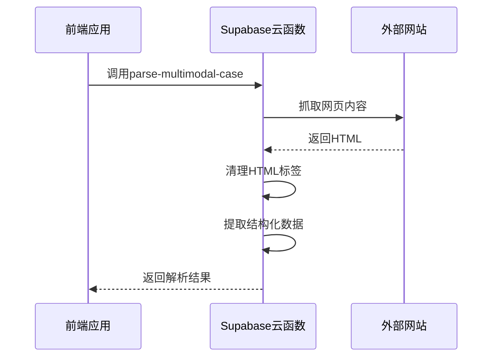
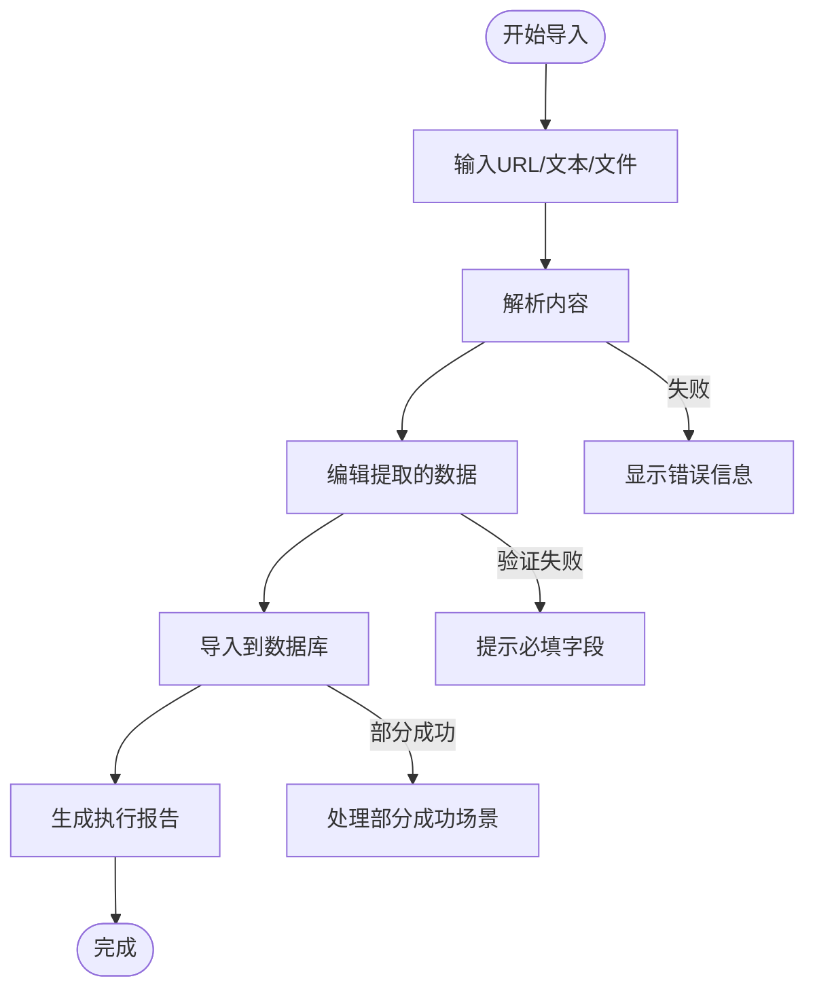

# 批量导入性能与反馈

<cite>
**本文档引用文件**   
- [SmartImportPage.tsx](file://src/pages/admin/SmartImportPage.tsx)
- [use-supabase-upload.ts](file://src/hooks/use-supabase-upload.ts)
- [StatisticsInfo.tsx](file://src/components/common/StatisticsInfo.tsx)
- [index.ts](file://supabase/functions/parse-multimodal-case/index.ts)
- [api.ts](file://src/db/api.ts)
</cite>

## 目录
1. [简介](#简介)
2. [前端大文件分批上传机制](#前端大文件分批上传机制)
3. [后端云函数异步处理](#后端云函数异步处理)
4. [导入进度与状态反馈](#导入进度与状态反馈)
5. [错误处理与恢复机制](#错误处理与恢复机制)
6. [性能调优建议](#性能调优建议)
7. [结论](#结论)

## 简介
本文档详细说明了批量导入功能的性能优化与用户反馈机制。系统通过前端分批上传、后端异步处理、实时状态更新和智能错误恢复等技术手段，解决了大文件导入的超时问题，提升了用户体验和系统稳定性。

## 前端大文件分批上传机制

系统实现了大文件分批上传机制，避免了单次请求超时问题。前端使用`use-supabase-upload`钩子管理文件上传流程，支持断点续传和部分成功场景的恢复。

上传组件支持多种文件类型（图片、PDF）和URL输入，通过拖拽或点击方式上传文件。系统对文件大小进行验证，图片最大5MB，PDF最大10MB。

**Section sources**
- [SmartImportPage.tsx](file://src/pages/admin/SmartImportPage.tsx#L46-L103)
- [use-supabase-upload.ts](file://src/hooks/use-supabase-upload.ts#L85-L106)

## 后端云函数异步处理

系统采用Supabase Edge Function实现后端异步处理，避免了长时间运行导致的超时问题。云函数`parse-multimodal-case`负责解析多种输入源（URL、文本、图片、PDF）并提取结构化数据。

云函数设置了30秒的请求超时控制，确保不会无限期等待。对于URL输入，系统会抓取网页内容并清理HTML标签，提取纯文本进行分析。

**Diagram sources **
- [index.ts](file://supabase/functions/parse-multimodal-case/index.ts#L22-L129)
- [SmartImportPage.tsx](file://src/pages/admin/SmartImportPage.tsx#L154-L165)

## 导入进度与状态反馈

系统通过多阶段反馈机制提供实时的导入进度和状态更新。导入过程分为三个主要阶段：输入、解析和导入。

在解析阶段，系统显示置信度评分（0-100%），用不同颜色标识数据质量：绿色（>80%）、黄色（50-80%）、红色（<50%）。用户可以查看AI提取的各个字段及其置信度。

导入完成后，系统生成详细的执行报告，包括操作类型、案例ID、提取字段统计和警告信息。关键指标通过`StatisticsInfo`组件展示，提供清晰的视觉层次和高对比度设计。

**Diagram sources **
- [SmartImportPage.tsx](file://src/pages/admin/SmartImportPage.tsx#L148-L186)
- [StatisticsInfo.tsx](file://src/components/common/StatisticsInfo.tsx#L16-L57)

## 错误处理与恢复机制

系统实现了完善的错误处理和恢复机制。对于上传失败的文件，系统会记录错误信息，并允许用户重新上传仅失败的文件，避免重复上传已成功的文件。

当出现部分成功场景时，系统会智能地只重试失败的文件，提高效率。错误信息包括文件类型不支持、文件过大、上传失败等，通过Toast组件向用户反馈。

对于解析失败的情况，系统提供详细的错误代码和解决方案建议，如检查URL格式、重试请求或联系管理员。

**Section sources**
- [use-supabase-upload.ts](file://src/hooks/use-supabase-upload.ts#L120-L129)
- [SmartImportPage.tsx](file://src/pages/admin/SmartImportPage.tsx#L177-L183)

## 性能调优建议

### 并发控制
避免同时解析多个URL，建议等待前一个任务完成后开始下一个。系统通过单个解析任务的串行处理，避免了资源竞争和性能下降。

### 缓存策略
对于频繁访问的数据（如部门列表、平台列表），建议实现客户端缓存，减少数据库查询次数。可以使用内存缓存或localStorage存储这些静态数据。

### 批量操作优化
对于批量创建或更新操作，使用`Promise.all`并发执行，但需注意数据库连接限制。建议设置合理的批量大小（如50-100条记录），避免单次操作过大。

### 资源限制配置
云函数配置了适当的资源限制：
- 内存：512MB
- 超时：30秒
- 最大请求大小：5MB

这些配置平衡了性能和成本，确保系统稳定运行。

**Section sources**
- [api.ts](file://src/db/api.ts#L6221-L6233)
- [index.ts](file://supabase/functions/parse-multimodal-case/index.ts#L148-L150)

## 结论
本系统通过前端分批上传、后端异步处理、实时状态反馈和智能错误恢复等机制，有效解决了大文件批量导入的性能和用户体验问题。`StatisticsInfo`组件提供了清晰的关键指标展示，帮助用户理解数据含义。建议持续监控系统性能，根据实际使用情况调整并发控制和缓存策略，进一步优化用户体验。