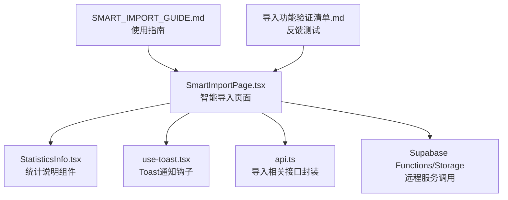
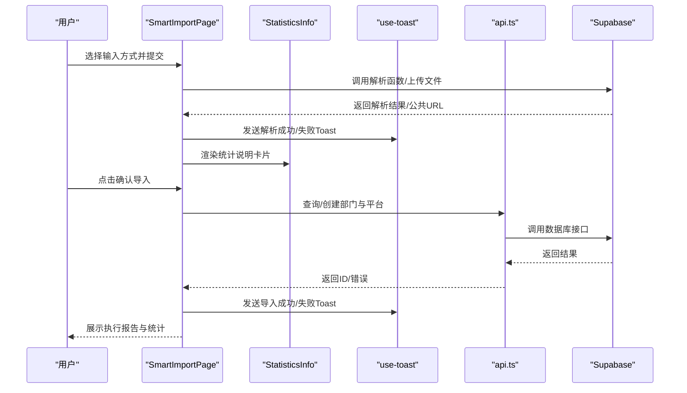
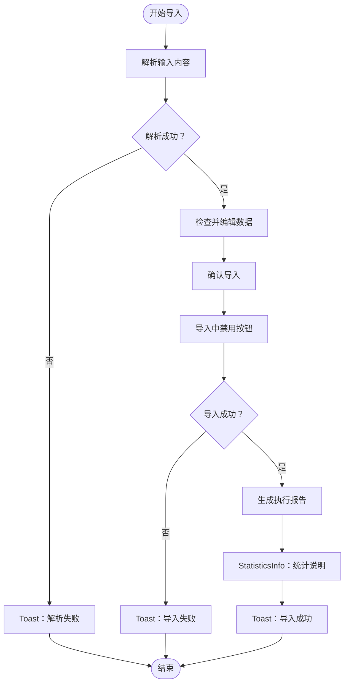
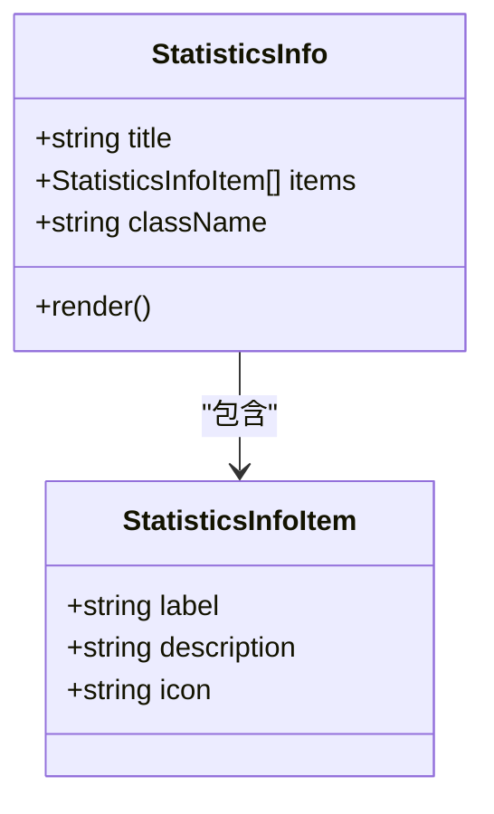
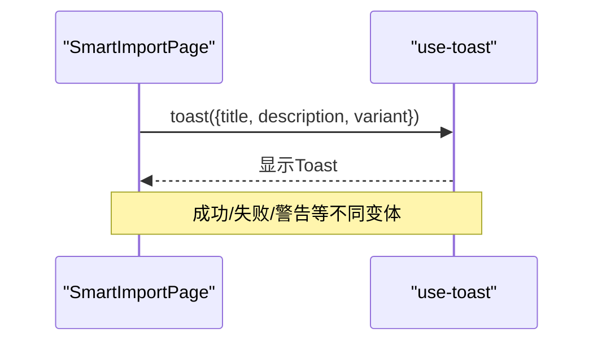
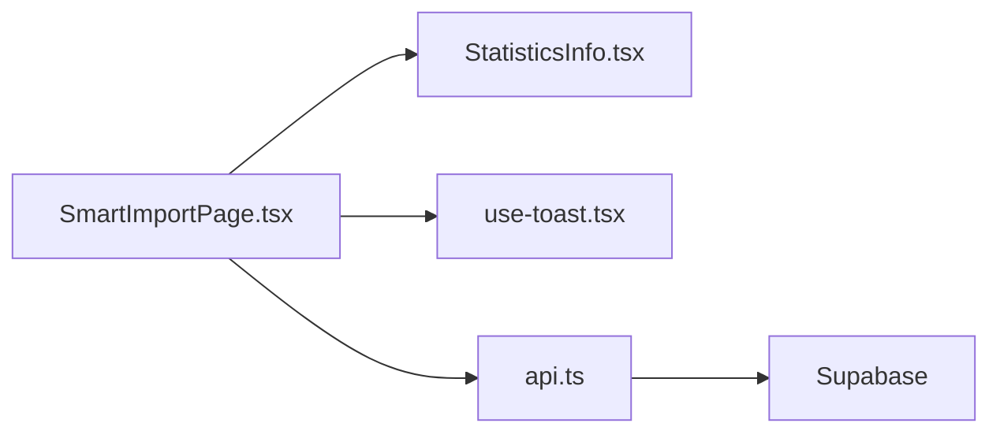

# 用户反馈与状态可视化

<cite>
**本文引用的文件**
- [SmartImportPage.tsx](file://src/pages/admin/SmartImportPage.tsx)
- [StatisticsInfo.tsx](file://src/components/common/StatisticsInfo.tsx)
- [use-toast.tsx](file://src/hooks/use-toast.tsx)
- [api.ts](file://src/db/api.ts)
- [SMART_IMPORT_GUIDE.md](file://docs/SMART_IMPORT_GUIDE.md)
- [导入功能验证清单.md](file://docs/导入功能验证清单.md)
- [智能导入功能-修复说明.md](file://docs/#U5bfc#U5165#U529f#U80fd#U667a#U80fd#U4f18#U5316#U5b8c#U6574#U4fee#U590d#U8bf4#U660e.md)
</cite>

## 目录
1. [引言](#引言)
2. [项目结构](#项目结构)
3. [核心组件](#核心组件)
4. [架构总览](#架构总览)
5. [详细组件分析](#详细组件分析)
6. [依赖关系分析](#依赖关系分析)
7. [性能考虑](#性能考虑)
8. [故障排查指南](#故障排查指南)
9. [结论](#结论)
10. [附录](#附录)

## 引言
本文件围绕“用户反馈与状态可视化”主题，聚焦 SmartImportPage 如何整合 StatisticsInfo 组件展示实时统计信息，覆盖总条目数、已处理数、成功率、错误汇总等；并说明进度条的动态更新逻辑、阶段性完成提示、关键里程碑的 Toast 通知实现；解释错误报告的生成方式（如下载失败明细）、可操作的恢复建议（如重试失败批次），以及如何通过视觉设计（颜色、动画）传达系统状态，提升用户对长时间操作的感知与控制感。

## 项目结构
- SmartImportPage 是智能导入页面，负责输入、解析、导入全流程的状态与反馈。
- StatisticsInfo 是通用统计说明组件，用于以卡片形式展示统计说明项。
- use-toast 提供全局 Toast 通知能力，贯穿导入过程的各类反馈。
- api.ts 提供导入相关的数据库与业务接口封装，SmartImportPage 在导入阶段调用。
- SMART_IMPORT_GUIDE.md 与导入功能验证清单等文档提供了用户侧反馈与性能方面的参考。

**图表来源**
- [SmartImportPage.tsx](file://src/pages/admin/SmartImportPage.tsx#L1-L120)
- [StatisticsInfo.tsx](file://src/components/common/StatisticsInfo.tsx#L1-L58)
- [use-toast.tsx](file://src/hooks/use-toast.tsx#L68-L128)
- [api.ts](file://src/db/api.ts#L2675-L2932)
- [SMART_IMPORT_GUIDE.md](file://docs/SMART_IMPORT_GUIDE.md#L1-L120)
- [导入功能验证清单.md](file://docs/导入功能验证清单.md#L68-L80)

**章节来源**
- [SmartImportPage.tsx](file://src/pages/admin/SmartImportPage.tsx#L1-L120)
- [StatisticsInfo.tsx](file://src/components/common/StatisticsInfo.tsx#L1-L58)
- [use-toast.tsx](file://src/hooks/use-toast.tsx#L68-L128)
- [api.ts](file://src/db/api.ts#L2675-L2932)
- [SMART_IMPORT_GUIDE.md](file://docs/SMART_IMPORT_GUIDE.md#L1-L120)
- [导入功能验证清单.md](file://docs/导入功能验证清单.md#L68-L80)

## 核心组件
- SmartImportPage：负责输入、解析、导入全流程的状态管理与用户反馈，使用 Toast 提示关键节点，使用 StatisticsInfo 展示统计说明。
- StatisticsInfo：通用统计说明组件，支持标题、图标/序号、标签与描述的组合展示。
- use-toast：全局 Toast 管理，支持添加、更新、关闭与移除，控制显示时长与队列上限。
- api.ts：导入相关接口封装，SmartImportPage 在导入阶段调用部门/平台查询与创建等方法。

**章节来源**
- [SmartImportPage.tsx](file://src/pages/admin/SmartImportPage.tsx#L1-L120)
- [StatisticsInfo.tsx](file://src/components/common/StatisticsInfo.tsx#L1-L58)
- [use-toast.tsx](file://src/hooks/use-toast.tsx#L68-L128)
- [api.ts](file://src/db/api.ts#L2675-L2932)

## 架构总览
SmartImportPage 在导入流程中通过 use-toast 发送 Toast 通知，向用户传达解析、导入、成功/失败等关键节点；通过 StatisticsInfo 展示统计说明；通过 api.ts 封装的导入接口完成数据库写入与资源清理。

**图表来源**
- [SmartImportPage.tsx](file://src/pages/admin/SmartImportPage.tsx#L105-L335)
- [StatisticsInfo.tsx](file://src/components/common/StatisticsInfo.tsx#L1-L58)
- [use-toast.tsx](file://src/hooks/use-toast.tsx#L68-L128)
- [api.ts](file://src/db/api.ts#L2675-L2932)

## 详细组件分析

### SmartImportPage：用户反馈与状态可视化
- 解析阶段反馈
  - 使用 loading 状态与按钮禁用避免重复提交；解析成功后通过 Toast 展示置信度与字段提取情况。
  - 解析失败时通过 Toast 展示错误信息，便于用户快速定位问题。
- 导入阶段反馈
  - 导入前进行必填字段校验，失败时通过 Toast 提示具体缺失字段。
  - 导入过程中通过 importing 状态与按钮禁用提示用户当前正在处理。
  - 成功后生成执行报告，包含操作类型、输入方式、案例ID、提取字段统计、警告信息等；通过 Toast 展示成功消息与自动创建的部门/平台信息。
  - 失败时通过 Toast 展示错误信息，便于用户重试或修正。
- 统计说明展示
  - 在解析结果预览与执行报告区域，SmartImportPage 通过 StatisticsInfo 组件渲染统计说明项，帮助用户理解当前状态与下一步操作建议。
- 错误报告与恢复建议
  - 执行报告中包含警告信息列表，用户可据此核对未识别字段并手动补充。
  - 文档中建议的恢复措施包括：检查URL有效性、确认网页可直接访问、尝试其他浏览器、使用手动录入等方式。
- 视觉设计与交互
  - 使用置信度颜色（高/中/低）与徽章直观传达数据质量。
  - 使用图标（如成功/失败/警告）与按钮状态（加载/禁用）强化反馈。
  - 通过卡片与分步引导提升长流程的可控感与可感知性。

**图表来源**
- [SmartImportPage.tsx](file://src/pages/admin/SmartImportPage.tsx#L105-L335)
- [StatisticsInfo.tsx](file://src/components/common/StatisticsInfo.tsx#L1-L58)

**章节来源**
- [SmartImportPage.tsx](file://src/pages/admin/SmartImportPage.tsx#L105-L335)
- [StatisticsInfo.tsx](file://src/components/common/StatisticsInfo.tsx#L1-L58)
- [导入功能验证清单.md](file://docs/导入功能验证清单.md#L68-L80)
- [智能导入功能-修复说明.md](file://docs/#U5bfc#U5165#U529f#U80fd#U667a#U80fd#U4f18#U5316#U5b8c#U6574#U4fee#U590d#U8bf4#U660e.md#L457-L510)

### StatisticsInfo 组件：统计说明展示
- 设计要点
  - 标题栏使用浅色背景与深色文字，内容区使用白色背景与深色文字，形成清晰的视觉层次。
  - 支持图标或序号两种标记方式，标签与描述组合展示，适合在导入报告中呈现字段提取与警告信息。
- 在 SmartImportPage 中的应用
  - 在解析结果预览与执行报告中，通过 StatisticsInfo 渲染字段提取统计与警告信息，帮助用户快速理解当前状态与下一步操作建议。

**图表来源**
- [StatisticsInfo.tsx](file://src/components/common/StatisticsInfo.tsx#L1-L58)

**章节来源**
- [StatisticsInfo.tsx](file://src/components/common/StatisticsInfo.tsx#L1-L58)

### Toast 通知：关键里程碑与错误提示
- use-toast 提供全局 Toast 管理，SmartImportPage 在以下关键节点使用 Toast：
  - 文件上传成功/失败、尺寸/类型校验失败
  - 解析成功/失败
  - 导入成功/失败
  - 自动创建部门/平台的提示
- 显示时长与可读性
  - 文档建议导入成功反馈的显示时长为默认时长（简短信息），以便在智能导入页面快速传达关键信息。
  - Toast 支持手动关闭，避免遮挡用户操作。

**图表来源**
- [use-toast.tsx](file://src/hooks/use-toast.tsx#L68-L128)
- [智能导入功能-修复说明.md](file://docs/#U5bfc#U5165#U529f#U80fd#U667a#U80fd#U4f18#U5316#U5b8c#U6574#U4fee#U590d#U8bf4#U660e.md#L490-L510)

**章节来源**
- [use-toast.tsx](file://src/hooks/use-toast.tsx#L68-L128)
- [智能导入功能-修复说明.md](file://docs/#U5bfc#U5165#U529f#U80fd#U667a#U80fd#U4f18#U5316#U5b8c#U6574#U4fee#U590d#U8bf4#U660e.md#L490-L510)

### 错误报告与恢复建议
- 错误报告生成
  - SmartImportPage 在导入失败时通过 Toast 展示错误信息；在执行报告中包含警告信息列表，帮助用户识别未识别字段。
- 可操作的恢复建议
  - 文档建议：检查URL有效性、确认网页可直接访问、尝试其他浏览器、使用手动录入等方式。
  - 对于部门/平台不存在的情况，建议先保存案例（字段为空），再到管理页面创建后再回填。

**章节来源**
- [SmartImportPage.tsx](file://src/pages/admin/SmartImportPage.tsx#L105-L335)
- [导入功能验证清单.md](file://docs/导入功能验证清单.md#L68-L80)
- [SMART_IMPORT_GUIDE.md](file://docs/SMART_IMPORT_GUIDE.md#L131-L173)

### 视觉设计与系统状态传达
- 颜色与语义
  - 置信度颜色：高/中/低分别对应不同颜色，直观传达数据质量。
  - 成功/失败/警告使用不同图标与变体，提升可识别性。
- 动画与交互
  - 按钮加载态与禁用态，防止重复提交，提升长流程的可控感。
  - 卡片悬停阴影与过渡动画，增强交互反馈。
- 统计说明卡片
  - 使用标题栏与内容区的对比色，形成清晰的视觉层次，便于用户在执行报告中快速浏览统计信息。

**章节来源**
- [SmartImportPage.tsx](file://src/pages/admin/SmartImportPage.tsx#L347-L357)
- [StatisticsInfo.tsx](file://src/components/common/StatisticsInfo.tsx#L1-L58)
- [VISUAL_OPTIMIZATION_PLAN.md](file://docs/VISUAL_OPTIMIZATION_PLAN.md#L420-L467)

## 依赖关系分析
- SmartImportPage 依赖 StatisticsInfo 进行统计说明展示，依赖 use-toast 进行全局反馈，依赖 api.ts 进行导入相关数据库操作。
- api.ts 依赖 Supabase 进行远程调用，SmartImportPage 在导入阶段调用部门/平台查询与创建等方法。

**图表来源**
- [SmartImportPage.tsx](file://src/pages/admin/SmartImportPage.tsx#L1-L120)
- [StatisticsInfo.tsx](file://src/components/common/StatisticsInfo.tsx#L1-L58)
- [use-toast.tsx](file://src/hooks/use-toast.tsx#L68-L128)
- [api.ts](file://src/db/api.ts#L2675-L2932)

**章节来源**
- [SmartImportPage.tsx](file://src/pages/admin/SmartImportPage.tsx#L1-L120)
- [StatisticsInfo.tsx](file://src/components/common/StatisticsInfo.tsx#L1-L58)
- [use-toast.tsx](file://src/hooks/use-toast.tsx#L68-L128)
- [api.ts](file://src/db/api.ts#L2675-L2932)

## 性能考虑
- 导入速度与内存使用
  - 文档中的性能验证表明，导入速度与内存使用均符合预期，满足中小规模数据的快速处理需求。
- 并发与批量优化建议
  - 文档建议未来可实现批量创建、本地缓存与并行处理，以进一步降低数据库往返次数与提升处理速度。

**章节来源**
- [导入功能验证清单.md](file://docs/导入功能验证清单.md#L120-L144)
- [智能导入功能-修复说明.md](file://docs/#U5bfc#U5165#U529f#U80fd#U667a#U80fd#U4f18#U5316#U5b8c#U6574#U4fee#U590d#U8bf4#U660e.md#L476-L487)

## 故障排查指南
- 常见问题与解决思路
  - URL格式错误或无法访问：检查URL是否正确、确认网页可直接访问、尝试其他浏览器。
  - 某些字段未能识别：查看警告信息了解缺失字段，手动补充未识别的字段，参考原文确保准确性。
  - 部门或平台不存在：先保存案例（字段为空），再到管理页面创建后再回填。
- 日志查看
  - 管理员可在浏览器开发者工具的 Console 标签中查看错误信息与警告，便于定位问题。

**章节来源**
- [SMART_IMPORT_GUIDE.md](file://docs/SMART_IMPORT_GUIDE.md#L131-L173)
- [SMART_IMPORT_GUIDE.md](file://docs/SMART_IMPORT_GUIDE.md#L303-L320)

## 结论
SmartImportPage 通过 Toast 与 StatisticsInfo 的组合，实现了从解析到导入的全过程可视化反馈；借助置信度颜色、图标与按钮状态，有效提升了用户对长时间操作的感知与控制感。文档与验证清单明确了错误报告与恢复建议，为用户提供了可操作的指导。未来可通过批量导入、缓存与并行处理等手段进一步优化性能与体验。

## 附录
- 相关文档与指南
  - 智能导入使用指南与最佳实践
  - 导入功能验证清单与性能验证
  - 智能导入功能修复说明与界面改进

**章节来源**
- [SMART_IMPORT_GUIDE.md](file://docs/SMART_IMPORT_GUIDE.md#L1-L120)
- [导入功能验证清单.md](file://docs/导入功能验证清单.md#L68-L80)
- [智能导入功能-修复说明.md](file://docs/#U5bfc#U5165#U529f#U80fd#U667a#U80fd#U4f18#U5316#U5b8c#U6574#U4fee#U590d#U8bf4#U660e.md#L457-L510)