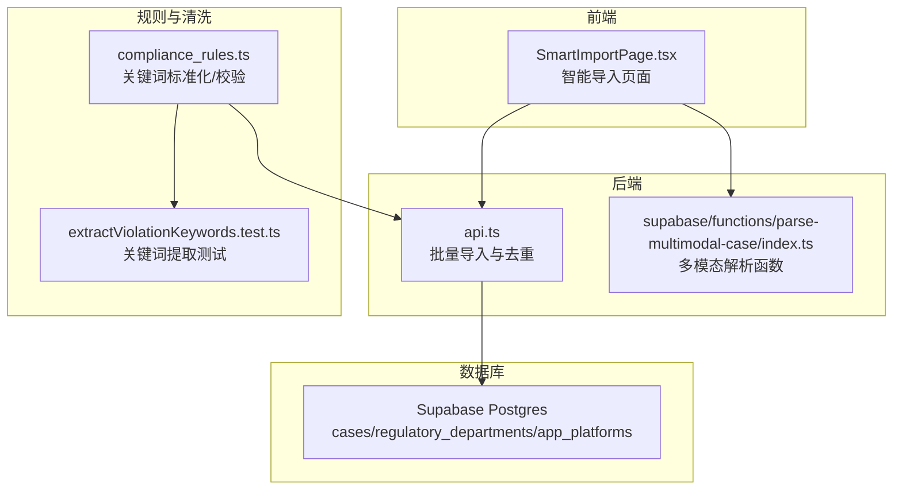
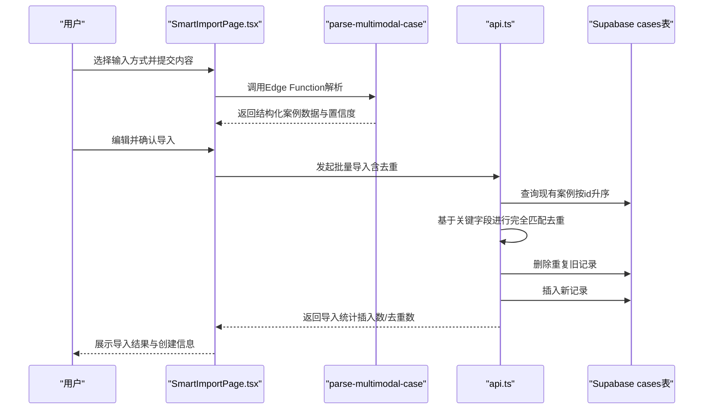
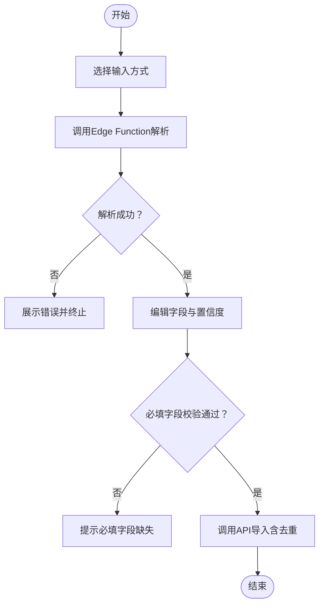
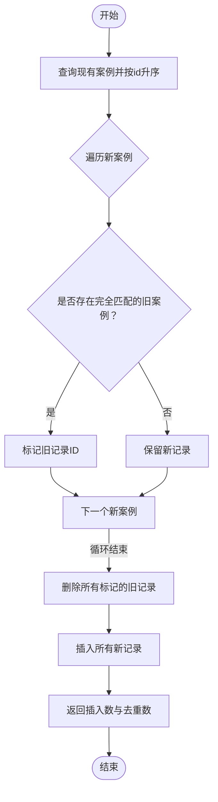
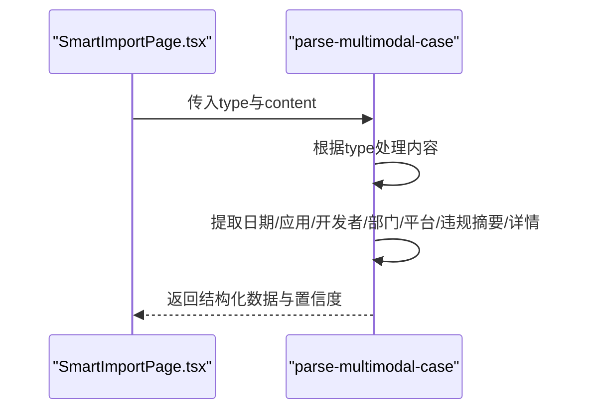
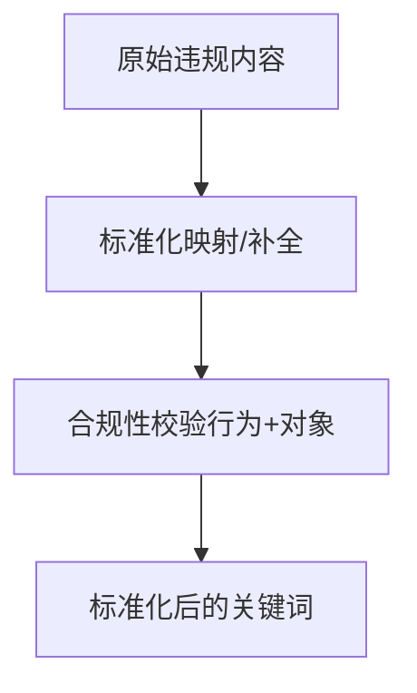
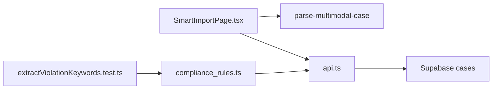

# 数据冲突检测与处理

<cite>
**本文引用的文件**
- [src/utils/sortUtils.ts](file://src/utils/sortUtils.ts)
- [src/db/extractViolationKeywords.test.ts](file://src/db/extractViolationKeywords.test.ts)
- [src/db/compliance_rules.ts](file://src/db/compliance_rules.ts)
- [src/db/api.ts](file://src/db/api.ts)
- [src/pages/admin/SmartImportPage.tsx](file://src/pages/admin/SmartImportPage.tsx)
- [supabase/functions/parse-multimodal-case/index.ts](file://supabase/functions/parse-multimodal-case/index.ts)
- [src/types/types.ts](file://src/types/types.ts)
- [docs/#U5bfc#U5165#U529f#U80fd#U667a#U80fd#U4f18#U5316#U5b8c#U6574#U4fee#U590d#U8bf4#U660e.md](file://docs/#U5bfc#U5165#U529f#U80fd#U667a#U80fd#U4f18#U5316#U5b8c#U6574#U4fee#U590d#U8bf4#U660e.md)
- [docs/BATCH_MANAGEMENT_GUIDE.md](file://docs/BATCH_MANAGEMENT_GUIDE.md)
</cite>

## 目录
1. [引言](#引言)
2. [项目结构](#项目结构)
3. [核心组件](#核心组件)
4. [架构总览](#架构总览)
5. [详细组件分析](#详细组件分析)
6. [依赖关系分析](#依赖关系分析)
7. [性能考量](#性能考量)
8. [故障排查指南](#故障排查指南)
9. [结论](#结论)
10. [附录](#附录)

## 引言
本文件围绕“数据冲突检测与处理”主题，聚焦于重复案例导入问题的系统化解决方案。目标是通过关键字段（如案例编号、标题、发生时间）组合进行相似度比对，并利用工具函数确保比对前的数据排序一致性；同时结合文本清洗与标准化规则，提升基于违规内容的去重精度；最后描述系统在检测到潜在重复时的用户交互流程，包括提示信息展示、差异对比视图及用户选择保留策略，保障数据唯一性与操作透明性。

## 项目结构
本项目采用前后端分离与多层架构组织，涉及前端页面、数据库API、Supabase Edge Functions以及文档化的导入流程说明。与重复导入相关的关键路径包括：
- 前端智能导入页面：负责解析输入、预览与确认导入
- 后端API：提供批量导入与去重逻辑
- Supabase函数：多模态解析案例文本，抽取结构化字段
- 规则与清洗：合规关键词标准化与校验

图表来源
- [src/pages/admin/SmartImportPage.tsx](file://src/pages/admin/SmartImportPage.tsx#L1-L800)
- [src/db/api.ts](file://src/db/api.ts#L666-L725)
- [supabase/functions/parse-multimodal-case/index.ts](file://supabase/functions/parse-multimodal-case/index.ts#L1-L368)
- [src/db/compliance_rules.ts](file://src/db/compliance_rules.ts#L1-L112)
- [src/db/extractViolationKeywords.test.ts](file://src/db/extractViolationKeywords.test.ts#L1-L75)

章节来源
- [src/pages/admin/SmartImportPage.tsx](file://src/pages/admin/SmartImportPage.tsx#L1-L800)
- [src/db/api.ts](file://src/db/api.ts#L666-L725)
- [supabase/functions/parse-multimodal-case/index.ts](file://supabase/functions/parse-multimodal-case/index.ts#L1-L368)
- [src/db/compliance_rules.ts](file://src/db/compliance_rules.ts#L1-L112)
- [src/db/extractViolationKeywords.test.ts](file://src/db/extractViolationKeywords.test.ts#L1-L75)

## 核心组件
- 智能导入页面（SmartImportPage.tsx）
  - 支持URL、文本、图片、PDF四种输入方式，调用Supabase Edge Function进行解析，生成结构化案例数据并允许用户编辑确认。
- 批量导入与去重（api.ts）
  - 提供批量导入接口，并在导入前扫描现有案例，基于关键字段进行完全匹配去重，删除旧记录后插入新记录，返回导入统计。
- 多模态解析函数（parse-multimodal-case/index.ts）
  - 从网页URL、文本、图片、PDF中抽取日期、应用名称、开发者、监管部门、应用平台、违规摘要与详细内容等字段，并计算置信度与警告信息。
- 合规关键词标准化与校验（compliance_rules.ts）
  - 提供关键词映射表、标准化函数与合规性校验，保证违规内容的一致性与可比性。
- 关键词提取测试（extractViolationKeywords.test.ts）
  - 验证关键词提取、标准化与合规性校验的正确性，覆盖补全、验证与集成场景。

章节来源
- [src/pages/admin/SmartImportPage.tsx](file://src/pages/admin/SmartImportPage.tsx#L1-L800)
- [src/db/api.ts](file://src/db/api.ts#L666-L725)
- [supabase/functions/parse-multimodal-case/index.ts](file://supabase/functions/parse-multimodal-case/index.ts#L1-L368)
- [src/db/compliance_rules.ts](file://src/db/compliance_rules.ts#L1-L112)
- [src/db/extractViolationKeywords.test.ts](file://src/db/extractViolationKeywords.test.ts#L1-L75)

## 架构总览
下图展示了从用户输入到数据库写入的完整流程，以及重复检测与处理的关键节点。

图表来源
- [src/pages/admin/SmartImportPage.tsx](file://src/pages/admin/SmartImportPage.tsx#L1-L800)
- [src/db/api.ts](file://src/db/api.ts#L666-L725)
- [supabase/functions/parse-multimodal-case/index.ts](file://supabase/functions/parse-multimodal-case/index.ts#L1-L368)

## 详细组件分析

### 组件A：智能导入页面（SmartImportPage.tsx）
- 功能要点
  - 支持多种输入源，统一调用Supabase Edge Function进行解析。
  - 解析完成后展示字段与置信度，允许用户编辑。
  - 导入前进行必填字段校验，自动创建缺失的监管部门与应用平台。
  - 导入成功后输出执行报告与创建信息。
- 关键交互
  - 解析阶段：根据输入类型调用不同处理逻辑，计算置信度与警告。
  - 编辑阶段：用户可修改字段，系统保留解析结果作为默认值。
  - 导入阶段：调用API创建案例，若创建了新部门/平台，会在结果中提示。

图表来源
- [src/pages/admin/SmartImportPage.tsx](file://src/pages/admin/SmartImportPage.tsx#L1-L800)

章节来源
- [src/pages/admin/SmartImportPage.tsx](file://src/pages/admin/SmartImportPage.tsx#L1-L800)

### 组件B：批量导入与去重（api.ts）
- 功能要点
  - 批量导入接口：接收案例数组，先查询现有案例并按id升序排序，再进行完全匹配去重。
  - 去重策略：以关键字段集合进行完全匹配，命中即标记旧记录待删除，随后插入新记录。
  - 返回统计：返回插入数量与去重数量，便于审计与反馈。
- 关键字段
  - 报告日期、应用名称、开发者、监管部门ID、应用平台ID、违规内容、来源URL。
- 性能与一致性
  - 通过按id升序排序，确保去重过程稳定一致，避免并发写入导致的竞态。

图表来源
- [src/db/api.ts](file://src/db/api.ts#L666-L725)

章节来源
- [src/db/api.ts](file://src/db/api.ts#L666-L725)

### 组件C：多模态解析函数（parse-multimodal-case/index.ts）
- 功能要点
  - 从URL、文本、图片、PDF中抽取结构化字段：报告日期、应用名称、开发者、监管部门、应用平台、违规摘要、违规详细内容。
  - 计算字段提取的置信度与警告信息，便于用户判断解析质量。
- 与导入流程的关系
  - 解析结果作为SmartImportPage的输入，最终由api.ts完成导入与去重。

图表来源
- [supabase/functions/parse-multimodal-case/index.ts](file://supabase/functions/parse-multimodal-case/index.ts#L1-L368)

章节来源
- [supabase/functions/parse-multimodal-case/index.ts](file://supabase/functions/parse-multimodal-case/index.ts#L1-L368)

### 组件D：合规关键词标准化与校验（compliance_rules.ts）
- 功能要点
  - 提供关键词映射表，将不完整/模糊描述映射为标准法律表述。
  - 提供关键词标准化函数与合规性校验，确保违规内容具备行为与对象要素。
- 与导入流程的关系
  - 在解析阶段可配合关键词提取与清洗，提升违规内容的一致性，从而提高去重准确性。

图表来源
- [src/db/compliance_rules.ts](file://src/db/compliance_rules.ts#L1-L112)

章节来源
- [src/db/compliance_rules.ts](file://src/db/compliance_rules.ts#L1-L112)

### 组件E：关键词提取测试（extractViolationKeywords.test.ts）
- 功能要点
  - 通过测试用例验证关键词提取、标准化与合规性校验的正确性，覆盖补全、验证与集成场景。
- 与导入流程的关系
  - 为解析与清洗提供质量保障，间接提升去重精度。

章节来源
- [src/db/extractViolationKeywords.test.ts](file://src/db/extractViolationKeywords.test.ts#L1-L75)

## 依赖关系分析
- 前端依赖后端API与Supabase函数
  - SmartImportPage依赖parse-multimodal-case进行解析，依赖api.ts进行导入与去重。
- 后端API依赖数据库
  - 批量导入与去重依赖cases表的现有数据，按id升序保证一致性。
- 规则与清洗依赖合规规则库
  - 关键词标准化与校验为解析与导入提供数据质量保障。

图表来源
- [src/pages/admin/SmartImportPage.tsx](file://src/pages/admin/SmartImportPage.tsx#L1-L800)
- [src/db/api.ts](file://src/db/api.ts#L666-L725)
- [supabase/functions/parse-multimodal-case/index.ts](file://supabase/functions/parse-multimodal-case/index.ts#L1-L368)
- [src/db/compliance_rules.ts](file://src/db/compliance_rules.ts#L1-L112)
- [src/db/extractViolationKeywords.test.ts](file://src/db/extractViolationKeywords.test.ts#L1-L75)

章节来源
- [src/pages/admin/SmartImportPage.tsx](file://src/pages/admin/SmartImportPage.tsx#L1-L800)
- [src/db/api.ts](file://src/db/api.ts#L666-L725)
- [supabase/functions/parse-multimodal-case/index.ts](file://supabase/functions/parse-multimodal-case/index.ts#L1-L368)
- [src/db/compliance_rules.ts](file://src/db/compliance_rules.ts#L1-L112)
- [src/db/extractViolationKeywords.test.ts](file://src/db/extractViolationKeywords.test.ts#L1-L75)

## 性能考量
- 去重扫描与排序
  - API层按id升序查询现有案例，避免并发写入导致的竞态，保证去重稳定性。
- 字段匹配复杂度
  - 去重采用完全匹配策略，字段数量有限，整体复杂度可控。
- 解析与清洗
  - Edge Function对输入进行预处理与字段抽取，置信度与警告辅助用户决策，减少二次导入成本。
- 建议
  - 在大规模导入场景中，可考虑对关键字段建立索引以加速匹配；同时保持去重逻辑的幂等性，避免重复删除。

## 故障排查指南
- 导入失败或解析异常
  - 检查输入类型与内容是否符合要求（URL格式、文本长度、图片/PDF大小限制）。
  - 查看Edge Function返回的错误信息与警告列表，定位字段提取失败的原因。
- 去重未生效
  - 确认关键字段是否一致（报告日期、应用名称、开发者、监管部门ID、应用平台ID、违规内容、来源URL）。
  - 检查数据库中是否存在历史记录，确认API层的去重逻辑是否正常执行。
- 自动创建部门/平台失败
  - 检查部门/平台名称是否为空或重复，确认创建接口返回的错误信息。
- 关键词不一致导致误判
  - 使用合规规则库进行标准化与校验，确保违规内容的一致性后再导入。

章节来源
- [src/pages/admin/SmartImportPage.tsx](file://src/pages/admin/SmartImportPage.tsx#L1-L800)
- [src/db/api.ts](file://src/db/api.ts#L666-L725)
- [src/db/compliance_rules.ts](file://src/db/compliance_rules.ts#L1-L112)

## 结论
本系统通过“解析—清洗—去重—导入”的闭环流程，有效解决了重复案例导入问题。关键字段的完全匹配去重策略与按id升序的排序一致性，确保了数据唯一性与操作透明性。合规关键词的标准化与校验进一步提升了违规内容的一致性，为去重提供了更可靠的依据。智能导入页面的用户交互设计（置信度、警告、自动创建）增强了用户体验与导入质量。

## 附录
- 关键字段定义（来自类型定义）
  - 报告日期、应用名称、开发者、监管部门ID、应用平台ID、违规内容、来源URL。
- 文档化导入流程参考
  - 智能导入与批量导入的完整流程与测试场景参见文档说明。

章节来源
- [src/types/types.ts](file://src/types/types.ts#L28-L39)
- [docs/#U5bfc#U5165#U529f#U80fd#U667a#U80fd#U4f18#U5316#U5b8c#U6574#U4fee#U590d#U8bf4#U660e.md](file://docs/#U5bfc#U5165#U529f#U80fd#U667a#U80fd#U4f18#U5316#U5b8c#U6574#U4fee#U590d#U8bf4#U660e.md#L1-L665)
- [docs/BATCH_MANAGEMENT_GUIDE.md](file://docs/BATCH_MANAGEMENT_GUIDE.md#L136-L197)