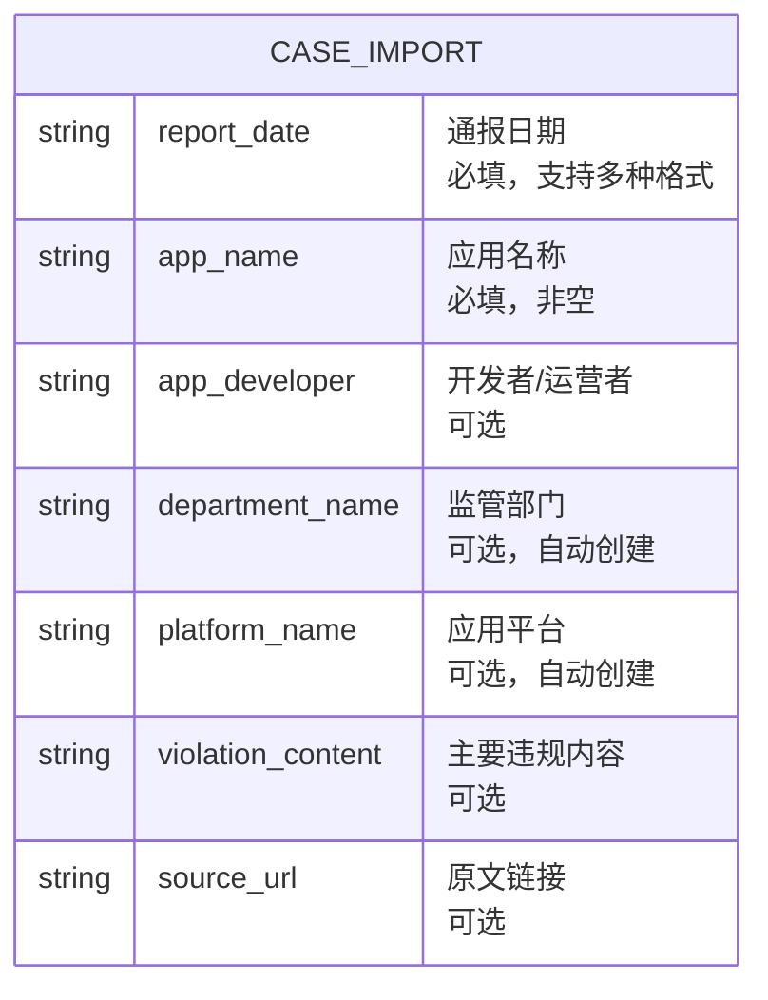

# 数据格式校验规则

<cite>
**本文档引用文件**   
- [案例导入模板说明.md](file://docs/案例导入模板说明.md)
- [SmartImportPage.tsx](file://src/pages/admin/SmartImportPage.tsx)
- [sortUtils.ts](file://src/utils/sortUtils.ts)
- [api.ts](file://src/db/api.ts)
- [types.ts](file://src/types/types.ts)
- [导入功能验证清单.md](file://docs/导入功能验证清单.md)
- [系统修复总结.md](file://docs/系统修复总结.md)
</cite>

## 目录
1. [智能导入数据校验机制](#智能导入数据校验机制)
2. [必填字段验证逻辑](#必填字段验证逻辑)
3. [枚举值匹配规则](#枚举值匹配规则)
4. [日期与数字格式规范化](#日期与数字格式规范化)
5. [受控字段及校验条件](#受控字段及校验条件)
6. [字段排序一致性保障](#字段排序一致性保障)
7. [校验失败错误类型及修正指引](#校验失败错误类型及修正指引)

## 智能导入数据校验机制

智能导入功能在数据处理过程中实施了多层次的数据校验机制，确保导入数据的完整性、准确性和一致性。该机制在用户确认导入前即执行前端验证，并结合后端逻辑进行双重保障。

校验流程始于用户上传Excel文件后，系统首先检查文件是否包含有效数据行。若文件为空或仅有表头，则立即提示“Excel文件中没有数据”。随后，系统对每一行数据进行逐项校验，重点验证必填字段是否存在、数据格式是否符合规范、枚举值是否匹配标准等。

校验逻辑在`SmartImportPage.tsx`中实现，通过调用`getDepartments`和`getPlatforms`获取现有枚举数据，并在用户提交前进行实时比对。对于不匹配的枚举值，系统支持自动创建新条目，如监管部门或应用平台不存在时，将自动调用`createDepartment`或`createPlatform`进行创建。

整个校验过程在导入前完成，避免了无效数据进入数据库，提升了数据质量与用户体验。

**Section sources**
- [SmartImportPage.tsx](file://src/pages/admin/SmartImportPage.tsx#L193-L209)
- [api.ts](file://src/db/api.ts#L745-L755)

## 必填字段验证逻辑

系统对案例导入模板中的必填字段实施严格验证，确保核心信息完整。根据`案例导入模板说明.md`，必填字段包括“通报日期”和“应用名称”，二者均标记为带⭐列。

在导入流程中，系统通过以下逻辑进行验证：
- 检查字段值是否存在且非空字符串
- 排除仅包含空格的无效输入
- 在用户尝试导入时进行即时校验

当检测到必填字段缺失时，系统会中断导入流程并弹出明确的错误提示。例如：
- 若“应用名称”为空，提示“应用名称不能为空”
- 若“通报日期”为空或格式错误，提示“通报日期格式错误或为空”

该验证在`SmartImportPage.tsx`的`handleImport`函数中实现，通过条件判断`!editedData.app_name`和`!editedData.report_date`触发相应错误提示，确保数据完整性。

**Section sources**
- [案例导入模板说明.md](file://docs/案例导入模板说明.md#L15-L16)
- [SmartImportPage.tsx](file://src/pages/admin/SmartImportPage.tsx#L193-L209)

## 枚举值匹配规则

系统对标准化枚举字段实施精确匹配规则，确保数据一致性。主要枚举字段包括“监管部门”和“应用平台”。

### 监管部门匹配规则
- 匹配方式：精确字符串匹配
- 数据源：`regulatory_departments`表中的`name`字段
- 层级规则：国家级部门优先，省级部门次之，同级按名称排序
- 不存在时处理：自动创建新部门，默认级别为“国家级”

### 应用平台匹配规则
- 匹配方式：精确字符串匹配
- 数据源：`app_platforms`表中的`name`字段
- 不存在时处理：自动创建新平台

在`smartImportCases`函数中，系统通过`Map`结构建立现有部门和平台的名称-ID映射，用于快速查找。若输入值在映射中不存在，则将其加入待创建集合，后续批量创建。

此机制既保证了枚举值的标准化，又具备良好的扩展性，避免因名称不一致导致的数据孤岛问题。

**Section sources**
- [SmartImportPage.tsx](file://src/pages/admin/SmartImportPage.tsx#L225-L258)
- [api.ts](file://src/db/api.ts#L766-L785)

## 日期与数字格式规范化

系统支持多种日期格式的自动识别与规范化处理，极大提升了用户导入体验。根据`系统修复总结.md`，系统支持6种以上日期格式。

### 支持的日期格式
| 格式类型 | 示例 |
|--------|------|
| ISO格式 | `2024-01-15` |
| 斜杠格式 | `2024/01/15` |
| 中文格式 | `2024年1月15日` |
| Excel序列号 | `44927` |
| 美式格式 | `01/15/2024` |
| 欧式格式 | `15/01/2024` |

### 日期解析流程
1. 输入值首先进行类型判断（字符串、数字或Date对象）
2. 字符串处理：移除中文字符、统一分隔符为连字符
3. 数字处理：识别为Excel序列号，基于1900年1月1日基准转换
4. 尝试标准`new Date()`解析
5. 解析失败时，按`YYYY-MM-DD`或`MM/DD/YYYY`模式拆分重试
6. 最终统一格式化为`YYYY-MM-DD`

该逻辑在`utils.ts`的`parseDate`函数中实现，包含对Excel日期bug（1900年2月29日）的特殊处理，确保转换准确性。

**Section sources**
- [系统修复总结.md](file://docs/系统修复总结.md#L173-L183)
- [utils.ts](file://src/lib/utils.ts#L55-L117)

## 受控字段及校验条件

结合`案例导入模板说明.md`和代码实现，列出所有受控字段及其校验条件如下：



**Diagram sources**
- [案例导入模板说明.md](file://docs/案例导入模板说明.md#L15-L21)
- [types.ts](file://src/types/types.ts#L134-L142)

### 详细校验条件表
| 字段名 | 是否必需 | 校验条件 | 错误提示 |
|-------|--------|--------|--------|
| 通报日期 | 是 | 非空，格式可识别 | “通报日期格式错误或为空” |
| 应用名称 | 是 | 非空，非纯空格 | “应用名称不能为空” |
| 开发者/运营者 | 否 | 可为空 | 无 |
| 监管部门 | 否 | 若存在需匹配或可创建 | “创建部门失败” |
| 应用平台 | 否 | 若存在需匹配或可创建 | “创建平台失败” |
| 主要违规内容 | 否 | 可为空 | 无 |
| 原文链接 | 否 | 可为空 | 无 |

此外，系统还支持“违规摘要”作为“主要违规内容”的兼容列，增强模板兼容性。

**Section sources**
- [案例导入模板说明.md](file://docs/案例导入模板说明.md#L13-L21)
- [SmartImportPage.tsx](file://src/pages/admin/SmartImportPage.tsx#L629-L678)

## 字段排序一致性保障

`sortUtils.ts`文件中的`sortDepartments`函数负责保障监管部门列表的排序一致性，确保前端展示的数据结构统一。

### 排序规则
1. **层级优先**：国家级部门排在省级部门之前
2. **名称次之**：同层级部门按名称拼音顺序排序

### 实现逻辑
```typescript
export function sortDepartments(departments: RegulatoryDepartment[]): RegulatoryDepartment[] {
  return [...departments].sort((a, b) => {
    // 国家级优先
    if (a.level === 'national' && b.level === 'provincial') return -1;
    if (a.level === 'provincial' && b.level === 'national') return 1;
    // 同级按名称排序
    return a.name.localeCompare(b.name, 'zh-CN');
  });
}
```

该函数返回新数组，避免修改原数据。通过`localeCompare`方法支持中文字符的正确排序，确保“工业和信息化部”等名称按拼音顺序排列。

此排序机制应用于所有涉及监管部门列表的界面，如案例管理、部门管理等，保障了数据展示的一致性。

**Section sources**
- [sortUtils.ts](file://src/utils/sortUtils.ts#L9-L17)
- [types.ts](file://src/types/types.ts#L14-L20)

## 校验失败错误类型及修正指引

当数据校验失败时，系统提供明确的错误类型和用户修正指引，帮助用户快速定位并解决问题。

### 常见错误类型及修正方法

#### 错误1：通报日期格式错误或为空
**错误信息**：
```
第2行：通报日期格式错误或为空
```
**原因**：
- 日期列为空
- 日期格式无法识别
- 单元格格式不正确

**修正指引**：
1. 确保“通报日期”列有值
2. 使用推荐格式：`YYYY-MM-DD`（如`2024-01-15`）
3. 在Excel中将单元格格式设为“日期”或“文本”

#### 错误2：应用名称不能为空
**错误信息**：
```
第3行：应用名称不能为空
```
**原因**：
- “应用名称”列为空
- 单元格仅包含空格

**修正指引**：
1. 填写正确的应用名称
2. 删除该行（如为测试数据）

#### 错误3：Excel文件中没有数据
**错误信息**：
```
Excel文件中没有数据
```
**原因**：
- 工作表为空
- 仅有表头无数据行
- 选择了错误工作表

**修正指引**：
1. 确保至少有一行有效数据（第二行起）
2. 检查是否在正确工作表
3. 确认数据从第二行开始

#### 错误4：创建部门失败
**错误信息**：
```
创建部门失败: XXX部门
```
**原因**：
- 部门名称重复
- 名称含特殊字符
- 数据库连接问题

**修正指引**：
1. 检查部门名称是否已存在
2. 移除特殊字符
3. 联系技术支持

系统最多显示前5个错误，避免信息过载。用户可根据提示逐一修正，提升数据质量。

**Section sources**
- [案例导入模板说明.md](file://docs/案例导入模板说明.md#L121-L185)
- [SmartImportPage.tsx](file://src/pages/admin/SmartImportPage.tsx#L420-L435)