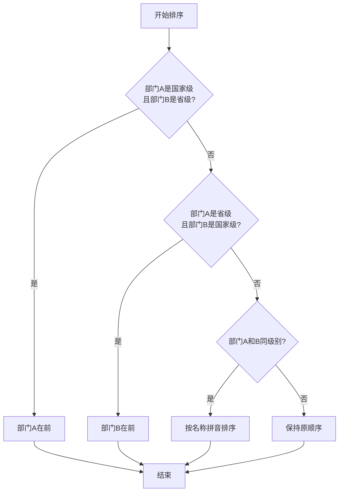
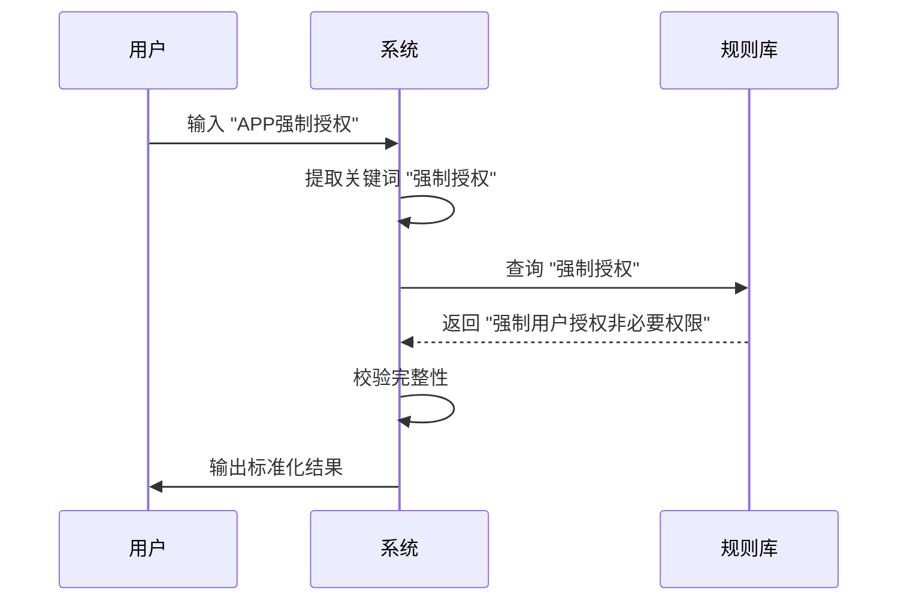

# 数据清洗与质量保障

<cite>
**本文档引用文件**   
- [sortUtils.ts](file://src/utils/sortUtils.ts)
- [timeRangeUtils.ts](file://src/utils/timeRangeUtils.ts)
- [extractViolationKeywords.test.ts](file://src/db/extractViolationKeywords.test.ts)
- [compliance_rules.ts](file://src/db/compliance_rules.ts)
- [SmartImportPage.tsx](file://src/pages/admin/SmartImportPage.tsx)
- [api.ts](file://src/db/api.ts)
- [types.ts](file://src/types/types.ts)
- [parse-multimodal-case/index.ts](file://supabase/functions/parse-multimodal-case/index.ts)
- [00007_merge_violation_fields.sql](file://supabase/migrations/00007_merge_violation_fields.sql)
- [consistency.test.ts](file://src/db/consistency.test.ts)
- [DATA_VALIDATION_REPORT.md](file://docs/DATA_VALIDATION_REPORT.md)
- [导入功能验证清单.md](file://docs/导入功能验证清单.md)
</cite>

## 目录
1. [引言](#引言)
2. [数据校验规则](#数据校验规则)
3. [数据排序与时间归一化](#数据排序与时间归一化)
4. [违规内容关键词提取与清洗](#违规内容关键词提取与清洗)
5. [数据冲突处理与用户修正](#数据冲突处理与用户修正)
6. [数据一致性保障](#数据一致性保障)
7. [结论](#结论)

## 引言

本技术文档详细阐述了在智能导入过程中如何确保数据的一致性与准确性。系统通过严格的校验规则、智能的数据清洗逻辑以及冲突处理机制，保障了从多种输入源（URL、文本、图片、PDF）导入的案例数据质量。文档重点说明了基于案例导入模板的校验规则、数据排序与时间范围归一化处理、违规内容的关键词提取与标准化，以及数据冲突的处理策略。

## 数据校验规则

在数据导入环节，系统实施了多层次的校验规则以确保数据的完整性和准确性。

### 必填字段检查

系统对案例数据中的关键字段进行强制性检查。在 `SmartImportPage.tsx` 中，当用户尝试导入数据时，会首先验证必填字段：
- **应用名称**：必须提供，不能为空。
- **通报日期**：必须提供，不能为空。
- 其他字段如开发者、监管部门、应用平台等为可选字段。

如果必填字段缺失，系统会立即向用户发出明确的错误提示，阻止不完整数据的导入。

### 枚举值匹配

系统对特定字段的值进行枚举匹配，确保其符合预定义的规范。例如，在 `parse-multimodal-case/index.ts` 函数中，监管部门和应用平台的提取依赖于预定义的列表：
- **监管部门**：匹配如“工业和信息化部”、“国家互联网信息办公室”等国家级部门，或包含“省/市”和“通信管理局/网信办”的省级部门。
- **应用平台**：匹配如“应用宝”、“华为应用市场”、“App Store”等主流应用商店。

这种匹配机制确保了部门和平台名称的标准化，避免了因用户输入不一致（如“工信部”与“工业和信息化部”）导致的数据碎片化。

### 格式规范化

系统对数据格式进行严格的规范化处理，特别是对日期和文本内容。
- **日期格式**：支持多种日期格式的自动识别与转换，包括 `YYYY-MM-DD`、`YYYY/MM/DD`、`YYYY年M月D日` 等。系统会将所有格式统一转换为标准的 `YYYY-MM-DD` 格式。
- **文本内容**：对输入的文本进行清理，去除多余的空白字符、HTML标签和特殊编码，确保数据的纯净。

这些校验规则共同构成了数据质量的第一道防线，确保了进入系统的核心数据是准确、完整和规范的。

**Section sources**
- [SmartImportPage.tsx](file://src/pages/admin/SmartImportPage.tsx#L193-L209)
- [parse-multimodal-case/index.ts](file://supabase/functions/parse-multimodal-case/index.ts#L215-L232)
- [导入功能验证清单.md](file://docs/导入功能验证清单.md)

## 数据排序与时间归一化

为了提供一致的用户体验和准确的统计分析，系统在数据处理中应用了 `sortUtils.ts` 和 `timeRangeUtils.ts` 两个工具模块。

### sortUtils.ts 的应用

`sortUtils.ts` 模块提供了对监管部门列表进行智能排序的功能。其核心函数 `sortDepartments` 定义了明确的排序规则：
1.  **优先级排序**：国家级部门（`national`）优先于省级部门（`provincial`）。
2.  **次级排序**：在同级别部门中，按部门名称的拼音顺序进行升序排列。

这种排序逻辑确保了在用户界面（如下拉选择框）中，最重要的国家级监管机构始终位于列表的顶部，方便用户快速选择，同时保持了列表的有序性。

**Diagram sources **
- [sortUtils.ts](file://src/utils/sortUtils.ts#L9-L16)

### timeRangeUtils.ts 的应用

`timeRangeUtils.ts` 模块负责将用户选择的抽象时间范围转换为精确的日期区间，实现时间范围的归一化。其核心函数 `calculateTimeRange` 支持三种预设时间范围：
- **近6个月 (`recent6`)**：计算从当前月份起往前推6个月的第一天作为起始日期。
- **本年至今 (`thisYear`)**：计算当前年份1月1日作为起始日期。
- **全部数据 (`all`)**：将起始日期设置为一个非常早的日期（1970-01-01），以确保包含所有历史数据。

该模块还提供了 `formatMonth` 工具函数，用于将日期对象格式化为 `YYYY-MM` 的标准字符串，便于按月进行数据聚合和展示。

通过这两个工具模块，系统实现了数据展示的标准化和时间维度的统一，为后续的数据分析和可视化奠定了坚实的基础。

**Section sources**
- [sortUtils.ts](file://src/utils/sortUtils.ts)
- [timeRangeUtils.ts](file://src/utils/timeRangeUtils.ts)

## 违规内容关键词提取与清洗

系统通过 `extractViolationKeywords.test.ts` 和 `compliance_rules.ts` 文件定义了一套完整的违规内容识别、提取与标准化流程。

### 关键词提取与标准化逻辑

该流程的核心是将用户输入的模糊、不完整的违规描述，自动转换为符合《个人信息保护法》等法规的标准化法律表述。其工作原理如下：

1.  **智能补全映射**：系统维护一个 `COMPLIANCE_MAP` 映射表，其中包含了常见模糊描述与标准法律术语的对应关系。例如：
    - `"超范围收集"` → `"超范围收集个人信息"`
    - `"强制授权"` → `"强制用户授权非必要权限"`
    - `"未明示收集规则"` → `"未明示收集使用个人信息的规则"`

2.  **模糊匹配与补全**：当系统识别到一个关键词时，会首先在 `COMPLIANCE_MAP` 中进行精确查找。如果未找到，则会尝试进行模糊匹配（如检查是否以某个关键词结尾），以处理如“APP强制授权”这类包含标准关键词的句子。

3.  **完整性校验**：系统通过 `validateKeyword` 函数对提取和补全后的关键词进行合规性校验。一个合格的违规描述必须包含至少一个“行为动词”（如“收集”、“使用”、“提供”）和一个“对象名词”（如“个人信息”、“权限”、“功能”），以确保描述的完整性和法律效力。

**Diagram sources **
- [compliance_rules.ts](file://src/db/compliance_rules.ts#L7-L61)
- [compliance_rules.ts](file://src/db/compliance_rules.ts#L102-L111)

### 违规内容字段合并

为了简化数据结构并提升数据质量，系统在数据库迁移脚本 `00007_merge_violation_fields.sql` 中执行了违规内容字段的合并操作。具体步骤如下：
1.  在 `cases` 表中新增 `violation_content` 字段。
2.  将原有 `violation_summary`（违规摘要）和 `violation_detail`（详细违规内容）两个字段的数据，通过 `COALESCE` 函数合并到新的 `violation_content` 字段中，优先使用摘要字段。
3.  删除旧的 `violation_summary` 和 `violation_detail` 字段，以及相关的 `case_details` 表。

这一合并操作统一了违规内容的存储，避免了数据冗余，并为后续的关键词提取和分析提供了单一、清晰的数据源。

**Section sources**
- [extractViolationKeywords.test.ts](file://src/db/extractViolationKeywords.test.ts)
- [compliance_rules.ts](file://src/db/compliance_rules.ts)
- [00007_merge_violation_fields.sql](file://supabase/migrations/00007_merge_violation_fields.sql)

## 数据冲突处理与用户修正

系统设计了完善的机制来处理数据冲突，并为用户提供清晰的修正建议，以提升导入成功率。

### 重复案例检测与去重

系统通过 `batchCreateCasesWithDedup` 函数实现智能去重。其策略是“保留最新数据”：
1.  **识别重复**：在导入新数据前，系统会查询数据库中已存在的所有案例。
2.  **全字段比对**：将新数据与现有数据进行全字段比对（包括通报日期、应用名称、开发者、监管部门、平台、违规内容和原文链接）。
3.  **删除旧数据**：一旦发现完全匹配的重复案例，系统会先将旧的案例数据从数据库中删除。
4.  **插入新数据**：然后将新的案例数据插入数据库。

这种“先删后插”的策略确保了即使数据内容有微小更新，也能被成功导入，从而保证了数据的时效性。

### 用户修正建议机制

在 `SmartImportPage.tsx` 页面中，系统为用户提供了直观的修正流程：
1.  **解析预览**：在用户提交导入请求后，系统会先将解析出的数据以表单形式呈现给用户。
2.  **置信度提示**：系统会显示一个置信度分数，让用户了解AI解析的可靠性。
3.  **警告信息**：对于解析过程中发现的潜在问题（如字段缺失），系统会以警告框的形式明确提示用户。
4.  **手动编辑**：用户可以在预览界面直接编辑任何字段，修正AI可能解析错误的内容。
5.  **最终确认**：用户确认无误后，才执行最终的导入操作。

这个“解析-预览-修正-导入”的四步流程，将AI的自动化能力与用户的最终决策权相结合，极大地降低了因AI误判而导致的数据错误，显著提升了导入的成功率和数据质量。

**Section sources**
- [api.ts](file://src/db/api.ts#L667-L725)
- [SmartImportPage.tsx](file://src/pages/admin/SmartImportPage.tsx#L591-L737)

## 数据一致性保障

为确保系统各模块间数据的一致性，系统实施了严格的验证和保障措施。

### 跨模块数据一致性验证

系统通过单元测试 `consistency.test.ts` 来验证关键统计数据在不同页面间的一致性。例如，该测试会同时从首页（Homepage）和趋势分析页（Trend Page）获取“本月通报频次”数据，并断言两者必须相等。这种自动化测试确保了即使数据来源或计算路径不同，最终呈现给用户的结果也是一致的，避免了“数据不一致”的用户困惑。

### 数据质量保障措施

根据 `DATA_VALIDATION_REPORT.md` 报告，系统采取了多项措施保障数据质量：
- **精确的统计口径**：通报频次按“部门+日期”去重计算，避免了重复统计。
- **去重逻辑**：在计算涉及应用数时，会对应用名称进行去重，确保统计的准确性。
- **前端显示优化**：修复了如“-0”等不合理的显示问题，并建议添加统计口径说明，帮助用户正确理解数据。

这些措施共同构成了一个闭环的数据质量保障体系，从数据输入、处理到输出的各个环节都进行了严格把控。

**Section sources**
- [consistency.test.ts](file://src/db/consistency.test.ts)
- [DATA_VALIDATION_REPORT.md](file://docs/DATA_VALIDATION_REPORT.md)

## 结论

本文档全面阐述了智能导入系统中的数据清洗与质量保障机制。通过实施严格的必填字段检查、枚举值匹配和格式规范化，系统确保了输入数据的准确性。利用 `sortUtils.ts` 和 `timeRangeUtils.ts` 实现了数据排序和时间范围的标准化。通过 `compliance_rules.ts` 定义的智能补全和校验规则，系统能够高效地提取并标准化违规内容表述。此外，系统通过智能去重和用户友好的修正流程，有效处理了数据冲突，提升了导入成功率。最后，通过自动化测试和严谨的统计口径，系统保障了跨模块数据的一致性。这一系列措施共同确保了整个系统的数据质量，为后续的分析和决策提供了可靠的基础。