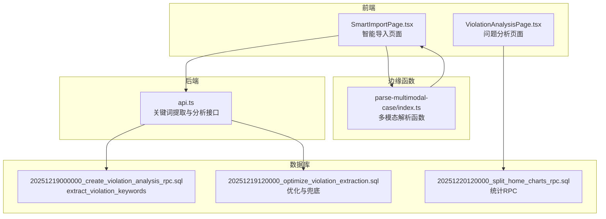
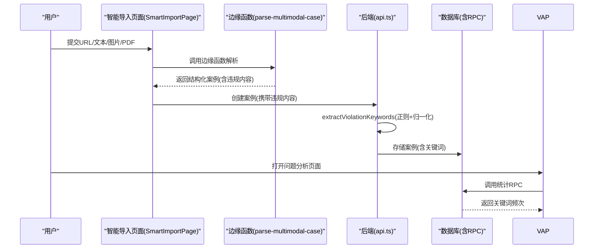
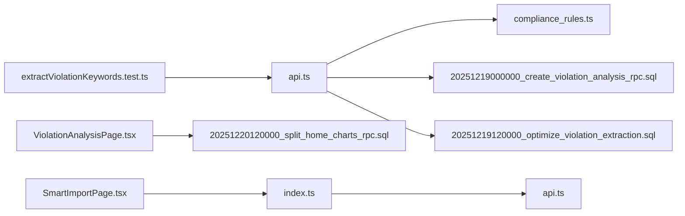

# 关键词提取与归一化

<cite>
**本文引用的文件**
- [extractViolationKeywords.test.ts](file://src/db/extractViolationKeywords.test.ts)
- [compliance_rules.ts](file://src/db/compliance_rules.ts)
- [api.ts](file://src/db/api.ts)
- [20251219000000_create_violation_analysis_rpc.sql](file://supabase/migrations/20251219000000_create_violation_analysis_rpc.sql)
- [20251219120000_optimize_violation_extraction.sql](file://supabase/migrations/20251219120000_optimize_violation_extraction.sql)
- [20251220120000_split_home_charts_rpc.sql](file://supabase/migrations/20251220120000_split_home_charts_rpc.sql)
- [index.ts](file://supabase/functions/parse-multimodal-case/index.ts)
- [ViolationAnalysisPage.tsx](file://src/pages/ViolationAnalysisPage.tsx)
- [SmartImportPage.tsx](file://src/pages/admin/SmartImportPage.tsx)
</cite>

## 目录
1. [简介](#简介)
2. [项目结构](#项目结构)
3. [核心组件](#核心组件)
4. [架构总览](#架构总览)
5. [详细组件分析](#详细组件分析)
6. [依赖关系分析](#依赖关系分析)
7. [性能考量](#性能考量)
8. [故障排查指南](#故障排查指南)
9. [结论](#结论)
10. [附录](#附录)

## 简介
本文件围绕“违规关键词提取与语义归一化”机制展开，基于测试用例与源码实现，系统性说明如下要点：
- 如何通过正则表达式从非结构化文本中匹配违规行为模式；
- 如何调用归一化函数将简写或模糊表述标准化为完整合规术语；
- 归一化映射表的结构、维护方式与校验规则；
- 在案例导入与问题分析流程中的集成应用；
- 常见匹配失败场景及扩展规则与正则覆盖的建议。

## 项目结构
本功能涉及前后端协同：
- 前端：智能导入页面负责接收用户输入，调用边缘函数解析文本，再将违规内容提交至后端；
- 后端：提供关键词提取与分析接口，同时在数据库侧提供SQL函数以保证一致性；
- 数据库侧：维护关键词提取与统计分析的RPC函数，确保前后端逻辑一致。

图表来源
- [SmartImportPage.tsx](file://src/pages/admin/SmartImportPage.tsx#L1-L896)
- [ViolationAnalysisPage.tsx](file://src/pages/ViolationAnalysisPage.tsx#L1-L405)
- [index.ts](file://supabase/functions/parse-multimodal-case/index.ts#L1-L368)
- [api.ts](file://src/db/api.ts#L2150-L2349)
- [20251219000000_create_violation_analysis_rpc.sql](file://supabase/migrations/20251219000000_create_violation_analysis_rpc.sql#L1-L133)
- [20251219120000_optimize_violation_extraction.sql](file://supabase/migrations/20251219120000_optimize_violation_extraction.sql#L121-L176)
- [20251220120000_split_home_charts_rpc.sql](file://supabase/migrations/20251220120000_split_home_charts_rpc.sql#L146-L175)

章节来源
- [SmartImportPage.tsx](file://src/pages/admin/SmartImportPage.tsx#L1-L896)
- [ViolationAnalysisPage.tsx](file://src/pages/ViolationAnalysisPage.tsx#L1-L405)
- [index.ts](file://supabase/functions/parse-multimodal-case/index.ts#L1-L368)
- [api.ts](file://src/db/api.ts#L2150-L2349)
- [20251219000000_create_violation_analysis_rpc.sql](file://supabase/migrations/20251219000000_create_violation_analysis_rpc.sql#L1-L133)
- [20251219120000_optimize_violation_extraction.sql](file://supabase/migrations/20251219120000_optimize_violation_extraction.sql#L121-L176)
- [20251220120000_split_home_charts_rpc.sql](file://supabase/migrations/20251220120000_split_home_charts_rpc.sql#L146-L175)

## 核心组件
- 正则匹配与分片处理：将违规内容按分号切分为片段，逐一匹配预设正则集合，得到候选关键词。
- 归一化映射与补全：通过映射表与模糊匹配策略，将不完整或简写表述补全为标准合规术语。
- 校验规则：对关键词进行完整性校验，确保包含必要的行为与对象元素。
- 兜底策略：若未匹配到任何模式，保留清洗后的片段作为“其他/未分类”问题参与统计。
- 统计与分析：通过RPC函数对关键词进行聚合统计，支撑问题分析页面展示。

章节来源
- [extractViolationKeywords.test.ts](file://src/db/extractViolationKeywords.test.ts#L1-L75)
- [compliance_rules.ts](file://src/db/compliance_rules.ts#L1-L112)
- [api.ts](file://src/db/api.ts#L2150-L2349)
- [20251219000000_create_violation_analysis_rpc.sql](file://supabase/migrations/20251219000000_create_violation_analysis_rpc.sql#L1-L133)
- [20251219120000_optimize_violation_extraction.sql](file://supabase/migrations/20251219120000_optimize_violation_extraction.sql#L121-L176)

## 架构总览
关键词提取与归一化在“导入—存储—分析”链路中的位置如下：

图表来源
- [SmartImportPage.tsx](file://src/pages/admin/SmartImportPage.tsx#L1-L896)
- [index.ts](file://supabase/functions/parse-multimodal-case/index.ts#L1-L368)
- [api.ts](file://src/db/api.ts#L2150-L2349)
- [20251220120000_split_home_charts_rpc.sql](file://supabase/migrations/20251220120000_split_home_charts_rpc.sql#L146-L175)

## 详细组件分析

### 正则匹配与分片处理
- 分片策略：将输入文本按中文分号与英文分号拆分，逐片段处理，避免长句导致误判。
- 正则集合：覆盖“收集/使用/处理/共享/传输/存储”等行为，以及“个人信息/用户信息/隐私信息/ID/设备信息/通讯录/位置/照片”等对象。
- 匹配与截断：匹配到的片段会被裁剪至合理长度，避免异常过长文本影响统计与展示。
- 去重：同一关键词仅保留一次，避免重复统计。

章节来源
- [api.ts](file://src/db/api.ts#L2150-L2349)

### 归一化映射与补全
- 映射表结构：以“简写/模糊表述”为键，“标准合规术语”为值，覆盖收集与使用、权限、告知与隐私政策、用户权益、广告与行为、SDK等类别。
- 补全策略：
  - 直接查表：优先使用精确映射；
  - 模糊匹配：对以键结尾且长度差异较小的片段进行补全，避免过度匹配；
  - 兜底：若未命中映射，保留原文本（经裁剪与清洗）。
- 校验规则：要求关键词包含至少一个行为动词与一个对象名词，或满足特定短语集合，确保语义完整性。

章节来源
- [compliance_rules.ts](file://src/db/compliance_rules.ts#L1-L112)

### 兜底策略与异常处理
- 若片段未匹配任何正则，且长度适中，则尝试归一化后保留，作为“其他/未分类”问题参与统计。
- 数据库侧RPC同样提供兜底：若未匹配到任何模式，提取首句作为关键词；若仍为空，则返回空数组，避免统计异常。

章节来源
- [api.ts](file://src/db/api.ts#L2150-L2349)
- [20251219000000_create_violation_analysis_rpc.sql](file://supabase/migrations/20251219000000_create_violation_analysis_rpc.sql#L1-L133)
- [20251219120000_optimize_violation_extraction.sql](file://supabase/migrations/20251219120000_optimize_violation_extraction.sql#L121-L176)

### 统计与分析集成
- 前端问题分析页面通过RPC获取关键词频次，进行可视化展示与导出。
- RPC内部使用UNNEST展开关键词数组，按关键词分组统计，支持按部门、时间范围过滤。

章节来源
- [ViolationAnalysisPage.tsx](file://src/pages/ViolationAnalysisPage.tsx#L1-L405)
- [20251220120000_split_home_charts_rpc.sql](file://supabase/migrations/20251220120000_split_home_charts_rpc.sql#L146-L175)

### 智能导入流程中的应用
- 边缘函数解析URL/文本/图片/PDF，提取违规摘要与详细内容；
- 前端将违规内容提交后端，后端调用关键词提取与归一化，入库并参与统计分析。

章节来源
- [index.ts](file://supabase/functions/parse-multimodal-case/index.ts#L1-L368)
- [SmartImportPage.tsx](file://src/pages/admin/SmartImportPage.tsx#L1-L896)
- [api.ts](file://src/db/api.ts#L2150-L2349)

## 依赖关系分析

图表来源
- [extractViolationKeywords.test.ts](file://src/db/extractViolationKeywords.test.ts#L1-L75)
- [api.ts](file://src/db/api.ts#L2150-L2349)
- [compliance_rules.ts](file://src/db/compliance_rules.ts#L1-L112)
- [20251219000000_create_violation_analysis_rpc.sql](file://supabase/migrations/20251219000000_create_violation_analysis_rpc.sql#L1-L133)
- [20251219120000_optimize_violation_extraction.sql](file://supabase/migrations/20251219120000_optimize_violation_extraction.sql#L121-L176)
- [20251220120000_split_home_charts_rpc.sql](file://supabase/migrations/20251220120000_split_home_charts_rpc.sql#L146-L175)
- [SmartImportPage.tsx](file://src/pages/admin/SmartImportPage.tsx#L1-L896)
- [index.ts](file://supabase/functions/parse-multimodal-case/index.ts#L1-L368)
- [ViolationAnalysisPage.tsx](file://src/pages/ViolationAnalysisPage.tsx#L1-L405)

## 性能考量
- 正则匹配：采用全局匹配并重置lastIndex，避免跨片段状态污染；对匹配结果进行裁剪与去重，降低后续处理成本。
- 数据库侧RPC：在提取阶段即进行去重与长度限制，减少数组膨胀与统计压力。
- 前端统计：RPC层完成聚合，前端仅做可视化渲染，避免重复计算。

[本节为通用指导，无需列出具体文件来源]

## 故障排查指南
- 匹配不到关键词
  - 检查输入文本是否包含中文分号或英文分号，确保被正确分片；
  - 确认违规内容是否包含行为与对象元素，必要时补充完整描述；
  - 对于新出现的违规表述，参考“扩展映射规则与增强正则覆盖”的建议进行补充。
- 归一化结果不符合预期
  - 检查映射表是否已覆盖该表述；
  - 若为模糊表述，确认是否符合“以键结尾且长度差异较小”的模糊匹配条件。
- 统计为空
  - 确认RPC函数是否被正确调用；
  - 检查过滤条件（部门、时间范围）是否过于严格；
  - 确认案例是否成功入库且包含违规内容。

章节来源
- [api.ts](file://src/db/api.ts#L2150-L2349)
- [20251219000000_create_violation_analysis_rpc.sql](file://supabase/migrations/20251219000000_create_violation_analysis_rpc.sql#L1-L133)
- [20251219120000_optimize_violation_extraction.sql](file://supabase/migrations/20251219120000_optimize_violation_extraction.sql#L121-L176)
- [20251220120000_split_home_charts_rpc.sql](file://supabase/migrations/20251220120000_split_home_charts_rpc.sql#L146-L175)

## 结论
该机制通过“正则匹配—归一化—校验—统计”的闭环，实现了对非结构化违规文本的自动化抽取与标准化，既保证了语义完整性，又提升了统计分析的准确性与一致性。数据库侧RPC与前端页面的协同，进一步强化了端到端的一致性与可维护性。

[本节为总结性内容，无需列出具体文件来源]

## 附录

### 归一化映射表结构与维护
- 结构：键为简写/模糊表述，值为标准合规术语；
- 维护方式：新增或调整映射时，需同步更新前后端逻辑，确保RPC与JS实现一致；
- 校验：validateKeyword函数确保关键词包含行为与对象元素，避免语义缺失。

章节来源
- [compliance_rules.ts](file://src/db/compliance_rules.ts#L1-L112)

### validateKeyword函数设计思路
- 行为元素：涵盖“收集/使用/处理/提供/共享/公开/转让/注销/删除/更正/撤回/访问/阅读/同意/告知/明示/索取/申请/调用/开启/启动/下载/安装/推送/弹窗/扣费/更新”等；
- 对象元素：涵盖“个人信息/隐私政策/规则/权限/功能/账号/软件/应用/APP/SDK/广告/弹窗/版本/费用/同意/授权”等；
- 特殊短语：如“欺骗误导用户”，单独纳入校验逻辑。

章节来源
- [compliance_rules.ts](file://src/db/compliance_rules.ts#L63-L112)

### 常见匹配失败场景与扩展建议
- 新出现的违规表述
  - 建议在映射表中新增对应键值对；
  - 同时在正则集合中增加覆盖模式，确保能捕获该表述。
- 模糊表述
  - 利用模糊匹配策略，确保以键结尾且长度差异较小的片段能被补全；
  - 避免过度匹配，可通过长度阈值与上下文约束进行控制。
- 兜底策略
  - 对未匹配片段进行清洗与长度限制后保留，作为“其他/未分类”问题参与统计；
  - 数据库侧RPC提供首句兜底，确保统计不会为空。

章节来源
- [api.ts](file://src/db/api.ts#L2150-L2349)
- [20251219000000_create_violation_analysis_rpc.sql](file://supabase/migrations/20251219000000_create_violation_analysis_rpc.sql#L1-L133)
- [20251219120000_optimize_violation_extraction.sql](file://supabase/migrations/20251219120000_optimize_violation_extraction.sql#L121-L176)

### 实际调用示例（路径定位）
- 前端导入页面调用边缘函数解析文本，随后调用后端创建案例接口，其中包含违规内容字段：
  - [SmartImportPage.tsx](file://src/pages/admin/SmartImportPage.tsx#L1-L896)
  - [index.ts](file://supabase/functions/parse-multimodal-case/index.ts#L1-L368)
- 后端关键词提取与归一化：
  - [api.ts](file://src/db/api.ts#L2150-L2349)
- 数据库RPC统计：
  - [20251220120000_split_home_charts_rpc.sql](file://supabase/migrations/20251220120000_split_home_charts_rpc.sql#L146-L175)