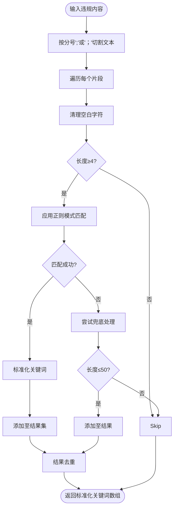
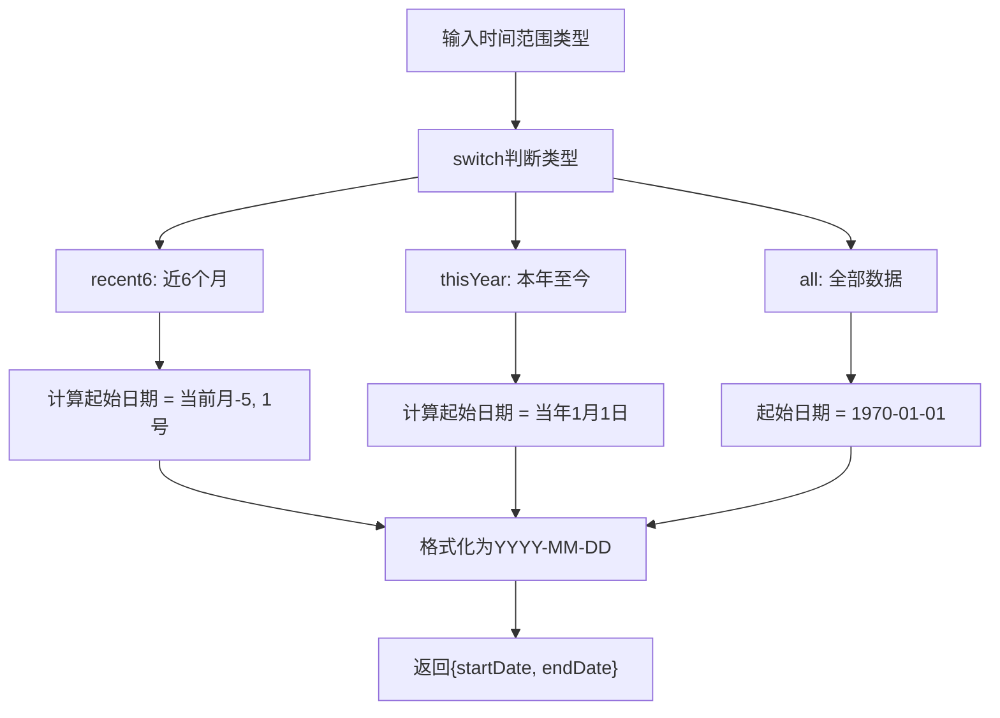
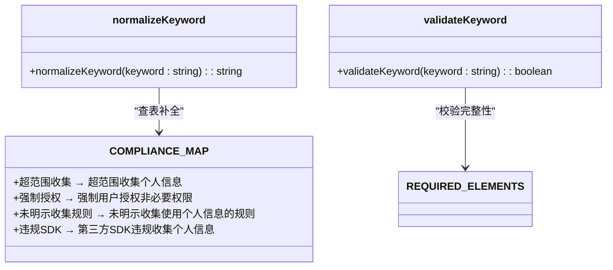

# 语义标准化处理

<cite>
**本文档引用文件**  
- [extractViolationKeywords.test.ts](file://src/db/extractViolationKeywords.test.ts)
- [compliance_rules.ts](file://src/db/compliance_rules.ts)
- [api.ts](file://src/db/api.ts)
- [timeRangeUtils.ts](file://src/utils/timeRangeUtils.ts)
- [timeRangeUtils.test.ts](file://src/utils/__tests__/timeRangeUtils.test.ts)
- [20251219120000_optimize_violation_extraction.sql](file://supabase/migrations/20251219120000_optimize_violation_extraction.sql)
- [20251220120000_split_home_charts_rpc.sql](file://supabase/migrations/20251220120000_split_home_charts_rpc.sql)
</cite>

## 目录
1. [引言](#引言)
2. [违规关键词提取与语义清洗](#违规关键词提取与语义清洗)
3. [时间范围字段归一化](#时间范围字段归一化)
4. [语义映射表维护机制](#语义映射表维护机制)
5. [系统适应性与扩展能力](#系统适应性与扩展能力)
6. [结论](#结论)

## 引言
本文档深入解析“合规通”平台中违规内容的语义清洗与标准化处理流程。系统通过关键词提取算法对非结构化文本进行智能分析，结合同义词归并、模糊匹配等技术实现语义统一。同时，针对时间范围字段（如“去年”、“Q3”）进行归一化处理，确保数据一致性。文档基于测试用例和核心代码逻辑，全面阐述语义映射表的维护机制与系统扩展能力。

## 违规关键词提取与语义清洗

系统通过`extractViolationKeywords`函数从非结构化文本中识别并标准化违规表述。该过程包含正则匹配、智能补全、完整性校验及兜底策略，确保提取结果既准确又合规。

**图示来源**  
- [api.ts](file://src/db/api.ts#L2213-L2256)
- [compliance_rules.ts](file://src/db/compliance_rules.ts#L75-L94)

**测试用例验证了以下语义清洗行为**：
- 输入“存在超范围收集行为” → 输出“超范围收集个人信息”
- 输入“未经同意收集” → 补全为“未经用户同意收集个人信息”
- 输入“APP强制授权” → 标准化为“强制用户授权非必要权限”

该流程确保即使输入表述不完整或模糊，也能映射到标准法律术语，提升数据分析的准确性。

**本节来源**  
- [extractViolationKeywords.test.ts](file://src/db/extractViolationKeywords.test.ts#L9-L37)
- [api.ts](file://src/db/api.ts#L2224-L2242)

## 时间范围字段归一化

`timeRangeUtils.ts`模块负责将相对时间表达（如“近6个月”、“本年至今”）转换为标准日期区间，支持前端图表与统计功能的数据查询。

**图示来源**  
- [timeRangeUtils.ts](file://src/utils/timeRangeUtils.ts#L21-L40)

**具体实现逻辑**：
- **recent6**：从当前月份往前推6个月，以当月1号为起始日期
- **thisYear**：从当前年份1月1日开始，至当前日期结束
- **all**：起始日期设为1970-01-01，确保包含所有历史数据

测试用例验证了跨年场景下的正确性，例如2026年1月调用`recent6`时，起始日期应为2025年8月1日。

**本节来源**  
- [timeRangeUtils.ts](file://src/utils/timeRangeUtils.ts#L13-L53)
- [timeRangeUtils.test.ts](file://src/utils/__tests__/timeRangeUtils.test.ts#L17-L55)

## 语义映射表维护机制

系统的语义统一能力依赖于`COMPLIANCE_MAP`映射表，该表定义了不完整/模糊描述与标准法律表述之间的对应关系，并支持模糊匹配与智能补全。

**图示来源**  
- [compliance_rules.ts](file://src/db/compliance_rules.ts#L7-L61)

**映射表维护规则**：
1. **精确匹配优先**：直接查找`COMPLIANCE_MAP`进行补全
2. **模糊匹配补充**：若输入以映射键结尾且长度接近，则视为可补全
3. **完整性校验**：通过`REQUIRED_ELEMENTS`验证关键词是否包含必要行为动词和对象名词

例如，“私自收集”被精确映射为“私自收集个人信息”，而“APP强制授权”通过模糊匹配触发“强制授权”的补全逻辑。

**本节来源**  
- [compliance_rules.ts](file://src/db/compliance_rules.ts#L75-L111)
- [extractViolationKeywords.test.ts](file://src/db/extractViolationKeywords.test.ts#L29-L32)

## 系统适应性与扩展能力

系统具备良好的扩展性，能够适应新出现的违规表述。通过集中维护`COMPLIANCE_MAP`和正则模式库，可在不修改核心逻辑的前提下添加新的语义映射规则。

**扩展方式**：
1. **新增映射条目**：在`compliance_rules.ts`中向`COMPLIANCE_MAP`添加新的键值对
2. **更新正则模式**：在`api.ts`的`patterns`数组中增加新的正则表达式
3. **调整校验规则**：根据需要修改`REQUIRED_ELEMENTS`中的行为动词或对象名词列表

**兜底策略保障适应性**：
当输入文本未匹配任何已知模式但长度适中（≤50字符）时，系统会保留原始文本作为“其他/未分类”问题参与统计。此机制确保系统不会遗漏新型违规表述，便于后续人工分析与规则补充。

**图示来源**  
- [20251219120000_optimize_violation_extraction.sql](file://supabase/migrations/20251219120000_optimize_violation_extraction.sql#L121-L129)
- [api.ts](file://src/db/api.ts#L2247-L2253)

**本节来源**  
- [api.ts](file://src/db/api.ts#L2247-L2253)
- [20251219120000_optimize_violation_extraction.sql](file://supabase/migrations/20251219120000_optimize_violation_extraction.sql#L121-L130)

## 结论
“合规通”平台通过多层次的语义清洗与标准化机制，有效处理非结构化违规文本。关键词提取算法结合正则匹配与智能补全，确保表述统一；时间范围工具实现相对表达到标准区间的转换；语义映射表支持灵活扩展，配合兜底策略保障系统对新型表述的适应能力。整体设计兼顾准确性、一致性与可维护性，为后续数据分析与可视化提供高质量数据基础。