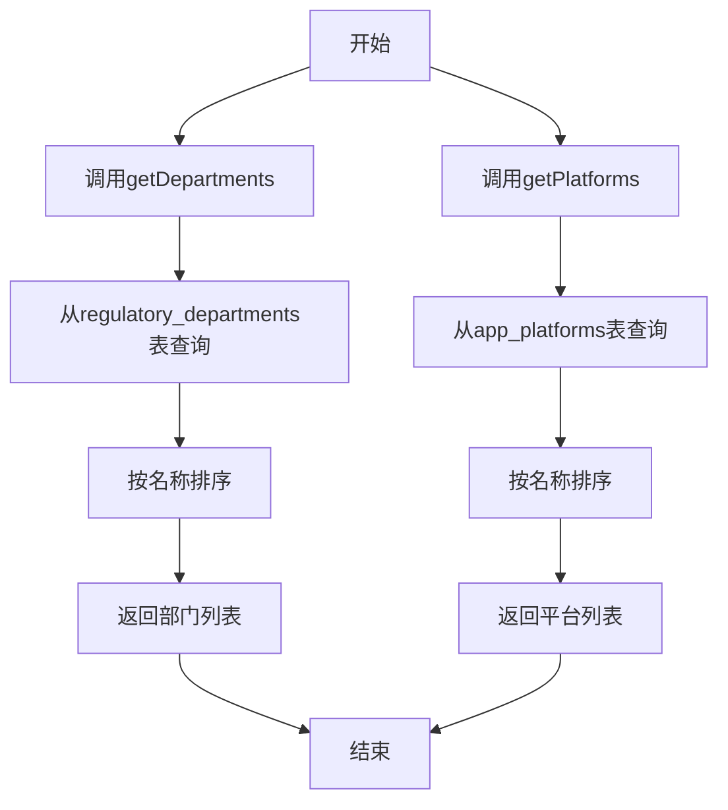
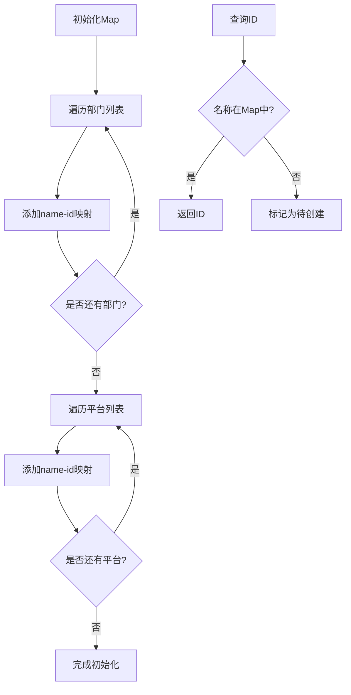
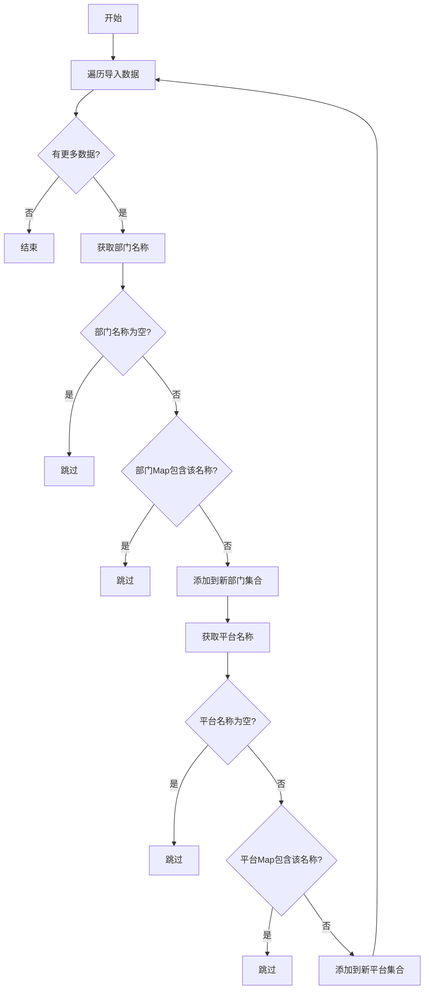
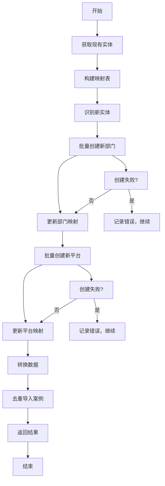
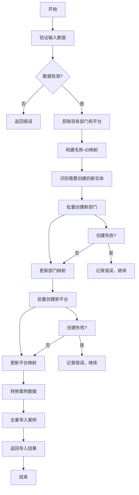

# 数据库比对与查重机制

<cite>
**本文档引用的文件**  
- [SmartImportPage.tsx](file://src/pages/admin/SmartImportPage.tsx)
- [api.ts](file://src/db/api.ts)
- [types.ts](file://src/types/types.ts)
</cite>

## 目录
1. [简介](#简介)
2. [核心流程概述](#核心流程概述)
3. [现有实体列表获取](#现有实体列表获取)
4. [Map数据结构的应用](#map数据结构的应用)
5. [不存在实体的识别与创建](#不存在实体的识别与创建)
6. [数据一致性保障机制](#数据一致性保障机制)
7. [智能导入流程图](#智能导入流程图)
8. [总结](#总结)

## 简介

在智能导入案例的过程中，系统需要确保新导入的数据与现有数据库中的实体保持一致，避免重复创建监管部门和应用平台。为此，系统采用了一套高效的比对与查重机制，通过`smartImportCases`函数实现。该机制利用`Map`数据结构建立名称-ID映射关系，实现快速查找，并在发现不存在的部门或平台名称时自动标记为待创建状态。

**Section sources**
- [SmartImportPage.tsx](file://src/pages/admin/SmartImportPage.tsx#L189-L335)
- [api.ts](file://src/db/api.ts#L728-L851)

## 核心流程概述

智能导入的核心流程包括以下几个关键步骤：
1. 验证输入数据的完整性
2. 并行获取现有部门和平台列表
3. 构建名称-ID映射表
4. 识别需要创建的新实体
5. 批量创建新实体
6. 转换数据并导入案例

这一流程确保了数据的一致性和完整性，同时提高了导入效率。

**Section sources**
- [api.ts](file://src/db/api.ts#L728-L851)

## 现有实体列表获取

系统通过`getDepartments`和`getPlatforms`两个函数从数据库中获取现有的监管部门和应用平台列表。这两个函数使用Supabase客户端从`regulatory_departments`和`app_platforms`表中查询所有记录，并按名称排序返回。



**Diagram sources**
- [api.ts](file://src/db/api.ts#L56-L64)
- [api.ts](file://src/db/api.ts#L305-L313)

## Map数据结构的应用

系统使用`Map`数据结构来存储部门和平台的名称-ID映射关系，以实现高效的查重操作。`departmentMap`和`platformMap`分别用于存储监管部门和应用平台的映射。

```typescript
const departmentMap = new Map<string, string>(); // name -> id
const platformMap = new Map<string, string>(); // name -> id
```

初始化过程如下：
1. 获取现有部门和平台列表
2. 遍历列表，将每个实体的名称作为键，ID作为值存入Map

查询过程如下：
1. 检查Map中是否存在指定名称
2. 如果存在，返回对应的ID
3. 如果不存在，标记为需要创建



**Diagram sources**
- [api.ts](file://src/db/api.ts#L766-L775)

## 不存在实体的识别与创建

当系统发现导入数据中的部门或平台名称在现有数据库中不存在时，会将其标记为待创建状态。具体流程如下：

1. 遍历导入数据
2. 对每个部门名称，检查`departmentMap`中是否存在
3. 如果不存在，将其添加到`newDepartmentNames`集合中
4. 对每个平台名称，检查`platformMap`中是否存在
5. 如果不存在，将其添加到`newPlatformNames`集合中



**Diagram sources**
- [api.ts](file://src/db/api.ts#L778-L785)

## 数据一致性保障机制

为了确保数据的一致性，系统在导入过程中采取了多项措施：

1. **事务性操作**：虽然Supabase不支持传统事务，但系统通过分步操作和错误处理来模拟事务行为
2. **批量创建**：对需要创建的新实体进行批量处理，减少数据库交互次数
3. **去重导入**：使用`batchCreateCasesWithDedup`函数在导入案例时进行去重
4. **错误处理**：对每个创建操作进行错误捕获，确保即使部分创建失败也不会影响整体流程



**Diagram sources**
- [api.ts](file://src/db/api.ts#L787-L837)

## 智能导入流程图

以下是完整的智能导入流程图，展示了从数据验证到最终导入的完整过程：



**Diagram sources**
- [api.ts](file://src/db/api.ts#L728-L851)

## 总结

智能导入过程中的数据库比对与查重机制通过以下方式确保了数据的一致性和完整性：

1. 使用`getDepartments`和`getPlatforms`函数获取现有实体列表
2. 利用`Map`数据结构建立高效的名称-ID映射关系
3. 通过集合数据结构识别需要创建的新实体
4. 采用批量创建方式提高效率
5. 在导入前更新映射表，确保新创建的实体也能被正确引用

这套机制不仅避免了重复创建，还保证了数据的准确性和一致性，为系统的稳定运行提供了有力保障。

**Section sources**
- [api.ts](file://src/db/api.ts#L728-L851)
- [SmartImportPage.tsx](file://src/pages/admin/SmartImportPage.tsx#L189-L335)