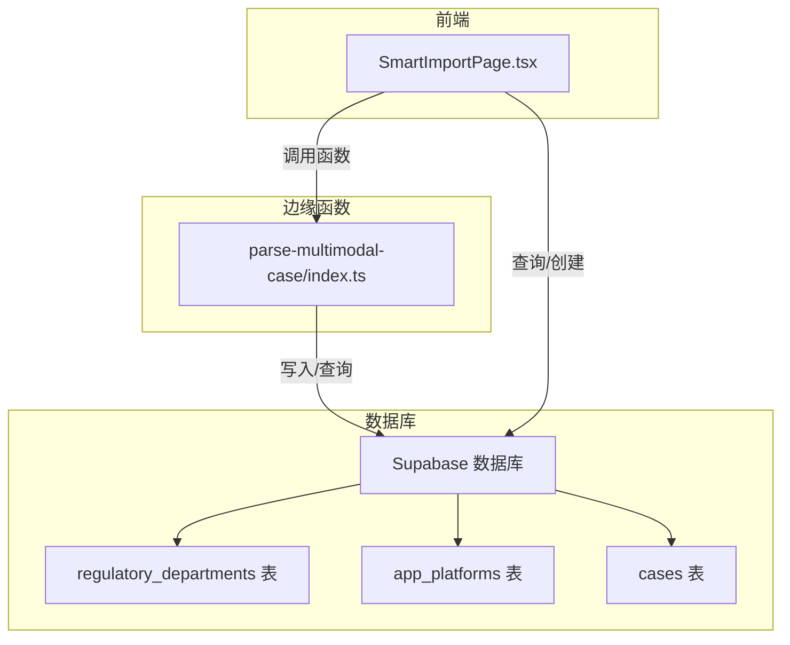
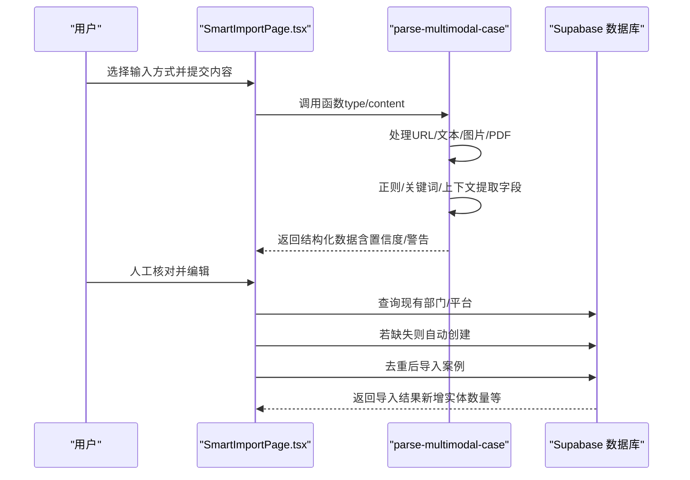
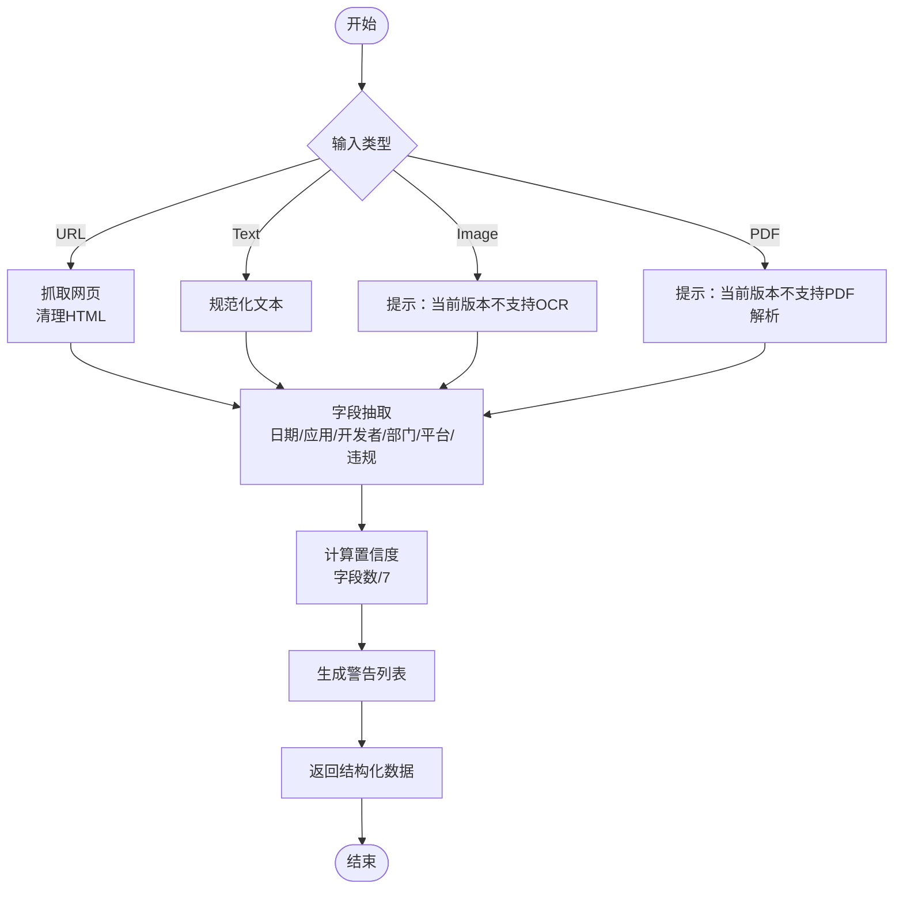
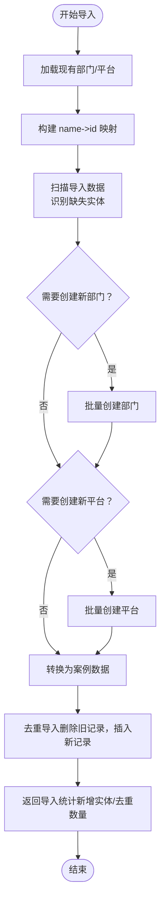
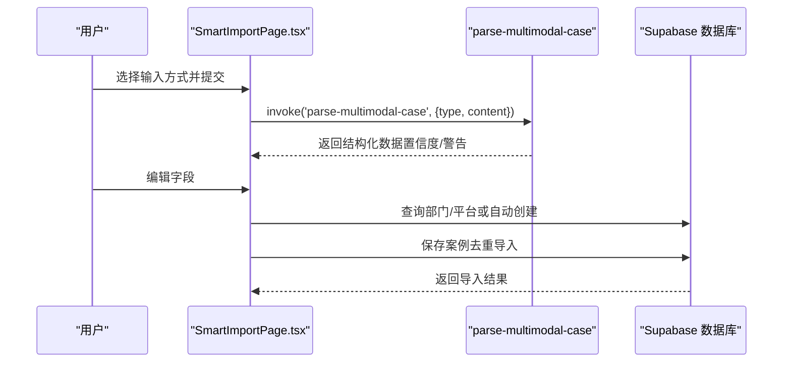
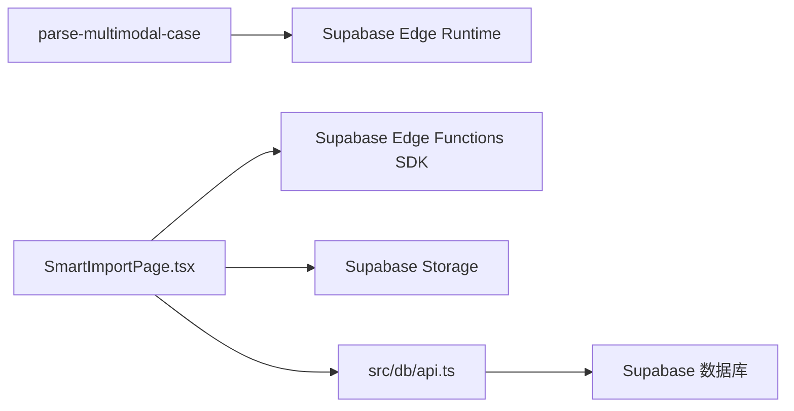

# 新部门/平台自动识别

<cite>
**本文引用的文件**
- [supabase/functions/parse-multimodal-case/index.ts](file://supabase/functions/parse-multimodal-case/index.ts)
- [src/db/api.ts](file://src/db/api.ts)
- [src/pages/admin/SmartImportPage.tsx](file://src/pages/admin/SmartImportPage.tsx)
- [docs/MULTIMODAL_UPGRADE_PLAN.md](file://docs/MULTIMODAL_UPGRADE_PLAN.md)
- [docs/MULTIMODAL_UPGRADE_COMPLETE.md](file://docs/MULTIMODAL_UPGRADE_COMPLETE.md)
- [docs/#U6848#U4f8b#U5bfc#U5165#U529f#U80fd#U667a#U80fd#U4f18#U5316#U8bf4#U660e.md](file://docs/#U6848#U4f8b#U5bfc#U5165#U529f#U80fd#U667a#U80fd#U4f18#U5316#U8bf4#U660e.md)
- [docs/#U6848#U4f8b#U5bfc#U5165#U529f#U80fd#U4f18#U5316#U5feb#U901f#U53c2#U8003.md](file://docs/#U6848#U4f8b#U5bfc#U5165#U529f#U80fd#U4f18#U5316#U5feb#U901f#U53c2#U8003.md)
</cite>

## 目录
1. [简介](#简介)
2. [项目结构](#项目结构)
3. [核心组件](#核心组件)
4. [架构总览](#架构总览)
5. [详细组件分析](#详细组件分析)
6. [依赖关系分析](#依赖关系分析)
7. [性能考量](#性能考量)
8. [故障排查指南](#故障排查指南)
9. [结论](#结论)
10. [附录](#附录)

## 简介
本文件聚焦“新部门/平台自动识别”的核心算法与流程，围绕 parse-multimodal-case 边缘函数如何通过多模态输入（URL/文本/图片/PDF）进行结构化抽取，结合数据库 API 层的智能匹配与自动创建机制，实现“新实体”（监管部门/应用平台）的自动发现与入库。文档同时阐述置信度评估、人工确认流程以及与现有数据库的比对策略，帮助读者在保证系统扩展性的同时兼顾数据准确性。

## 项目结构
- 边缘函数：parse-multimodal-case 负责多模态内容解析与结构化抽取。
- 前端页面：SmartImportPage 提供多模态输入、解析预览、人工确认与导入。
- 数据访问层：api.ts 提供部门/平台查询、创建、案例导入与去重逻辑。
- 文档资料：升级计划与完成报告明确了功能边界与实现要点。

图表来源
- [src/pages/admin/SmartImportPage.tsx](file://src/pages/admin/SmartImportPage.tsx#L148-L177)
- [supabase/functions/parse-multimodal-case/index.ts](file://supabase/functions/parse-multimodal-case/index.ts#L22-L129)
- [src/db/api.ts](file://src/db/api.ts#L56-L124)

章节来源
- [src/pages/admin/SmartImportPage.tsx](file://src/pages/admin/SmartImportPage.tsx#L148-L177)
- [supabase/functions/parse-multimodal-case/index.ts](file://supabase/functions/parse-multimodal-case/index.ts#L22-L129)
- [src/db/api.ts](file://src/db/api.ts#L56-L124)

## 核心组件
- parse-multimodal-case 边缘函数：统一处理多模态输入，抽取日期、应用名称、开发者、监管部门、应用平台、违规摘要与详情，并计算字段提取置信度。
- 数据库 API 层：提供部门/平台查询、创建；在智能导入时进行“智能匹配 + 自动创建 + 去重”的一体化流程。
- 前端智能导入页面：调用边缘函数进行解析，展示置信度与警告，支持人工编辑后导入。

章节来源
- [supabase/functions/parse-multimodal-case/index.ts](file://supabase/functions/parse-multimodal-case/index.ts#L22-L129)
- [src/db/api.ts](file://src/db/api.ts#L275-L303)
- [src/db/api.ts](file://src/db/api.ts#L375-L402)
- [src/db/api.ts](file://src/db/api.ts#L727-L851)
- [src/pages/admin/SmartImportPage.tsx](file://src/pages/admin/SmartImportPage.tsx#L148-L177)

## 架构总览
多模态解析与智能导入的整体流程如下：

图表来源
- [src/pages/admin/SmartImportPage.tsx](file://src/pages/admin/SmartImportPage.tsx#L148-L177)
- [supabase/functions/parse-multimodal-case/index.ts](file://supabase/functions/parse-multimodal-case/index.ts#L22-L129)
- [src/db/api.ts](file://src/db/api.ts#L727-L851)

## 详细组件分析

### parse-multimodal-case：多模态结构化抽取与置信度评估
- 输入路由与预处理
  - 支持 type 为 url/text/image/pdf，content 分别对应 URL、文本、或文件公开 URL。
  - URL 输入会抓取网页、清理 HTML、限制大小；文本输入做空白规范化；图片/PDF 输入当前简化为提示信息（完整 OCR/PDF 解析在后续版本增强）。
- 字段抽取与上下文分析
  - 日期、应用名称、开发者、监管部门、应用平台、违规摘要、违规详情均通过正则与关键词策略抽取。
  - 监管部门与平台的识别采用“关键词集合 + 省级匹配”的组合策略，提升覆盖面。
  - 违规详情基于关键词段落筛选与长度限制，避免噪声。
- 置信度评估
  - 以“成功提取字段数量 / 总字段数”作为基础置信度，便于前端直观展示与引导人工校验。
  - warnings 列表汇总未能识别的关键字段，辅助人工确认。
- 输出结构
  - 返回标准化结构化数据，包含 input_type 以便前端展示与审计。

图表来源
- [supabase/functions/parse-multimodal-case/index.ts](file://supabase/functions/parse-multimodal-case/index.ts#L132-L213)
- [supabase/functions/parse-multimodal-case/index.ts](file://supabase/functions/parse-multimodal-case/index.ts#L214-L368)

章节来源
- [supabase/functions/parse-multimodal-case/index.ts](file://supabase/functions/parse-multimodal-case/index.ts#L22-L129)
- [supabase/functions/parse-multimodal-case/index.ts](file://supabase/functions/parse-multimodal-case/index.ts#L132-L213)
- [supabase/functions/parse-multimodal-case/index.ts](file://supabase/functions/parse-multimodal-case/index.ts#L214-L368)

### 数据库 API：智能匹配与自动创建
- 查询现有实体
  - getDepartments()/getPlatforms() 获取全部部门/平台，用于后续智能匹配。
- 智能匹配与自动创建
  - smartImportCases：一次性拉取现有部门/平台，构建 name->id 映射；遍历导入数据识别缺失实体；批量创建新部门（默认国家级）、新平台；转换为案例导入数据；调用去重导入。
  - 前端页面 SmartImportPage.tsx：在导入前同样进行“查找或创建”的逻辑，若数据库中不存在则自动创建，再保存案例。
- 去重与结果反馈
  - batchCreateCasesWithDedup：识别完全重复案例并删除旧记录，插入新记录，返回插入与去重数量统计。
  - smartImportCases：额外返回新增部门/平台数量与名称列表，便于审计与复核。

图表来源
- [src/db/api.ts](file://src/db/api.ts#L727-L851)
- [src/db/api.ts](file://src/db/api.ts#L667-L726)
- [src/pages/admin/SmartImportPage.tsx](file://src/pages/admin/SmartImportPage.tsx#L214-L276)

章节来源
- [src/db/api.ts](file://src/db/api.ts#L56-L124)
- [src/db/api.ts](file://src/db/api.ts#L275-L303)
- [src/db/api.ts](file://src/db/api.ts#L305-L402)
- [src/db/api.ts](file://src/db/api.ts#L667-L726)
- [src/db/api.ts](file://src/db/api.ts#L727-L851)
- [src/pages/admin/SmartImportPage.tsx](file://src/pages/admin/SmartImportPage.tsx#L214-L276)

### 前端页面：解析预览与人工确认
- 调用边缘函数
  - 根据当前 Tab（url/text/image/pdf）构造请求体，调用 parse-multimodal-case，展示置信度与警告。
- 人工编辑与导入
  - 必填字段校验（应用名称、通报日期），若数据库中缺失监管部门/平台则自动创建，最终保存案例并生成执行报告。
- 文件上传与清理
  - 图片/PDF 上传至 Supabase Storage 临时桶，导入成功后清理临时文件。

图表来源
- [src/pages/admin/SmartImportPage.tsx](file://src/pages/admin/SmartImportPage.tsx#L148-L177)
- [src/pages/admin/SmartImportPage.tsx](file://src/pages/admin/SmartImportPage.tsx#L214-L335)

章节来源
- [src/pages/admin/SmartImportPage.tsx](file://src/pages/admin/SmartImportPage.tsx#L148-L177)
- [src/pages/admin/SmartImportPage.tsx](file://src/pages/admin/SmartImportPage.tsx#L214-L335)

## 依赖关系分析
- parse-multimodal-case 依赖 Supabase Edge Runtime 的 fetch 能力（URL 输入抓取）与 JSON 请求体解析。
- 前端依赖 Supabase Edge Functions SDK 进行函数调用，依赖 Supabase Storage 进行临时文件上传与清理。
- 数据库 API 依赖 Supabase 客户端进行查询、插入与 RPC 搜索。

图表来源
- [supabase/functions/parse-multimodal-case/index.ts](file://supabase/functions/parse-multimodal-case/index.ts#L22-L129)
- [src/pages/admin/SmartImportPage.tsx](file://src/pages/admin/SmartImportPage.tsx#L148-L177)
- [src/db/api.ts](file://src/db/api.ts#L56-L124)

章节来源
- [supabase/functions/parse-multimodal-case/index.ts](file://supabase/functions/parse-multimodal-case/index.ts#L22-L129)
- [src/pages/admin/SmartImportPage.tsx](file://src/pages/admin/SmartImportPage.tsx#L148-L177)
- [src/db/api.ts](file://src/db/api.ts#L56-L124)

## 性能考量
- 边缘函数
  - URL 抓取设置超时与大小限制，避免资源占用过高。
  - 文本预处理与正则匹配复杂度可控，适合短到中等长度文本。
- 前端
  - 文件上传采用临时桶，导入完成后清理，避免长期占用空间。
- 数据库
  - 智能导入采用批量创建与去重策略，减少重复写入与冗余数据。

章节来源
- [supabase/functions/parse-multimodal-case/index.ts](file://supabase/functions/parse-multimodal-case/index.ts#L132-L191)
- [src/pages/admin/SmartImportPage.tsx](file://src/pages/admin/SmartImportPage.tsx#L320-L335)
- [src/db/api.ts](file://src/db/api.ts#L667-L726)

## 故障排查指南
- 解析失败
  - 检查输入类型与内容是否符合要求（URL 协议、文本长度、文件类型与大小）。
  - 查看 warnings 列表，定位未识别字段。
- 自动创建失败
  - 检查网络与权限（Storage 与数据库访问）。
  - 查看返回的错误信息，确认名称是否重复或字段约束冲突。
- 导入结果异常
  - 确认必填字段（应用名称、通报日期）是否填写。
  - 核对去重策略是否生效，避免重复导入导致统计偏差。

章节来源
- [supabase/functions/parse-multimodal-case/index.ts](file://supabase/functions/parse-multimodal-case/index.ts#L22-L129)
- [src/pages/admin/SmartImportPage.tsx](file://src/pages/admin/SmartImportPage.tsx#L178-L213)
- [src/db/api.ts](file://src/db/api.ts#L667-L726)

## 结论
本方案通过 parse-multimodal-case 的统一结构化抽取与前端的人工确认流程，结合数据库 API 的智能匹配与自动创建机制，实现了“新部门/平台”的自动识别与入库。置信度与警告为人工复核提供了明确依据，去重导入保障了数据质量。整体设计在扩展性与准确性之间取得平衡，具备良好的可维护性与演进空间。

## 附录
- 多模态升级计划与完成报告明确了功能边界、技术限制与后续增强方向。
- 智能导入流程文档提供了匹配规则、错误处理与用户体验优化建议。

章节来源
- [docs/MULTIMODAL_UPGRADE_PLAN.md](file://docs/MULTIMODAL_UPGRADE_PLAN.md#L1-L120)
- [docs/MULTIMODAL_UPGRADE_COMPLETE.md](file://docs/MULTIMODAL_UPGRADE_COMPLETE.md#L1-L61)
- [docs/#U6848#U4f8b#U5bfc#U5165#U529f#U80fd#U667a#U80fd#U4f18#U5316#U8bf4#U660e.md](file://docs/#U6848#U4f8b#U5bfc#U5165#U529f#U80fd#U667a#U80fd#U4f18#U5316#U8bf4#U660e.md#L86-L134)
- [docs/#U6848#U4f8b#U5bfc#U5165#U529f#U80fd#U4f18#U5316#U5feb#U901f#U53c2#U8003.md](file://docs/#U6848#U4f8b#U5bfc#U5165#U529f#U80fd#U4f18#U5316#U5feb#U901f#U53c2#U8003.md#L225-L301)