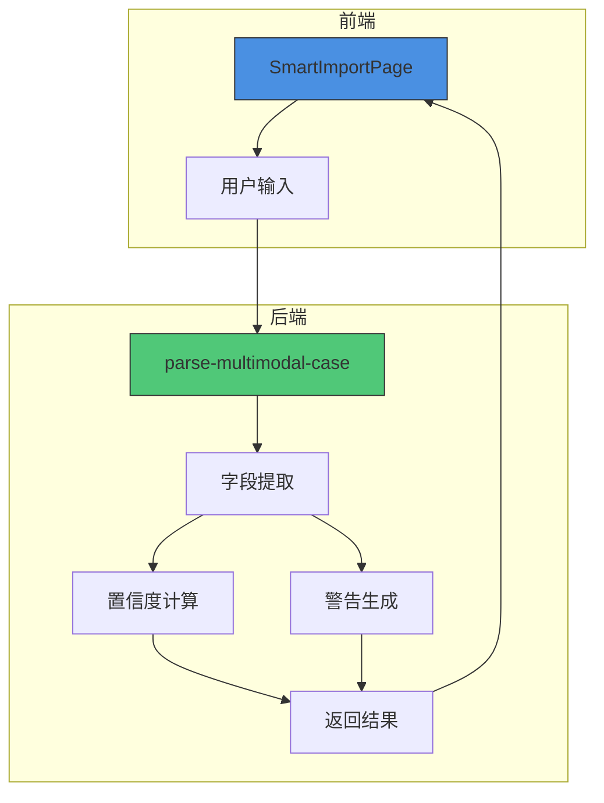

# 置信度评估与人工确认

<cite>
**本文档引用文件**  
- [index.ts](file://supabase/functions/parse-multimodal-case/index.ts)
- [SmartImportPage.tsx](file://src/pages/admin/SmartImportPage.tsx)
- [MULTIMODAL_UPGRADE_COMPLETE.md](file://docs/MULTIMODAL_UPGRADE_COMPLETE.md)
- [MULTIMODAL_UPGRADE_PLAN.md](file://docs/MULTIMODAL_UPGRADE_PLAN.md)
</cite>

## 目录
1. [置信度评分计算机制](#置信度评分计算机制)
2. [前端置信度展示与交互](#前端置信度展示与交互)
3. [警告信息生成逻辑](#警告信息生成逻辑)
4. [置信度阈值与业务流程影响](#置信度阈值与业务流程影响)
5. [系统架构与数据流](#系统架构与数据流)

## 置信度评分计算机制

系统通过 `parse-multimodal-case` 函数实现多模态案例的自动解析。该函数接收 URL、文本、图片或 PDF 输入，利用正则表达式和关键词匹配技术提取结构化信息。置信度（confidence）的计算基于成功提取的关键字段数量与总字段数的比例。

具体而言，系统尝试提取以下7个核心字段：通报日期、应用名称、开发者、监管部门、应用平台、违规摘要和违规详情。每成功提取一个字段，计数器加1。最终置信度值为成功提取字段数除以7。例如，若成功提取5个字段，则置信度为 5/7 ≈ 0.71。

该评分机制确保了对解析结果完整性的量化评估，为后续的人工审核决策提供数据支持。

**Section sources**
- [index.ts](file://supabase/functions/parse-multimodal-case/index.ts#L96-L101)

## 前端置信度展示与交互

在智能案例导入页面（SmartImportPage），系统将后端返回的置信度值以直观的方式呈现给用户。置信度以百分比形式显示，并通过颜色编码和标签进行视觉强化：

- **高置信度（≥80%）**：绿色显示，标签为“高”
- **中置信度（≥50%）**：黄色显示，标签为“中”
- **低置信度（<50%）**：红色显示，标签为“低”

用户在确认导入前，可清晰地看到AI解析的可靠性等级。高置信度结果通常可直接确认导入，而低置信度结果则提示用户需仔细核对和手动修正数据，确保数据质量。

**Section sources**
- [SmartImportPage.tsx](file://src/pages/admin/SmartImportPage.tsx#L601-L606)

## 警告信息生成逻辑

系统在解析过程中会生成 `warnings` 数组，用于记录未能成功提取的字段。每当某个字段的提取结果为空时，系统会向 `warnings` 数组添加一条相应的警告信息。例如，若未能识别监管部门，则添加“未能识别监管部门”的警告。

这些警告信息在前端以醒目的警示框形式展示，帮助用户快速定位潜在问题。用户可根据警告提示，针对性地检查和补充缺失信息，提高数据录入的准确性和完整性。

**Section sources**
- [index.ts](file://supabase/functions/parse-multimodal-case/index.ts#L75-L94)
- [SmartImportPage.tsx](file://src/pages/admin/SmartImportPage.tsx#L611-L623)

## 置信度阈值与业务流程影响

置信度阈值的设定对业务流程有直接影响。低置信度结果（如低于50%）通常意味着AI未能有效提取关键信息，此类案例需强制进行人工审核。这确保了即使在自动化解析失败的情况下，数据仍能通过人工干预被正确录入。

在实际业务场景中，高置信度案例可实现“一键导入”，大幅提升工作效率；而低置信度案例则进入“检查-修正-确认”的人工处理流程。这种分级处理机制在保证数据质量的同时，优化了人力资源的分配，实现了自动化与人工审核的最佳平衡。

**Section sources**
- [SmartImportPage.tsx](file://src/pages/admin/SmartImportPage.tsx#L347-L357)

## 系统架构与数据流

**Diagram sources**
- [index.ts](file://supabase/functions/parse-multimodal-case/index.ts)
- [SmartImportPage.tsx](file://src/pages/admin/SmartImportPage.tsx)